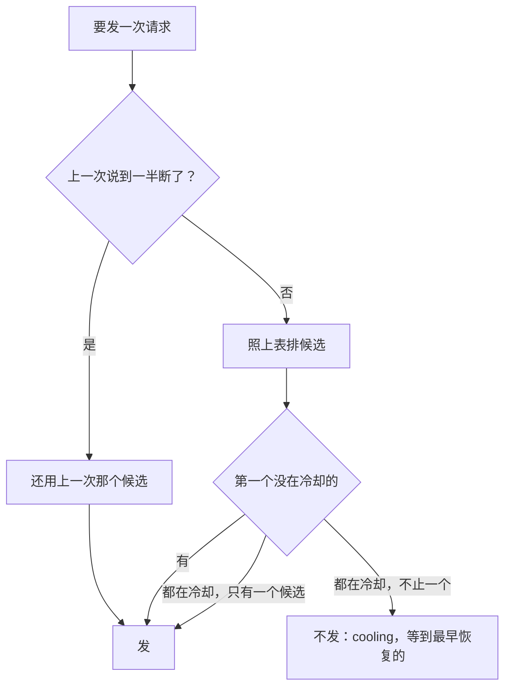

## 供应商和模型

### 是什么

Miyu 怎么接上模型：配置里写几家供应商，每家带驱动、地址、几个 key。模型写成「供应商/模型」。模型的资料（窗口、最大输出、能收什么、价格）从手写、用出来的、供应商的列表、models.dev 目录、驱动的保守默认里一格格查出来，每一格说得出来源。会话钉着一个模型或者一个池，出错了按错误的分类换 key、换池里的下一个。会话里能换模型，下一个回合开始生效。第一次用时先找机器上现成的 key 和本机的模型服务。每次请求的用量、照价格算出的金额冻结进那一次的 `model.called`，头和她自己都能查。

驱动的内部（Anthropic 消息接口、OpenAI Responses 接口怎么编码、解码）不在这一页：开工前另画 `drivers/anthropic.md`、`drivers/openai-responses.md`。这一页只写它们要守的约定（「对外的样子」最后一节）。配置怎么读、怎么分层、怎么校验、密钥怎么存，归 `config.md`。这一页只写模型这一块有哪些键、每个键是什么意思。

状态：图纸，定稿（2026-10-01 起草，起草时要拍板的几题同一天定了，见「定的（2026-10-01）」；主会话审过，项目主人同一天批准），M8 的 8-6 到 8-11、8-14 的一部分、8-15 照它施工（施工方案第三节 M8 那张表）。每一节标着由哪一步做。做完一步，这一页照做好的样子改写那几节，「要跟着改的别的页」里列的几页跟着改。8-6 做完了（2026-10-01）：标 8-6 的几节照做好的样子写，施工时定的记在「施工时定的」。8-7 做完了（2026-10-01，施工完，待主会话审）：标 8-7 的几节照做好的样子写，施工时定的记在「施工时定的」8-7 那张表。8-6b 做完了（2026-10-01）：`base_url` 一行、`model.list` 的 `providers`、第十条、「样子」里的例子照做好的样子写，施工时定的记在「施工时定的」8-6b 那张表。

### 在哪

施工时照这个放：

| 代码 | 管什么 | 哪一步 |
|---|---|---|
| `crates/miyu-models/`（新，第 2 层，纯逻辑） | 模型这一块的纯逻辑：目录的类型、四层对目录、资料合起来和来源、三种写法、池的挑法、冷却怎么算、金额怎么算。不碰文件和网络，时刻由调用的一方交进来 | 8-6 起 |
| `crates/miyu-models/src/catalog.rs`、`catalog/price.rs` | models.dev 目录的类型，只读用得上的格，一个模型一个模型地读、坏的跳过；照名字、规整以后的名字建索引；在用的目录 `Loaded`（哪一份、什么时候拉的）；价格 `Price` | 8-7 |
| `crates/miyu-models/src/matching.rs` | 四层对目录、名字规整、认供应商（`recognize`）、认原厂（`Vendors`） | 8-7 |
| `crates/miyu-models/src/facts.rs`、`facts/source.rs` | 资料的每一格、来源、合起来，写成 `model.list` 的 `facts` | 8-7 |
| `crates/miyu-models/src/observed.rs` | 用出来的（`learned.json`）、供应商的列表（`providers/<编号>.json`）的样子、读写、只记小的 | 8-7 |
| `crates/miyu-models/src/knowledge.rs` | 查资料时手头的几份：档案、认原厂的表、目录、用出来的、列表（`Knowledge`） | 8-7 |
| `crates/miyu-models/src/reference.rs` | 三种写法：读、哪里能写哪几种（8-6）；挡位换成它的值（`tier`）、造会话记下的引用（`record`）、一个引用这一轮指到一个模型还是一个池（`resolve`）、用途挡位池里点名的模型（`named`）（8-8） | 8-6、8-8 |
| `crates/miyu-models/src/settings.rs` | 模型这一块的配置项：`UseSettings`（`models.chat`、`vision`）、`TierSettings`（四个挡位，8-8）、`PoolSettings`（`pools.<id>` 的成员、分法，8-8）、`ProviderSettings`（`providers.<id>` 的驱动、地址、key、`catalog`，8-8 加 `cache`）、`ModelSettings`（`providers.<id>.models.<model>` 的窗口），核心登记进清单（`config.md`） | 8-6 起 |
| `crates/miyu-models/src/profile.rs` | 档案的样子：驱动、地址、`compat`、能收哪些输入、一张图怎么算，核心读成 JSON 交进来 | 8-6 起 |
| `crates/miyu-models/src/provider.rs` | 一家供应商这一轮的样子（手写的、档案的合起来），一个引用这一轮发给谁，窗口手写的压过模型资料，没有模型时的原话 | 8-6 起 |
| `crates/miyu-models/src/keys.rs` | 一个会话钉在哪一个 key 上、候选的先后 | 8-6 |
| `crates/miyu-models/src/pools.rs` | 池：认得出的成员、不写分法时怎么分、钉住的照发过的认回来、候选怎么绕、指针（`Pointers`，`pools.json` 的字）怎么往前走 | 8-8 |
| `crates/miyu-models/src/cooldown.rs` | 冷却：按分类、翻倍、封顶、成功清零 | 8-9 |
| `crates/miyu-models/src/price.rs` | 金额：挑哪一档价格、乘倍率、缺一项不算 | 8-15 |
| `crates/miyu-session/src/route.rs`、`route/` | 每个会话的路由：实现 `ModelPort`，挑候选、钉 key、出错换、记冷却、交限额。取代 `http.rs` 里的 `HttpModels`（8-6：`route.rs` 挑、`route/send.rs` 发；8-8：`route/pool.rs` 池里挑成员、池的限额） | 8-6、8-8、8-9 |
| `crates/miyu-session/src/route/shared.rs` | 核心一份的模型资料 `ModelData`：档案、认原厂的表、在用的目录（读完以前要它的等着）、用出来的、供应商的列表、拉列表的客户端；`state/models/` 的读写（8-7）；池的指针和它的 `pools.json`（8-8）。冷却表随 8-9 | 8-7、8-8、8-9 |
| `crates/miyu-session/src/route/lists.rs` | 拉一家供应商的模型列表：照驱动的 `models_path()` GET、`parse_models`，存 `state/models/providers/<编号>.json` | 8-7 |
| `crates/miyu-core/src/models.rs`、`models/` | 起来时读档案、认原厂的表（TOML 读成 JSON），造路由；写了 `ready` 以后读目录、用出来的、供应商的列表、池的指针（`models/catalog.rs`：快照和缓存挑新的），后台更新（`models/refresh.rs`，8-8：地址可以是环境变量的引用，`Schedule`）。找现成的、试一次随 8-11 | 8-6 起 |
| `crates/miyu-endpoint/src/models.rs`、`models/entry.rs` | 协议：`model.list`（8-7，`entry.rs` 写一家；8-8 加 `pools`、`tiers`、`uses.vision`），`session.create` 的 `model` 怎么解析（`record`，8-8，`methods.rs` 调它）；`session.configure`、`provider.detect`、`provider.catalog`、`provider.test`、`usage.query` 随后 | 8-7 到 8-11、8-15 |
| `crates/miyu-kernel/src/session/configure.rs` | 换模型的命令、回合开始交出生效的模型、记 `replaced` | 8-10 |
| `crates/miyu-kernel/src/session/retry.rs`、`event/model.rs` | 分类多 `no_model`（8-6，不再来）；`failover`、`cooling`（8-9） | 8-6、8-9 |
| `crates/miyu-kernel/src/event/` | `session.created`（8-8 多 `model`）、`session.policy_changed`、`model.called` 多的几格 | 8-8、8-10、8-15 |
| `crates/miyu-drivers/src/driver.rs` | 驱动接口多的两样：认证头、列模型 | 8-6、8-7 |
| `crates/miyu-http/src/get.rs` | 一次 GET：拉目录、拉模型列表、探本机的服务 | 8-7、8-11 |
| `crates/miyu-store/src/usage.rs` | 用量汇总 `state/usage.db` | 8-15 |
| `crates/miyu-basesystem/src/subagent.rs` | 派子代理的工具 `subagent` 多一格 `tier`（只认四个挡位，交给端口）；执行器那一头 `crates/miyu-session/src/agents.rs` 照父会话这一轮的配置解析成子会话的引用（`Inherit`） | 8-8 |
| `crates/miyu-basesystem/src/session_usage.rs` | 她自己查用量的工具 | 8-15 |
| `crates/miyu-cli/src/setup.rs`、`setup/` | `miyu setup` | 8-11 |
| `crates/miyu-cli/src/ask.rs` | `miyu ask --model` | 8-10 |
| `xtask/src/dev_home.rs` | `cargo xtask dev-home`：开发时照环境变量造一个带配置的数据根；测试在 `crates/miyu/tests/dev_home.rs`（原样编进去） | 8-6 |
| `resources/models/models-dev.json`、`models-dev.meta.json`、`models-dev.LICENSE` | 安装包带的完整目录快照，原样的 `api.json`，和它是什么时候拉的；models.dev 的 MIT 许可证原文（`licenses.md`） | 8-7 |
| `resources/models/profiles.toml` | 驱动怎么认（`[npm]`：包名 → 驱动，8-7），认得出的供应商的档案：开关、另配的头、占位工具、找 key 的环境变量、本机服务探哪里。现在只有 `[npm]` 和 `[providers.deepseek]`：驱动、地址、开关、一张图怎么算（「能收哪些输入」8-7 拿掉，照模型资料） | 8-6 起 |
| `resources/models/vendors.toml` | 认原厂：家族的第一段 → 原厂在目录里的编号 | 8-7 |
| `resources/core/drivers/placeholder-tool.txt` | 占位工具的说明 | 8-14 |
| `resources/core/models/probe.txt` | `provider.test` 发的那一句 | 8-11 |
| `resources/software/basesystem/tools/session_usage.json`、`session_usage/*.txt` | 查用量的说明和结果的几句 | 8-15 |

分层照 `01-架构.md` 第九节：`miyu-models` 是新的第 2 层 crate，登记进那张表（门禁的真相源）。它只用白名单里的 `serde`、`serde_json`、`sha2`，同一层用 `miyu-config`（声明配置项）、`miyu-drivers`（开关、输入的类型）。TOML 的资源文件由 `miyu-core` 读成 JSON 再交进去（8-6）。

### 对外的样子

#### 配置：模型这一块的键

配置怎么读、分层、校验、`{ secret = … }` 和 `{ env = … }` 怎么解开，见 `config.md`。这里是每个键的意思。生效照 `14-配置.md` G7：会改请求的，下一个回合开始时生效（K3）。

**`[providers.<编号>]`**：一家供应商（8-6）。8-6 登记进清单的是 `driver`、`base_url`、`keys`、`catalog` 四格，8-7 加 `price_multiplier`、`local`，8-8 加 `cache`（`config.md`「M8 的配置项」，清单里写成 `providers.<id>.*`），别的格随用到它的那一步（「施工时定的」8-6、8-7、8-8）。编号照「路径里的名字」的写法（`kernel/ids.md`：小写字母开头，只有小写字母、数字、`-`、`_`，最长 32 个字符），它要当 `state/` 下的文件名。

| 键 | 取值 | 不写是 | 是什么 |
|---|---|---|---|
| `driver` | `openai-chat`、`anthropic`、`openai-responses` | 照档案、目录推（第一条第 2 条） | 怎么说话。推不出来的必写 |
| `base_url` | 网址，或者 `{ env = "…" }`（施工 8-6b，照密钥一样的读法，没有 `{ secret = … }`：地址不进密钥文件） | 照档案、目录推 | 地址，路径由驱动接在后面。推不出来的必写。是引用的，真要连供应商的那一刻才照核心的环境解出来（`config.md` 第九条第 5 条），没设、设成空的这一家没有地址（`no_model`）；`config.get`、`model.list` 都照写的样子交，不交解出来的地址 |
| `keys` | 列表，每一项 `{ secret = "…" }` 或 `{ env = "…" }` | 空 | 几个 key。空的不带认证头：本机的服务 |
| `headers` | 表：头的名字 → 字符串，或 `{ secret }`、`{ env }` | 空 | 另配的头。字符串里能写 `{session_digest}`、`{call_digest}`、`{version}`（第八条第 1 条）。和档案里的同名时盖掉档案的 |
| `catalog` | models.dev 里一家供应商的编号 | 不写 | 手写指定：这家对应目录里的哪一家（第二条第 4 条第 2 层）。例如只转 DeepSeek 的中转写 `deepseek` |
| `price_multiplier` | 不小于 0 的数 | 1 | 倍率（第二条第 11 条） |
| `cache` | `contract`、`best_effort`、`per_request` | 驱动的默认 | 缓存属于哪一类（`08-上下文投影.md` 第六节）。8-8 登记，现在只用来定池不写分法时怎么分（`[pools.<名字>]`）；key 默认钉不钉随用到它的那一步。没有哪种驱动的默认是 `per_request` |
| `compat` | 表，见下 | 档案的，档案没有的是驱动的默认 | `openai-chat` 的开关。别的驱动写了是错 |
| `placeholder_tools` | 工具名的列表 | 档案的，没有是空的 | 工具面里缺这几件时补同名的占位声明（第八条第 2 条） |
| `local` | 布尔 | 地址在本机（`127.0.0.1`、`localhost`、`::1`）的，或者档案标了 `local` 的，是 `true` | 本机的模型服务（Ollama、LM Studio 这类）：价格默认是 0，当免费（第二条第 12 条）。放在局域网别的机器上的，要当免费就写 `true` |
| `models` | 表：模型名 → 手写的资料 | 空 | 见下 |

`compat` 里的四格，一格对 `Compat` 的一格（`drivers/openai-chat.md`「开关」）：

| 键 | 取值 |
|---|---|
| `output_limit` | `"max_tokens"`、`"max_completion_tokens"` |
| `reasoning` | `"drop"`，或者 `{ replay = "reasoning_content" 或 "reasoning", always = true 或 false }` |
| `stream_usage` | `true`、`false` |
| `continuation` | `"none"`，或者 `{ field = "prefix" 或 "partial", path = "…" }` |

**`[providers.<编号>.models."<模型名>"]`**：手写的资料（8-7）。模型名照供应商那边的叫法，照「短名字」的写法（1 到 128 字节，没有控制字符）。每一格都可以不写。8-7 登记了除 `driver` 以外的几格（`driver` 随 8-12、8-14：现在只有一种驱动），类型、范围见 `config.md`「M8 的配置项」：`catalog` 是最多 256 个字符的文字，`reasoning` 的每一级最多 32 个字符，价格每一项 0 到 1000000，倍率 0 到 1000；`price` 写成行内表、有表头的表都行，清单里是 `price.input` 这样的五项。

| 键 | 取值 | 是什么 |
|---|---|---|
| `catalog` | `"<目录里的供应商>/<目录里的模型>"` | 手写指定照目录里的哪一个（第二条第 4 条第 1 层） |
| `window` | 正整数，1 到 100000000 | 上下文窗口。取代开发用的 `MIYU_DEV_WINDOW`（8-6 先登记这一格，造会话、载入时用，会变随 8-10） |
| `max_output` | 正整数 | 最大输出 |
| `inputs` | `"text"`、`"image"`、`"pdf"` 的列表 | 能收哪些输入 |
| `tools` | 布尔 | 能不能调工具 |
| `reasoning` | 字符串的列表 | 思考强度有哪几级，只给 `model.list` 看 |
| `price` | `{ input, output, cache_read, cache_write, currency }`：每一百万 token 的价，`currency` 是币种，写 ISO 4217 的三个大写字母，不写是 `USD` | 价格。写了就整份用它，不和目录的拼。中转站按人民币标价的写 `currency = "CNY"` |
| `price_multiplier` | 不小于 0 的数 | 盖过供应商上写的 |
| `driver` | 同供应商的 `driver` | 这个模型走另一种驱动，例如 opencode Zen 的 Claude 走 `anthropic` |

**`[models]`**：用途（8-8）。

| 键 | 取值 | 不写是 | 生效 | 是什么 |
|---|---|---|---|---|
| `chat` | 模型或者 `@池` | 没有：`no_model` | `new_session`（8-6） | 新会话默认用的，钉着的没了退回它 |
| `vision` | 模型或者 `@池` | 没有 | `next_turn` | 替看不了图的模型看图（第三条第 5 条）。8-8 只读进来、`model.list` 列出来 |
| `tiers.lite`、`tiers.cheap`、`tiers.standard`、`tiers.flagship` | 模型或者 `@池` | 没有：用 `chat` | `next_turn` | 四个挡位：轻量、便宜、普通、旗舰。派子代理、造会话时照那一刻的配置解析，记下解析出的模型或池 |

**`[pools.<名字>]`**：池（8-8）。名字照「路径里的名字」的写法。两项都是 `next_turn`。

| 键 | 取值 | 不写是 |
|---|---|---|
| `models` | 模型的列表（配置的类型「模型」：只能是 `<供应商>/<模型>`，写了池、挡位的是 `bad_format`，`config.md`），至少一个 | 没有：这个池解析不出（`pool "<名字>" has no models`） |
| `strategy` | `"pin"` 钉住、`"rotate"` 轮换 | 认得出的成员那几家全写了按次计费（`cache = "per_request"`）是 `rotate`，别的是 `pin`（`15-模型与供应商.md` M4） |

**`[models.catalog]`**：目录怎么更新（8-7），当场生效。

| 键 | 默认 | 是什么 |
|---|---|---|
| `update` | `true` | 后台去 models.dev 拉新的。关掉只用安装包带的和缓存里已有的。环境变量 `MIYU_CATALOG_UPDATE`（`true`、`false`）压过它（8-7，2026-10-01 主会话定：离线的机器、测试拉起的核心） |
| `url` | `https://models.dev/api.json` | 从哪拉。也能写 `{ env = "…" }`，照核心的环境取（8-8 改：8-6b 起网址类型整体认引用，这一项以前读成空的，`config.md`「施工时定的」8-8）；没设、设成空的到点了照拉不到算 |
| `every` | `24h` | 缓存旧过这么久才拉。1 小时到 30 天 |

**`[models.cooldown]`**：冷却（8-9），当场生效，下一次出错用新的。每一类一个表 `{ base, max }`：

| 键 | `base` | `max` |
|---|---|---|
| `rate_limited` | `30s` | `10m` |
| `retryable` | `10s` | `5m` |
| `auth` | `10m` | `2h` |

**`usage.currency`**：显示用的币种（8-15），默认 `USD`，当场生效，能写进个人设置。现在不换算：它只定汇总里几种币种的先后，它排最前，别的照币种代码的字母先后。以后要换算另说（2026-10-01 项目主人定）。

项目配置（`.miyu/config.toml`）这一块一项都不能写：它们都不是收紧的项（施工方案第三节 M8 下面第一条，2026-10-01）。

#### 三种写法

凡是要指定模型的地方（`models.chat`、挡位、池的成员、`session.create`、`session.configure`、`miyu ask --model`），照这个先后认（8-6、8-8）：

1. `@` 开头：池，后面是池的名字。
2. 正好是 `lite`、`cheap`、`standard`、`flagship`：挡位。
3. 有 `/`：在第一个 `/` 处切开，前面是供应商的编号，后面是模型名（模型名里还能有 `/`：`openrouter/deepseek/deepseek-v4` 的模型名是 `deepseek/deepseek-v4`）。两边都不能是空的。
4. 别的：错，「不是模型、池，也不是挡位」。

哪里能写哪几种：

| 地方 | 模型 | `@池` | 挡位 |
|---|---|---|---|
| `models.chat`、`models.vision`、挡位的值 | 能 | 能 | 不能：挡位没配时退回 `chat`，写挡位会绕圈 |
| 池的成员 | 能 | 不能 | 不能 |
| `session.create`、`session.configure`、`miyu ask --model` | 能 | 能 | 能，记下的是它这时解析出的模型或池，这一挡以后改了也不跟着换（第六条第 2 条，「定的」第 1 条） |
| `subagent` 的 `tier` | 不能 | 不能 | 只能写挡位 |

#### 模型的资料

每一格一个值、一个来源。来源从上往下查，每一格各查各的，对上就停（`15-模型与供应商.md` M2）：

| 格 | 手写的 | 用出来的 | 供应商的列表 | models.dev | 驱动的保守默认 |
|---|---|---|---|---|---|
| `window` 上下文窗口 | `window` | 撞到上下文超长时报的上限 | `context_window`、`context_length`、`max_context_length` | `limit.context` 和 `limit.input` 里小的那个 | 没有：不主动压 |
| `max_output` 最大输出 | `max_output` | | | `limit.output` | 没有：输出预留照策略的上限 |
| `inputs` 能收什么 | `inputs` | | | `modalities.input` 里的 `text`、`image`、`pdf` | 只有文字 |
| `tools` 能不能调工具 | `tools` | | | `tool_call` | 不知道：照样带工具面 |
| `reasoning` 思考强度 | `reasoning` | | | `reasoning_options` 里 `effort` 的几级，只有开关的写 `on` | 没有 |
| `price` 价格 | `price` | | | `cost`（连同 `tiers`、`context_over_200k`），币种是 `USD` | 本机的服务是 0，当免费。别的没有：不算金额 |
| `multiplier` 倍率 | 模型的 `price_multiplier`，再是供应商的 | | | | 1 |
| `cache` 缓存类别 | 供应商的 `cache` | | | | 驱动的：`anthropic`、`openai-responses` 是 `contract`，`openai-chat` 是 `best_effort` |
| `driver` 驱动 | 模型的 `driver`，再是供应商的 | | | 第 1、2 层对上的模型的 `provider.npm`，再是供应商的 `npm`，照档案的表换成驱动 | 没有：必写 |
| `name` 显示名 | | | | `name` | 模型名 |
| `status` | | | | `status`（`deprecated`、`beta`） | 没有 |

- 价格是一整格：从哪一层来，四项和币种就都照那一层的，不拿别处的一项补。
- 本机的服务（`local` 是真的）价格只认手写的，不借目录，没写的是 0，来源是 `local`（2026-10-01 项目主人定）：按名字对上的目录价是云端的价，本机跑不花这个钱。
- 第 3、4 层按名字对上的，借不借照 `15-模型与供应商.md` 第三节那张表：能收什么、能不能调工具、思考强度都借，窗口、最大输出借、标明来源，价格照第二条第 6 条挑。
- 谁在用：窗口、最大输出交给内核当限额（压缩线），造会话、载入时定（会话中途变随 8-10）。能收什么交给驱动（`Call.inputs`），每次请求照这一轮查。`driver` 定这个模型走哪种驱动。价格、倍率算金额（8-15）。别的只给 `model.list` 看。
- 8-7 做了的格：窗口、最大输出、能收什么、能不能调工具、思考强度、价格、倍率、显示名、状态（`miyu_models::facts`）。`cache` 8-8 只用来定池不写分法时怎么分，照供应商手写的那一格直接读（`miyu_models::pools`），不进资料、`model.list` 的 `facts` 里没有（「施工时定的」8-8）；模型这一格的 `driver`（随 8-12、8-14）还没有：现在供应商的驱动照第一条第 2 条推，每个模型都走它。
- 用出来的只交窗口；供应商的列表只交窗口（列表里报了的）。没对上目录、没手写的格是驱动的保守默认，来源 `default`，值是 `null`（能收什么是 `["text"]`、倍率是 1、显示名是模型名）。

**来源**写成一个对象，头照它说一句（「给人看的字」）：

| `from` | 另带 | 例子 |
|---|---|---|
| `config` | `file` 哪份配置（数据根里的相对路径）、`line` 第几行 | `{"from":"config","file":"system/config.toml","line":12}` |
| `learned` | `at` 什么时候记下的 | `{"from":"learned","at":"2026-10-01T08:12:30.000Z"}` |
| `provider` | `fetched` 列表什么时候拉的 | `{"from":"provider","fetched":"2026-10-01T03:00:00.000Z"}` |
| `catalog` | `entry` 目录里的哪一个、`layer` 第几层对上的、`fetched` 目录什么时候拉的 | `{"from":"catalog","entry":"deepseek/deepseek-flash","layer":3,"fetched":"2026-09-27"}` |
| `local` | 没有 | `{"from":"local"}`：本机的服务，价格当 0 |
| `default` | 没有 | `{"from":"default"}` |

#### 事件

照 `03-事件模型.md` 第八节「可以加字段」，以前的日志没有这几格，照没有读。

**`session.created`** 多一格 `model`（8-8）：造会话时解析好的引用，模型或 `@池`（挡位已经换成它那时的值），写在最后一格。协议造的照 `session.create` 的 `model`，没写的照这时的 `models.chat`。子会话的照 `subagent` 的 `tier`，没写的照父会话那时的引用（第三条第 4 条）。这时连 `models.chat` 都没配的不写。内核只记不解读：载入时交给路由，路由照它挑（第三条）；以前的日志没有这一格，路由照载入那一刻的 `models.chat`（和 8-6 一样）。

**`session.policy_changed`** 多两格（8-10）：

- `model`：换成的引用。人换的 `by` 是人，`cause` 是 `session.configure` 那条命令。
- `replaced`：钉着的引用没了，由内核退回默认时写，是原来那个。`by` 是内核，`cause` 是回合的。只和 `model` 一起出现（账本查）。

**`model.called`** 多一格 `cost`（8-15），排在 `usage` 后面。算不出金额的不写（第九条第 2 条）：

| 格 | 写法 | 是什么 |
|---|---|---|
| `amount` | 数，币种照 `currency` | 这一次花了多少，不取整 |
| `currency` | 币种，ISO 4217 的三个大写字母 | 那一份价格的币种：目录的是 `USD`，手写的照写的 |
| `price` | `{ input, output, cache_read, cache_write }`，每一百万 token，币种同上 | 实际用的那一档价格，只写有的几项 |
| `multiplier` | 数 | 乘的倍率 |
| `source` | 字符串 | 价格从哪来：`catalog:<目录里的供应商>/<模型>`、`config:<文件>:<行>`，或者 `local`（本机的服务，`amount` 是 0，`price` 四项都是 0，`currency` 是 `USD`） |
| `above` | 整数，可以没有 | 用了按上下文分档的价格：是超过多少 token 的那一档 |

`error.class` 多两种（8-6、8-9），都是执行器没发出去就说完的，`model.called` 没有 `endpoint`、`model`、`request`：

- `no_model`：没有能用的模型，`models.chat` 没配、会话的引用解析不出也退不回去。不再来。
- `cooling`：候选不止一个，全在冷却。能再来：等到最早恢复的那一个（第五条第 6 条）。

#### 瞬时事件

**`model.changed`**（8-9、8-10）：会话接下来请求的模型或者限额变了。头照它换底栏、限额，`why` 是 `failover` 的在时间线上出一条通知（`13-终端界面.md` 第三节）。`by` 是内核，`cause` 是回合的，不落盘。样本放 `docs/designs/samples/transient/model.changed.jsonl`。

| 格 | 是什么 |
|---|---|
| `ref` | 会话的引用 |
| `endpoint`、`model` | 接下来发给谁。轮换的池没有（每次都换） |
| `limits` | 和 `subscribe` 回应里的一样：`window`、`compaction_line`，没有的不写 |
| `why` | `turn`：回合开始时重新解析，变了（换了模型、钉着的没了、配置改了）。`failover`：出错换到了池里别的模型 |

**`status`** 的 `retry` 多一格 `failover`（8-9）：`true` 是换了端点当场再来，不是 `true` 的不写。

#### 协议

照 `protocol.md` 的写法：参数里不认识的格不理，「可以不写」的写 `null` 等于没写。

**`session.create`** 多一个参数 `model`（字符串，可以不写，写 `null` 等于没写，8-8）：照「三种写法」，照这时不算项目配置的最终值解析（第三条第 1 条，`miyu_models::reference::record`）：挡位换成它这时的值（没配的是 `models.chat`），模型要那一家配了（模型名不查），池要至少有一个认得出的成员。记下的写进 `session.created` 的 `model`。不是字符串的：`bad_params`。解析不出：`unknown_model`，什么都不造，原话记一行 `DEBUG unknown model`。同一个命令编号重发的，照样先解析再找上一次造的。

**`session.configure`**（命令，8-10）

| 参数 | 类型 | 说明 |
|---|---|---|
| `session` | 字符串，必写 | 哪个会话 |
| `model` | 字符串，必写 | 换成的模型、`@池` 或者挡位 |

回应 `{}`。换了没有看推送里的 `session.policy_changed`。

1. `model` 不是字符串、是空的：`bad_params`，不找会话。解析不出：`unknown_model`。先找会话，找不到的回的是找不到。
2. 挡位照这时的配置解析成模型或池再交给内核。
3. 和会话现在记着的一样：什么都不记，照样回 `{}`。
4. 以后别的临时开关（`04-核心协议.md` 第九节）加进来也是这个方法，那时参数至少写一个。

**`subscribe`** 的回应多一格 `model`（8-10）：`{"ref":…,"endpoint":…,"model":…}`，是会话接下来请求的。轮换的池没有 `endpoint`、`model`。一个模型都没有的不写这一格。

**`model.list`**（查询。8-7 做，池、挡位 8-8 加，冷却 8-9 加）

| 参数 | 类型 | 说明 |
|---|---|---|
| `provider` | 字符串，可以不写 | 只看这一家 |
| `refresh` | 布尔，不写是 `false` | 先去拉一遍供应商的模型列表（第二条第 10 条），拉完再答 |

回应：

| 格 | 是什么 |
|---|---|
| `providers` | 配好的供应商，照编号排。每一家：`id`、`driver`、`base_url`（照配置写的样子交：写死的是地址本身，是 `{ env = … }` 的交 `{"env": "…"}`，不解出地址，施工 8-6b）、`keys`（每个 key 的 `ref`：`secret:<名字>` 或 `env:<变量>`，`set` 有没有值，`state`）、`catalog`（对上了目录里的哪一家，`how` 是怎么对上的：`config` 手写、`id` 编号一样、`similar_id` 去掉分隔以后一样、`url` 地址一样，没对上的不写）、`models`。这一家用不了的（推不出驱动、地址，驱动还没有）：`driver`、`base_url` 照手写的，没写的是 `null`，多一格 `problem`（`no_model` 的那一句原话），`models` 是空的（8-7） |
| `models` 里的每一个 | `model` 模型名、`ref` 写成引用的样子、`listed` 从哪几处列出来的（`config`、`provider`、`catalog`，照这个先后）、`facts` 每一格的 `value` 和来源（上面「模型的资料」，九格都在：`window`、`max_output`、`inputs`、`tools`、`reasoning`、`price`、`multiplier`、`name`、`status`）、`state`。手写指定的目录条目不存在的，多一格 `catalog_missing`：写的那个条目（8-7） |
| `pools` | 每个池，照名字排：`name`、`strategy`（生效的分法：写了的照写的，没写的照成员定，一个成员都认不出的照写的或 `pin`）、`models`（照配置写的原样，认不出的也在）（8-8） |
| `tiers` | `lite`、`cheap`、`standard`、`flagship` 四格，各是配的引用，没配的是 `null`（不替它填 `chat`）（8-8） |
| `uses` | `chat`、`vision` 各配的引用，没配的是 `null`（8-7 只有 `chat`，8-8 加 `vision`） |
| `catalog` | 在用的目录：`source`（`snapshot` 或 `cache`）、`fetched`；两份都读不了的是 `null` |

- 先等目录读完（核心写了 `ready` 以后才读）。`provider` 写了、不是配好了的：`unknown_provider`；不是字符串的：`bad_params`。
- 照不算项目配置的最终值答（项目配置里本来就不能写模型这一块）。
- 列哪些模型：供应商的列表里的、目录里对上的那一家的、配置里手写了的、用途挡位池里点名的（8-7 是 `models.chat`，8-8 加 `vision`、四个挡位、每个池的成员：`miyu_models::reference::named`），合在一起去重，照模型名排。`listed` 里点名的算 `config`。
- 模型的 `state` 有三种。`ok` 能用。`cooling` 在冷却，带 `until` 最早什么时候能用、`class` 为什么（8-9）。`no_key` 写了 key，一个都没有值。它看这个模型能用的 key 里最好的那个。
- key 的 `state` 是 `ok`，或者 `cooling`（认证失败停了整个 key），带 `until`、`class`（8-9；8-7 都是 `ok`）。
- key 的值从不交出去。
- `refresh` 是真的：先一家一家拉，拉完再答，拉不到的照旧用上一份。不是的：没有列表、旧过 24 小时、这一家用得了的，在后台拉，这一次照手头的答。

**`provider.detect`**（查询，8-11）：没有参数。

| 格 | 是什么 |
|---|---|
| `keys` | 核心的环境里设了、不是空的 key：`env` 变量名、`provider` 目录里的编号、`name`、`driver`、`configured`（已经有供应商引用了它的，是那一家的编号，没有的不写） |
| `local` | 本机跑着的模型服务：`provider`、`name`、`base_url`、`models`（它列出来的模型名） |
| `looked_for` | 找了哪些环境变量：名字的列表，不带值。头拿它和自己的环境比（第七条第 2 条） |

**`provider.catalog`**（查询，8-11）

| 参数 | 类型 | 说明 |
|---|---|---|
| `query` | 字符串，可以不写 | 编号、名字里有这一截的（不分大小写） |
| `limit` | 正整数，不写是 50 | 最多几家 |

回应 `providers`：每一家 `id`、`name`、`driver`（认不出的是 `null`）、`base_url`、`env`、`doc`、`models`（有几个模型）、`supported`（有驱动、有地址）。能用的排前面，再照名字排。

**`provider.test`**（命令，8-11）：会真的花一点额度。

| 参数 | 类型 | 说明 |
|---|---|---|
| `provider` | 字符串，和 `candidate` 二选一 | 配好了的供应商 |
| `candidate` | 对象，和 `provider` 二选一 | 还没写进配置的：`driver`、`base_url`、`key`（`{secret}`、`{env}`，或者 `{value}`：这一次用，不存、不记）、`catalog`、`headers`。没写的照档案、目录推 |
| `model` | 字符串，可以不写 | 拿哪个试。不写的照推荐挑（第七条第 4 条第 3 款） |

回应：`ok`。成了的带 `models`（列出来的模型名）、`listed`（`provider` 或 `catalog`）、`model`（试的哪个）、`first_token_ms`。没成的带 `stage`（`list` 列模型、`request` 发请求、`config` 推不出驱动或地址）、`error`（`class`、`status`、`message`，和 `model.called` 的一样）。

**`usage.query`**（查询，8-15）

| 参数 | 类型 | 说明 |
|---|---|---|
| `from`、`until` | 时刻，可以不写 | 只算这一段，左闭右开 |
| `group` | 数组，可以不写 | 照这几样分组：`account`、`venue`、`model`、`day`、`session`。不写是一行总计 |
| `session` | 字符串，可以不写 | 只算这个会话 |
| `tree` | 布尔，不写是 `false` | 写了 `session` 的，连它派的子会话一起算 |
| `offset` | 时区，可以不写 | 分天照哪个时区，写法 `+09:00`。不写是核心所在机器此刻的 |

回应 `rows`，照分组的几样排。每一行：分组的那几格（`model` 写成 `供应商/模型`，`day` 写成 `2026-10-01`），`requests` 发出去的请求数，`usage` 四项加起来，`amounts` 有金额的照币种各加各的（`[{"currency":"USD","amount":0.42},{"currency":"CNY","amount":1.3}]`，照 `usage.currency` 排，一个都没有的是空的），`unpriced` 有用量、没金额的有几次。不同币种不换算、不相加（2026-10-01 项目主人定）。

**原因码**多两个：

| 原因码 | 什么时候 |
|---|---|
| `unknown_model` | `session.create`、`session.configure` 的 `model` 解析不出：没有这家供应商、没有这个池、池是空的、挡位没配又没有 `chat` |
| `unknown_provider` | `model.list`、`provider.test` 的 `provider` 不是配好了的 |

#### 工具

**派子代理的工具 `subagent` 多一个参数 `tier`**（8-8）。说明不改，参数一句，不进 `required`，原文（`tools/subagent.md` 有整份样本）：

```json
"tier":{"type":"string","enum":["lite","cheap","standard","flagship"],"description":"Model tier for the task, lightest to strongest. Default: your own model."}
```

- 2026-10-01 主会话照开发端点、`deepseek-v4.1-flash` 量：整个 tools 数组 2108 → 2156，`subagent` 的边际份量 141 → 189，多 48，登记在 `26-提示词.md` 第十节；工具说明的字节 7048 → 7208，还在预算里（`crates/miyu-basesystem/tests/budget.rs`）。
- 只认四个挡位（`miyu_models::reference::TIERS`）：别的词、大小写不对、不是字的，照参数不对（`common/bad-args`，原话列出能写的几个），端口一次都不问；不写、写 `null` 的是没有。
- 工具把挡位交给派子代理的端口（`AgentPort::spawn` 的 `tier`，`tools/interface.md`），执行器照第三条第 4 条解析。
- 工具面照会话的快照：8-8 以前造的会话冻着的 `subagent` 没有 `tier`，前缀一个字节不变；新会话的有。

**`session_usage`**（8-15）：零参数，访问类别 `read`，只查这个会话。草稿（待量 token）：

```json
{
  "description": "Show how many tokens and how much money this session has used so far, and how full your context is.",
  "parameters": {"type":"object","properties":{}}
}
```

结果的几句（`session_usage/*.txt`，草稿，待量）：

| 文件 | 原文 | 什么时候 |
|---|---|---|
| `usage.txt` | `Usage so far: {requests} requests, {input} input tokens ({cached} from cache), {output} output tokens.` | 总有 |
| `cost.txt` | `Cost: {amounts}.` | 有金额的。`{amounts}` 照币种各写一段 `<金额> <币种>`，用 ` + ` 接起来，照 `usage.currency` 排，例如 `0.42 USD + 1.30 CNY` |
| `unpriced.txt` | `{count} requests have no price, so the cost leaves them out.` | 有没金额的 |
| `context.txt` | `Context: {used} of {window} tokens. Compaction starts at {line}.` | 有窗口的 |
| `context-no-window.txt` | `Context: about {used} tokens. This model reports no window.` | 没有窗口的 |

一件还是两件（另一种是 `session_usage` 只管用量、`context_usage` 只管上下文）在 8-15 实测定（第九条第 7 条）。

#### 命令行

- `miyu setup`（8-11）：第一次接入，走 `provider.detect`、`provider.catalog`、`secret.set`、`provider.test`、`config.set`（第七条第 5 条）。存 key 和 `miyu login` 走的是同一个方法（`config.md`）。怎么问人先照推荐写，8-11 开工前再给项目主人看（「定的」第 7 条）。
- `miyu ask --model <引用>`（8-10）：开新会话的，照它造（`session.create` 的 `model`）。接着已有会话的，先 `session.configure` 再说：永久换，以后都用它（「定的」第 2 条）。`22-命令行.md` 第三节早有这一项。
- 退出码 5「没有可用的模型」（`22-命令行.md` 第二节）认这一轮最后一条 `model.called` 的 `no_model`、`cooling`。

#### 文件

| 位置 | 是什么 | 丢了怎样 |
|---|---|---|
| `resources/models/models-dev.json` | 安装包带的目录：models.dev 的 `api.json`，原样的字节 | 起得来，目录是空的，WARN |
| `resources/models/models-dev.meta.json` | `{"source":<网址>,"fetched":<时刻>}`，时刻是 RFC 3339 的 UTC（`2026-10-01T03:25:54.000Z`），照字的先后比新旧 | 当作最旧 |
| `resources/models/models-dev.LICENSE` | models.dev 的 MIT 许可证原文，跟着快照一起发（8-7） | 没人读 |
| `resources/models/profiles.toml` | 驱动怎么认、认得出的供应商的档案 | 起不来：安装坏了 |
| `resources/models/vendors.toml` | 认原厂 | 起不来：安装坏了 |
| `<缓存目录>/models/models-dev.json`、`.meta.json` | 后台拉的目录，`meta` 另带 `etag`。整台机器共用（`store.md` 第 3 条） | 照快照，再拉 |
| `state/models/learned.json` | 用出来的：`{"<供应商>/<模型>":{"window":{"value":…,"at":…}}}` | 重新学 |
| `state/models/providers/<编号>.json` | 供应商的列表：`{"fetched":…,"models":[{"id":…,"window":…}]}` | 下次再拉 |
| `state/models/pools.json` | 池的指针：`{"<池>":<下一个是第几个>}` | 从头轮 |
| `state/usage.db` | 用量汇总，SQLite | 重建 |

`state/` 下的都是派生数据（`07-存储.md` 第六节）：先写临时文件再改名，不同步，坏了当没有。

#### 驱动要守的约定（给 8-12、8-13）

两个新驱动的内部另画一页，这里是它们对外要做到的。openai-chat 在 8-6、8-7 补上了第 2、3、7 条（`drivers/openai-chat.md`）。

1. 同一个 `Driver` 接口：`family`、`blobs_needed`、`encode`、`decoder`、`classify`，编码、解码、分类是纯函数（`05-内核接口.md` 第七节）。
2. **认证头**（8-6 加进接口）：`auth(key)` 交回要带的头。openai-chat、openai-responses 是 `Authorization: Bearer <key>`，Anthropic 是 `x-api-key`，再加它要的版本头。没有 key 的不带。HTTP 执行器照它写，不再自己写 Bearer（`http.md`）。
3. **列模型**（8-7 加进接口）：`models_path()` 发到哪、`parse_models(字节)` 读出模型名和报了的窗口（`Listed { id, window }`），分页照那一家的。openai-chat：`/models`，窗口照 `context_window`、`context_length`、`max_context_length`，不分页。
4. 编码：同一份统一的请求出同样的字节，每种写法一份样本，请求形状探针多一张脸（`08-上下文投影.md` 第七节）。缓存标记用「稳定区结束」「请求结束」两处（`08-上下文投影.md` 第六节），不用的驱动不理。
5. 解码：统一的四种增量。用量归成四项，思考算在输出里。签名、加密的思考这类写进私有数据，同一家发回去原样带上（`03-事件模型.md` 第九节）。
6. 别家留下的思考块（私有数据不是自己家的、或者没有）：照驱动页定的降级（丢掉或者写成文字），同样的历史编出同样的字节。
7. 出错分进同样的六类，带要等多久、超了多少。报了上限的（例如 `maximum context length is <N>`），交出 `limit`，就是 N。第二条第 9 条「用出来的」要它，openai-chat 在 8-7 补上了（`Classified.limit`：说得出 N 就交，后半段说不出也交）。
8. 一张图算多少 token（`ImagePrice`）照那一家的公式。没有的照策略的固定数。
9. 缓存类别的默认（上面「模型的资料」表）。
10. 占位的几句照快照里的（`DriverTexts`），新的几句登记。
11. 输出上限：一定要写的（Anthropic），照驱动页定的取法。openai-chat 照旧不写（`drivers/openai-chat.md`）。
12. 接着写被打断的回复：一个开关，实测过的才开（`05-内核接口.md` 第七节）。

### 怎么走

**一、供应商**（8-6）

1. 核心起来时读档案（`profiles.toml`，TOML 读成 JSON 交给 `miyu-models`），交给路由的共享那一份（8-6 是 `Routes`，8-7 起是 `Routes` 里的 `ModelData`，`route/shared.rs`）。`[providers.*]` 不另读成表：一个会话在回合开始时拿一份冻结下来的配置（`14-配置.md` G7，第六条第 3 条），每次请求照它现合（`miyu_models::provider`）。
2. **驱动、地址从哪来**。先看手写的。没写的看档案（`profiles.toml` 的 `[providers.<目录里的编号>]`：写了 `catalog` 的照它，没写的照这一家的编号）。档案也没有的，看它对上的目录里那一家（第二条第 4 条第 2 层）的 `api` 和 `npm`，`npm` 照档案的 `[npm]` 表换成驱动（8-7）。都没有的，这一家用不了：请求它的当场 `no_model`，原话 `provider "<编号>" needs driver and base_url: it matches nothing in the catalog`，别的照常。8-6 还没有目录，对档案只认编号一样的（档案里 DeepSeek 那一段带着驱动和地址，`deepseek` 只写 key 就能用）。写了还没有的驱动（`anthropic`、`openai-responses`）：`driver "<它>" of provider "<编号>" is not available yet`，随 8-12、8-13。手写的地址可能是一个环境变量的引用（`{ env = … }`，施工 8-6b）：对目录、认不认本机的服务这两处要字面地址的，是引用时当没有这一格（不强行解出来）；真要连供应商时才照第 5 条一样的办法解出来（`miyu_models::provider::resolve_base_url`），解不出来（没设、设成空的）这一家没有地址，`provider "<编号>" has no usable base_url`。
3. **开关**：档案的，档案没有的用驱动的默认。DeepSeek 的那一套（思考每条都带、`/beta` 接着写）从代码里的 `Compat::deepseek()` 挪进了档案的 `[providers.deepseek]`（8-6），出厂只给实测过的开（`05-内核接口.md` 第七节）。手写的 `compat` 一格格盖在档案上面，随用到它的那一步。档案另带两格（8-6 加）：能收哪些输入（`inputs`，DeepSeek 收图不收 PDF）、一张图怎么算（`image_tokens = "deepseek"`），8-7 有了目录、手写的资料以后照资料。
4. **另配的头**：档案的，手写的同名盖掉。值里的 `{…}` 照第八条第 1 条换（8-14）。
5. **key**：照写的先后。`{ secret }` 取密钥（人用 `miyu login` 存），`{ env }` 取核心的环境变量（怎么取是 `config.md` 的事），都照这一轮冻结的配置取（`TurnConfig::secret`）。取不到值的 key 不当候选。一个都取不到的，请求当场 `no_model`（`provider "<编号>" has no usable key`），8-7 起 `model.list` 里这家的模型状态是 `no_key`。没写 key 的不带认证头（本机的服务）。
6. **一个会话钉在一个 key 上**：会话编号的 SHA-256 前 8 个字节照大端当成一个无符号整数，对 key 的个数（写了的，取不取得到都算）取余，就是它的 key（`miyu_models::keys`）。不用存，重启以后还是它。候选里它排第一，别的照写的先后跟在后面（第四条）；8-6 取第一个取得到值的。出错换到别的 key 以后，这个会话一直用新的，直到它也出错。只记在内存里，核心重启回到算出来的那一个（「起草时定的」第 3 条，换 key 随 8-9）。
7. **没有模型**：端口每次请求都当场说完，分类 `no_model`，不发，原话说清是哪一种：`models.chat` 没配的 `no model configured: set models.chat`；引用读不成、指的供应商、池没有的照「出错」那张表（`"<它>" is not a model, a pool or a tier`、`no provider "<编号>"`、`no pool "<名字>"`）；那一家用不了、key 一个都取不到的照第 2、5 条。内核不再来。会话造的时候记下它的引用（8-8 起写进 `session.created.model`，第三条）；记下的解析不出的（供应商、池删了，池空了），退回这一轮的 `models.chat`，退得回去的以后钉在它上面（只在内存里，8-10 起记 `replaced`）。
8. **取代开发用的**：`DEEPSEEK_API_KEY` 的特判、`MIYU_DEV_BASE_URL`、`MIYU_DEV_MODEL`、`MIYU_DEV_WINDOW` 从核心里删掉了，`core.md` 的环境变量表跟着删了；头不再照 `DEEPSEEK_API_KEY` 决定拉不拉起核心，一律拉起（`config.md` 第十条第 1 条）。`DEEPSEEK_API_KEY` 以后只是「找现成的」会找到的一个变量（第七条第 1 条）。开发怎么测见第十条。

**二、模型资料**（8-7）

1. **目录从哪来**：安装包带一份完整的 `api.json`（施工 8-7 下载的 2026-10-01 那一份：5.3 MB，225 家、8341 个模型），缓存目录里有后台拉的一份。两份比 `meta` 的 `fetched`，用新的。新的读不了，用另一份。都读不了，目录是空的，记 `WARN catalog unreadable`，照样起来（现在读不出模型资料起不来，改掉：目录只是资料的一层）。
2. **读**：写了 `ready` 以后在阻塞线程里读，只读用得上的格（下面），读完才答要它的（造会话、载入、`model.list`）。一个模型的格坏了（类型不对、数是负的），跳过它，记一行 `DEBUG catalog entry skipped`；一家供应商自己的格坏了，整家跳过。整份不是 JSON 对象的，算读不了。一样新的两份先用快照。读完记 `INFO catalog loaded source=<snapshot 或 cache> fetched=<…> providers=<…> models=<…> ms=<…>`，8-7 照这一行对 `23-性能预算.md` 的启动预算。
   - 供应商：`id`、`name`、`env`、`npm`、`api`、`doc`、`models`。
   - 模型：`id`、`name`、`family`、`tool_call`、`modalities.input`、`limit.context`、`limit.input`、`limit.output`、`cost`（`input`、`output`、`cache_read`、`cache_write`、`reasoning`、`tiers`、`context_over_200k`）、`reasoning_options`、`provider.npm`、`status`。
3. **后台更新**（`models.catalog.update` 开着的）：读完以后，缓存的 `fetched` 旧过 `every` 的，GET `url`，带上次的 `etag`（`If-None-Match`），连接 10 秒、整个 60 秒、最多 32 MiB。
   - 200：先读一遍，至少有一家供应商才算好的。写进缓存目录（临时文件再改名，`meta` 一起），换上新的，记 `INFO catalog refreshed …`。304：只改 `meta` 的 `fetched`。
   - 别的、读不了的：记 `WARN catalog refresh failed error=…`，一小时后再试。缓存目录算不出来的不拉，记一行。
   - 核心一直开着的，每过 `every` 再查一次。
   - 换上的新目录，会话在下一个回合开始时用（第六条第 3 条），新会话当场用。已经记下的金额不重算（第九条第 3 条）。
4. **四层对目录**：对一家配好的供应商 P（编号、地址、手写的 `catalog`）的一个模型 M，照这个先后，对上就停，交回目录里的一个条目和第几层：
   1. **手写指定**：模型写了 `catalog = "cp/cm"`，就是目录里的这一个。目录里没有它：不往下猜，这个模型不借目录，`model.list` 的这个模型标上手写指定的条目不存在。
   2. **供应商对上、名字一样**。先认 P 是目录里的哪一家，先对上的算：
      - P 写了 `catalog` 的，是那一家。目录里没有的，当 P 认不出。
      - 编号一样（不分大小写）。
      - 编号去掉 `-`、`_`、`.`、空格以后一样：`opencodego` 对上 `opencode-go`。几家都对上的，取编号照字节排第一的。
      - 地址一样：两边都去掉末尾的 `/`，再去掉末尾的 `/v1`，协议和主机名不分大小写。几家都对上的，同上。
      
      认出来了，在那一家里找 M：先找一模一样的，再找规整以后（第 5 条）一样的。找到了是第 2 层。没找到往下走。
   3. **只看名字，一样的**：整个目录里名字和 M 一模一样的。几家都有的，照第 6 条挑一家。
   4. **规整以后取最长的前缀**：整个目录里规整以后的名字 N，M 规整以后等于 N，或者以 N 加 `-` 开头。取最长的 N。只有一段、又没有数字的 N（例如 `custom`、`fast`、`free`、`auto`，2026-09-27 的目录里有 47 个）只在正好相等时才算：不然 `custom-7b`、`fast-coder` 会对上它们。几家同一个 N 的，照第 6 条。
      
      都没对上：这个模型不借目录。
5. **规整**：取最后一个 `/` 后面的。转成小写。空格、`_`、`.`、`-` 连成的一串换成一个 `-`。去掉头尾的 `-`。
6. **几家同名挑哪家**，先对上的算：
   1. 第 2 层认出来的那一家（P 在目录里的那一家）有：取它。你用的就是这家，它列的价格就是它的官方价。
   2. 原厂有：原厂照 `vendors.toml` 认。拿目录里这个条目的 `family`（没有的用名字）规整以后的第一段，去掉末尾的数字（`qwen3` 是 `qwen`，`o3` 是 `o`），查表得出原厂的几个编号，照先后，第一个列了它的就是。
   3. 都没有：照编号的字节序取第一家，能力、窗口照它借，价格不借（不是原厂的价，`15-模型与供应商.md` M9「缺的那一格拿别的价格顶，数字就不是官方价了」）。
7. **例子**（8-7 的测试照这张表写，目录用真目录裁出来的一份）：

| 配好的 | 对上 | 层 | 为什么 |
|---|---|---|---|
| `opencodego/deepseek-v4.1-flash` | `opencode-go/deepseek-v4.1-flash` | 2 | 编号去掉 `-` 一样 |
| `deepseek`（地址 `https://api.deepseek.com/v1`）的 `deepseek-flash` | `deepseek/deepseek-flash` | 2 | 编号一样。地址去掉 `/v1` 也一样 |
| `newapi` 的 `deepseek-v4.1-flash` | 目录里有它的十几家都不是原厂，取编号排第一的，价格不借 | 3 | 自己配的中转。原厂 `deepseek` 没列这个名字 |
| `newapi` 的 `claude-sonnet-4-5` | `anthropic/claude-sonnet-4-5` | 3 | 原厂 `anthropic` 列了 |
| `newapi` 的 `deepseek-flash-expire-xxxx` | `deepseek/deepseek-flash` | 4 | 前缀，原厂列了 |
| `newapi` 的 `DeepSeek V4 Flash` | 规整成 `deepseek-v4-flash`，原厂的那一条 | 4 | 大小写、空格不分 |
| `newapi` 的 `gpt-5-minimal` | `openai/gpt-5` | 4 | `gpt-5-mini` 不在分隔处断开，最长的是 `gpt-5` |
| `newapi` 的 `custom-7b` | 没对上 | | `custom` 是单段通用名 |
| `newapi` 的 `x`，写了 `catalog = "deepseek/nope"` | 没对上，标出来 | 1 | 手写指定的不存在，不往下猜 |

8. **合起来**：每一格照「模型的资料」那张表从上往下查。第 1、2 层对上的全借。第 3、4 层照 `15-模型与供应商.md` 第三节借，价格照第 6 条。
9. **用出来的**：主请求、摘要请求报上下文超长，驱动交出了上限 N（「驱动要守的约定」第 7 条），N 比这个模型发的时候手头的窗口小（或者手头没有窗口）：记进 `state/models/learned.json`（已经学到的比 N 小的不换），记一行 `INFO learned window provider=… model=… window=…`。新造的、载入的会话用上；开着的会话限额会变随 8-10（「施工时定的」8-7）。只学窗口。一直留着，手写的盖过它，删掉文件就重新学。这一次的超长照旧走被动压缩（`compaction.md` 第六条）。
10. **供应商的列表**：`provider.test`、`model.list` 带 `refresh` 时拉。`model.list` 发现某家没有、或者旧过 24 小时的，在后台拉，这一次先照手头的答。照驱动的 `models_path()` GET，带这家的第一个能用的 key，连接 10 秒、整个 30 秒。拉到的存 `state/models/providers/<编号>.json`。拉不到的记一行 `WARN provider list failed`，照旧用上一份。拉列表的是核心一份的 GET 客户端（`miyu_http::fetcher`），列表里报了窗口的，窗口这一格照它（第三层）。
11. **倍率**：模型的 `price_multiplier`，没有的用供应商的，都没有是 1（`15-模型与供应商.md` 第三节，2026-09-30 项目主人定）。倍率和币种无关，照乘。
12. **本机的服务当免费**（2026-10-01 项目主人定）：`local` 是真的供应商（地址在本机，或者档案标了），价格只认手写的，没写是 0，来源 `local`。目录按名字对上的价格不借。`provider.detect` 认出的本机服务写进配置以后自然是 `local`。

**三、引用、用途、挡位、池**（8-8）

1. **解析一个引用**（照这一回合冻结的配置，`miyu_models::reference::resolve`）：
   - 模型 `p/m`：配置里有 `p` 这家就算（模型名不查：供应商的列表不一定全）。那一家这一轮的样子照第一条（推不出来的这时就说 `no_model`）。
   - `@池`：有这个池、`models` 不是空的，成员里每个都照上一条认得出（那一家配了）。认不出的成员跳过，路由每次解析记一行 `WARN pool member skipped pool=… member=…`。一个都不剩，算解析不出（`pool "<名字>" has no models`）。
   - 挡位：配了的照它的值。没配的用 `models.chat`（`15-模型与供应商.md` M3：不借用相邻的挡位，`miyu_models::reference::tier`）。挡位的值再是挡位的，配置里就不收。
2. **校验**（配置读进来时，报法照 `config.md`）：
   - 写法不对、`models.chat`、`vision`、挡位的值写了挡位：`bad_format`（类型「引用」）。池的成员写了池或挡位：`bad_format`（类型「模型」，8-8 加）。池的名字、供应商的编号不合写法：键里的名字那一段的 `bad_format`。这三样解析时就丢掉这一项。
   - 引用的供应商、池不存在：`bad_reference`（错误，`miyu_config::dangling`），照不算项目配置的最终值查（指的供应商可以配在另一层）。读进来以后另查一遍、只报不丢：值照样用，路由当场照它说 `no_model` 和为什么（第一条第 7 条）；算进握手的 `config_errors`。`config.check` 查一段字时照「这段字换掉它那一层」合出来的查，字里新配的算上。
   - 都是这一项的错，别的项照常。
3. **用途**：`chat` 是新会话默认用的、钉着的没了退回的（第六条第 4 条）。`vision` 见第 5 条。`embedding`、`speech_in`、`speech_out` 不在 M8（「还没有的」）。
4. **子代理用哪个**：`subagent` 写了 `tier` 的，照父会话这一轮冻结的配置解析这一挡（第 1 条，没配是 `models.chat`）。没写的，用父会话这时生效的引用（「定的」第 6 条：路由钉着的那一个，`ModelPort::reference`）。解析出来的（`@池` 原样，挡位换成它的值）交给会话表，记进子会话 `session.created` 的 `model`；什么都没有的不写，子会话照它造出来那时的 `models.chat`。执行器这一头在 `crates/miyu-session/src/agents.rs`（`Inherit`）。
5. **`vision`**：M8 只有这一格配置，`model.list` 的 `uses` 里看得到。替看不了图的模型看图（`10-自带软件.md` 第三节末尾）要一种新事件、一个辅助请求、几句给模型看的字，还有「转述不够细」要真的看图模型实测，在 M8 里另开一步做（8-17，「定的」第 5 条）。这之前，看不了图的模型照旧收到占位那一句。
6. **池**（`miyu_models::pools`，路由这一头 `route/pool.rs`）：
   - **不写分法的**：认得出的成员那几家全写了按次计费（`cache = "per_request"`）的轮换，别的钉住。没有哪种驱动默认按次计费，没写 `cache` 的都不算。
   - **钉住**：造端口时（造会话、载入）钉上一个成员：载入的，最近一条发出去了的 `model.called`（不管是不是辅助请求）的 `endpoint`、`model` 是这个池的成员的，钉着它（不另记一格，日志里本来就有）；不是的、新造的，取指针指的那个成员，指针加一。以后每次请求先发给它。
   - **轮换**：每次请求从指针指的那个成员起排候选，指针加一。辅助请求（起标题、回顾、压缩的摘要）也走这一条。
   - 指针一个池一个，核心一份，在 `state/models/pools.json`：`{"<池>":<下一个是第几个>}`，第几个照认得出的成员数。每次往前走写一次（在阻塞线程里，拿着指针的锁写，写的总是最新的；临时文件再改名，不同步，坏了当没有、从头轮）。成员变了，指针对新的个数取余。
   - 钉着的、指到的那个这时用不了（那一家推不出驱动、地址，地址、key 取不到），照第四条的先后取下一个；钉住的池，钉着的换成真发的那一个，以后钉在它上面。8-8 只因为「这时用不了」换，出错才换随 8-9。都用不了的当场 `no_model`，原话是第一个候选的。
7. **池的限额**（交给内核算压缩线，造端口时定，会话里不变，会变随 8-9、8-10）：钉住的是钉着的那个成员的。轮换的取成员里说得出的窗口最小的、最大输出最小的，一张图的算法只在成员都一样时给，限额里的模型写 `none`：轮换的池里每次请求的模型都不一样，锚总是对不上，用量全靠本地估（`compaction.md` 第一条第 1 条），这是认了的。

**四、一次请求怎么挑端点**（8-6、8-8、8-9）

一个候选是（供应商、key、模型）。端口每次请求照这个先后排候选：

| 会话的引用 | 候选的先后 |
|---|---|
| 模型 `p/m` | `p` 的 key：会话的那一个在前，别的照写的先后（8-6 只取第一个取得到值的，出错换随 8-9） |
| 钉住的池 | 钉着的成员的 key（同上），再是下一个成员的，一直绕回来（8-8：取第一个这时用得了的成员，第三条第 6 条） |
| 轮换的池 | 从指针指的成员起，每个成员的 key 同上（8-8 同上） |
| 没有 key 的供应商（本机的服务） | 只有一个候选 |



1. 取排在最前、没在冷却的候选。冷却看两处：这个 key 整个在冷却（认证失败的），或者这个 key 的这个模型在冷却。
2. 都在冷却：只有一个候选的，照样发它（等多久内核已经照它的规矩等过了）。不止一个的，不发，当场说完，分类 `cooling`（第五条第 6 条）。
3. 上一次请求收到过增量、然后出错的（说到一半断了），这一次不挑，还发给上一次那一个，不管它冷不冷（第五条第 4 条）。这一次说完了（成了、出错前一个字都没收到、被打断），这一条就放开。
4. 发出去以后报「发出去了」：真发给的供应商编号和模型名，记进 `model.called`（和现在一样）。
5. 成了（`result` 是 `ok`）：这个候选的失败次数清零，key 的认证失败次数也清零。钉住的池，钉着的成员换成它。会话的 key 换成它。
6. 被人打断：什么都不记。

**五、出错换端点、冷却**（8-9）

1. **哪些错换**：驱动分的 `rate_limited`、`retryable`、`auth`（额度用完的也在这一类）。`context_too_long` 走压缩，`content_policy` 如实说，`other` 是请求本身有错：都不换，不记冷却（`15-模型与供应商.md` 第五节那张表）。内核自己查出的 `bad_stream`、`empty_reply` 不经端口，照旧在同一个端点再来。
2. **冷却多久**：这个单位连着失败的第 n 次，冷却 = min(`base` × 2^(n−1), `max`)。供应商说了要等多久、比它长的，用供应商说的，也不超过 `max`。`base`、`max` 照分类取 `[models.cooldown]` 的。
   - 单位：`auth` 是整个 key（这个 key 的每个模型都停）。别的是这个 key 的这个模型。
   - 冷却到了就能用，失败次数不清零：再失败，照 n+1 算，翻倍。真成功一次才清零（第四条第 5 条）。旧版实测：固定的冷却让一直挂着的端点每两分钟被重新信任一次。
   - 冷却表核心一份，只在内存里：重启从头来。
   - 记一行 `INFO endpoint cooling provider=… key=<第几个> model=… class=… for_ms=… failures=…`。key 只写第几个，从 1 数。
3. **换**：出错的这一次，端口在「说完了」里交：
   - 还有别的候选这时就能用：`failover` 是真，不带要等多久。内核不管分类当场再来（第 5 条），下一次照第四条挑到别的。
   - 别的候选都在冷却、只剩等：`failover` 是真，要等多久 = 最早恢复的那一个还要多久（和供应商说的取长的）。
   - 只有这一个候选：`failover` 不写，照旧交分类和供应商说的要等多久，内核照它原来的规矩再来或者结束（`kernel/session.md`「出错再来」）。
4. **已经给人看过的不回退**：收到过增量才出错的，冷却照记（别的会话、以后的步照它避开），`failover` 不写，下一次照第四条第 3 条还发给它，内核带着半截接着说（`15-模型与供应商.md` M5）。
5. **内核这一头**：`ModelEnded` 多 `failover`、`cost` 两格（`cost` 见第九条）。能再来的：分类是可以再来的几类，或者 `failover` 是真，或者分类是 `cooling`。等多久照 `wait_ms`，没有的照退避。换端点也算一次再来，数进这一步的 5 次（`RETRY_LIMIT`）。推的 `status` 带 `failover`。
6. **全在冷却**（第四条第 2 条）：`model.called` 没有端点，分类 `cooling`，原话写每个候选为什么、到什么时候，英文，例如 `all candidates cooling: deepseek/deepseek-flash key 1 rate_limited until 2026-10-01T08:12:30Z, bigmodel/glm-5.3-flash key 1 auth until 2026-10-01T08:20:00Z`。`wait_ms` 是最早恢复的还要多久。内核照「出错再来」：不超过 2 分钟的等着再来，超过的这一轮以出错结束。头照 `model.list` 的 `state` 说清哪个模型为什么不能用、多久以后恢复。`miyu ask` 以退出码 5 结束。
7. **换了模型出通知**：每次请求说完，actor 比端口的 `limits()` 和上一次交给内核的：变了的交 `Input::Limits`。真发给的模型和上一次不一样的，推 `model.changed`（`why` 是 `failover`）。换 key、模型没变的不推。
8. 记一行 `INFO failover session=… from=<供应商/模型> to=<供应商/模型> class=…`（模型没变、只换 key 的写 `key=<第几个>`）。

**六、会话里换模型**（8-10）

1. **内核记着引用**：`session.created` 的 `model`，被后来带 `model` 的 `session.policy_changed` 盖掉，最后那个就是会话的引用。撤掉的回合里改的也算：换模型不是对话的一部分，照改标题（`kernel/session.md`「改标题、置顶」第 1 条）。以前的会话没有 `model` 的，引用是「跟着 `models.chat`」。
2. **`Configure { model }`**（`session.configure`）：和现在的引用一样，接受，什么都不记。不一样，追加 `session.policy_changed`，`model` 是它，`by` 是人，回合进行中的带上这个回合。落了盘才回应。什么时候来都收，正在改回文件的照「命令和回应」第 5 条拒。挡位在协议那一头已经解析好，内核只存字符串，不解读。
3. **回合开始时重新解析**：
   1. 内核在回合开始那一批落了盘以后交 `RunTurnStartHooks { turn, model }`，`model` 是会话现在的引用（没有的是没有）。
   2. actor 先叫路由照这一回合的配置重新解析：没有引用的用 `models.chat`。引用解析不出的，退回 `models.chat`（第 4 条）。解析出的端点、限额和上一轮的不一样，换掉路由里的：钉着的成员还在池里、会话的 key 还在的，照旧。限额变了交 `Input::Limits`。模型变了推 `model.changed`（`why` 是 `turn`）。
   3. 再跑各模块的挂接点，一起交回 `TurnStartHooksDone`，多一格 `replaced`：退回了默认的，是原来的引用和退回的引用。
   4. 内核收到 `replaced`，在注入的事实前面追加 `session.policy_changed`：`model` 是退回的，`replaced` 是原来的，`by` 是内核，带这个回合。
   5. 所以换模型、配置变了（新 key、新地址、池的成员）、新的目录、用出来的窗口，都在下一个回合开始时生效，一轮里前后一致（`02-内核.md` K3）。
   6. 手动压缩、清空单开的那一轮不跑挂接点，也就不重新解析：压缩照旧用上一轮的端点，fork 式摘要要复用的正是那段前缀（`09-压缩.md`）。
4. **钉着的没了**（`15-模型与供应商.md` M7）：供应商从配置里删了、池删了或者空了。退回 `models.chat`，时间线上照那条 `session.policy_changed` 说明换成了哪个，不报错、不断开。`models.chat` 也解析不出的：不记，端口是「没有模型」，这一轮的请求当场 `no_model`。模型下架（供应商那边没了）现在认不出，请求照供应商的报错走（「还没有的」）。
5. **换了模型以后**：
   - 用量的锚对不上新的端点和模型，整份本地估，已经有的规则（`compaction.md` 第一条第 1 条）。
   - 自动压缩暂停着的，解除：带 `model` 的 `session.policy_changed` 写在暂停后面，暂停不再算（`compaction.md` 第十条第 6 条「换一个模型」，照「压缩成功一次，以前的都写在它前面」那样只看写下的先后）。换过去以后再失败，从 0 数。
   - 思考块、私有数据跨家怎么带，照驱动（「驱动要守的约定」第 6 条）。
6. **头看得到**：`subscribe` 的回应带 `model`。推送里的 `session.policy_changed` 是人换的、退回的记录。`model.changed` 是真换过去的那一刻。

**七、第一次接入**（8-11）

1. **找哪些环境变量**是数据：目录里每一家的 `env` 只有一个名字的，就是它的 key。档案里的 `env` 可以补名字（例如 Google 的三个名字都是 key）。`env` 有几个名字、又没有档案说哪个是 key 的（Azure 这类要另给资源名的），不找。
2. **`provider.detect`**：
   - 照上面的名单查核心的环境：设了、不是空的列进 `keys`。值不看、不交。
   - 本机的服务：目录和档案里地址落在本机（`127.0.0.1`、`localhost`、`::1`）的几家（例如目录里的 `lmstudio`、档案里的 `ollama`），各发一次列模型，300 毫秒没回的当没有，并行发。只探本机，不往外发。
   - 已经配好的供应商用了这个变量、这个地址的，写上 `configured`。
   - 找了哪些名字写进 `looked_for`，不带值。
   - 已经登录的 agent CLI 不找：借订阅以后再说（施工方案第三节 M8 下第一条）。
   - **核心看不到头的环境变量时**（2026-10-01 主会话定）：核心的环境是拉起它的那个头的，别的终端里后来设的它看不到。`miyu setup` 拿 `looked_for` 和自己的环境比：头看得到、核心看不到的，说清是哪个变量，给出让核心看到的办法（等核心空闲自己退，或者让它空闲时重启，下一条命令由这个终端拉起它），不复制 key。
3. **`provider.catalog`**：照目录和档案列。认得出驱动、有地址的算 `supported`。别的也列、标出来，人知道为什么选不了。
4. **`provider.test`**：
   1. 推不出驱动、地址的：`stage` 是 `config`。
   2. 列模型：照驱动的 `models_path()`。拉到了的，配好了的供应商顺手存进供应商的列表（第二条第 10 条）。拉不到的不算失败：照目录里对上的那一家列，`listed` 是 `catalog`。这一步的出错留着，第 3 步也没成才报它（`stage` 是 `list`）。
   3. 发一次请求：`model` 没写的照推荐挑，推荐是能调工具、窗口不小于 64000、不是 `deprecated` 的，里面发布最晚的（目录的 `release_date`），都不知道的取列表第一个。请求只有一条 user，是 `resources/core/models/probe.txt` 那一句，没有工具面（有占位工具的供应商照第八条补）。收到第一段正文就叫停，不等说完，省额度。空闲 60 秒。
   4. 成了交回 `first_token_ms`。没成交回分类、HTTP 状态、原话（`stage` 是 `request`）。
   5. `candidate` 的 `{value}` 只在这一次的内存里，不记日志、不存。
   6. 不记会话日志，不记用量汇总：它不属于哪个会话。记一行 `INFO provider tested provider=… model=… ok=…`。
5. **`miyu setup` 走的方法**，照先后。问法先照推荐写：交互式一步步选（列出来、敲数字、贴 key 不回显），参数能跳过对应的一步。8-11 开工前再给项目主人看（「定的」第 7 条）：
   1. 连上核心（没在跑就拉起）。
   2. `provider.detect`：列出找到的 key 和本机的服务，人勾一个。都没有、或者人不要，走 `provider.catalog` 搜一家。
   3. 选的是目录里的一家、要贴 key 的：人贴进来（不回显），`secret.set` 存成密钥（和 `miyu login` 同一个方法），名字是供应商的编号。环境变量里的 key 直接引用 `{ env = … }`，不复制（`15-模型与供应商.md` M8）。
   4. `provider.test`：没成的说清为什么，回到上一步。
   5. 选主对话的模型：照 `provider.test` 列出的，推荐的排前面（第 4 条第 3 款）。
   6. `config.set` 写 `[providers.<编号>]`（驱动、地址推得出的不写）和 `models.chat`，经核心写（`14-配置.md` G4）。挡位、看图不问：没配就用主对话的模型（`15-模型与供应商.md` 第七节）。
6. **`miyu ask` 没有模型时**：标准输入是终端，先走一遍 `miyu setup` 再发这条消息。不是终端，退出码 5（`22-命令行.md` 第三节）。「没有模型」照 `model.list` 的 `uses.chat` 是 `null` 认，不再照 `DEEPSEEK_API_KEY` 认。

**八、opencode Zen**（8-14 里不碰驱动内部的那一半）

opencode Zen 的免费模型只放行 opencode 自己的客户端：流式、工具里同时有 `shell`（或 `bash`）和 `read`、至少带一个 `x-opencode-*` 头（`15-模型与供应商.md` 第二节，旧版 2026-09-20 上百次对照）。Console Go（`/zen/go/v1`）缺 `x-opencode-session` 直接 400。这些做成档案里的数据，不写进代码。

1. **头**：档案的 `[providers.opencode]`、`[providers.opencode-go]` 带：

   | 头 | 值 |
   |---|---|
   | `x-opencode-client` | `cli` |
   | `x-opencode-project` | `global` |
   | `x-opencode-session` | `ses_{session_digest}` |
   | `x-opencode-request` | `msg_{call_digest}` |

   - `{session_digest}`：会话编号的 SHA-256 写成十六进制的前 26 位。同一个会话重启以后还是它。`provider.test` 这类不属于会话的，用核心起来时随机的一个编号算。
   - `{call_digest}`：`<会话编号>/<seen>` 的 SHA-256 前 26 位：同一次请求重试时不变。
   - `{version}`：Miyu 的版本号。
   - 值里只认这三个字段，别的 `{…}` 是配置错误。`User-Agent` 照旧是 `miyu/<版本>`，不冒充 opencode：旧版实测它的内容不参与判定。
   - 头由 HTTP 执行器照端点另配的头发（`http.md`），和驱动无关。
2. **占位工具**：档案给这两家写 `placeholder_tools = ["read", "shell"]`。
   - 发请求之前，统一的请求的工具面里缺哪件，补一件同名的：说明是 `resources/core/drivers/placeholder-tool.txt` 那一句，参数 `{"type":"object","properties":{}}`，照名字排进工具面。
   - 补在统一的请求上、驱动编码之前，所以三种驱动都成立（opencode 的 Claude、GPT 走 `anthropic`、`openai-responses`）。补过的请求字节的哈希照常记进 `model.called`。
   - 有这两件的会话（平常的终端会话）什么都不补，请求和别家一样。
   - 补不补照这家冻结的配置定，一个会话在这家上的工具面每次都一样，前缀不受影响。
   - 她真调了占位的那件：内核的工具规则里没有它（快照的工具面里没有），照没有这件工具处理（`kernel/tools.md`），不会多出权限。
3. **哪一步做**：8-14 做档案里的这两样、HTTP 的模板、占位工具、请求形状探针多一张 Zen 的脸（`docs/designs/samples/probe/zen/`：没有 shell 的会话，补了两件占位）。真端点实测：免费模型不再 403。

**九、用量和金额**（8-15）

1. **用量永远记**：`model.called` 的 `usage` 照旧（`03-事件模型.md` 第三节）。
2. **金额**（`15-模型与供应商.md` M9）：
   1. 价格照这一次真发给的模型的资料（第二条），这一回合冻结的那一份。
   2. 按上下文分档的：这一次的输入（`uncached` + `cache_read` + `cache_write`）超过哪一档的门槛，用门槛最高的那一档。目录的 `context_over_200k` 当作门槛 200000 的一档。档里没写的项用底价的。
   3. 金额 = (`uncached` × 输入价 + `cache_read` × 缓存读价 + `cache_write` × 缓存写价 + `output` × 输出价) ÷ 1000000 × 倍率，照这个先后，用双精度浮点数算。
   4. 这一次用量不是 0 的哪一项没有价格，不算金额。价格里单写了思考价、又和输出价不一样的，也不算：思考算在输出里，拆不开，算出来就不是准数。
   5. 没有用量的（打断了、没报的），没有金额。
   6. **币种**（2026-10-01 项目主人定）：金额的币种就是那一份价格的币种。目录的价格是 `USD`。手写的照它的 `currency`，不写是 `USD`。倍率照乘。不换算。
   7. 本机的服务：价格是 0（第二条第 12 条），这一次金额是 0、`USD`，来源 `local`。
3. **冻结**：端口照上面算好，连同用的那一档价格、币种、倍率、出处、分档的门槛，随「说完了」交给内核（`ModelEnded` 的 `cost`），写进 `model.called` 的 `cost`。以后目录更新、人改倍率，已经记下的不重算。内核不碰价格：金额在执行器算，内核只记。
4. **用量汇总**（`07-存储.md` 第六节，S3）：`state/usage.db`，SQLite。
   - 一次请求一行：会话、序号、时刻、属主、场所、父会话、供应商、模型、四项用量、金额和币种（没有的空着）、是不是摘要请求。以（会话、序号）为主键，重复写不出两行。
   - 一个会话一行：它记到了第几条。
   - actor 在 `model.called` 落了盘以后写它，在阻塞线程里。写不进去的记一行 `WARN`，不影响会话。
   - `usage.query` 之前先补：会话的日志比它记到的多的，读多出来的那一截补上。回收处里的会话照样读（`07-存储.md` 第六节）。
   - 表的版本和程序的不一样、打不开、坏了：删掉重建，读全部会话、回收处、账号日志里的 `usage.purged`。
   - 撤掉的回合里的请求也算：钱已经花了。
5. **删掉的会话**：回收处清掉一个会话（`core.md` 第 14 步）之前，往属主的 `journal.jsonl` 追加一条 `usage.purged`：会话、属主、场所、父会话，和它按（供应商、模型、UTC 的整点小时）分好的四项用量、照币种分开的金额、请求数、没金额的次数，写完整的值。写进去了才删目录。重建时和还在的会话、回收处加起来，一个会话只在一处。按小时存，分天时整点时区的一分不差。半点的时区（`+05:30` 这类）按小时的开头归到哪天。账号日志的写法由 `config.md` 那一步（8-3）定。
6. **`usage.query`**：照汇总表算。分组照参数，`day` 照 `offset` 把时刻换成那个时区的日期。金额照币种各加各的，不换算，照 `usage.currency` 排（2026-10-01 项目主人定）。头显示成「$0.42 + ¥1.30」这样，没有价格的那几次注明「另有 N 次没有价格」（「给人看的字」）。子代理的会话属主就是派它的人（`agents.md` 第一条），按人分组自然算在他头上。M8 只有管理员，谁能查别人的随多用户。
7. **她自己查**：`session_usage`，只查这个会话（不带子会话），不给账号的汇总（`15-模型与供应商.md` 第八节）。
   - 用量、金额照 `usage.query`（`session` 是这个会话）：和头读的是同一份。
   - 上下文照内核这时的估算（和压缩线同一个算法，`compaction.md` 第一条）、窗口、压缩线：经端口向会话要一份（`Session::context_used()`，只读）。
   - 一件还是两件，8-15 实测：开发端点上问六句（还剩多少上下文、这次花了多少钱、快压缩了吗……），各跑一件和两件，看她挑没挑对、tools 数组多多少 token。一样对的，一件：工具少、token 少。结果写进施工单和登记簿。

**十、开发怎么测**（8-6）

1. CI 里的测试照旧不连真模型：假服务器（`miyu-http` 的 `testkit`）、执行器替身。真核心的测试在数据根里写一份 `system/config.toml`（`crates/miyu/tests/crash.rs`、`dev_home.rs`），会话的测试照配置的字造一份不变的配置（`crates/miyu-session/tests/support/routing.rs`），供应商的地址指到假服务器。
2. 真模型自测：`cargo xtask dev-home <目录>` 照三个环境变量造一个数据根：`MIYU_DEV_BASE_URL`（地址）、`MIYU_DEV_MODEL`（模型名）、`MIYU_DEV_WINDOW`（可以不设）。它建好骨架、写 `system/config.toml`：一家 `dev`（`openai-chat`，`catalog = "deepseek"`，地址照 `{ env = "MIYU_DEV_BASE_URL" }` 取、key 照 `{ env = "DEEPSEEK_API_KEY" }` 取，8-6b 起地址也不写进文件），`models.chat = "dev/<模型>"`，设了窗口的写进这个模型的 `window`。
   - 这三个名字只在 xtask 里，程序里没有了。地址、key 都不进仓库、也不进造出来的配置文件（和 key 一样只在命令里，8-6b 起地址也是这样：和本机端点地址一样，只放在拉起核心的命令的环境变量里）。
   - 之后照平常 `MIYU_DEV_BASE_URL=… MIYU_HOME=<目录> miyu ask …`：地址每次拉起核心都要照这个环境变量取，不是只在 `dev-home` 这一次。
   - 数据根要先有骨架再写配置：不然核心认不出它是 Miyu 的数据根（`store.md`「认得出自己的数据根才动它」）。骨架照核心的写法建（`miyu-store` 的 `DataRoot::prepare`）：目录里有别的东西、认不出是 Miyu 的数据根的不动。
   - 已经有 `system/config.toml` 的不盖，说一句、退出码 1：人改过的配置不替人扔掉。要换地址、模型，换一个目录，或者用 `miyu config` 改。
   - 写的配置第一行是 `#:schema`，第二行注释说是它造的、地址照 `MIYU_DEV_BASE_URL` 取、key 照 `DEEPSEEK_API_KEY` 取；模型名照 TOML 的字符串写（`[providers.dev.models."<模型>"]`）。目录写相对的照当前目录接上。没设地址、模型，地址不是 `http://`、`https://` 开头（这一步只在内存里查，不写进文件），模型名超过 128 字节或有控制字符，窗口不是 1 到 100000000 的整数：说哪个变量不对，退出码 1；没写目录的印用法，退出码 2。
   - 用法（地址、key 照你自己的）：

     ```sh
     MIYU_DEV_BASE_URL=https://relay.example.invalid/v1 MIYU_DEV_MODEL=deepseek-v4.1-flash MIYU_DEV_WINDOW=128000 cargo xtask dev-home ~/miyu-dev
     MIYU_DEV_BASE_URL=https://relay.example.invalid/v1 DEEPSEEK_API_KEY=… MIYU_HOME=~/miyu-dev miyu ask "在吗"
     ```

     核心在拉起它的终端里取 `MIYU_DEV_BASE_URL`、`DEEPSEEK_API_KEY`：已经在跑的核心看不到后来设的，先让它退出（空闲十分钟自己走）。也可以 `MIYU_HOME=~/miyu-dev miyu login dev` 存一个密钥、把配置里的 `{ env = "DEEPSEEK_API_KEY" }` 改成 `{ secret = "dev" }`（地址没有这条路：`{ secret = … }` 对网址不是合法的写法，地址一直要靠环境变量）。
3. 合进 main 以后告诉终端界面、网页两个演示：开发端点改成这样接，协议多了哪几个方法（改了协议要告诉两个头）。

### 样子

配置（例子，地址用 `.invalid`）：

```toml
[providers.deepseek]
keys = [{ secret = "deepseek" }, { secret = "deepseek-2" }]

[providers.newapi]
driver = "openai-chat"
base_url = "https://relay.example.invalid/v1"
keys = [{ env = "NEWAPI_KEY" }]
price_multiplier = 0.5

[providers.newapi.models."deepseek-v4.1-flash"]
catalog = "opencode-go/deepseek-v4.1-flash"

[providers.opencode]
keys = [{ env = "OPENCODE_API_KEY" }]

[models]
chat = "deepseek/deepseek-flash"

[models.tiers]
lite = "@free"
flagship = "newapi/claude-opus-5"

[pools.free]
models = ["opencode/qwen3.6-plus-free", "newapi/deepseek-v4.1-flash"]
strategy = "rotate"
```

`deepseek` 没写驱动、地址：档案和目录推得出（目录的 `api` 是 `https://api.deepseek.com`，`npm` 是 `@ai-sdk/openai-compatible`）。

事件的新格（例子，8-8、8-10、8-15 各补进 `docs/designs/samples/events/` 的样本；8-8 的 `session.created` 样本两条都带 `model`：主会话照那时的 `models.chat`，子会话没写挡位、抄父会话的）：

```json
{"owner":"admin","venue":"local","policy":"sha256:…","permission":{"level":"workspace","read_only":false},"cwd":"~/src/miyu","model":"deepseek/deepseek-flash"}
{"model":"@free"}
{"model":"deepseek/deepseek-flash","replaced":"claude/opus"}
{"seen":44,"endpoint":"deepseek","model":"deepseek-flash","request":"sha256:…","messages":1,"usage":{"uncached":1843,"cache_read":0,"cache_write":0,"output":26},"cost":{"amount":0.00029205,"currency":"USD","price":{"input":0.15,"output":0.6,"cache_read":0.003},"multiplier":1,"source":"catalog:deepseek/deepseek-flash"},"first_token_ms":812,"duration_ms":2760,"result":"ok"}
{"seen":80,"messages":12,"result":"error","error":{"class":"cooling","message":"all candidates cooling: deepseek/deepseek-flash key 1 rate_limited until 2026-10-01T08:12:30Z, deepseek/deepseek-flash key 2 auth until 2026-10-01T08:20:00Z"}}
```

第四行的金额：1843 × 0.15 + 26 × 0.6 = 292.05，除以一百万是 0.00029205。`cache_read`、`cache_write` 是 0，没有缓存写价也照算。

`model.list` 的一家（例子，截了一个模型、几格资料；`crates/miyu-endpoint/tests/models.rs` 照这个样子查一字不差）：

```json
{"id":"deepseek","driver":"openai-chat","base_url":"https://api.deepseek.com","keys":[{"ref":"secret:deepseek","set":true,"state":"ok"},{"ref":"secret:deepseek-2","set":true,"state":"ok"}],"catalog":{"provider":"deepseek","how":"id"},"models":[{"model":"deepseek-flash","ref":"deepseek/deepseek-flash","listed":["config","provider","catalog"],"facts":{"window":{"value":1000000,"from":"catalog","entry":"deepseek/deepseek-flash","layer":2,"fetched":"2026-10-01T03:25:54.000Z"},"price":{"value":{"input":0.15,"output":0.6,"cache_read":0.003,"reasoning":0.6,"currency":"USD"},"from":"catalog","entry":"deepseek/deepseek-flash","layer":2,"fetched":"2026-10-01T03:25:54.000Z"},"multiplier":{"value":1.0,"from":"default"},"status":{"value":null,"from":"default"}},"state":"ok"}]}
```

推不出来的一家：

```json
{"id":"broken","driver":null,"base_url":null,"keys":[],"models":[],"problem":"provider \"broken\" needs driver and base_url: it matches nothing in the catalog"}
```

档案（例子，`resources/models/profiles.toml` 的几段）：

```toml
[npm]
"@ai-sdk/openai-compatible" = "openai-chat"
"@ai-sdk/anthropic" = "anthropic"
"@ai-sdk/openai" = "openai-responses"

[providers.deepseek]
driver = "openai-chat"
base_url = "https://api.deepseek.com"
image_tokens = "deepseek"
compat = { reasoning = { replay = "reasoning_content", always = true }, continuation = { field = "prefix", path = "/beta/chat/completions" } }

[providers.opencode]
headers = { "x-opencode-client" = "cli", "x-opencode-project" = "global", "x-opencode-session" = "ses_{session_digest}", "x-opencode-request" = "msg_{call_digest}" }
placeholder_tools = ["read", "shell"]

[providers.anthropic]
base_url = "https://api.anthropic.com/v1"

[providers.openai]
base_url = "https://api.openai.com/v1"

[providers.ollama]
name = "Ollama"
driver = "openai-chat"
base_url = "http://127.0.0.1:11434/v1"
```

出厂的档案现在是上面 `[npm]` 和 `[providers.deepseek]` 两段（8-7）：DeepSeek 的驱动、地址留在档案里（目录推得出，留着是为了目录读不了时照样能用，「施工时定的」8-7），`image_tokens` 是 8-6 加的一格；8-6 加的 `inputs` 8-7 拿掉了，照模型资料。`opencode`、`anthropic`、`openai`、`ollama` 那几段随 8-11、8-14。`opencode-go` 那一段和 `opencode` 一样。`ollama` 目录里没有（目录里的 `ollama-cloud` 是云端的），档案补上，只为「找现成的」。

`vendors.toml`（例子）：

```toml
claude = ["anthropic"]
gpt = ["openai"]
o = ["openai"]
gemini = ["google"]
gemma = ["google"]
grok = ["xai"]
qwen = ["alibaba", "alibaba-cn"]
glm = ["zhipuai", "zai"]
kimi = ["moonshotai", "moonshotai-cn"]
deepseek = ["deepseek"]
mistral = ["mistral"]
minimax = ["minimax", "minimax-cn"]
mimo = ["xiaomi"]
```

给模型看的几句都待量、待登记（`26-提示词.md` 第十节）：`placeholder-tool.txt` 草稿 `Compatibility placeholder. Never call this tool.`（旧版原话），`probe.txt` 草稿 `Reply with OK.`，`subagent` 的 `tier`、`session_usage` 见上面「工具」。

### 出错

配置里的（报法照 `config.md`：文件、行、列、期望、收到、改法，这一项不能用，别的照常）：

| 什么时候 | 说什么（英文，进运行日志，也给头） |
|---|---|
| 驱动不认识 | `unknown driver "<它>": expected openai-chat, anthropic or openai-responses` |
| 推不出驱动、地址 | `provider "<编号>" needs driver and base_url: it matches nothing in the catalog` |
| `compat` 写在别的驱动上 | `compat only applies to openai-chat` |
| 写法不对的引用 | `"<它>" is not a model, a pool or a tier` |
| 写了挡位的地方不能写 | `a tier cannot be used here: "<它>"` |
| 池的成员不是模型 | `pool members must be models: "<它>"` |
| 引用的供应商、池不存在 | `no provider "<编号>"`、`no pool "<名字>"`（路由当场说；配置里报 `bad_reference`，话照 `config.md`「报错的话」，8-8） |
| 池是空的 | `pool "<名字>" has no models` |
| 手写指定的目录条目不存在 | `catalog has no "<它>"`（警告，不算错） |
| 头的值里有不认识的字段 | `unknown field {<它>} in header "<名字>"` |
| 倍率是负数、价格不是数 | 照 `config.md` 的类型、范围报 |

运行时的，照 `28-运行日志.md` 记成英文的一行：

| 级别 | 这件事 | 什么时候 |
|---|---|---|
| `INFO` | `catalog loaded source=… fetched=… providers=… models=… ms=…` | 起来时读完目录 |
| `WARN` | `catalog unreadable source=… error=…` | 一份读不了。两份都读不了再记一行 `catalog empty` |
| `INFO` | `catalog refreshed fetched=… providers=… models=…`、`catalog not modified` | 后台拉到了、304 |
| `WARN` | `catalog refresh failed error=…` | 拉不到、读不了、写不进缓存 |
| `WARN` | `provider list failed provider=… error=…` | 拉供应商的列表失败 |
| `INFO` | `learned window provider=… model=… window=…` | 用出来的窗口 |
| `INFO` | `endpoint cooling provider=… key=… model=… class=… for_ms=… failures=…` | 记冷却 |
| `INFO` | `failover session=… from=… to=… class=…` | 换端点 |
| `INFO` | `model fallback session=… from=… to=…` | 钉着的没了，退回默认 |
| `WARN` | `pool member skipped pool=… member=…` | 池里认不出的成员（那一家没配），路由每次解析记一行（8-8） |
| `DEBUG` | `unknown model why=…` | `session.create` 的 `model` 解析不出，回 `unknown_model`（8-8，目标 `miyu::endpoint`） |
| `INFO` | `provider tested provider=… model=… ok=…` | 试了一次 |
| `WARN` | `usage not indexed session=… error=…` | 用量汇总写不进去 |

`request` 那一行（`session/actor.md` 第 7 条）照旧写真发给的端点、模型。

### 给人看的字

原因码：

| 原因码 | 中文 | 英文 |
|---|---|---|
| `unknown_model` | 配置里没有这个模型、池或者挡位。 | There is no such model, pool or tier in the configuration. |
| `unknown_provider` | 没有这个供应商。 | There is no such provider. |

资料的来源，头照 `from` 说（草稿，界面那一步定样子）：

| 来源 | 中文 | 英文 |
|---|---|---|
| `config` | 手写，{file} 第 {line} 行 | Set in {file}, line {line} |
| `learned` | 用出来的，{at} 记下 | Learned on {at} |
| `provider` | 供应商的模型列表，{fetched} 拉的 | From the provider's model list, fetched {fetched} |
| `catalog` 第 1 层 | 照 models.dev 的 {entry}，手写指定 | From models.dev {entry}, set by hand |
| `catalog` 第 2 层 | 照 models.dev 的 {entry}，供应商对上 | From models.dev {entry}, same provider |
| `catalog` 第 3 层 | 照 models.dev 的 {entry}，按模型名对上 | From models.dev {entry}, matched by model name |
| `catalog` 第 4 层 | 照 models.dev 的 {entry}，按名字前缀对上 | From models.dev {entry}, matched by name prefix |
| `local` | 本机的服务，当免费 | Local service, counted as free |
| `default` | 驱动的保守默认 | Driver default |

`miyu ask` 退出码 5 的那一行（草稿）：

| 什么时候 | 中文 | 英文 |
|---|---|---|
| `no_model` | 没有可用的模型：还没配。运行 miyu setup。 | No model is available: none is set up. Run miyu setup. |
| `cooling` | 没有可用的模型：都在冷却，最早的 {wait} 后恢复。 | No model is available: all are cooling down. The first is back in {wait}. |

金额（2026-10-01 项目主人定：照币种分开写、不换算，没价格的注明几次）：

| 什么 | 中文 | 英文 |
|---|---|---|
| 几种币种接起来 | `$0.42 + ¥1.30` | `$0.42 + ¥1.30` |
| 没价格的 | 另有 {count} 次没有价格 | {count} more requests have no price |
| 本机的服务 | 本机，免费 | Local, free |

币种的写法是给人看的字，放在 `core/human/`：`USD` 写 `$`、`CNY` 写 `¥`，别的写代码，例如 `EUR 1.20`。几位小数随界面定。

`model.changed` 的通知、`/models` 抽屉、底栏的字随 M9 的界面。

### 守着它的

施工时照这张表写：

| 测试 | 守哪几条 | 哪一步 |
|---|---|---|
| `crates/miyu-models/src/reference/tests.rs` | 三种写法的先后、切在第一个 `/`、哪里能写哪几种、报的原话、配置收的和 `models.chat` 那一处认的一样（8-6）；池的成员配置收的和 `PoolMember` 那一处认的一样，挡位是它的值、没配的退回 `chat`、不借相邻的，造会话记下的引用和解析不出的几种，一个引用这一轮指到模型还是池、池的认不出的成员跳过（8-8；一个引用发给谁 8-8 从 `provider/tests.rs` 挪来） | 8-6、8-8 |
| `crates/miyu-models/src/provider/tests.rs`、`profile/tests.rs`、`keys/tests.rs` | 认得出的一家只写 key、手写的压过档案、档案照 `catalog` 找、没有档案的照驱动的默认、推不出来的和还没有的驱动说清楚、档案认得也要配了才算；引用发给谁、挡位退回 `chat`、池和不在的供应商、没配的原话；窗口手写的压过模型资料、模型名里有点的；档案的几格读法、一格格盖在默认上、多了不认识的格读不进来、DeepSeek 那一套和 `Compat::deepseek()` 一样；key 照会话编号的算式、同一个编号同一个、先后、分得开 | 8-6 |
| `crates/miyu-models/src/catalog/tests.rs` | 真目录裁出来的一份（`crates/miyu-models/testdata/models-dev-trimmed.json`，另加了一个坏模型）读得进、坏的模型和坏的一家跳过、不认识的格不理、`limit.input` 比 `context` 小的取小的、思考强度、分档的价、两份索引、整份坏的读不了 | 8-7 |
| `crates/miyu-models/src/matching/tests.rs` | 第二条第 7 条那张表的每一行，规整，单段通用名，几家同名先取第 2 层认出的那家、再原厂、再字节序且不借价格 | 8-7 |
| `crates/miyu-models/src/facts/tests.rs` | 每一格各查各的，窗口照手写、用出来的、列表、目录的先后，价格整份不拼，第 3、4 层借哪些，本机的当免费，倍率谁盖谁，手写指定不存在的什么都不借，来源一字不差 | 8-7 |
| `crates/miyu-models/src/observed/tests.rs`、`provider/tests.rs`（8-7 那几条） | 用出来的只记小的、读写一字不差，列表读写；照目录推驱动、地址，本机的认法 | 8-7 |
| `crates/miyu-config/src/item/kind/tests.rs` | 小数、文字、时长三种类型：查、从 TOML 和协议读、Schema、说成什么话、宏的写法、类型本身写坏了的 | 8-7 |
| `crates/miyu-drivers/src/openai_chat/models/tests.rs`、`classify/tests.rs`、`classify/excess/tests.rs`，`crates/miyu-http/tests/get.rs` | 列模型的读法；超长交出上限；一次 GET | 8-7 |
| `crates/miyu-session/tests/route_facts.rs`、`route_learned.rs`、`http.rs` | 目录读完以前造会话等着、窗口照目录、读不了照样造、换上的新目录新会话用；用出来的窗口记下、写盘、记一行、新会话用上、大的不记、手写的盖过；能收什么照手写的资料 | 8-7 |
| `crates/miyu-models/src/pools/tests.rs` | 钉住从发过的认回（`find`）、候选绕一圈、轮换指针、成员变了取余、指针的字读写、默认的分法（全是按次计费的才轮换）、认不出的成员跳过、没写成员和一个都不剩的解析不出 | 8-8 |
| `crates/miyu-models/src/cooldown/tests.rs` | 翻倍、封顶、供应商说的更长、成功清零、到期先试、认证失败停整个 key | 8-9 |
| `crates/miyu-models/src/price/tests.rs` | 金额的算式、分档、缺项不算、思考价不同不算、倍率谁盖谁、用量是 0 的项不要价、币种照价格、本机的是 0 | 8-15 |
| `crates/miyu-session/tests/route.rs`、`route_pools.rs` | 两台假服务器：key 照会话编号挑、重启还是它（8-6，连同：取不到的跳过、几种 `no_model` 不发、没写 key 不带认证头、开着的会话钉着造它时的模型、钉着的那一家没了退回这一轮的 `models.chat` 以后钉在它上面、造的时候没配的配好以后用上、窗口照配置）；池（8-8，`route_pools.rs`）：钉住的一个会话一直发给一个成员、新会话照指针分开、认不出的成员跳过，载入照日志认回钉着的、指针写进 `pools.json` 重启读回来，轮换的一次一个，这时用不了的跳过、钉到下一个，池没了退回 `chat` 以后钉在它上面，限额照钉着的、轮换的取小的，`session.created` 记下会话的引用；429 换 key、换池里的下一个、当场再来，说到一半断了还发给它，全在冷却交 `cooling`，只有一个候选照发，限额变了交内核、推 `model.changed`（8-9） | 8-6、8-8、8-9 |
| `crates/miyu-kernel/src/session/tests/scenario/models.rs` | `Configure`：一样的不记、回合进行中的下一轮生效、撤掉的回合里的也算，回合开始交引用，`replaced` 记在注入前面，`failover` 不管分类当场再来、数进 5 次，`cooling`、`no_model`，换模型解除压缩的暂停 | 8-6、8-9、8-10 |
| `crates/miyu-kernel/src/event/*/tests.rs`、`crates/miyu-kernel/tests/samples.rs` | 新的几格读写一字不差，以前的日志照读，样本对得上（8-8：`session/tests.rs` 的 `session.created.model`，写在最后、`null` 当没有、不是字的读不进来） | 8-8、8-10、8-15 |
| `crates/miyu-endpoint/tests/models.rs`、`models_pools.rs` | `model.list` 的形状、来源、状态，用不了的一家、手写指定不存在的、只看一家、`unknown_provider`，`refresh` 拉完再答、不写的在后台拉（8-7）；`models_pools.rs`（8-8）：`pools`、`tiers`、`uses` 的形状，用途挡位池里点名的模型也列，`session.create` 的 `model` 记下解析出的、几种 `unknown_model` 什么都不造、不是字的 `bad_params`，真核心派子代理时子会话照挡位、抄父会话记下的，`bad_reference` 的问题、话、`config_errors`，`config.check` 照新的字查；`session.configure`、`subscribe` 带 `model`（8-10） | 8-7 到 8-10 |
| `crates/miyu-endpoint/tests/providers.rs` | `provider.detect` 照交进来的环境、只探本机，`provider.catalog` 搜、排，`provider.test` 对假服务器成了、列不出、认证失败，`{value}` 不进日志 | 8-11 |
| `crates/miyu-core/tests/catalog.rs`、`crates/miyu-core/src/models/tests.rs` | 快照和缓存挑新的、坏的退回另一份、没有 `meta` 的当最旧、都坏照样起来，后台拉（写缓存、换上）、304、失败一小时后再试，关掉 `update` 不拉、打开当场拉；出厂的快照、`meta`、认原厂的表读得进、表里的原厂都在目录里 | 8-7 |
| `crates/miyu-assemble/tests/probe_zen.rs`、`docs/designs/samples/probe/zen/` | 占位工具补在哪、字节，有这两件的会话一字不变 | 8-14 |
| `crates/miyu-http/tests/auth.rs` | 认证头照驱动（`Bearer`、`x-api-key` 加版本头），没有 key 的不带，打印端点不漏 key（8-6，放在用假服务器的集成测试里） | 8-6 |
| `crates/miyu-http/src/send/tests.rs` | 头的模板换对、重试时 `call_digest` 不变 | 8-14 |
| `crates/miyu-core/src/models/tests.rs`、`crates/miyu-core/tests/serve.rs` | 出厂的档案读得进来、DeepSeek 那一套和请求形状探针用的一样、TOML 读成 JSON、写坏的说是档案；真核心没配模型的每次请求 `no_model`、没发出去 | 8-6 |
| `crates/miyu/tests/dev_home.rs` | `xtask dev-home` 的三个变量怎么读、哪些不收；造的配置照清单读一处错都没有；已经有配置的不盖、别人的目录不动；真核心在这个数据根上照配置连上假服务器，带着 `DEEPSEEK_API_KEY` 的值、发给写的那个模型，`miyu ask` 答得上来 | 8-6 |
| `crates/miyu-store/tests/usage.rs`、`crates/miyu-endpoint/tests/usage.rs` | 一次一行、重复不出两行、补多出来的、重建、回收处、`usage.purged`、分组和时区、币种各加各的、照 `usage.currency` 排 | 8-15 |
| `crates/miyu-basesystem/tests/subagent.rs` | `tier` 只认四个挡位、交给端口，不写的、`null` 交没有，写错的照参数不对、端口不问、原话列出能写的几个；参数格式的 `enum` 和代码里的四个一样 | 8-8 |
| `crates/miyu-session/tests/spawn/tier.rs` | 子会话的引用：写了挡位的照父会话这一轮的配置解析（池原样、没配的是 `chat`），没写的抄父会话钉着的 | 8-8 |
| `crates/miyu-config/src/dangling/tests.rs` | `bad_reference`：供应商、池没配的一处一条、带名字、指到值那一行，配了的、不算数的那一层不报，说成话；类型「模型」只收 `<供应商>/<模型>` | 8-8 |
| `crates/miyu-core/tests/catalog.rs` | 目录的地址写成环境变量的引用的照核心的环境取、后台照它拉，没设、设成空的没有地址、照失败算（8-8） | 8-7、8-8 |
| `crates/miyu-basesystem/tests/session_usage.rs`、`budget.rs` | 查用量的输出一字不差、几种情形（8-15），工具面的预算（8-8 加了 `tier` 还在预算里） | 8-8、8-15 |
| `crates/miyu-cli/tests/setup.rs` | `miyu setup` 走一遍（伪终端，假服务器） | 8-11 |
| `xtask/src/ledger.rs` | 新的几句和登记簿对得上（8-8：`subagent.json` 换了指纹） | 8-8、8-11、8-14、8-15 |

### 出处

- `15-模型与供应商.md` M1 到 M9，第二节（供应商、opencode Zen）、第三节（资料、四层对目录、倍率）、第四节（用途、挡位）、第五节（池、出错怎么换）、第六节（会话里换模型）、第七节（第一次接入）、第八节（用量与花费）、第九节（协议）。
- `14-配置.md` 第七节（密钥）、G7（生效时机）。`02-内核.md` K3、第七节（资源调度）。
- `05-内核接口.md` 第七节（驱动的规格、出错分类、缓存类别）。
- `08-上下文投影.md` C5、C6、第六节（钉住端点）、第七节（度量）。
- `09-压缩.md`（压缩线用模型的窗口）。`compaction.md` 第一条、第十条。
- `03-事件模型.md` 第三节（`model.called`）、第八节（格式演进）、第九节（供应商的原样数据）。
- `07-存储.md` 第二节（缓存目录）、第六节（派生数据、删掉的会话的用量）。
- `10-自带软件.md` 第十节（`read`、`shell` 不改名）。`26-提示词.md` J12、第十节、附录（派子代理那件的草稿）。
- `22-命令行.md` 第二、三节（退出码 5、`--model`、没模型时的引导）。
- 旧版的证据：`zen_headers.rs`、`zen_tools.rs`（Zen 的头、占位工具的原话），`models_cache/api.rs`（models.dev 的格、`limit.input`），2026-09-27 的目录缓存（本页的统计数字）。

### 还没有的

- 借 agent CLI 的订阅（Claude Code、Codex、Antigravity、CodeBuddy）和订阅的额度：以后再说（施工方案第三节 M8 下第一条）。「找现成的」那时加上已登录的 CLI。
- 成员自带的供应商、成员家目录的密钥（M6）：随多用户。
- 用途 `embedding`、`speech_in`、`speech_out`：随记忆、语音。
- 替看图：M8 里另开一步（「定的」第 5 条）。
- 币种之间换算：以后另说（「定的」第 3 条）。
- 思考强度的菜单、请求里的思考开关。空闲超时按思考强度放大（`http.md`「还没有的」）。
- 存根能用不能用这一格（`08-上下文投影.md` C5）：随工具加载。
- 投放层的保温、写入宽限（`08-上下文投影.md` C6）。连接预热。
- 资源调度器：每个端点的并发、限速、优先级（`02-内核.md` 第七节）。`kernel.status` 里端点的健康。`miyu doctor` 逐个试供应商。
- 模型的别名、只列几个（`15-模型与供应商.md` 第三节）。按权重分的池（M4 的重开条件）。
- 缓存类别 `cache` 定 key 默认钉不钉、进模型资料的那一格：8-8 只用它定池不写分法时怎么分（「施工时定的」8-8）。池里出错换下一个成员、成了才钉：8-9。
- 用出来的：工具结果里收不收图。现在只学窗口。
- 目录里模型的 `provider.api`、`shape`（Azure 这类带模板的地址）：只认 `provider.npm`。
- 辅助请求各自默认走哪一挡：随各子系统。
- 模型下架的认法：供应商的列表不一定全，报错的说法各家不一样，现在只认配置里删掉的。
- 设置页里供应商、池的专门编辑器，`/models` 抽屉，底栏：M9。

### 起草时定的

技术细节照推荐定的。2026-10-01 主会话全部审过、都认了：

| # | 定了什么 | 为什么 | 别的选法 |
|---|---|---|---|
| 1 | 挑端点、冷却、换端点放在执行器（每个会话一个路由，核心一份冷却表）。内核只多认 `failover`（不管分类当场再来）和两种分类 `cooling`、`no_model` | 内核不碰 I/O，也不认识配置。「换不换」要知道池、key、冷却，只有执行器知道。内核的重试次数、等待、推 `status` 照旧一套 | 内核持有候选表、自己挑：内核要认识配置和时钟里的冷却，破了纯逻辑 |
| 2 | 会话钉着的是引用：`session.created.model`、`session.policy_changed.model` 记它。池里钉着哪个成员，从最近一条发出去的 `model.called` 读回，不另记 | 日志里本来就有，一件事一条记录。重启照样钉在同一个成员上，缓存不丢 | 另加事件记钉着的成员：多一种记录，和 `model.called` 说的是同一件事 |
| 3 | key 照会话编号的 SHA-256 取余挑，出错换了只在内存里 | 不用存。重启还是它。出错换 key 很少见，重启回到原来那个只掉一次缓存 | 照池一样用指针轮着分、`model.called` 记第几个 key：要多记一格，换来的只是少掉一次缓存 |
| 4 | 换模型、配置变了、新目录、钉着的没了，都在回合开始时由执行器重新解析，结果随 `TurnStartHooksDone` 交回，内核记 `replaced`。手动压缩、清空那一轮不跑挂接点，也不重新解析 | K3 要的就是回合开始那一刻。挂接点那一下本来就在回合开始、先落盘后请求之前，一来一回不多加。压缩照旧用上一轮的端点，fork 式要复用的前缀在那里 | 内核另交一个「换模型」动作：多一种动作，时机和挂接点是同一刻。执行器在配置变的那一刻就换：回合中途会换 |
| 5 | 8-6 的「出错才换」挪到 8-9，和池的出错换用同一套冷却。8-6 只做钉 key、排候选 | 换 key 和换池里的成员是同一件事，两步各写一套会对不上 | 8-6 先写一个简单的换 key：8-9 再推倒 |
| 6 | 第 2 层在认出的那一家里也认规整以后一样的名字。第 3、4 层同名几家的，先取第 2 层认出的那一家，再取原厂 | 你用的就是那一家，它列的价就是它的官方价（例如 opencode 给 `deepseek-v4.1-flash` 标的价是 opencode-go 的两倍，按原厂算就少算了一半） | 严格照「取原厂」：走 opencode 的请求按 DeepSeek 的价算，数不对 |
| 7 | 原厂照 `vendors.toml` 认：家族的第一段去掉末尾数字，查表 | 目录里没有「原厂」这一格。试过「哪家列这个家族的占比最高」，`gpt`、`qwen`、`gemma` 都认错。一张十几行的表是数据，不进代码 | 照供应商编号是不是名字的前缀：`claude`、`gpt`、`glm`、`kimi` 全对不上。没有原厂就不借：`deepseek-v4.1-flash` 在十几家都有，只好一格格手写 |
| 8 | 认不出原厂的，能力、窗口借编号排第一的，价格不借 | 价格要的是官方价，拿中转的价顶就不是准数（M9 的原则）。能力、窗口换渠道不变 | 取最低价：中转有时比原厂低，数也不准 |
| 9 | 第 4 层跳过只有一段、没有数字的通用名，除非正好相等 | 真目录里有 47 个这样的名字（`custom`、`fast`、`free`），不跳 `custom-7b` 会对上 `custom` | 不跳：错借。要求前缀至少两段：`codestral-latest` 对不上 `codestral`，要手写 |
| 10 | 手写指定的目录条目不存在，不往下猜，标出来 | 人写明了要哪一个，猜到别的反而藏住了错 | 往下三层接着找 |
| 11 | 供应商认目录：手写的 `catalog`、编号、去掉分隔的编号、地址（去掉 `/v1`）。几家都对上取字节序第一 | 设计的先后，加上可以手写。`/v1` 两种写法 DeepSeek 都收 | 地址压过编号：设计定的是编号先 |
| 12 | 目录读不出照样起来，目录只是一层资料 | 现在读不出模型资料起不来。完整目录 5 MB、会随下载更新，坏一次不该让核心起不来 | 照旧起不来 |
| 13 | 写了 `ready` 以后在后台读目录，要它的等它 | 5 MB 的 JSON 要几十毫秒，冷启动预算 150 毫秒（`23-性能预算.md`）。8-7 量了写进施工单 | 读完再说 `ready`：头多等 |
| 14 | 安装包带原样的 `api.json`，缓存里也是原样的，旁边一份 `meta` | 两份同一个格式，刷新快照就是下载一次。来源、日期另记 | 裁成只留用得上的格：小，可是每次刷新要跑一遍裁的脚本、格式和缓存不一样 |
| 15 | 冷却的初值：限速 30 秒到 10 分钟，连不上 10 秒到 5 分钟，认证 10 分钟到 2 小时。都是配置 | 旧版固定 2 分钟太短，认证 600 秒。翻倍加封顶，一直挂着的端点越来越少被试 | 一种冷却不分类：认证失败和一时限速一样短 |
| 16 | 认证失败停整个 key，别的错只停这个 key 的这个模型 | 认证是 key 的事。限速、5xx 常常只是一个模型的事 | 全按 key：一个模型限速拖累同一 key 的别的模型 |
| 17 | 只有一个候选时，冷却不拦 | 没得换，拦了只会让内核白数一次重试。等多久由内核照原来的规矩 | 照样拦：单端点的 5xx 重试从 1 秒变成至少 10 秒 |
| 18 | 说到一半断了，下一次照样发给它，这一条在内存里、对下一次说完就放开 | 设计的「重来的还是原来那个端点」。冷却照记，别的会话、以后的步照它避开 | 断了就换：另一个模型接着说半截话 |
| 19 | 换模型解除自动压缩的暂停 | 暂停的原因（连着失败、压完很快又满）是跟着模型的窗口来的。`compaction.md` 第十条第 6 条本来就教人「换一个模型」 | 不解除：换到大窗口的模型还是不压，到窗口就停 |
| 20 | `models.chat` 改了，已经开着的会话不跟着换，只影响新会话 | 设计：`chat` 是「新会话默认用的模型」，会话钉着模型 | 跟着换：每改一次，每个会话掉一次缓存 |
| 21 | 金额由执行器算好随「说完了」交给内核，照那一份价格的币种（「定的」第 3 条）、双精度浮点数，不取整 | 内核不认识价格。浮点加减乘除在三个平台上是确定的，精度远够显示 | 整数的百万分之一：一次读缓存可能不到一个单位，要更小的单位 |
| 22 | 单写了思考价、又和输出价不一样的，不算金额 | 思考算在输出里拆不开，算出来不准。真目录 7750 个有价的模型里只有 38 个这样 | 照输出价算：数不准，又不写「约」 |
| 23 | 按上下文分档的价格照这一次的输入挑档，`context_over_200k` 当门槛 200000 | 目录里 569 个模型有 `tiers`、487 个有 `context_over_200k` | 只用底价：长上下文少算 |
| 24 | 用量汇总是 SQLite（`state/usage.db`），一次请求一行，查之前补多出来的。删掉的会话按 UTC 小时记进账号日志 | S3 定了 SQLite。一次一行分天、分模型都能算。按小时的记录够整点时区分天 | 每次查都扫全部日志：会话多了慢。删掉的逐次记：账号日志太大 |
| 25 | `usage.query` 多 `tree`、`offset` 两个参数 | 头看一棵子代理树花了多少、照自己的时区分天 | 头自己加：要先知道有哪些子会话 |
| 26 | opencode Zen 的头、占位工具做成供应商的档案，占位补在统一的请求上 | Zen 的 Claude、GPT 走另外两种驱动，补在 openai-chat 的开关里管不到它们。头是 HTTP 的事，和驱动无关 | 照施工方案写成 openai-chat 的开关：另两种驱动要再做一遍 |
| 27 | 不冒充 opencode 的 `User-Agent`，只带四个 `x-opencode-*` 头 | 旧版实测 UA 的内容不参与判定。少冒充一样是一样 | 连 UA 一起抄 |
| 28 | `provider.detect` 只探本机的地址，300 毫秒。不在起来时自动探 | 找现成的不该往外发请求。人要的时候才探 | 起来时就探：每次拉起核心都多几次连接 |
| 29 | 供应商的列表人要时才拉（`provider.test`、`refresh`、`model.list` 缺了在后台拉） | 列表只给 `/models` 看，不值得每次起来带着 key 去请求 | 起来时拉一遍配好的每一家 |
| 30 | 用出来的只学窗口，从超长的报错里解析上限 | 解析已经有了（`excess` 那一套），驱动多交一个数。别的（收不收图）靠报错的原话猜不准 | 也学图：原话五花八门 |
| 31 | 开发用的三个环境变量挪进 `cargo xtask dev-home`，程序里删掉 | 真模型自测照旧一条命令，程序里不留开发开关。地址照旧不进仓库 | 留一个隐藏的环境变量：施工单 3-9 再补定过配置做好以后删 |
| 32 | 新 crate `miyu-models` 放第 2 层 | 对目录、冷却、金额都是纯函数，照 `miyu-drivers` 的做法单测、随机测。执行器、核心、协议都要用 | 放在 `miyu-core`：会话 actor 在它下面一层用不到 |

### 定的（2026-10-01）

起草时要拍板的几题，同一天定了：

| # | 题 | 定了什么 | 谁定的 |
|---|---|---|---|
| 1 | 会话里选了挡位，以后这一挡的配置改了，会话跟不跟着换 | 不跟着换：记下当时解析出的模型或池（第六条第 2 条）。会话钉着模型，前缀和缓存稳 | 主会话，照「前缀稳定第一」 |
| 2 | `miyu ask --model` 接着已有的会话说 | 永久换，等于 `session.configure`，以后都用它 | 项目主人 |
| 3 | 金额的币种 | 默认美元。手写的价格可以写币种（例如中转站按人民币标价），不写是美元。金额照那一份价格的币种记进 `model.called.cost`。汇总照币种分开显示（「$0.42 + ¥1.30」），不换算，数字都是准的。另有一个显示用的币种设置 `usage.currency`，默认美元：不换算时它只定汇总里几种币种的先后，以后要换算另说 | 项目主人 |
| 4 | 本机的模型服务、查不到价格的 | 本机的服务（`provider.detect` 认出的、档案里标了 `local` 的，也就是 `local` 是真的供应商）价格默认 0，当免费。别的真查不到价格的，汇总显示有价的合计，注明「另有 N 次没有价格」 | 项目主人 |
| 5 | 替看不了图的模型看图 | 8-8 只加 `models.vision` 这一格，替看图在 M8 里另开一步（施工方案另加一行） | 主会话 |
| 6 | 子代理不写挡位用哪个模型 | 用父会话这时用的模型 | 主会话 |
| 7 | `miyu setup` 看不到终端里的环境变量，和它怎么问人 | 说清看不到哪个、给出让核心看到的办法、不复制 key（第七条第 2 条）。怎么问人先照推荐写（交互式一步步选，参数能跳过对应的一步），8-11 开工前再给项目主人看 | 主会话 |
| 8 | 管密钥的命令 | `miyu login`、`miyu logout`、`miyu login --list`，由 `config.md` 写。这一页用到存 key 的地方照这个名字引用 | 照 `config.md` |
| 9 | 工具的名字 | 派子代理的工具改名 `subagent`（另开小单正在做），这一页的 `tier` 照新名字写。父子留言的工具以后改名 `send_message`，随跨会话 | 主会话 |
| 10 | 和施工方案不一样的两处、三处技术细节 | 出错换 key 挪到 8-9。Zen 做成供应商档案、占位补在统一的请求上。路由放执行器。回合开始重新解析。第 2 层认出的那家先于原厂。都认（「起草时定的」第 1、4、5、6、26 条） | 主会话 |

### 施工时定的

8-6 施工时照推荐定的技术细节（2026-10-01，施工员定，写进了正文；标着「主会话定」的是主会话同一天定的；配置那一半在 `config.md`「施工时定的」8-6）：

| 定了什么 | 为什么 | 别的选法 |
|---|---|---|
| 8-6 进清单的只有用得上的几格：`driver`、`base_url`、`keys`、`catalog`、模型的 `window`、`models.chat`。`headers`、`price_multiplier`、`cache`、`compat`、`placeholder_tools`、`local`、别的模型资料、挡位、池随用到它的那一步 | 不为以后写代码：8-6 没有一处读它们；`catalog`、`window` 是 `xtask dev-home` 要写的 | 照图纸一次登记全：清单里多一堆没人读的项，写了也不生效 |
| `driver` 是选项，列图纸的三种；写了还没有的两种，这一家用不了，请求当场 `no_model`（`driver "…" … is not available yet`） | 选项至少两个（`config.md` 的规矩）；配置的写法照图纸定，以后加驱动不改清单 | 只列 `openai-chat`：选项只有一个，宏不收 |
| 档案照 `catalog`（写了的）或编号找，多两格：`inputs`、`image_tokens`；DeepSeek 那一段带驱动、地址 | 以前写在代码里的「DeepSeek 收图、照官方算法算图、地址」得有个去处，8-7 以前没有目录；`dev` 写 `catalog = "deepseek"` 就拿到 DeepSeek 那一套开关 | 照编号认 DeepSeek 写在代码里：代码里又有了供应商的名字 |
| 档案在核心读成 JSON 再交给 `miyu-models`（自己把 `toml_edit` 的文档转成 JSON），不另开 `toml_edit` 的 `serde` | 不多带依赖；`miyu-models` 只用 `serde_json` | 开 `serde`：多两个依赖 |
| 模型资料 `ModelTable` 从核心挪进 `miyu-models` | 路由在会话那一层，要照它查窗口；核心在上一层 | 核心查好交进去：路由每次照配置换模型时查不到 |
| 不另造 `route/shared.rs`：核心一份的（客户端、档案、模型资料）放在 `Routes`，冷却表、池的指针随 8-8、8-9 | 8-6 只有这三样，都不会变 | 先造一个空的共享层：不为以后写代码 |
| 会话的引用 8-6 记在路由里（只在内存）：造会话、载入时的 `models.chat`；解析不出的退回这一轮的 `models.chat`，退得回去的以后钉在它上面 | `session.created.model` 随 8-8；不退回的话，配置以前开的会话一直 `no_model` | 每一轮照这一轮的 `models.chat`：开着的会话跟着换，和 `new_session` 对不上 |
| 一个会话的 key 照写了的 key 的个数取余，取不到的按候选的先后跳过 | 补设、删掉一个密钥不让别的会话换 key、掉缓存 | 照取得到的个数取余：设一个密钥，一半的会话换 key |
| 限额（窗口、最大输出、一张图）造路由时照那一刻的配置定，会话里不变；`window` 的生效时机写 `new_session` | 限额会变、推 `model.changed` 随 8-9、8-10；写 `next_turn` 就和真的行为对不上 | 写 `next_turn`：开着的会话改了窗口不生效 |
| `ModelPort::model()` 交回一份（不再是引用），运行日志的 `request` 那一行写上一次解析出来的那个 | 路由的模型会变；真发给谁记在 `model.called` | 照旧交引用：要另起一把锁拿着 |
| `TurnConfig` 成了 `Arc<Turn>`：最终值连同取密钥的那一份配置，`ConfigSource` 多 `secret(引用)`，端点的配置服务照密钥文件、核心的环境取 | key 跟着这一轮冻结（`config.md` 第九条第 7 条）；会话那一层看不到端点 | 回合开始时把 key 都取好放进去：用不上的家也取一遍 |
| 驱动的 `auth(key)` 交回头的列表；`Endpoint` 的 key 可以没有（`Endpoint::keyless`），没有的不问驱动 | 图纸「驱动要守的约定」第 2 条；本机的服务不带认证头 | 交一个头：Anthropic 要两个 |
| `Compat` 的接着写的路径成了字，`Compat` 不再是 `Copy`；`Compat::deepseek()` 留在 `testkit` 开关后面给测试用，核心的测试守着它和档案一样 | 档案里的路径是读进来的；请求形状探针不读资源 | 删掉：探针要改成读档案 |
| `no_model` 的原话照图纸，再加两种：`provider "…" has no usable key`、`driver "…" of provider "…" is not available yet`；路由每次记一行 `WARN no model why=…` | 说清是哪一种没有；运行日志看得到 | 一律 `no model configured`：配了还说没配 |
| 命令行认 `no_model`（没发出去）是退出码 5，没发出去的认证失败不再算没有模型；分类的话「没有可用的模型」 | 以前没有 key 才报认证失败，现在认证失败是真的 key 不对 | 两种都算 5：key 写错了也叫人去配 |
| `cargo xtask dev-home` 的代码在 `xtask/src/dev_home.rs`，测试把它原样编进 `crates/miyu/tests/dev_home.rs`（`#[path]`）；xtask 依赖 `miyu-store` 建骨架 | xtask 不是库；测的就是那一份代码；骨架照核心的写法 | 另写一份造数据根的：两份要对；测试里跑 `cargo xtask`：测试里套 cargo |
| `dev-home` 已经有配置的不盖；key 写成 `{ env = "DEEPSEEK_API_KEY" }` | 不替人扔掉改过的配置；图纸第十条 | 盖掉：手改的白改 |
| 没有 key 也一律拉起核心（主会话定，照图纸）；没有模型那一句先指到 `miyu config edit --system`，8-11 换成 `miyu setup`（主会话定） | 头不知道配置里有没有模型 | 照旧看 `DEEPSEEK_API_KEY`：配置里配了也不拉起 |

8-7 施工时照推荐定的技术细节（2026-10-01，施工员定，写进了正文；标着「主会话定」的是主会话同一天定的；配置那一半在 `config.md`「施工时定的」8-7）：

| 定了什么 | 为什么 | 别的选法 |
|---|---|---|
| `MIYU_CATALOG_UPDATE=false` 压过 `models.catalog.update`；测试拉起的真核心都带它，缓存目录指到它自己的临时目录（Linux 的 `XDG_CACHE_HOME`、Windows 的 `LOCALAPPDATA`；macOS 照家目录，不改家目录，只靠前一条）（主会话定） | 测试拉起的核心不连 models.dev，也不写本机共用的缓存 | 测试的数据根里写配置：写了自己配置的测试要改成追加 |
| 核心一份的模型资料 `ModelData` 放在会话那一层（`route/shared.rs`），用出来的、列表的读写也在那里；核心只读目录、后台更新 | 路由记下用出来的窗口、`model.list` 拉列表都在会话那一层以上；核心在最上面，往下交 | 读写都放核心、会话那一层经端口回调：多一个接口，只有一个实现 |
| `Models` 多一个 `ready()`：造会话、载入先等它，路由的等目录读完；剧本的马上好 | 「起草时定的」第 13 条：写了 `ready` 以后读目录、要它的等它 | 写 `ready` 之前读完：头多等 |
| 限额照旧造路由时定；用出来的窗口新造的、载入的会话用上，开着的会话随 8-10 | 8-6 定了限额会话里不变，会变、推 `model.changed` 随 8-9、8-10 | 8-7 就让开着的会话换限额：要先有推限额的事件 |
| 资料的九格：窗口、最大输出、能收什么、能不能调工具、思考强度、价格、倍率、显示名、状态；`cache`、模型的 `driver` 不做 | 不为以后写代码：`cache` 8-8 定池、key 钉不钉时用；只有一种驱动 | 照图纸一次做全：两格没人读 |
| 档案的 `inputs` 拿掉，能收什么照资料；DeepSeek 的驱动、地址留在档案里 | 图纸第一条第 3 条；目录读不了时 DeepSeek 照样能用 | 驱动、地址也拿掉：目录坏了 DeepSeek 用不了 |
| 价格的值带着币种；目录的是 `USD`，带分档 `tiers`、`context_over_200k`、思考价；手写的只有四项和币种 | 金额随 8-15，这一步把价格这一格读对、说得出 | 只读四项：8-15 再改目录的读法 |
| 价格的来源照写了的第一项（`input`、`output`、`cache_read`、`cache_write`、`currency` 的先后）那一行 | 写成行内表的都在一行；分开写的指到第一项 | 照最上面那一行：要多比一遍 |
| 币种不另查写法：配置里是最多 3 个字符的文字，照写的用 | 头照它分开显示，写错了一眼看得出 | 加一种「币种」类型：多一种类型只为一项 |
| 本机的服务：手写的 `local`，没写的照最终的地址（手写的、档案的、目录的）的主机名：`127.0.0.1`、`localhost`、`::1` | 第二条第 12 条 | 只看手写的：Ollama 要人写一行 |
| 认供应商的地址照手写的、档案的地址比（目录推出来的地址不拿来认自己） | 认出来才知道目录推的地址，绕不回去 | — |
| 认原厂：几家同名的照字节序一家家看它的 `family`（没有的用模型名），第一个列了原厂的就是 | 图纸第 6 条说的是「这个条目」，几家同名时 `family` 可能不一样 | 只看第一家的 `family`：别家写对了也认不出 |
| 目录的索引：模型名、规整以后的名字各一张表，第 4 层照规整以后的名字在 `-` 处切前缀查表 | 一个模型查一次不用扫八千个；`model.list` 一家几百个模型照样快 | 每次扫全表 |
| 坏的模型跳过，交回跳过的名字由核心记 `DEBUG catalog entry skipped`；一家供应商自己的格坏了整家跳过 | 纯逻辑一层不记日志 | 一家坏了整份读不了 |
| 一样新的两份目录先用快照；没有 `meta` 的当最旧 | 快照是随安装包验过的 | 先用缓存 |
| 304 只改缓存 `meta` 的时刻，不换在用的目录；缓存的目录本体还在才带 `ETag` | 内容没变；本体没了还说 304，手里什么都没有 | 304 也重读一遍缓存：白读 5 MB |
| 拉目录、拉列表共用一个 GET 的客户端（连接 10 秒），整个 60 秒、32 MiB；列表整个 30 秒、16 MiB | 图纸第二条第 3、10 条；几千个模型的列表也就几 MB | 和请求模型共用客户端：连接超时 30 秒 |
| `model.list` 不写 `refresh` 的，后台只拉这一家用得了的（推得出驱动、地址）、没有列表或者旧过 24 小时的；拉不到的每问一次记一行 | 用不了的拉了也是白拉 | 每家都拉 |
| `model.list` 用不了的一家照样列，多一格 `problem`，`models` 是空的；手写指定的目录条目不存在的模型多一格 `catalog_missing` | 图纸要标出来，没写格名；头照它说清哪里不对 | 不列用不了的一家：配了却看不见 |
| `model.list` 的 `uses` 8-7 只有 `chat`，`pools`、`tiers` 不写 | 不为以后写代码：`vision`、池、挡位随 8-8 | 写空的：头以为配置里没写 |
| `model.list` 照不算项目配置的最终值答，手写来源的 `file` 是那一层文件的写法（`system/config.toml`） | 项目配置里不能写模型这一块 | 照某个目录带项目配置：`model.list` 没有目录参数 |
| 列模型用的驱动带空的占位字（只有编码用它） | 列模型、认证头用不着占位；不为它改驱动的造法 | 驱动另开一个不带字的造法 |
| 快照带 models.dev 的 MIT 许可证原文 `models-dev.LICENSE`（`licenses.md`） | MIT 要求随副本带上版权和许可声明 | 不带：许可证不全 |

8-6b 施工时照推荐定的技术细节（2026-10-01，项目主人定要做、施工员照推荐定写法；配置那一半在 `config.md`「施工时定的」8-6b）：

| 定了什么 | 为什么 | 别的选法 |
|---|---|---|
| `Provider.base_url` 的类型是 `Address`（`Literal`、`Env` 两种），不是解好的字；对目录、本机的服务这两处字面地址才用得上的查法，是引用时当没有这一格；真要连供应商时（`route.rs`、`route/lists.rs`）才经 `resolve_base_url` 照和 key 一样的 `secret` 闭包解出来 | `provider()` 本来就是纯逻辑、不碰 IO（第一条），解出地址要环境访问；`model.list`、`config.get` 走的是同一份 `Provider`，解好了就没法在那两处隐瞒 | 造 `Provider` 的时候就把地址解出来：纯逻辑函数要带 IO 闭包，`model.list` 也无从只显示引用 |
| `xtask dev-home` 写 `base_url = { env = "MIYU_DEV_BASE_URL" }`，不写地址本身；地址在 `Vars::read` 里只读进内存校验写法（必须 `http://`、`https://` 开头），从不落盘 | 本机端点地址和 key 一样，只想放在拉起核心的命令的环境变量里（项目主人定）；上游校验能让人更早发现拼错的地址 | 不校验，直接写引用：地址写岔了要等连不上才发现 |
| `route/lists.rs` 拉供应商的模型列表也经 `resolve_base_url`，和 `route.rs` 发请求共用同一个办法 | 两处都是「真要连供应商的那一刻」，没有理由走两套解法 | 列表那边另写一份：两份要对着改 |

8-8 施工时照推荐定的技术细节（2026-10-01，施工员定，写进了正文；配置那一半在 `config.md`「施工时定的」8-8）：

| 定了什么 | 为什么 | 别的选法 |
|---|---|---|
| 池的成员是一种新的配置类型「模型」（`Kind::Model`，宏里写 `models` 是它的列表）：只收 `<供应商>/<模型>`，池、挡位、写法不对的 `bad_format` | 「哪里能写哪几种」池的成员只能写模型；写在类型上，写错当场报文件、行、列，和别的类型一样 | 照引用收、路由跳过：写错了要等用的时候才看得出来 |
| `bad_reference` 照不算项目配置的最终值另查一遍（`miyu_config::dangling`，挂在引用的密钥取不到的那一处 `Config::missing`），只报不丢，算进 `config_errors`；`config.check` 照「这段字换掉它那一层」合出来的查 | 指的供应商可能配在另一层，合出来才知道；丢了这一项，路由反而说「没配 `models.chat`」，照样用着、当场说清是哪一家没有更明白 | 合并时丢掉：合并要认识模型那一块的键，还有先后依赖 |
| 有没有这一家、这个池由用的一方交两个闭包说，`miyu-config` 只认引用的写法 | 配置那一层不认识模型那一块的键 | `miyu-config` 自己认 `providers.<id>`、`pools.<id>`：低层知道了高层的事 |
| 供应商登记 `cache`（三个选项，不写照驱动），只用来定池不写分法时怎么分，不进模型资料、`model.list` 的 `facts` | 图纸的默认分法要它；资料的九格 8-7 定了，多一格头要跟着改，现在只有池用它 | 不登记、池默认一律钉住：和图纸的默认分法对不上 |
| 池的指针和 `pools.json` 放在会话那一层的 `ModelData`（`route/shared.rs`），核心起来时随用出来的、列表一起读（`read_observed`） | 照 8-7 用出来的、列表的先例；往前走指针的是路由，在会话那一层 | 照图纸「在哪」放核心：核心在上一层，要经端口回调，多一个接口只有一个实现 |
| 指针存「下一个是第几个」，取的时候对认得出的成员数取余，存回去的也取过余 | 成员变了照新的个数取余（图纸）；存的数不会一直长 | 存一直加一的计数：大了也照样取余，只是读不出「下一个是谁」 |
| 写 `pools.json` 在阻塞线程里，拿着指针单独的那一把锁写 | 路由在 actor 里挑端点，不碰磁盘；几次写排着队，最后落盘的总是最新的；不挡查资料 | 当场在 actor 里写：碰磁盘；不拿锁写：后写的可能被先写的盖掉 |
| 钉住的池造端口时就钉上；载入时照最近一条发出去了的 `model.called`（连同辅助请求的）认 | 限额照钉着的成员定，造端口时就要知道；辅助请求也发给钉着的那个，日志里最近一条就是它 | 第一次请求时才钉：造会话时的限额不知道照谁 |
| 钉着的、指到的这时用不了（推不出驱动、地址，地址、key 取不到），照第四条的先后取下一个，钉住的换成真发的那一个；出错才换、成了才钉随 8-9 | 第四条的先后 8-8 就有了，一个没配好的成员不该拖住整个池；出错换要冷却表，随 8-9 | 用不了就 `no_model`：池里别的成员好好的也发不出去 |
| 轮换的池的限额：说得出的窗口、最大输出里取小的，说不出的不算；一张图的算法成员都一样才给；限额里的模型写 `none` | 图纸「取最小的」；全说不出的不主动压，和单个模型一样；`none` 让锚对不上，用量全靠本地估（图纸认了的） | 有一个说不出就当整个不知道：一个没资料的成员让整个池都不压 |
| `session.create` 的 `model` 照不算项目配置的最终值解析（`reference::record`）：模型只查那一家配了，池要至少一个认得出的成员；没写的由造会话的一方照这时的 `models.chat` 写进 `session.created` | 图纸「解析不出」那几种；模型名不查（供应商的列表不一定全）；项目配置里不能写模型这一块 | 照带项目配置的最终值：多读一遍项目配置，结果一样 |
| 会话的引用经 `ForSession.reference` 交给路由（造的是解析好的，载入的是 `session.created.model`），以前的日志没有的照载入那一刻的 `models.chat`；路由的 `ModelPort::reference` 交出它，派子代理照它抄 | 内核只记不解读（「起草时定的」第 1 条）；8-10 以前引用不会变，内核用不着交 | 内核另交引用：8-10 的 `RunTurnStartHooks` 才要它 |
| 子会话的引用由执行器（`agents.rs` 的 `Inherit`：父会话钉着的引用、这一轮的配置）解析，工具交给端口的只是挡位的名字 | 工具在第 3 层，不认识配置；配置跟着父会话这一轮冻结（K3） | 工具自己解析：工具要拿到配置 |
| `tier` 的名单只有 `miyu_models::reference::TIERS` 一份，`subagent` 读参数时照它查（`miyu-basesystem` 多依赖同为第 2 层以下的 `miyu-models`），测试守着参数格式的 `enum` 和它一样 | 无硬编码；写错的原话列出能写的几个（`serde` 的 `unknown_variant`） | 工具里再写一份四个词 |
| `models.catalog.url` 换成网址的 `Address`（有默认值的 `Setting for Address`），后台更新照 `Schedule`（地址照核心的环境取好）跑；没有地址的到点了记一行 `WARN catalog refresh failed`、照失败算 | 8-6b 留下的小毛病：写了引用读成空的、一直拉不到；取不到和拉不到一样，一小时后再试 | 写了引用的报配置错：网址类型整体认引用（8-6b），这一项不该例外 |
| `open.rs` 长过 500 行，`Create`、`Load` 挪进 `open/setup.rs`；路由里池的那一半拆进 `route/pool.rs`；`route.rs` 测试的几个共用小函数挪进 `tests/support/routing.rs` | 行数门禁；`route_pools.rs` 也要用 | 塞在原文件里：过了上限 |
| `model.list` 的 `pools[].models` 照配置写的原样（认不出的也在），`strategy` 是生效的 | 头照它画设置页，写错的要看得到；生效的分法才说得清这个池现在怎么分 | 只列认得出的：写错的成员在头那里看不见 |
| `vision`、四个挡位、池两项的生效时机是 `next_turn`，`chat` 照旧 `new_session` | 挡位、池每次用的时候照那一轮的配置解析；会话已经记下的不跟着变（「定的」第 1 条），说成「下一轮」不会让人以为开着的会话换了模型 | 写 `new_session`：和派子代理照这一轮配置解析对不上 |

### 要跟着改的别的页

这一页不改它们，施工时各步照这里改：

| 页 | 改什么 | 哪一步 |
|---|---|---|
| `config.md`（另一个分身起草） | 清单里登记这一页的每个键，连同 `providers.*.local`、`usage.currency`（类型、默认、范围、生效时机、谁能改、项目配置不能写）。`miyu login` 存的 key 就是 `{ secret }` 取的那些。`{ secret }`、`{ env }` 怎么解开、核心的环境。`config.set` 写整张表（供应商、池）。每个值的文件、行（`model.list` 的来源要它）。回合开始冻结的快照交给路由。账号日志（`usage.purged` 要写它） | 8-1 到 8-5 |
| `protocol.md` | `session.create` 的 `model`。`session.configure`、`model.list`、`provider.detect`、`provider.catalog`、`provider.test`、`usage.query`。`subscribe` 回应的 `model`、限额会变（第 5、7 条改）。`model.changed`。`status` 的 `failover`。两个原因码。「还没有的」删掉换模型那条。8-7 改了：方法表加 `model.list`，原因码、给人看的字加 `unknown_provider`，「在哪」「守着它的」加 `models.rs`。8-8 改了：`session.create` 的 `model`，原因码、给人看的字加 `unknown_model`，守着它的加 `models_pools.rs` | 8-7 到 8-11、8-15 |
| `kernel/events.md`、`kernel/events-bodies.md` | `session.created.model`、`session.policy_changed.model`、`replaced`（账本查只和 `model` 一起）、`model.called.cost`、分类 `cooling`、`no_model`。瞬时的 `model.changed`。样本。8-8 改了：`events-bodies.md` 的 `session.created` 多 `model`，样本两条都带它 | 8-8、8-10、8-15 |
| `kernel/session.md` | `Configure`。`RunTurnStartHooks` 带 `model`。`TurnStartHooksDone` 带 `replaced`。`ModelEnded` 带 `cost`、`failover`。「出错再来」认 `failover`、`cooling`。「载入」算引用。`Session::context_used()`。8-6 改了：「出错再来」写明 `no_model` 不再来，「守着它的」加 `scenario/models.rs` | 8-6、8-9、8-10、8-15 |
| `compaction.md` | 「模型的资料」那段换成指到这一页。第十条第 6 条：换模型解除暂停。「还没有的」删掉那一条。8-7 改了：「在哪」「模型的资料」指到这一页 | 8-7、8-10 |
| `drivers/openai-chat.md` | 开关来自档案和配置，`Compat::deepseek()` 删掉。「现在接的是哪一家」重写。认证头、列模型两样接口。`Classified` 多 `limit`。「还没有的」删掉 Zen 那条。8-6 改了：开关来自档案，`Compat::deepseek()` 留在 `testkit` 后面；「现在接的是哪一家」重写；`auth` 加进接口。8-7 改了：列模型两样接口、`models.rs`，`Classified` 多 `limit`（第 8 条），「现在接的是哪一家」能收什么照资料、驱动照目录的 `npm` | 8-6、8-7、8-14 |
| `drivers/anthropic.md`、`drivers/openai-responses.md` | 新页，照「驱动要守的约定」 | 8-12、8-13 |
| `http.md` | 认证头照驱动。另配的头的模板。一次 GET。「会话怎么用它」改成路由。8-6 改了：认证头照驱动、`Endpoint::keyless`、「会话怎么用它」指到路由、`tests/auth.rs`。8-7 改了：一次 GET（`get.rs`、`fetcher`、`tests/get.rs`） | 8-6、8-7、8-14 |
| `session/actor.md` | 端口照引用造、回合开始重新解析、限额会变、推 `model.changed`。写用量汇总。第 8 条 `HttpModels` 换成路由。8-6 改了：第 8 条换成路由，`ForSession` 带编号和配置，`model()` 交回一份，测试表加 `route.rs`。8-8 改了：`ForSession` 多 `reference`、`sent`，端口多 `reference()`，路由的池，测试表加 `route_pools.rs` | 8-6、8-8、8-9、8-10、8-15 |
| `session/tools.md` | 派子代理照 `tier` 解析模型、写进子会话。8-8 改了：「派子代理」多子会话用哪个模型（`Inherit`），测试表加 `spawn/tier.rs` | 8-8 |
| `tools/subagent.md`（改名以后的页） | `tier` 参数，「还没有的」删掉它。8-8 改了：样本、参数表、怎么走、出错、守着它的 | 8-8 |
| `tools/session_usage.md` | 新页 | 8-15 |
| `tools/interface.md` | 查用量的端口。派子代理的端口带挡位（8-8 改了：`spawn(description, prompt, tier)`） | 8-8、8-15 |
| `policy.md` | 快照不变。工具面里 `subagent` 的参数、新的 `session_usage` 跟着新会话进快照（8-8 改了：`subagent` 多 `tier` 那一句） | 8-8、8-15 |
| `core.md` | 「模型」一节重写。起来的先后加上读目录、后台更新。环境变量表删掉 `DEEPSEEK_API_KEY`、`MIYU_DEV_*`。第 14 步清回收处之前记 `usage.purged`。8-6 改了：「模型」一节重写，环境变量表删掉那几个，第 9 步读档案，运行日志加 `model profiles loaded`。8-7 改了：起来的先后第 9、13 步，「模型」第 1、5、6 条，环境变量表加 `MIYU_CATALOG_UPDATE`、缓存目录，运行日志加目录那几行 | 8-6、8-7、8-15 |
| `store.md`、`store/resources.md` | 缓存目录里的 `models/`。`state/models/`、`state/usage.db`。资源目录的 `models/` 四份，刷新快照的办法换成下载原样的 `api.json`。8-7 改了：缓存目录的 `models/`、`state/models/`；资源目录 `models/` 的五份（快照、`meta`、许可证、档案、认原厂的表）、刷新快照的办法。8-8 改了：`state/models/pools.json` | 8-7、8-8、8-15 |
| `cli/ask.md`、`cli/main.md`、新页 `cli/setup.md` | `--model`。退出码 5 认 `no_model`、`cooling`。没模型时走 setup。子命令 `setup` | 8-10、8-11 |
| `log.md` | 新的几行（「出错」那张表）。8-7 改了：目录、用出来的、列表、`state/models/` 那几行。8-8 改了：`pool member skipped`、`unknown model`、目录没有地址的 `catalog refresh failed` | 8-7、8-8、8-9 |
| `licenses.md` | 引入 SQLite 的依赖（例如 `rusqlite` 带 `bundled`，MIT，SQLite 是公有领域），门禁照查 | 8-15 |
| `26-提示词.md` 第十节、`prompts.md` | 登记 `subagent.json` 的新参数、`session_usage.json` 和结果的几句、`placeholder-tool.txt`、`probe.txt`，各量 token（8-8 改了：`subagent.json` 那一行 141 → 189，`prompts.md` 重新生成） | 8-8、8-11、8-14、8-15 |
| `01-架构.md` 第九节 | 第 2 层登记 `miyu-models`（8-6 登记了） | 8-6 |
| `15-模型与供应商.md` | 「后续再定」里定了的：第一版的驱动、第 3 层怎么认原厂（`vendors.toml`）、`usage.query` 的形状。「定的」那几条（这一次已补进第四、六、七、八节和 M9） | 图纸批准时 |
| `22-命令行.md` | `miyu setup` 的问法（8-11 开工前定）、`--model` 接旧会话是永久换 | 8-10、8-11 |
| `07-存储.md` 第六节 | `usage.purged` 按小时、按币种记 | 8-15 |
| `docs/blueprint/README.md` | 分页表加 `models.md`（这一次已加）。新的驱动页、`tools/session_usage.md`、`cli/setup.md` 随各步 | 各步 |
| 终端界面、网页两个演示 | 合进 main 以后各发一条：开发端点改成 `xtask dev-home`，协议多的方法和推送 | 8-6、8-10 |
