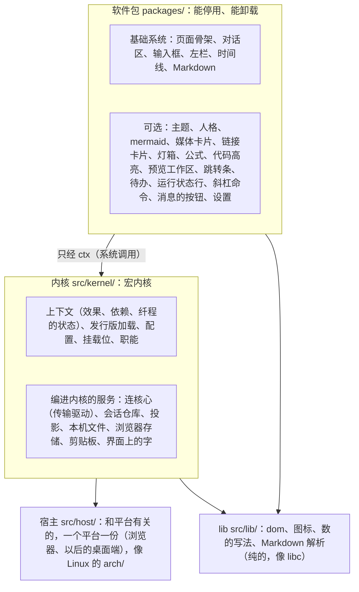

## 网页的架构（仿 Linux）

### 是什么

网页演示怎么搭：一个宏内核，外面一圈能装能卸的软件包；页面上的每一样都由某个软件包提供，每个数、每句字、每种颜色、每个挂的位置都能配。2026-09-30 项目主人定：网页的架构也仿 Linux（分层、宏内核、模块化、功能做成能装能卸的软件），一切元素都能配置、高度可自定义。

照 `00-设计理念.md` 第三节（模块化、宏内核、内置和外部走同一套接口）、第四节（可拆卸：能停用、能卸载，拿掉不留坑；可自定义：出厂的只读，改的写一份同名覆盖），`05-内核接口.md`（一种模块，一份清单加一次注册），`14-配置.md`（一份清单处处推导、分层、说得出来源、写错不致命）。做法借 Cordis（Koishi 用的插件框架，deepseek-harness 的网页也是它；论文《A Programming Paradigm for Spatiotemporal Composability》）：拿掉一个组件，它做过的事全部撤回（时间上可组合）；组件声明要哪些服务，缺了就等着、换了就重来（空间上可组合）。网页不引 Cordis 的代码，照它的思路用原生 JavaScript 写一个小的（设计 21 X2：不用框架、不用构建）。

### 分层

1. **依赖只往下**：软件包只用内核给的 `ctx` 和 `lib/`；软件包之间不互相 `import`，只经服务和挂载位合作；内核不 `import` 任何软件包。由测试照 `import` 查（「守着它的」）。
2. **宏内核**：决定快慢、彼此紧挨着的放在内核里一起写：连核心、会话仓库、投影（事件 → 正文的条目）、一帧画一次的调度。它们在内核里也是服务，走同一套接口，只是编进内核、总在（像编进内核的驱动）。换传输（桥换成核心的网页模块）只换这一个服务的实现。
3. **内核自己站得住**：一个软件包都起不来时，内核照样画出「哪个包卡在哪」的状态页，不白屏。
4. **和平台有关的只在宿主里**：连核心的那条线、本机文件的地址、附件从哪来、存文件、外面的链接、剪贴板、窗口，浏览器和桌面端做法不一样，都收在 `src/host/` 的一份里；内核起来时选一份，以服务 `host` 交出去。别处不直接碰这些（见下一节）。

### 宿主（为桌面端预先设计）

2026-09-30 项目主人定：网页以后移植成桌面端，用 Tauri 包（系统自带的网页视图加一个 Rust 的外壳）；现在就照这个前提设计，到时候只加一份宿主和一个外壳，页面、内核、软件包不动。第一版还是只有网页（设计 01、21 第一节，同一天补了以后照 Tauri 包网页；X8 说的是另一件事：不做成网页应用装到桌面、手机主屏），只是网页从现在起不能写成只能跑在浏览器里的样子。

**一份页面，两个宿主**。同一个 `web-demo/` 目录：

| | 浏览器（现在） | 桌面端（以后，Tauri） |
|---|---|---|
| 页面从哪来 | 桥（以后是核心的网页模块，设计 21 X5）经 HTTP 给 | 打进应用里，Tauri 照目录直接给（`frontendDist`）；不用构建，ES 模块、动态加载软件包照旧 |
| 连核心 | 页面开一条 WebSocket 到桥，桥转到核心的本机套接字、握手时出示本机令牌 | 外壳（Rust）连核心的本机套接字、出示本机令牌，页面经 Tauri 的进程间通道收发，一行一条 |
| 证明是你 | 链接 `#k=` 的访问口令（设计 21 X6） | 不要：通道只在这个进程里 |
| 头这边顶替的查询（`web.*`；`events.read` 2026-10-01 起不顶了，用核心的订阅补发） | 桥 | 外壳，和桥同一份 Rust 代码（下面「宿主怎么搬」第 3 步）；核心有了 `link.preview`、`view.detail` 这些以后两边都不用顶 |

**宿主交出的**（服务 `host`，一个平台一份实现；左边一列是页面用的名字）：

| 能力 | 浏览器 | 桌面端 |
|---|---|---|
| `channel()` 连核心的一条线 | WebSocket（`/ws?k=口令`） | 包一层进程间通道，样子照 WebSocket：`send(一行)`、`readyState`（1 是通着）、`onopen`、`onmessage({data})`、`onclose`、`onerror`。JSON-RPC 那一层（`core/connection.js`）两边同一份 |
| `urls` 本机文件、blob（链接卡片的配图、图标也是 blob）的地址 | 桥的 `/file`、`/blob`，带口令 | 外壳注册的自定义协议（`miyu://file?…`，Windows 上是 `http://miyu.localhost/…`），规矩和桥一样：照核心的 `fs.read`、`blob.get` 读（数据根不给、照账号的 blob）（原来只给这个会话日志里出现过的哈希） |
| `files.pick()` 选文件 | `<input type=file>`，交回浏览器的文件 | 系统的选文件对话框，交回路径 |
| `files.watchDrop(目标, 进、到上面、出、放下)` 拖进来 | 页面上的拖放事件：拖进窗口、到了目标上面、离开，只在目标上松开才收（附件给的目标是整页：在哪松开都收），别处松开不让页面去打开那个文件 | 窗口的拖放事件（网页视图里的拖放拿不到路径）照落点算在不在目标上，交回路径 |
| `files.text(文件, 最多多大)` 读文字文件的内容（框里的卡写有几行） | 浏览器文件的内容；核心存好的那一份（输入历史翻出来的附件，文件上带 `stored`：会话、编号）照桥的 `/blob` 读，本机的文件照 `/file` 读；超过的、读不了的交 `null` | 外壳读那个路径，超过的、读不了的交 `null` |
| `files.preview(文件)` 框里的缩略图 | 浏览器文件的临时地址；核心存好的那一份是桥的 `/blob` 地址；本机的文件（`@` 选文件交过来的，只有路径）是桥的 `/file` 地址 | 本机路径换成的地址 |
| `files.read(文件, 从哪, 多长)` 读附件的一段字节（分块传给核心，`blob.write`，核心施工 W-5） | 浏览器文件切一段读出来 | 有路径的不用读（直接 `blob.put` 的 `path`）；粘贴来的（只有内容）照浏览器 |
| `open(地址)` 外面的链接 | 新标签页 | 系统的浏览器 |
| `files.pickDir({title, start})` 选目录（工作区的「选择文件夹…」，设置页的路径项，`web.md`「设置页」第 5 条）：交路径，取消了交 `false`，开不了交 `null`（用的地方退回自己画的文件夹浏览器） | 浏览器给不了本机路径：页面在本机的请桥开系统的对话框（桥的 `/pick-dir`，Linux 照 zenity、kdialog，macOS 照 osascript，Windows 照 PowerShell；2026-10-08 项目主人：应该打开目录选择器）；页面开在别的机器上、桥那台没有对话框程序的交 `null` | 系统的选目录对话框，交回路径 |
| `openPath(路径)` 用系统里打开这种文件的程序打开本机的文件（设置页点来源，第 7 条） | 没有（交 `false`，设置页改成复制路径） | 系统的默认程序 |
| `intercept(根)` 接住页面里的链接 | 什么都不做 | 点 `target=_blank` 的链接改走 `open`，点带 `download` 的改走存文件的对话框（网页视图不一定管下载） |
| `clipboard.write(字)` | `navigator.clipboard` | 同（网页视图大多给），不给的走外壳 |
| `store` 这台设备上存东西的存法 | `localStorage` | 同（或者外壳写进配置目录里的一个文件） |
| `kind` | `browser` | `tauri` |

**页面自己守的**（两个宿主都成立，由测试和评审守）：

1. 平台的 API 只在 `src/host/` 里用：`WebSocket`、`location.hash`、`localStorage`、`sessionStorage`、`window.open`、`navigator.clipboard`、`dataTransfer`，写死的桥的地址（`/ws`、`/file?`、`/blob?`）。测试照源码查（「守着它的」）。存东西经内核的 `storage`（键带账号，「多用户、多终端」第 5 条），存法是宿主给的。
2. 链接照网页的写法写（外链 `target=_blank`、下载 `download`），由宿主在最外层接住，页面各处不分平台。
3. 不往外取：字体、库都在本地；网上的东西（链接卡片的图）经宿主转。桌面端的内容安全策略由 Tauri 强制，照浏览器现在的一样严（回答里网上的图片以后也经宿主转，`web.md`「图片」第 1 条待拍板）。
4. 一个窗口一份状态：模块级的状态只放在宿主、资源这些一个窗口一份的地方；软件包不留模块级的状态（「软件包」已经是规矩）。桌面端一个会话能开一个窗口。
5. 窗口的边框：桌面端可以自己画标题栏。到时候页面顶上加一个独占的挂载位 `shell.titlebar`（浏览器里空着、不占地方），桌面端的软件包挂拖动区和三个按钮，macOS 让出左上角的三个圆点；左栏头上那一块、对话区顶上的空白当拖动区（`data-tauri-drag-region`，浏览器里不起作用）。现在不做，版式留着这个口子：整页的网格加一行时，别的地方不用改。
6. 键：浏览器占着的（`Ctrl+W`、`Ctrl+T`、`Ctrl+N`）网页不用，桌面端可以用；键位由 `ctx.keys` 登记，宿主给各自的默认。
7. 提醒（她做完了、要你确认）以后经宿主：浏览器的通知、系统的通知。
8. 不用浏览器自带的 `alert`、`confirm`、`prompt`（网页视图里样子、行为不一样，有的根本不弹）：要问的、要提示的照「确认和提问」「提示」自己画。测试照源码查（2026-10-07 做设置页时补）。

**宿主怎么搬**：

1. 蓝图（这一节）。
2. （做完了，2026-09-30）建 `src/host/browser.js`，把上表浏览器那一列收进去：连核心的线和口令、地址、上传、选文件、拖放、缩略图、外链、剪贴板。内核照它起服务 `host`（原来的服务 `bridge` 并进来：起桥的目录、家目录）；附件、灯箱、mermaid、复制改走它。加测试：`src/host/` 以外不碰平台的 API。
3. 桥拆成两半：和传输无关的（`web.*`、本机文件和 blob 的规矩、收附件、链接卡片）做成一个库，HTTP、WebSocket 那一层是它的一个外壳；桌面端的外壳用同一个库。
4. 真做桌面端时：加 `src/host/tauri.js` 和 `desktop/`（Tauri 的外壳：连核心、自定义协议、对话框、拖放；标题栏是一个软件包）。页面、内核、软件包不动。

### 多用户、多终端

2026-09-30 项目主人定：仿 Linux，多用户、多终端也是网页设计的一环。多用户的规矩在设计 06（账号、组、属主和权限、拆开的管理能力、没有 root），网页只照核心给的画、不自己拦；这里写网页这一侧怎么对上。

| Linux | Miyu | 网页这边 |
|---|---|---|
| 用户 | 账号：管理员 `admin`、成员（设计 06 第二节） | 一个页面登录成一个账号：本机经 `miyu web` 的一次性链接是管理员；远程用账号密码登录（U4）；桌面端在本机是管理员（外壳读得到本机令牌），连别的机器上的 Miyu 照远程登录 |
| root、capabilities | 没有 root，管理能力拆开（第四节） | 界面照这个账号有的能力露出对应的页面和按钮（管账号、装软件、配模型……）；只是不露，真正拦的是核心 |
| 终端（tty、ssh 的 pts） | 头的一条连接 | 一个浏览器标签页、一个桌面端窗口各是一个终端，各开一条连接、各自握手；一个人能同时开好几个，几个人也能同时在 |
| tmux 的会话 | 会话（一段对话） | 哪个终端都能接上同一个会话，看到的一样；终端关了它照样在跑（回合、后台任务不跟着终端走） |
| `/etc`、`~/.config` | 全机的设置、账号的设置 | 配置的分层：发行版像 `/etc`（全机，以后要「装软件」这项能力才能改），个人像 `~/.config`（跟着账号走，「配置」第 2 条） |
| `/usr`、`~/.local` | 系统装的软件、自己装的软件（第四节） | 管理员装的软件包全机都有；成员自己装的只在自己的页面里加载 |

**状态分三种，各放各的**：

| 哪一种 | 有哪些 | 放哪 |
|---|---|---|
| 会话的（能看这个会话的都一样） | 事件、标题、置顶、权限级别、待办、排着的话 | 核心；页面只照事件画，不管是哪个终端做的 |
| 账号的（跟着人走） | 主题、软件包的开关和配置、以后的按键 | 现在记在这台设备上、按账号分开；核心有了个人设置（`14-配置.md` 第八节）以后搬进账号的家目录，换一台设备照样 |
| 终端的（只这一个） | 看的是哪个会话、滚到哪、框里没发的字和附件、开着的浮层；左栏收没收、预览工作区多宽 | 这个标签页、窗口自己；要记下来的（左栏、宽度）按账号分开记在这台设备上 |

**页面要守的**：

1. 只照事件画：别的终端发的话、打断、撤销、重做、改名、删除、换权限级别，和自己做的一样从事件来。自己发的命令只多一样：回应（成没成、拒了为什么）；拒了的提示、放回框里，只在发它的那个终端。
2. 不假设只有自己：排着的话可能是别的终端发的；确认、提问的抽屉（M9）谁先回答算谁的，别的终端照回答的事件收起抽屉，不等自己点。
3. 会话被别处删了、改了：正看着的会话被删，回到会话表、提示一句；标题、置顶照推来的改。会话表以后照 `sessions.changed` 画，现在照每个会话的日志推。
4. 谁说的：会话能分享给别人只读（U12），群的会话里有好几个人说话。你这个账号以外的人说的话（`message.user` 的 `by` 不是你），气泡旁边写名字、头像；只读分享的会话，输入框换成一句「只读」，没有编辑、重做、删除。
5. 这台设备上记的东西按账号分开（内核的 `storage` 的键带上握手回的 `account`），同一台电脑上换一个人登录，看不到上一个人的。
6. 界面露什么照握手：现在握手只回 `account`；以后回这个账号有哪些管理能力，设置页照它露出对应的几块，没有的不露。
7. 桌面端一个窗口一个终端：每个窗口各开一条连接、各自握手，和浏览器的标签页一样；不在外壳里并成一条（并起来，核心就分不出是哪个窗口做的）。

现在做到的：第 5 条；第 3 条的删除、改名；第 1、2 条的排着的话。别的要核心给的（握手回管理能力、`sessions.changed`、确认提问的「已回答」事件、会话对这个账号是只读还是能说话、别人说的话带名字）已经记进施工方案：项目主人要在拆 M9（原来的 M8，2026-10-01 改了排期）、做用户系统之前专门讨论一次多用户、多终端，这几样到时一起定。

### 软件包

**一份清单加一次注册**（照 `05-内核接口.md` 第一、二节）。一个软件包是 `packages/<编号>/` 下的一组文件：

| 文件 | 写什么 |
|---|---|
| `manifest.json` | 清单：`id`（小写英文，`-` 连）、`version`、`name`（给人看，按语言代码写：`zh`、`ja`）、`kind`（`base` 基础系统、`optional` 可选）、`inject`（要哪些服务：名字后面带 `?` 的有就用、没有也行，来了、换了这个包重来；带 `~` 的用的时候再找、总是现在的那个，来来去去都不让这个包重来，给大的包用，比如整页不该因为灯箱装上、停了就整个重来）、`provides`（提供哪些服务、声明哪些挂载位、哪些职能）、`settings`（设置项的清单，见「配置」）、`styles`（样式文件）、`text`（界面上的字，按语言代码写，缺的退回 `zh`） |
| `index.js` | 入口：`export function apply(ctx) { … }`。不留模块级的状态（重装时模块会重新加载） |
| `style.css` | 这个包的样子：只用主题给的语义色变量，不写颜色字面量，不写主题选择器 |

清单是 JSON，不用加载代码就读得到：设置页能列出停用了的包的设置项。

### 上下文（系统调用）

每个软件包拿到自己的一个上下文 `ctx`。经它登记的东西都挂在它身上，停用、卸载、重装时照登记的反序一件件撤回：

| 调用 | 做什么 | 撤回时 |
|---|---|---|
| `ctx.effect(fn)` | 做一件事，`fn` 交回怎么撤回；别的调用都是它包的 | 调它交回的撤回（只调一次，调两次也只撤一次） |
| `ctx.<服务>` | 用清单里 `inject` 写了的服务；没写的碰了就报错（照 Cordis 的能力检查） | — |
| `ctx.provide(名字, 实现)` | 提供一个服务 | 拿掉；用它的包跟着等下一个 |
| `ctx.on(事件, fn)`、`ctx.emit(事件, …)`、`ctx.publish(事件, …)` | 听、发事件：`session.opened`、`view.changed`、`turn.started`、`turn.ended`、`message.sent`、`config.changed`。`publish` 发状态事件（「现在是什么样」，`view.changed` 用它）：内核记着最后一份，后来才听的当场先拿到它（刷新时包比页面晚起来，不然运行状态行要等下一件事才出来，2026-10-01 项目主人指出）；`emit` 发的是「发生了一件事」，不补 | 不再听 |
| `ctx.slots.declare(名字, 种类)`、`ctx.slots.register(名字, {id, order, key, render})`、`ctx.slots.mount(名字, {…})`、`ctx.slots.watch(名字, fn)`、`ctx.slots.list/single/pick` | 声明挂载位、往自己声明的里挂（`register`，没声明报错）、往别的包声明的里挂（`mount`：还没声明就等着，撤回了跟着没，再声明又挂上，不看加载的先后）、看着一个挂载位变、照表读（见「挂载位」） | 挂的拿下来；声明的连同里面挂的一起收掉；不再看 |
| `ctx.seam(名字)` | 职能：`provide({id, available, …})`、`use()`（见「职能」） | 拿掉这个提供者 |
| `ctx.commands.register(规格, 做法)` | 斜杠命令 | 命令列表里没了 |
| `ctx.keys.bind(按键, 做法, {when})` | 按键 | 解开 |
| `ctx.config`、`ctx.watchConfig(fn)` | 这个包的设置项的最终值（总是现在的）；听 live 的项当场变（见「配置」） | 不再听 |
| `ctx.text(路径, 字段)` | 这个包的字（照界面语言，缺的退回 `zh`） | — |
| `ctx.local(按语言写的一块)` | 照界面语言挑一块数据（`{zh: …, ja: …}`，缺的退回 `zh`；不是按语言写的原样交回），运行状态行的词库这类 | — |

纤程的状态（照 Cordis）：`inject` 写的服务（带 `?`、`~` 的不算）都在了才「就绪」，跑 `apply`；缺了是「等着」，写明缺哪个；`apply` 抛错、设置项校验不过是「故障」，写明原因，别的包照常；停用是「停了」。它要的服务换了提供者（比如换了主题），整个包撤回重来一遍。状态都列在 `/pkg` 里。

### 挂载位

页面上每一块都挂在某个挂载位里，由声明它的包画出挂的地方。三种（照 deepseek-harness 的 slots）：

| 种类 | 挂进去以后 | 例子 |
|---|---|---|
| `single` 独占 | 新挂的盖住原来的，拿掉了原来的露出来 | `page.sidebar`（左栏）、`chat.empty`（空会话的首页） |
| `list` 一串 | 照 `order` 排，同一个 `id` 只一份 | `composer.above`（待办、运行状态行）、`composer.bar`（框里下面一排左边的按钮：附件）、`composer.head`（框里写字的地方上面：附件那一排）、`composer.payload`（跟着话一起发的：附件；这里挂的不画，见下面）、`composer.footer`（框下面那一行的中间：后台任务的按钮）、`composer.float`（浮在输入框上面、和命令列表同一个位置：后台任务的浮层）、`message.actions`（你的话、她的一轮末尾的按钮）、`page.overlay`（灯箱）、`stage.right`（跳转条）、`composer.takeover`（占着整个框：确认和提问的抽屉；有东西时框里原来的让出来）、`chat.tail`（正文末尾、最后一轮下面：确认和提问了结以后留的结果） |
| `keyed` 按键分派 | 照键找，找不到用兜底 | `chat.item`（按条目的种类：你的话、回答、时间线、收尾那一行）、`markdown.code`（按代码块的语言）、`markdown.line`（单独一行的媒体）、`timeline.detail`（按工具） |

- 挂载位的名字照 `地方.东西`，声明时写明挂进去是「替换」还是「添加」。往没声明的挂载位里挂、同一个名字声明两次：加载时报错。
- 每一件挂的东西各自兜着错：它画的时候抛错，那一格画一个「这一块出错了（哪个包）」，别的照常。
- **拿掉不留坑**：没人挂的有兜底。没有 mermaid 包，mermaid 代码块照代码块写；没有链接卡片，链接照普通链接；没有灯箱，图点了在新标签页开；没有跳转条，右边什么都没有。

### 职能

一件事有好几个做法、同时只能用一个时，是一个职能（照 `12-进程形态与分发.md` R8「按职能替换」、deepseek-harness 的 capability seam）：`theme`（主题）、`persona`（名字、头像）、`markdown`（Markdown 画法）、`highlight`（代码高亮）、`math`（公式）、`lightbox`（灯箱）。选哪个：配置里写了哪个用哪个；没写的，能用的只有一个就用它；能用的不止一个又没写，报「不止一个，在设置里选一个」，不偷偷用第一个。

### 配置

**一切都能配**：每个包的数（尺寸、行数、时长、门槛）、字、颜色、挂在哪、先后、藏不藏、按键、职能选谁、开哪些包，都是配置。现在 `resources/` 里的 `layout.json`、`timeline.json`、`markdown.json`……搬到各自包的清单里当出厂值。

1. **一份清单处处推导**：设置项写在清单的 `settings` 里：`type`（`number`、`duration`、`boolean`、`choice`、`text`、`color`、`key`、`list`、`map`，结构复杂的一整块数据用 `json`，比如运行状态行的词库）、`default`、范围、`name`、`description`、`applies`（`live` 当场生效，`reload` 这个包重装）、`advanced`。校验、设置页、`/config` 的列表都从它来。
2. **分层**，上面的盖下面的（`applies: live` 的项只改了它们的，当场交给那个包：`ctx.config` 换成新的，`ctx.watchConfig` 听的收到，不重装；改了别的项重装）：出厂（清单里的 `default`）→ 发行版（`distro.json` 里给这个包的；全机的，像 `/etc`）→ 个人（这个账号的，像 `~/.config`：现在记在这台设备上、按账号分开，按包编号存的补丁；核心有了个人设置 `config.set`、`config.changed` 以后搬进账号的家目录，`14-配置.md` 第八节；「多用户、多终端」）。每个最终值说得出来自哪一层；「改回出厂」就是删掉个人那一层的这一项。
3. **写错不致命**：个人那一层某一项校验不过，这一项用下面一层的，设置页标红写明为什么；启动时清单自己的出厂值就不对，是这个包的 bug：它「故障」，别的照常。
4. **主题也是配置**：颜色是 CSS 变量，一套静态的底色加语义色；主题包登记一套，个人能单改其中几个（`theme.override`），撤回时露出原来的。
5. **内核自己也有设置项**：界面语言 `language`（`web.md`「界面语言」），和包的设置项同一套写法、校验、分层：发行版写在 `distro.json` 的 `kernel`，个人那一层记在编号 `kernel` 下面。内核起来时先定语言，再装界面的字、加载软件包（包的 `ctx.text` 照它取，缺的退回表里的那一种）。
6. **挂载位也能配**：`slots` 这一项写哪个挂载位里哪几件藏起来、先后怎么排（按 `id`），不改代码就能把跳转条藏掉、把待办挪到运行状态行下面。

### 发行版

`web-demo/distro.json`：这一版网页带哪些包、默认开不开、给每个包的配置，一行一个 `{id, disabled?, config?}`（照 Cordis 的加载器）。个人那一层按 `id` 改其中的行：停用、启用、改配置。加载器照 `id` 对账：新的加载，没了的撤回，`disabled` 变了撤回或加载，配置变了照 `applies` 更新或重装。基础系统的包只能停用其中可选的部分（比如左栏的临时浮出），页面骨架停不了。

以后一个核心软件包可以带一份网页的部分（比如产物：核心那边是 `artifact` 工具，网页这边是预览工作区），装一次两边都有（设计 21「网页头经提供者接口提供」、`05-内核接口.md` 的「网页页面」贡献）；网页的加载器照同一个形状加载它。

### 设置页

设置页也是一个软件包（`settings`），样子、行为见 `web.md`「设置页」（2026-10-07 项目主人定：页面正中的弹窗，核心的配置和网页自己的设置在一起）。它声明三个挂载位：`settings.section`（多一页，桌面端的设置挂这里；`render(kit)` 交回这一页，`kit` 是设置页的控件——开关、下拉、改完就存的一行字、只记着的一行字、按钮、底下提示一句（`settings/kit.js`），别的包画的页和设置页长一个样、不各抄一份；设置页别处改了配置会重画，页要自己记着开着的详情、没存的字，交回同一块）、`settings.item`（往某一页某一组里多加一项）、`settings.editor`（keyed，键是配置项的键：`{options(), hidden()}`，给这一项下拉的选项、没得选时藏了这一行；默认人格由 `setup` 给，2026-10-07）。核心的项照 `config.schema` 自动出控件，包的项照清单的 `settings` 自动出控件，要紧的由包自己画（deepseek-harness 试过全部自动生成，看着像把清单倒出来，不能用）。每一项显示最终值、来自哪一层、恢复默认。「软件包」那一页列出每个包、开没开、状态（就绪、等着缺什么、故障为什么）、提供什么；点一下停用、启用，不用刷新页面。`/settings` 打开设置页，`/config` 打开到「模型」那一页，`/pkg` 打开到「软件包」那一页。

### 现在搬到哪了

2026-09-30 起一件件搬（「怎么搬」第 3 步进行中）。这张表跟着搬，拆出一个包改一行。

**编进内核的服务**：`core`（连核心，现在经桥）、`sessions`（会话仓库）、`host`（宿主，见「宿主」：`kind`、这个页面登录成的账号 `account`、新会话的工作目录 `cwd`（握手回应的 `host.workspace`，核心施工 W-3；原来是起桥的目录）、家目录 `home`（`host.home`）、`files`、`open`、`clipboard`；口令不出宿主）、`page`（页面的根）、`slots`、`seams`、`storage`（这台设备上存的：宿主给的存法，键带账号，读写兜着）、`packages`（列出每个包的状态和清单、停用启用、改个人那一层的配置：按项合，写 `null` 的删掉那一项）。名字列在 `src/kernel/services.js`，内核起来时查一遍都提供了。

| 包 | 种类 | 要（`inject`） | 提供的服务 | 声明的挂载位 | 挂进 | 设置项 |
|---|---|---|---|---|---|---|
| `theme-morning`、`theme-tokyonight` | 可选 | `slots` | — | — | `theme.palettes` | 每个颜色一项（live） |
| `theme` | 基础 | `slots`、`packages` | `theme` | `theme.palettes`（list） | — | `palette`（live） |
| `app` | 基础 | `core`、`sessions`、`host`、`page`、`slots`、`packages`、`lightbox~`、`theme~` | `chat`、`markdown`、`commands`、`composer` | `stage.right`、`stage.info`（list）、`markdown.code`（keyed）、`composer.above`、`composer.bar`、`composer.head`、`composer.payload`、`composer.footer`、`composer.float`（list） | — | 还在 `resources/layout.json` 等处，拆出去的包带走自己的 |
| `rail` | 可选 | `slots`、`chat` | — | — | `stage.right` | `min_prompts`、`current_at`、`jump_margin`、`gutter`、`close_ms` |
| `mermaid` | 可选 | `slots`、`core`、`host`、`markdown`、`lightbox~` | — | — | `markdown.code`（键 `mermaid`） | `max_height` |
| `lightbox` | 可选 | — | `lightbox` | — | — | — |
| `todo` | 可选 | `slots`、`chat` | — | — | `composer.above`（order 10） | `rows`、`marks`、`hold_ms` |
| `pulse` | 可选 | `slots` | — | — | `composer.above`（order 20） | `sweep_seconds`、`dim`、`lift`、`dot_mark`、`dot_count`、`tick_ms`、`words`（json） |
| `attachments` | 可选 | `slots`、`core`、`host`、`composer` | — | — | `composer.bar`、`composer.head`、`composer.payload`；拖文件进来的那一层盖在整页上（挂在 `body` 上，和灯箱一样） | `max_files`、`max_mib`、`count_lines_max` |
| `jobs` | 可选 | `slots`、`core`、`sessions`、`chat`、`composer` | — | — | `composer.footer`、`composer.float` | `tick_ms` |
| `asking` | 可选 | `slots`、`chat`、`composer`、`core` | — | — | `composer.takeover`；了结以后留下的经 `chat.item`（键 `asking`）画在她那一轮里 | `max_vh`、`preview_min_width`、`esc_window_ms` |
| `setup` | 可选 | `slots`、`chat`、`composer`、`core`、`commands`、`storage` | — | — | `composer.above`（order 90：空会话的「选择人格」「设置工作区」）、`stage.info`（开着的会话左上角）、`settings.section`（「人格」「预设」两页，点开原地编辑）、`settings.editor`（键 `persona.default`）；登记 `/workspace` | — |
| `mascot` | 可选 | `slots`、`composer`、`chat`、`sessions` | — | — | —（整页最前面一层，挂在 `body` 上，和灯箱一样；台子照输入框、命令列表、后台任务浮层量） | 模型的数（形状、脸、灯光）、`pixel`、`cols`、`rows`、平常站在哪、重力、落地、被带着走、拖、待机、走动、跳、动作、手里的东西的像素图（模型照 TUI 的 `mascot.json`） |

服务 `chat`：`current()` 正在看的会话、`scroller` 对话区滚的那一层、`list` 正文那一列、`onPrompts(fn)` 你说的话（先给现在的一份，以后每画一次给一份）、`open(id)` 看另一个会话（子代理的会话第一次看时才读）、`running()` 正在看的会话在不在回答、`home()` 家目录、`interrupt()` 打断正在看的会话（照两下 `Esc`）、`reveal()` 正文末尾（`chat.tail`）来了新的，回到跟着最新的、露出它、`anchor(node)` 把一个节点钉在这时正文里最后一块的后面（交回钉在哪，之后的接在它下面）、`place(where, node)` 照交回的位置再钉一次（换了会话回来）。服务 `markdown`：`codeBlock`、`copy`。服务 `lightbox`：`open({url, name, workspace, vector})`。服务 `theme`：`current()`、`dark()`、`next()`。服务 `commands`：`register(规格, 做法)`（跟着登记的包撤回）、`list()`。事件：`view.changed`（对话区画了一次：`{session, running, events, live, retry, queued}`）、`session.opened`（看哪个会话，`null` 是还没开的新会话）、`session.created`（`{from, to}`：新会话第一句话发出去、会话开了）、`theme.changed`。挂载位 `markdown.code` 的一件：`render({text, say})` 交回一个节点；挂的变了，回答整个重画，滚到哪留着。服务 `composer`：`say(字, 好消息)` 提示一句、`changed()` 跟着发的东西变了（发送按钮重看一遍）、`input` 写字的那个框、`focus()`、`takeover(开不开)` 挂载位 `composer.takeover` 占不占着框（框的高度缓过去，收回时焦点回到写字的地方）。挂载位 `composer.payload` 的一件不画：`has()` 有没有要跟着发的、`busy()` 还在准备（这时不能发）、`take()` 交出来并清掉（`{attachments: […]}` 这样的一块，合进 `session.send` 的参数）、`putBack(交出去的)` 核心拒了，放回来。

还在 `app` 里的：人格、媒体卡片、链接卡片、公式、代码高亮、预览工作区、斜杠命令、消息的按钮、左栏的临时浮出，和基础系统本身（页面骨架、对话区、输入框、左栏、时间线、Markdown）。你的话里的附件由基础系统画（停用了 `attachments`，读回来的附件照样看得到）。

### 在哪

| 代码 | 管什么 |
|---|---|
| `web-demo/src/kernel/context.js` | 上下文：效果和撤回、服务、事件、纤程的状态 |
| `web-demo/src/kernel/loader.js` | 发行版和个人那一层合起来的包列表；对账、加载、撤回、重装；每个包的样式 |
| `web-demo/src/kernel/config.js` | 设置项的清单、校验、分层、来源 |
| `web-demo/src/kernel/language.js` | 界面语言：内核的设置项 `language`、照浏览器的语言认、`/language` 浮层里的几行（`options`）（`web.md`「界面语言」） |
| `web-demo/src/model/history.js` | 输入历史：记什么、`↑` `↓` 怎么翻、两下 `Esc` 清掉的那句、列表怎么搜、一条切成几段（`web.md`「输入历史」） |
| `web-demo/src/ui/history.js` | 输入历史列表（`Ctrl+R`） |
| `web-demo/src/model/mention.js` | `@` 选文件：光标前面的 `@` 词、两种找法、写进话里的路径、`Tab` 进目录（`web.md`「`@` 选文件」） |
| `web-demo/src/ui/mention.js` | `@` 选文件的列表；列、找问核心（`src/core/files.js`：`fs.list`、`fs.find`，核心施工 W-2） |
| `web-demo/src/ui/picker.js` | 选一样的浮层（`/language`）：浮在输入框上面，`↑` `↓` 选、`Enter` 选定、`Esc` 关，悬停选中、点一下选定 |
| `web-demo/src/kernel/slots.js` | 挂载位：声明、挂、三种的排法、兜底、各自兜错 |
| `web-demo/src/kernel/seams.js` | 职能：提供者、怎么选 |
| `web-demo/src/kernel/boot.js` | 起内核：编进内核的服务、读发行版、加载、状态页 |
| `web-demo/src/kernel/storage.js` | 这台设备上存的：键带账号，旧的不分账号的键第一次读时搬过来，读写兜着 |
| `web-demo/src/kernel/services.js` | 编进内核的服务的名字（实现现在还在 `src/core/`，搬进内核的时候挪过来） |
| `web-demo/src/host/` | 宿主：`browser.js` 浏览器那一份（连核心的线和口令、地址、上传、选文件、拖放、缩略图、外链、剪贴板）；以后加 `tauri.js`（见「宿主」） |
| `web-demo/src/lib/` | `dom.js`（造节点、图标、量位置：整页放大以后换回 CSS 像素）、`mount.js`（把一个 list 挂载位画进一个节点）、`text.js`（模板、照路径取一句）、`format.js`（数的写法）、`motion.js`（退场：加 `is-leaving`、等动画走完再收，退到一半又出来的停掉退场；在流里占着地方的一块用 `unfold`，高度从 0 长出来、收回去；见 `web.md`「动效」）、`jobs.js`（一个会话派出去的任务：在跑还是结束了、怎么排、挂在它下面的子代理；后台任务的浮层和左栏的树都照它）；以后搬进来的有 Markdown 解析 |
| `web-demo/packages/<编号>/` | 软件包 |
| `web-demo/distro.json` | 发行版 |

### 守着它的

| 测试 | 查什么 |
|---|---|
| `tests/kernel/context.test.js` | 撤回照反序、只撤一次；缺服务等着、来了就绪、换了重来；没声明的服务碰了报错；`apply` 抛错只它故障 |
| `tests/kernel/config.test.js` | 三层合出最终值和来源；个人那一层写错的那一项退回下一层；改回出厂；`live` 和 `reload` |
| `tests/kernel/slots.test.js` | 三种挂载位的排法；独占的盖住、拿掉露出原来的；兜底；没声明的挂进去报错；声明的包撤回，里面挂的一起收掉 |
| `tests/kernel/seams.test.js` | 配置写了的赢；只有一个能用的用它；不止一个没写的报错 |
| `tests/kernel/loader.test.js` | 按 `id` 对账：新增、拿掉、停用、改配置 |
| `tests/boundaries.test.js` | 软件包只 `import` `lib/` 和自己的文件；内核不 `import` 软件包；每份清单合法（设置项的出厂值过得了自己的校验，`inject` 的服务有人提供） |
| `tests/packages/*.test.js` | 每个可选包停用了，兜底接得住（照挂载位和职能的表查，不起浏览器） |
| `tests/host.test.js` | 平台的 API 只在 `src/host/` 里用（「宿主」的「页面自己守的」第 1 条，照源码查）；浏览器那一份的地址带口令、下载带名字；这台设备上存的按账号分开、旧键搬过来、读写抛错不致命；连核心只认一条像 WebSocket 的线（桌面端换线就能用） |

### 怎么搬

一步一步，每步测试先写、先红，搬完现有的测试照旧全绿、页面行为不变：

1. 内核：上下文、配置、挂载位、职能、加载器，带各自的测试。
2. 起页面改成经内核：编进内核的服务接上现在的连接、会话仓库、投影；现有的整页先当一个基础系统的包跑起来。
3. 从这个大包里一件件拆出软件包，拆一件加一条「停用它兜底接得住」：主题、人格、灯箱、mermaid、媒体卡片、链接卡片、公式、代码高亮、预览工作区、跳转条、待办、运行状态行、斜杠命令、消息的按钮、左栏的临时浮出；它们的数和字从 `resources/` 搬进各自的清单。
4. 基础系统拆成页面骨架、对话区、输入框、左栏、时间线、Markdown 几个包，声明各自的挂载位。
5. 设置页、软件包页，`/pkg`、`/config`。

### 出处

- `00-设计理念.md` 第三、四节；`05-内核接口.md` 第一、二、九节；`12-进程形态与分发.md` R6、R8；`14-配置.md` 第二、三、六节；设计 21 X2。
- Cordis 的论文和 deepseek-harness 的网页（`docs/architecture.md`、`docs/cordis-primer.md`、`docs/capability-seams.md`、`packages/client/runtime/src/client/slots.ts`、`packages/client/ui-theme/`、`packages/client/ui-settings/`）。
