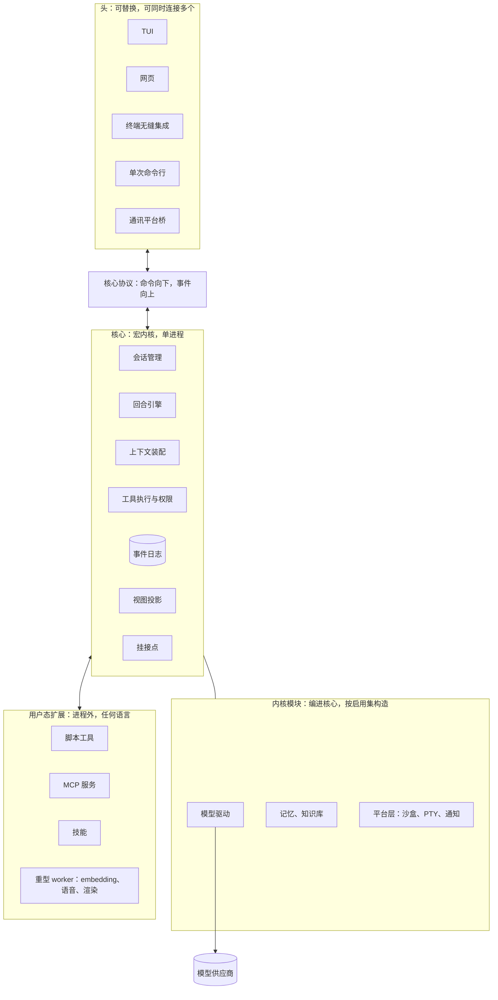
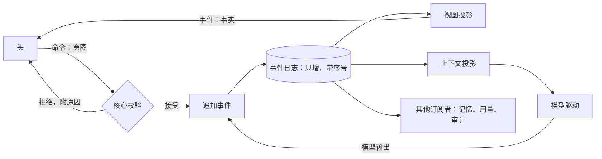
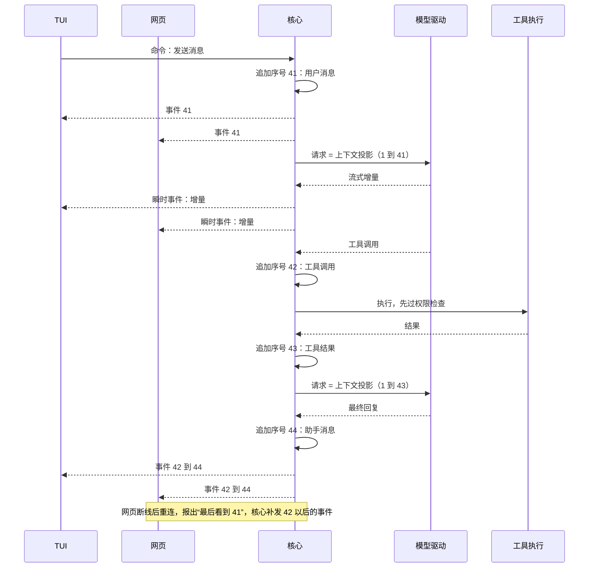
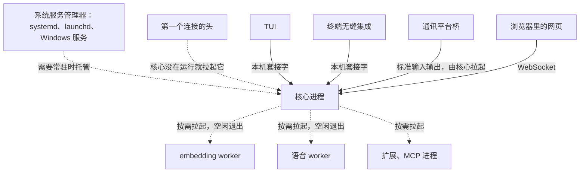
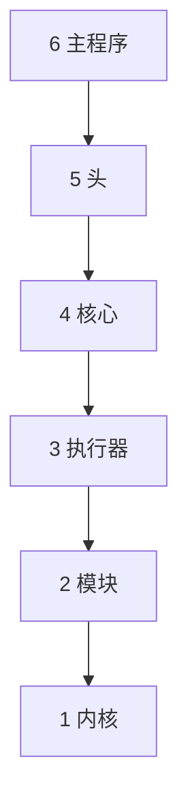

## 架构（草案）

状态：D1、D2、D3 已定（2026-09-25）；D4 已定（2026-09-26）。其余内容为草案。

### 一、出发点：无头的核心，可替换的头

仿照 Linux：Linux 不在乎装的是哪个桌面环境，Miyu 的核心也不在乎连上来的是哪个“头”。

- **核心**可以无头运行。会话、回合、工具、记忆全部在核心里，没有任何界面也能完整工作。
- **头**是可替换的组件：终端界面（TUI）、网页、终端无缝集成、单次命令行、通讯平台桥。桌面程序第一版不做，网页已经能替代它（2026-09-25 确认）。头可以任意更换，也可以同时连接多个。
- 要做到这一点，核心与头之间只能有一条通道，也就是核心协议。事件和数据怎么流动，决定了这套架构成不成立。第四节专门讲。

### 二、向 Linux 借什么

Linux 是操作系统，Miyu 是 harness，不能照搬，要做泛化。泛化有两个方向。

**从人的视角看进来：Miyu 像一台操作系统**

| Linux | Miyu | 说明 |
|---|---|---|
| 内核 | 核心 | 会话、回合、上下文、工具执行、权限、存储 |
| 系统调用接口 | 核心协议 | 核心对外的唯一入口，稳定，有版本号 |
| 进程 | 会话 | 有编号、有状态，可暂停、可打断、可结束 |
| fork 出的子进程 | 子代理 | 由父会话派生，结果回报给父会话 |
| 信号 | 控制命令 | 打断、暂停、继续 |
| 守护进程、cron | 后台任务、定时消息、长期目标 | |
| 文件系统加日志 | 事件日志 | 一切状态的真相源 |
| 设备驱动 | 模型驱动 | 把各供应商的差异翻译成统一的形状 |
| 编进内核的模块 | 内置子系统 | 记忆、知识库等，编进核心，按启用集构造 |
| 内核钩子（如 LSM） | 挂接点 | 扩展在固定位置介入核心流程 |
| 用户态程序 | 头、扩展、脚本工具 | 通过核心协议与核心交互 |
| 终端设备（TTY） | 头，以及通讯平台上的场所 | 每个头都是一个“终端”；通讯平台上的一个群、一个私聊也是一个终端设备，桥是它的驱动（`18-通讯平台.md` 第二节） |
| sshd | 通讯平台桥的身份这一面 | 把外部的人接到会话上，并替他们表明身份 |
| init、systemd | 系统自带的服务管理器 | Miyu 不自己造 init，借用各平台现成的 |
| systemd 的 target | 预设 | 装的软件一样，选不同的预设，打开不同的一组（`16-人格与预设.md`） |
| busybox | 分发形态 | 代码上可拆，分发上可合为一个二进制 |
| Unix 管道哲学 | 组件可独立使用 | 对应“可复用”原则 |

**从模型的视角看出去：模型像 CPU**

这个类比来自 Karpathy 提出的“LLM OS”，具体对应是这里自己做的。

| 计算机 | Miyu | 对设计的意义 |
|---|---|---|
| CPU | 模型 | 最贵的资源，要让它少空转 |
| 内存 | 上下文窗口 | 有限、昂贵，要管理 |
| CPU 缓存 | 供应商的前缀缓存 | 只增的上下文就是对缓存友好的内存布局 |
| 内存回收 | 压缩 | 内存不够时回收，且只能单向推进 |
| 磁盘 | 长期记忆、知识库、文件 | 需要时换入上下文 |
| 系统调用 | 工具调用 | 执行前由核心检查权限 |
| 中断 | 用户打断、回合中途到来的新消息 | |
| 调度器 | 回合引擎 | 决定哪个会话在什么时候使用模型 |

### 三、分层总图

### 四、事件流与数据流

这是整套架构的地基。规则如下：

1. **头只发命令，不改状态。** 命令是意图，可能被拒绝。拒绝时一定附带原因。
2. **核心是唯一的写入者。** 命令经核心校验，被接受后产生事件，追加进事件日志。
3. **事件是已经发生的事实，不可修改。** 每个会话的事件带单调递增的序号。
4. **一切状态都是事件日志的投影。** 界面上看到的、发给模型的上下文、记忆提取、用量统计，都从同一本日志推导出来。没有第二份真相。
5. **事件分两种。** 持久事件落库，例如消息、工具调用、工具结果。瞬时事件不落库，例如流式输出的增量、进度。瞬时事件最终汇总成一条持久事件。
6. **断线重连靠序号。** 头重连时报出最后看到的序号，核心补发之后的事件。已经了结的事情在投影里是状态，不会被当成新事件再触发一次。

一个回合的完整流动。两个头同时连着同一个会话：

### 五、头的规则

1. **头只经过核心协议与核心交互。** 不直接读写核心的存储。
2. **头的差异只影响“怎么显示”，不影响“模型看到什么”。** 模型看到的内容由会话决定，不由当前连着哪个头决定。会话的场所在创建时确定。场所是会话面对的地方：本机的头、通讯平台上的一个群或私聊、桌面语音（`18-通讯平台.md` 第三节）。旧版教训：终端和网页各拼一套提示词，跨端切换一次，前缀缓存就失效一次。
3. **头在连接时声明自己的能力。** 例如能不能显示图片、能不能弹出提问、能不能播放声音。某个头不具备的能力，由这个头显示降级形态，会话本身不变。
4. **多个头可以同时连接同一个会话，看到同一串事件。** 像 tmux 的多个客户端连着同一个会话。
5. **头不写业务逻辑。** “该显示什么”的判断只写一次，写在核心的视图投影里，所有头共用（D1）。

### 六、身份与信任

- 核心从连接本身得知对方是谁：本机套接字由操作系统报告对端用户，远程连接凭登录令牌。
- 头发来的正文里自称的身份一概不作数。
- 通讯平台桥是特权头。它被授权代表外部用户发命令，像 sshd 代表登录的用户。它代表的外部用户只拿到外部信任级别。
- 权限由核心在执行工具前判定，不靠提示词。

### 七、核心的边界

宏内核里放的是“决定速度、决定正确性”的部分：

| 组件 | 职责 | Linux 对应 |
|---|---|---|
| 会话管理 | 创建、暂停、打断、结束会话；管理父子会话 | 进程表 |
| 事件日志 | 只增存储，一切状态的真相源 | 文件系统加日志 |
| 回合引擎 | 驱动“请求模型、执行工具、再请求”的循环 | 调度器 |
| 上下文装配 | 从事件日志生成请求，保证前缀字节稳定；压缩的机制在这里（边界事件、只前进），什么时候压、摘要怎么写归策略模块 | 内存管理 |
| 工具执行与权限 | 调用工具前判权限、套沙盒 | 系统调用加权限检查 |
| 模型驱动 | 翻译各供应商的差异 | 设备驱动 |
| 挂接点 | 扩展在固定位置介入 | 内核钩子 |
| 视图投影 | 把事件变成显示用的状态（D1） | 无直接对应 |
| 协议服务 | 对外唯一入口 | 系统调用接口 |

核心之外的一切（头、通讯平台桥、脚本工具、MCP、技能、重型 worker）都是用户态，只通过核心协议或核心发起的调用与核心交互。

### 八、进程视图

本机套接字、WebSocket、标准输入输出只是不同的传输方式，上面跑的是同一套核心协议。

### 九、代码的分层

前面几节画的是运行起来的样子。这一节画代码的样子：每个 crate 属于哪一层，谁能依赖谁（2026-09-26 补）。

它是 `00-设计理念.md` 第四节「依赖只朝一个方向」的图纸。门禁直接读这一节的两张表和行数上限来检查，所以这里就是真相源：改分层，改的就是这里（D4）。

箭头是「可以依赖」：上层可以依赖它下面的任何一层，下层不许依赖上层。

| 层 | 名字 | 放什么 | 纯逻辑 | crate |
|---|---|---|---|---|
| 1 | 内核 | 事件、日志、投影、回合状态机，以及给执行器实现的端口（trait）；测试用的执行器替身，只在 `testkit` 开关打开时编进去（施工 2-9） | 是 | `miyu-kernel` |
| 2 | 模块 | 编进核心的纯逻辑：请求的组装、视图投影、压缩和权限的策略、驱动的编码与解码（施工 3-4）、协议的消息类型 | 是 | `miyu-assemble`、`miyu-drivers` |
| 3 | 执行器 | 真正做 I/O 的：存储、HTTP（施工 3-5）、工具、沙盒 | 否 | `miyu-store`、`miyu-http` |
| 4 | 核心 | 核心进程：会话 actor、协议端点、资源调度 | 否 | |
| 5 | 头 | 终端界面、命令行 | 否 | |
| 6 | 主程序 | `miyu`，按子命令分发 | 否 | |

规则：

1. 一个 crate 只能依赖同一层或更低层的 crate。
2. 每个 crate 都登记在上表里，一个 crate 只属于一层。没登记的 crate，或者表里有、仓库里却没有的 crate，门禁都当场拦下。
3. 纯逻辑的两层（内核、模块）：
   - 依赖的外部 crate 只能从下面的白名单里挑。要加一个，在引入它的那一步的施工单里写明理由。
   - `src/` 里不许出现 I/O：文件、网络、子进程、环境变量、线程、时钟、标准输入输出。单元测试也算在内；要读写文件的测试，放到 `tests/` 下。
   - `src/` 里不许用 `HashMap`、`HashSet`：它们遍历的顺序每次运行都不一样，同样的输入会得出不同的字节。要用映射，用 `BTreeMap`、`BTreeSet`。
4. 文件行数上限：每个 `.rs` 文件不超过 500 行，测试也算在内。
5. 工具 crate 不属于任何一层，也不许被别的 crate 依赖。现在有两个：`xtask`，就是门禁本身；`miyu-try`，试玩台（施工 3-5 补），内核直接接真模型。

纯逻辑的两层能用的外部 crate（白名单）：

| crate | 理由 |
|---|---|
| `serde` | 编号、时间、事件要写成 JSON、从 JSON 读回来；这是 Rust 里的标准做法（施工 1-1） |
| `serde_json` | 原样的 JSON：驱动私有数据和不认识的种类要一个字节都不改地留着；事件的编解码也用它（施工 1-2） |
| `sha2` | 内容哈希要真的算出来：请求的哈希和指纹，以后 blob 和策略快照也用。只要 SHA-256，默认功能都关掉；自己写容易错（施工 1-8） |

### 十、决定

**D1. 视图投影放在哪里**

- **已定：放在核心里。** 显示逻辑只写一次，所有头共用；用任何语言写的新头都不需要重写显示逻辑，头只负责画。细节见 `04-核心协议.md` 第五节。
- 未选 A：每个头自己算。这是旧版的做法，同一条显示规则在 TUI、网页各写一遍，改一处漏一处。
- 未选 B：做成共享库编进每个头。Rust 写的头可以直接用，网页头需要把它编译成 WASM。
- 重开条件：实测核心计算视图的开销违反“极速”原则，或者出现核心视图表达不了的头。

**D2. 核心的运行形态**

- **已定：运行时只有一种形态，就是独立的核心进程。** 第一个头连接时自动拉起；需要常驻（例如挂通讯平台）时交给系统服务管理器。代码上核心是一个库，测试可以直接嵌入。
- 未选：同时支持“嵌入头里运行”。单次命令行会更轻，但运行形态变成两种。旧版教训：单次命令退出时，会把它拉起的后台任务一起杀掉。
- 重开条件：实测单次命令行经过核心进程的启动延迟不可接受。

**D3. 通讯平台桥的形态**

- **已定：独立进程的头，像 sshd。** 由核心拉起，只在接入了平台时运行，一个平台账号一个；也可以单独拿出去用。
- 未选：编进核心的模块。少一个进程，但核心要背上每个平台的协议。
- 重开条件：实测独立进程带来的延迟或资源开销不可接受。

**D4. 代码怎么分层**

- **已定（随施工单 0-2，2026-09-26 项目主人批准）：六层，每个 crate 登记在一层，只能依赖同层和更低层；内核和模块两层是纯逻辑，外部依赖走白名单，`src/` 里不许有 I/O；每个文件不超过 500 行。第九节的表就是门禁读的真相源。**
- 未选 A：层序表写在门禁的代码里。旧版就是这样（层序表在一个 Python 脚本里），文档里要再写一份，两份迟早对不上。
- 未选 B：不分 crate，一个 crate 里分模块。编译器管不住模块之间的依赖方向，只能靠自觉。
- 重开条件：出现一个 crate 放不进任何一层；或者纯逻辑的层确实需要某种 I/O，那说明它该拆出一个端口。

**后续再定**

- 核心协议的消息格式与本机传输方式：已定，见 `04-核心协议.md`
- 网页的页面由谁提供：已定，见 `04-核心协议.md`
- 扩展的两种形态（编进核心、进程外）各自的接口：已定，见 `05-内核接口.md`
- 存储引擎：已定，见 `07-存储.md` S2、S3
