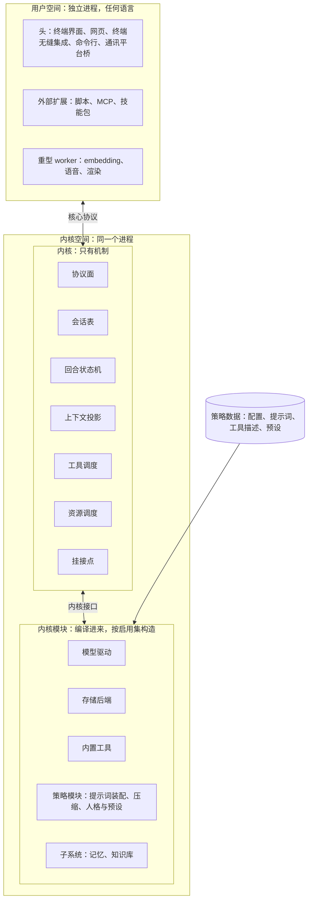
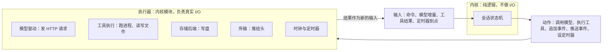
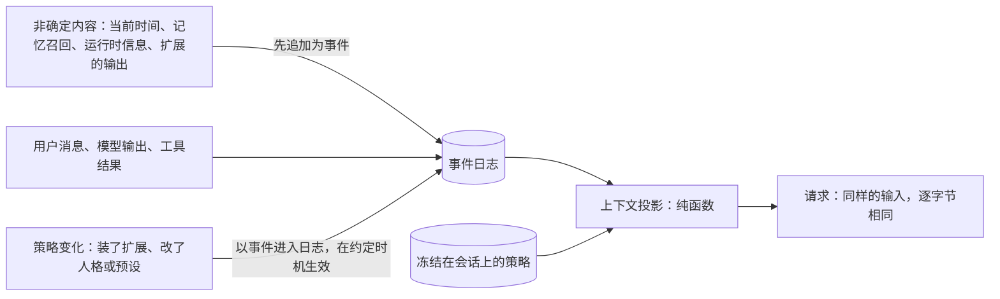
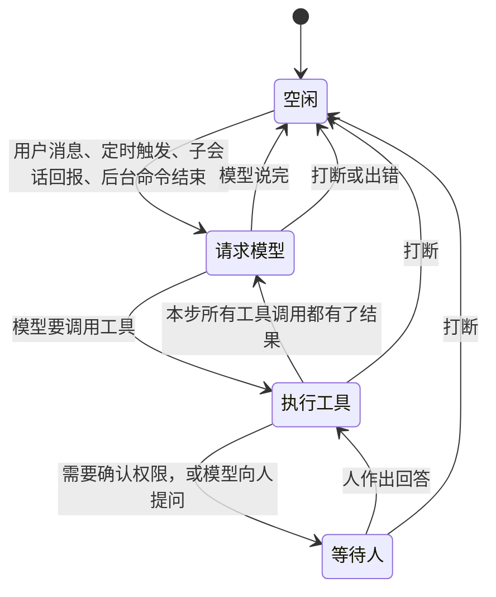
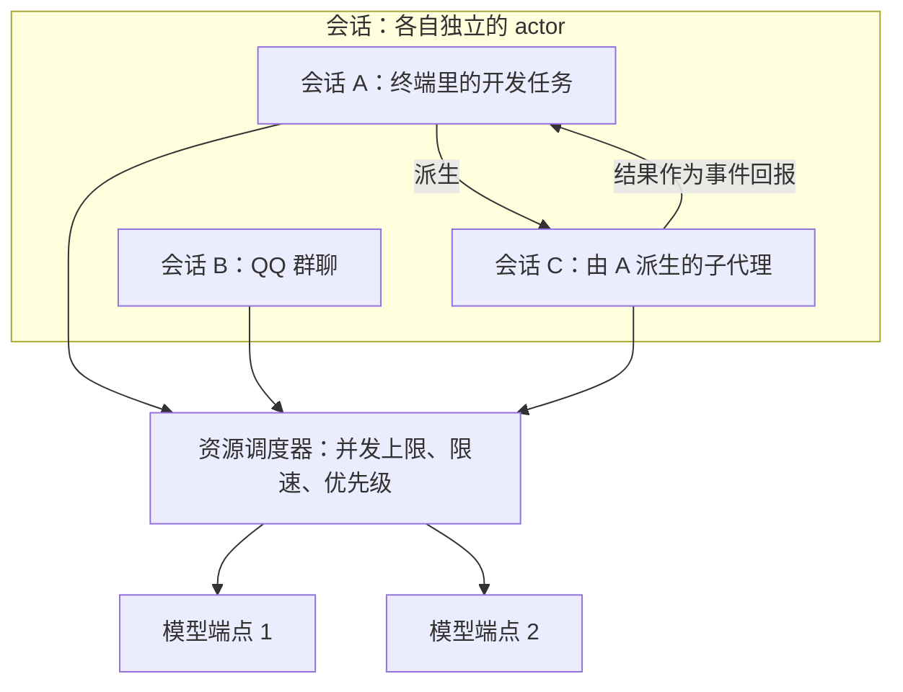

## 内核（草案）

状态：K1、K2、K3 已定（2026-09-25）。其余内容为草案。

### 一、内核只提供机制，不决定策略

这是 Unix 的老原则：提供机制，不规定策略。内核规定“事情怎么发生”，不规定“发生什么事”。

| 机制：在内核里 | 策略：数据或扩展 |
|---|---|
| 回合循环：请求模型，执行工具，再请求 | 用哪个模型，最多走几步 |
| 上下文投影：从事件日志生成请求 | 系统提示词写什么、按什么顺序排、用哪个人格和预设 |
| 压缩边界：日志里的一条“压缩”事件，投影从最近的边界开始算 | 什么时候压缩，摘要怎么写 |
| 工具调度：检查权限、派发、超时、取消、记录结果 | 有哪些工具，描述写什么，谁能用 |
| 权限检查点 | 权限规则 |
| 资源调度：并发、限速、优先级 | 每个端点的并发数，谁优先 |

这就是“无硬编码”在内核层的含义：内核里没有一句提示词，没有一个工具定义，没有任何一家供应商的细节，也没有一个写死的阈值。

出厂的人格、预设、提示词和工具描述，都是随发行附带的策略数据。换掉它们，内核一行不改。

### 二、内核、内核空间、用户空间

“宏内核”这个比喻要先说准。Linux 的宏内核指驱动和内核跑在同一个地址空间，不是说内核本身什么都管。对应到 Miyu：

- **内核**：只有机制的那一小块。概念少，代码少，极少改动。
- **内核空间**：与内核同一个进程。内核加上编译进来的模块：模型驱动、存储后端、内置工具、策略模块、记忆等子系统。模块按启用集构造，不用的不构造。
- **用户空间**：独立进程，用什么语言写都行。头、外部扩展、重型 worker 都在这里。

### 三、内核认识的全部概念

内核的词汇表只有这些。每个词只有一个含义。

| 概念 | 定义 |
|---|---|
| 会话 | 一个独立运行的单元，有自己的事件日志和状态。并发和隔离都以会话为单位 |
| 事件 | 已经发生的事实，追加进会话的日志，带序号，不可修改。分持久和瞬时两种 |
| 命令 | 发给内核的意图，来自头、扩展或别的会话。结局只有两种：被接受并产生事件，或被拒绝并附原因 |
| 回合 | 由一次触发引起的一轮工作，由若干步组成，以一个明确的结束原因收尾 |
| 步 | 一次模型请求，加上它引出的全部工具调用 |
| 上下文 | 发给模型的请求。它是事件日志和冻结策略的纯函数 |
| 工具调用 | 模型发起的一次能力调用。内核负责调度，不负责工具本身的逻辑 |
| 模型驱动 | 把统一的请求翻译成某家供应商的格式，再把它的响应翻译回统一的事件。通讯平台的场所驱动是另一回事，属于场所子系统（`18-通讯平台.md` 第二节） |
| 挂接点 | 策略介入内核流程的固定位置 |
| 身份 | 命令是谁发出的。由连接本身确定，不由正文确定 |

预设、人格、记忆、技能、压缩摘要这些词不在表里。它们是策略或子系统，内核不认识。场所、权限级别对内核来说只是冻结在会话上的属性，由策略模块解释。

### 四、纯逻辑内核

内核不做任何 I/O：不发网络请求，不读写文件，不读时钟。

它只做一件事：接收输入，更新状态，输出“要做的事”（动作）。真正的 I/O 由执行器完成，执行结果再作为新的输入送回内核。

这样做的收益：

- **可测**：测试只需要喂输入、看动作，不需要真模型、真网络、真时钟。
- **确定**：同样的输入序列一定得到同样的状态和动作。回放日志就能重现任何一次问题。
- **易懂**：状态机的每一步都是一个普通函数，输入和输出都是枚举，读一个函数就能看懂一件事。
- **可复用**：内核是一个没有 I/O 依赖的库，可以单独拿出去用，也可以嵌进测试。
- **跨平台**：平台差异全部落在执行器里，内核对平台无知。

代价：多一层“动作、输入”的枚举样板代码。

动作和输入的种类，只随内核认识的概念变（第三节）。记忆、场所、语音这些子系统不往里加：它们经挂接点和工具接进来，自己的 I/O 交给自己的执行器。所以子系统越长越多，内核的枚举也不跟着胖（2026-09-25 补）。

**输入、动作、命令怎么写**（2026-09-26 补，施工 2-1）：一个会话是一个状态机，送进一条输入，出来一串动作。现在有下面这些，别的随做它的那一步加：

| 类 | 有哪些 | 带着什么 |
|---|---|---|
| 输入 | 收到一个命令 | 命令编号、谁发的（取自连接）、到的时刻（执行器的时钟）、命令本身 |
| 输入 | 落盘了 | 追加的事件，到第几号为止已经同步到磁盘 |
| 输入 | 环境变了 | 时区、工作目录（施工 2-3） |
| 输入 | 回合开始的挂接点跑完了 | 到的时刻、哪个回合、各模块交回来的注入，照固定的先后（施工 2-3） |
| 输入 | 请求发出去了 | 到的时刻、这次请求的 `seen`、发给了哪个端点的哪个模型、请求字节的哈希（施工 2-3） |
| 输入 | 模型的一段增量 | 到的时刻、`seen`、一段增量（施工 2-3） |
| 输入 | 模型说完了 | 到的时刻、`seen`；用量，或者出错的分类和原话（施工 2-3） |
| 输入 | 工具执行完了 | 到的时刻、调用编号、成功还是出错、给模型看的内容块、执行用了多少毫秒（施工 2-4） |
| 输入 | 工具执行中的输出 | 到的时刻、调用编号、一段输出（施工 2-4） |
| 输入 | 执行前的链判完了 | 到的时刻、调用编号、结论：放行；拒绝，哪个模块拒的、写给模型的那一句；要问人，哪个模块问的、要的是哪一类访问、提的放行规则、给头看的说明（施工 2-7） |
| 命令 | 发一条消息（`session.send`） | 一串内容块；急着插话的，带一个标记（施工 2-5） |
| 命令 | 打断（`session.interrupt`） | 排着队的消息怎么办：接着发，还是退回（施工 2-5、2-6） |
| 命令 | 切权限级别（`session.set_permission_level`） | 常用的那一级、只读开关，改哪样写哪样（施工 2-7） |
| 命令 | 回答确认（`session.answer`） | 调用编号、选了哪一项；拒绝的可以带一句理由（施工 2-7） |
| 动作 | 追加事件 | 这一次产生的几条事件，一次写入、一次同步（`07-存储.md` 第三节） |
| 动作 | 回应命令 | 命令编号；接受的，附上它产生的事件的序号；拒绝的，附上原因码 |
| 动作 | 推送事件 | 落了盘的事件，推给头 |
| 动作 | 跑回合开始的挂接点 | 哪个回合（施工 2-3） |
| 动作 | 请求模型 | 这次请求看到了第几条为止、统一的请求（施工 2-3） |
| 动作 | 推送瞬时事件 | 一条瞬时事件，不落盘，不等（施工 2-3） |
| 动作 | 不要这次请求了 | `seen`（施工 2-3） |
| 动作 | 跑回合结束的挂接点 | 哪个回合（施工 2-3） |
| 动作 | 过执行前的链 | 调用编号、工具名、修正过的参数、这一轮的工作目录、实际生效的那一级（施工 2-7） |
| 动作 | 执行工具 | 调用编号、工具名、修正过的参数、这一轮的工作目录（施工 2-4） |
| 动作 | 停下工具 | 调用编号（施工 2-5） |

- **会话从 `session.created` 开始**：造会话时就追加这一条，它的 `cause` 是造会话的那个命令（`04-核心协议.md` 的 `session.create`）。
- **命令产生的事件**：`at` 是命令到的时刻，`by` 是发命令的一方，`cause` 是命令编号。空闲时来的消息还会开一个回合（第六节「回合怎么开、请求怎么发」）。
- **先落盘，后回应、后推送**（`07-存储.md` S4）：接受的命令，等它产生的事件都落了盘，才回应它、才推送这些事件。拒绝的命令没有产生事件，当场回应。
- **每收到一次命令，回应一次**（不变量 7）：接受，或者拒绝，没有第三种，也不会不回。同一个编号收到两次，就回两次。
- **同一个编号只生效一次**（不变量 9）：接受过的编号再来，不再产生事件；回应照上一次，还是接受、还是那几条事件，也等它们落了盘再回。拒绝过的不记：它没生效过，再来就重新判。
  - 只记最近接受的 1024 个编号，不随日志变长。断线重发发生在几秒、几分钟之内；再早的编号再来，当新命令。编号写在事件的 `cause` 里，重启以后从日志重建（施工 2-8）。
- **拒绝附原因码**：稳定的英文，给程序看；给人看的那句话，由核心照头的语言配上（`04-核心协议.md` 第六节第 4 条）。现在有这些：
  - `empty_message`：发来的消息一块内容都没有；
  - `not_running`：没有回合在进行，打断不了（施工 2-5）；
  - `unknown_level`：要切到的级别不认识（施工 2-7 上）；
  - `not_asking`：这个调用不在等确认（施工 2-7 中，下同）；
  - `unknown_decision`：确认的选项不认识；
  - `no_rule`：请求没提放行规则，选不了本会话、这个工作区以后；
  - `unexpected_reason`：只有拒绝能带理由。
- 内核自己造出的事件过不了账本（第九节），是内核的 bug，不是命令的拒绝：当场停下，写明是哪一条。

### 五、上下文是日志的纯函数

**上下文 = 投影（事件日志，冻结在会话上的策略）**

两条规则：

1. **任何非确定的内容，必须先成为事件，才能进入上下文。** 当前时间、记忆召回的结果、运行时信息都一样。进入日志之后它就是确定的，以后每次投影都逐字节相同。前缀字节契约因此从“靠自觉遵守”变成“结构上只能这样”。
2. **策略冻结在会话上。** 装了新扩展、改了人格或预设、工具目录变了，这些变化以事件的形式进入日志，在约定的时机生效，不会悄悄改掉已经发出去的前缀。

### 六、回合状态机

- 外部输入只在“步”的边界进入正在进行的回合，也就是两次模型请求之间。这样工具调用和工具结果永远成对。回合进行中收到的新消息，是排到回合结束，还是在下一步插入，属于策略。急着要说的也有办法：剩下还没跑的工具各补一条「已跳过」的结果，这句话立刻进下一步，工具调用和结果照样成对（参考 jcode 的软打断，2026-09-25 补）。
- 打断时，还没有结果的工具调用一律补上“已取消”的结果。

**回合怎么开、请求怎么发**（2026-09-26 补，施工 2-3）：

1. **空闲时来了一条消息，就开一个回合**：同一批追加这条 `message.user`、`turn.started`（`trigger` 是这条消息），和变了的环境、权限两块事实（`by` 是内核，`08-上下文投影.md` C10），一次写入、一次同步。回应这个命令时附上的只有消息本身的序号：回合是内核接着开的。
2. **回合进行中追加的事件都带上这个回合的编号**，中途来的消息也一样（`03-事件模型.md` 第二节）：撤销这一轮，它们一起撤掉。中途来的消息怎么进下一步，是施工 2-6。
3. **回合里内核造的事件**：`cause` 是触发它的那条事件的 `cause`，一个命令引起的事一路追得下去；`at` 是引起它的那条输入到的时刻。内核不读时钟，所以一条输入产生的几条事件，时刻相同。
4. **回合开始的挂接点**：开头那一批落了盘，才叫执行器跑回合开始的挂接点，挂接点看到的都是落了盘的事件（`07-存储.md` S4：落了盘才算发生）。执行器叫各模块，等它们都回来或者超时，把各自的注入照固定的先后交回来（`05-内核接口.md` 第五节第 2 条）；内核照交回来的先后追加成 `context.injected`，`by` 是各自的模块。一个模块都没挂，也照样回一次，交回空的。
5. **发请求等两样**：回合开始的挂接点跑完了；追加过的事件都落了盘（`08-上下文投影.md` 第一节第 2 条「先落盘，后请求」）。这时拿有效历史组装请求（`05-内核接口.md` 第五节「组装请求」），交给执行器去请求模型，带上这次请求看到了第几条为止（`seen`）。
   - `seen` 也是这次请求的名字：模型的增量、结局都带着它回来，对不上的是过时的，不理（施工 2-3 下、2-5）。每次请求都要记一条 `model.called`（`08-上下文投影.md` 第七节），所以后一次请求的 `seen` 一定比前一次大，不会重名。
6. **环境**：会话记着现在的时区和工作目录，造会话时交进来，执行器报「环境变了」就换掉；时间取边界上那条输入到的时刻。换了不当场注入，到下一个边界再查（C10）。工作目录跟着人说话时所在的目录走（`22-命令行.md` 第七节）：执行器在交进那条消息之前，先报环境变了。
7. **造会话时交进来、冻结在会话上的**（K3）：组装请求的做法，两类事实的模板。开始时的权限取自 `session.created`。

**回复怎么收、回合怎么结束**（2026-09-26 补，施工 2-3）：

1. **执行器的三种回报**，都带着这次请求的 `seen`，对不上的是过时的，不理：
   - 请求发出去了：发给了哪个端点的哪个模型，驱动编码以后的字节的哈希（`05-内核接口.md` 第七节）。
   - 一段增量（`03-事件模型.md` 第五节「增量和累积器怎么写」）。
   - 说完了：正常说完的，附上用量；出错的，附上分类和原话。没发出去就失败了的，例如没有能用的端点，不报「发出去了」，直接报说完了。
2. **增量交给累积器**，收下了就推一条瞬时的 `model.delta` 给头，私有数据不推。增量对不上、请求还没发出去就来了增量或者说完了，是驱动或执行器的错：这次请求按出错算，叫执行器别再发了。
3. **正常说完**：累积器拼成回复，同一批追加 `message.assistant`（`by` 是那个模型，`seen` 是这次请求的）和 `model.called`。回复里没有工具调用，再追加 `turn.ended`（完成）；有工具调用的，回合接着走（施工 2-4）。
   - 一个块都没有的回复按出错算：写进日志的回复，以后要原样发回去，空的会被拒。
4. **出错**：收到的半截不写成回复。重试重发的是同一份请求（施工 3-5）；写进去的话，里面的调用还得补上结果。追加 `model.called`（写明出错的分类和原话），再追加 `turn.ended`（出错）。
5. **每次请求都记一条 `model.called`**，出错的也记。它排在这次请求的回复后面；没有回复的，排在 `turn.ended` 前面（`03-事件模型.md` 第三节「模型调用怎么写」）。
   - 第一处不同：发请求时算出这份请求的指纹（施工 1-8），和这个会话上一次请求的比。只在内存里比，核心重启以后的第一次请求不写。
   - 用时从「发出去了」算起：第一段增量到了用了多久、到说完用了多久，拿回报到的时刻相减。
6. **回合结束以后**：`turn.ended` 落了盘，叫执行器跑回合结束的挂接点（`05-内核接口.md` 第五节，广播，不等结果）。会话空闲，下一条消息开下一个回合。

**工具怎么调、下一步怎么走**（2026-09-26 补，施工 2-4）：

1. **先查，再派**。回复里的每个调用，先过内核自己的两道检查（`05-内核接口.md` 第六节）：
   - 工具面上没有这个名字：当场记一条出错的结果，写明没有这个工具，不派。
   - 参数照这件工具的参数格式修正：被写成字符串的数组、对象、数字、布尔，照格式还原；声明成字符串的，一个字节都不动。什么都没写的，当成空对象。根本不是 JSON 对象的，当场记一条出错的结果，写明参数不是 JSON 对象，不派。
   - 修正只用在执行上：日志里的回复照模型给的原文记，发回去的字节不变。
   - 内核自己写的结果，`by` 是内核，内容是资源里对应的那一句（`resources/core/tool-results/`）。
2. **回复落了盘才派**：日志里先有这个调用，才有它的效果（`07-存储.md` S4）。派的时候带上调用编号、工具名、修正过的参数、这一轮的工作目录。
3. **派的先后**：连着的只读调用一起派；不是只读的，等它前面的都有了结果才派，它有了结果，后面的才派。能不能一起跑，看工具的访问类别（`05-内核接口.md` 第六节）。
4. **结果**：执行器交回的结果照到的先后追加成 `tool.result`，`by` 是那次调用；投影时按调用的先后排（`03-事件模型.md` 第六节）。对不上的，例如不是这一步在跑的、已经有了结果的，不理。执行中的输出推成瞬时的 `tool.progress`（`03-事件模型.md` 第五节）。
5. **下一步**：这一步的调用都有了结果、追加过的事件都落了盘，就组装下一次请求，和第一次一样。回合中途来的消息这时也在有效历史里，排在这一步的全部结果后面（`03-事件模型.md` 第六节）。
6. **步数上限**：一个回合最多请求几次模型，是策略数据，没有上限的就一直走到她不再调工具。到了上限，这一步的工具照样跑完，结果照样记下，但不再请求，追加 `turn.ended`（步数上限，`08-上下文投影.md` 第五节）。
7. **这一轮的工作目录**：回合开始时的那一个，这一轮里不变；中途报了环境变了，下一轮才用新的（`22-命令行.md` 第七节）。

**打断和急着插话**（2026-09-26 补，施工 2-5）：

1. **打断**（`session.interrupt`）：回合走到哪一步都能打断，打断以后会话空闲。没有回合在进行时来的打断，拒绝，原因码 `not_running`。
2. **请求在路上时打断**：叫执行器别再发了。收到的半截照累积器留下：正文、思考收到多少留多少，工具调用只留收全了的（`03-事件模型.md` 第五节）；不是空的，就写成回复，多写一格 `"interrupted":true`。`model.called` 的结果写 `interrupted`，用时算到打断为止。回复里留下的调用各补一条「已取消」，它们没跑过。
3. **工具在跑时打断**：在跑的叫执行器停下，各补一条「已取消」，说明可能已经做了一部分；还没派的也补「已取消」，说明没跑过。之后才到的结果、输出，不理。
4. **打断产生的事件**：内核补的结果和 `turn.ended`（被打断），`by` 是打断的人，`cause` 是打断的命令；回应这个命令时，附上这一次追加的全部事件的序号。收下的半截回复和 `model.called` 是请求自己的，`cause` 照旧是回合的。
5. **急着插话**：`session.send` 带上急着插话的标记。回合里还没派的调用各补一条「已跳过」，`by` 是说话的人；在跑的照常跑完；这一步齐了就请求下一次，这句话就在里面。请求还在路上时来的，等回复到了，回复里的调用全都跳过。
   - 模型正在说的话不截断：要截断，先打断再说。头怎么触发急着插话，做终端界面时和项目主人一起定（M8）。
   - 回合没在进行时，急着插话和普通的消息一样，开一个回合。
6. **写给模型的三句**：「已取消，没跑过」「已取消，跑到一半」「已跳过」，放在 `resources/core/tool-results/`，英文短句，只说发生了什么（`26-提示词.md` J3）。

**排队的消息**（2026-09-26 补，施工 2-6）：

1. **排队**：回合进行中来的消息照样记进日志，带着这个回合；她还没听到，就是排着队。下一次请求里就有它，排在这一步的全部工具结果后面（`03-事件模型.md` 第六节）。排着队的是这一轮里、最近一次请求看到的之后来的消息，头照日志就列得出来。
2. **最后一步里排队的，回复完了接着发**（项目主人：「那当然是在这步结束后发送呀。AI 回复结束后发送。」）：这一轮结束时还有排着队的，就接着开下一轮，由最后那一条触发，前面几条照日志的先后排在它前面（`08-上下文投影.md` 第四节第 4 条）。走完、出错、到步数上限结束的都一样。
   - 两个回合在同一批里追加：上一轮的 `turn.ended`，紧接着下一轮的 `turn.started` 和变了的事实。下一轮的 `at` 是结束上一轮的那条输入到的时刻，`cause` 是触发它的那条消息的 `cause`。
   - 另开一轮，不在上一轮里接着请求：这句话有自己的一轮，撤销时能单独撤，步数上限重新算，回合开始的挂接点也照这句话跑。
3. **打断有两种**（项目主人：「esc两次打断，排队的马上发；ctrl+c打断，排队的回到输入框」；键位的细节随终端界面，M8）：
   - **接着发**：打断以后，排着队的马上开一轮，和第 2 条一样。
   - **退回**：打断以后，排着队的撤回来。追加一条 `message.withdrawn`，写明撤回了哪几条，`by` 是打断的人；它们从有效历史里去掉。回应附上这一条的序号，头照着把字放回输入框。
4. **只有排着队的能撤回**：她还没听到过的，也就是最近一次请求看到的之后来的。听到过的已经在发出去的请求里，撤了前缀就断，账本拦下（第九节）。回合的触发不算排队：它开了这一轮。
5. 子代理和后台命令的回报（M7），照同一条走。

**权限级别怎么切**（2026-09-26 补，施工 2-7 上）：

1. **人切，内核记**：`session.set_permission_level` 开关只读，或者改常用的那一级，改哪样写哪样。记一条 `session.policy_changed`，`permission` 两格都写，`by` 是切的人；回合进行中切的带上这个回合。和现在一样的，接受，什么都不记。
2. **收紧当场生效，放宽等下一次请求**（`11-权限与沙盒.md` 第二节）：实际生效的那一级，从严到宽是只读、工作区、完全放开。收紧的，这一步里还没派的调用当场照新的级别判；放宽的，下一次请求发出去之前才生效。
3. **内核自己拦的**：只读时写文件的调用不派，当场记一条被拒绝的结果，`by` 是内核，写明会话是只读的（`resources/core/tool-results/`）。访问类别不认识的，按写入算（`05-内核接口.md` 第六节）。别的照常派：命令在只读的沙盒里跑（M5）；越界的读取、联网要不要问人，是执行前的链的事（施工 2-7 中）。
4. **变了才注入，在请求之前查**：回合中途切过的，下一次请求之前查一遍环境和权限，变了的记成事实，排在这一步的全部工具结果后面（`08-上下文投影.md` C10）。来回切了一圈又回到原样的，和最近那一块一样，不注入。回合之间切的，下一个回合开始时查（施工 2-3）。回合中途查的，环境那一块写这一轮的工作目录（`08-上下文投影.md` 第五节）。
5. **规则写在 system 里**：每一级能做什么、只有人能切，是核心的一行（`resources/core/permission-rule.txt`，`26-提示词.md` J2），施工 3-6 拼进 system。事实里只写现在是哪一级。

**确认怎么走**（2026-09-26 补，施工 2-7 中）：

1. **派之前先过执行前的链**（`05-内核接口.md` 第五节）：调用轮到能派时，内核先把它交给执行器过一遍链，带上实际生效的那一级。链里是权限策略和各扩展的守卫，最严者胜，交回一个结论。完全放开时也过：扩展的守卫不看级别。等结论的调用和在跑的一样占着位置，派的先后照旧（「工具怎么调、下一步怎么走」第 3 条）。
   - 放行：派给执行器去跑。
   - 拒绝：当场记一条被拒绝的结果，`by` 是拒绝它的模块，内容是它写给模型的那一句。
   - 要问人：记一条 `tool.approval_requested`，`by` 是提问的模块，这个调用停下来等人。请求写明要的是哪一类访问、提的放行规则、给头看的说明（`03-事件模型.md` 第三节「确认的事件怎么写」）。
2. **没有人能确认的会话**：没有确认界面的场所（QQ、桌面语音）、不是终端时的 `miyu ask`（`11-权限与沙盒.md` A11，`22-命令行.md` 第三节）。链说要问人的，内核不记请求，当场记一条被拒绝的结果，`by` 是内核，写明要人确认、这里没法确认。有没有人能确认，是策略数据。
3. **人回答**（`session.answer`）：四个选项，允许这一次、本会话都允许、这个工作区以后都允许、拒绝（`11-权限与沙盒.md` 第二节）。记一条 `tool.approval_decided`，`by` 是回答的人，`cause` 是这个命令。
   - 允许：这一条落了盘再派，日志里先有允许，才有它的效果（`07-存储.md` S4）。记住的放行规则由链照日志去用：本会话的，链读这个会话里的决定；这个工作区以后的，存进工作区的配置（M5）。内核只记，不判。
   - 拒绝：再记一条被拒绝的结果，`by` 是拒绝的人，内容写明被人拒绝了，写了理由的带上理由。**她接着干**（`11-权限与沙盒.md` A13，2026-09-26 项目主人定）：这一步照常往下走，她看到结果，自己换个办法。要她停下，就打断。
   - 请求没提放行规则的，只能选这一次或者拒绝。不在等确认的调用、不认识的选项、没有规则却选了记住、允许却带了理由，拒绝这个命令（第四节的原因码）。空的理由当没写。
4. **等人的时候**：这一步里别的调用照常走，只读的照样一起跑。回合停在「等待人」（上面的状态图）。不设超时：人不回就一直等，打断随时进得来（三家都不设）。
5. **收紧、打断、急着插话**：等结论的、等人的调用都还没跑过。
   - 收紧成只读：要写入的当场拦下，写明会话是只读的。等结论的看工具的访问类别，等人的看请求要的那一类；只读以后才到的结论要问人、要的是写入的，也不记请求，当场拦下。别的照旧等：只读和工作区只差在写入上，越界的读取、第一次访问网站，只读里照样问人（`11-权限与沙盒.md` 第二节）。
   - 打断：各补一条「已取消，没跑过」（「打断和急着插话」第 3 条）。
   - 急着插话：各补一条「已跳过」（「打断和急着插话」第 5 条）。
   - 调用有了结果，在等的请求就了结了，头收起抽屉。之后才到的结论不理；之后才到的回答拒绝，原因码 `not_asking`。
6. **请求和决定都不进上下文**（`08-上下文投影.md` 第四节）：她看到的只有工具结果。守卫超时由执行器计时，按拒绝交回（`05-内核接口.md` 第五节第 3 条）。

### 七、多会话并行

- **每个会话是一个独立的 actor**：自己的状态，自己的日志，自己的收件箱。会话之间不共享可变状态，只通过命令交流。
- **共享资源由资源调度器仲裁**：模型端点的并发上限、限速、429 退避，以及优先级。有人在等的回合，优先于辅助请求这类没人等的工作。人正看着的会话、父会话还没收到回报的子代理，都算有人在等（2026-09-26 补）。
- **子代理就是由父会话派生的子会话**：结果作为事件回到父会话。
- **子代理永远在后台跑**（2026-09-26 项目主人定）。派出去以后，父会话这一轮照常往下走，走完就空闲。回报到了，她闲着就由回报开一轮，正忙就在下一步的边界看到。
  - 不设「等它做完」：模型多半会白白地等，为此写的注意事项又白占 token。
  - 项目主人的话：「委派给别人了，那自己自然会空出来而不是一直阻塞。」Claude Code 也是这样做的。
- **派了孙代理的子代理，等它们都回报完再向上回报**：它这一轮说完话，只要还有自己派出去的在跑，就先不回报；被孙代理的回报叫醒的几轮也结束了，才把整件事一起回报给父会话。和 `miyu ask` 等子代理回报完才退出（`22-命令行.md` 第三节）是同一条规则（2026-09-26 补）。
- **后台命令跑完了也叫醒她**（2026-09-26 项目主人定）：记一条 `job.reported`（`03-事件模型.md` 第三节），她闲着就由它开一轮，正忙就在下一步看到。一直开着的服务不结束，也就不叫醒。旧版和 Claude Code 都是这样。
- **给子代理留言**：父会话可以给自己派出去的子代理追加一条消息（`10-自带软件.md` 的 `message_agent`）。它还在跑，就在下一步看到；已经做完，就在它的子会话里另起一轮，结束时照样回报。
- **一轮由谁开，结果回给谁**：父会话开的（派出去、留言），结束时回报给父会话；人切进子会话、自己开的那一轮，不回报，人就在旁边看着（`13-终端界面.md` 第五节）。人在父会话开的那一轮里插过话，回报里由内核注明一句，免得父会话对不上自己派的活。反过来也一样：人开的那一轮里只要进过父会话的留言，结束时就回报给父会话，并注明人也在这一轮里，免得留言没有回音（2026-09-26 补）。
- **撤销一轮，这一轮派出去的子代理和后台命令一起停下**：否则回报回来时，父会话的投影里已经没有派它的那次调用。撤销之前，头列出会被停掉的（2026-09-26 补）。
- **任何会话的回合都能打断，子代理的也一样**（`04-核心协议.md` 的 `session.interrupt`）。打断子代理的一轮，它这件活停在半路，闲着等人说话；人不管它、用 `job.stop` 停掉时，照样回报父会话一句「被人停掉了」，父会话不会白等。终端界面里用哪个键打断子代理，和头的细节一起打磨（2026-09-26 补）。
- **子代理的边界**：派生的深度有上限（初值 2 层）；用量记在派它的那个人头上；子代理跑到做完或被 `job.stop` 为止，打断父会话的回合不会停掉它；父会话被删，子会话一起停下。这些都是策略数据（2026-09-25 补，2026-09-26 改）。

### 八、挂接点（初稿，定稿见 `05-内核接口.md` 第五节）

挂接点分两种：

- **同步纯函数**：必须确定、必须快，结果直接参与计算。组装请求、压缩判断、调度属于这种。
- **异步**：可以做 I/O，可以慢。结果一律先成为事件，再参与后续计算。

| 挂接点 | 时机 | 能做什么 | 例子 |
|---|---|---|---|
| 命令进入 | 命令被接受之前 | 放行、拒绝、改写 | 命令这一层的权限检查、通讯平台限流 |
| 回合开始 | 第一步请求之前 | 追加事件 | 记忆召回、运行时信息 |
| 组装请求 | 每次投影 | 决定系统提示词、工具目录（同步纯函数） | 人格与预设、提示词装配 |
| 模型输出后 | 每步模型说完 | 追加事件、标记 | 内容过滤 |
| 工具执行前 | 派发之前 | 放行、拒绝、询问人 | 权限规则、沙盒策略 |
| 工具执行后 | 结果记录之前 | 改写结果、附加事件 | 重复调用提醒 |
| 回合结束 | 回合收尾之后 | 追加事件、发起辅助请求 | 记忆提取、标题生成、用量统计 |
| 订阅 | 任何事件之后 | 只读 | 审计、同步到外部 |

### 九、内核不变量

每一条都要写成测试。

1. 日志只增，序号连续递增。
2. 每个工具调用最终都有且只有一个结果：成功、失败、已取消、被拒绝或已跳过。
3. 同样的日志加同样的策略，投影出的请求逐字节相同。
4. 一个会话同一时刻最多只有一个回合在运行。
5. 会话之间不共享可变状态。
6. 进入上下文的非确定内容，一定先成为事件。
7. 每个命令都有明确结局：被接受并产生事件，或被拒绝并附原因。
8. 崩溃重启后，全部状态从日志重建。未完成的回合标记为中断，不会凭空继续；后台命令和子会话同理，没有结束记录的补一条「中断」。
9. 命令带有发送方生成的编号。同一编号重复发送，只生效一次，断线重发不会重复执行。

**日志追加时查的规矩**（2026-09-26 补，施工 1-7）：每追加一条事件，就照下表查一遍。违反的不追加，报错写明是第几条、违反了哪一条。

| 规矩 | 出处 |
|---|---|
| 序号从 1 开始，一条接一条，不跳号 | 不变量 1 |
| 第 1 条是 `session.created`，以后不再出现 | `03-事件模型.md` 第三节：会话创建 |
| `turn.started` 的 `turn` 是它自己的序号；这时没有别的回合在进行；`trigger` 在它之前 | `03-事件模型.md` 第二节、不变量 4 |
| 带 `turn` 的事件，`turn` 是正在进行的那个回合。`message.assistant`、`tool.result`、`tool.approval_*`、`turn.ended` 只在回合里发生，必须带 | `03-事件模型.md` 第二节 |
| `message.assistant` 里第 k 个工具调用，编号是 `call_<这一条的序号>_<k>` | `03-事件模型.md` 第二节 |
| `message.assistant` 的 `seen` 在它自己之前，而且不早于上一条回复：后一次请求一定看过前一条回复 | `03-事件模型.md` 第六节 |
| `model.called` 的 `seen` 在它自己之前 | `03-事件模型.md` 第三节「模型调用怎么写」 |
| `message.withdrawn` 撤回的，都是正在进行的回合里排着队的消息：`message.user`，还没被哪次请求看到过，也没撤回过 | `03-事件模型.md` 第三节「消息和工具结果怎么写」 |
| `tool.result` 对得上前面的一个调用，这个调用还没有结果 | 不变量 2 |
| `tool.approval_requested` 对得上一个还没有结果的调用，这个调用没有在等的请求 | `03-事件模型.md` 第三节「确认的事件怎么写」 |
| `tool.approval_decided` 对得上一个在等的请求，一个请求只决定一次；调用有了结果，在等的请求就了结了 | 同上 |
| `turn.ended` 时，这一回合的调用都已经有了结果 | 不变量 2、第六节 |
| `context.compacted` 的 `upto` 在它之前，而且不早于上一次压缩的 | `03-事件模型.md` 第七节 |
| `turn.reverted` 撤的回合都存在，而且都在最近一次压缩之后 | `03-事件模型.md` 第七节 |

- 只查日志自己就能判断的：这一条，加上它之前的日志。不看策略，不看时钟。时钟可能往回拨，所以不查 `at` 的先后。
- **查这些只用一本小账，不留事件本身**：下一条的序号、正在进行的回合和它还没有结果的调用、在等确认的调用、上一条回复是几号、最近一次压缩到哪、那以后开过的回合。账本不随日志变长（2026-09-26 项目主人提醒：日志全放进内存会一直膨胀）。
- 不认识的种类（例如模块自己的 `ext.*`）只查序号和 `turn`。以后加一种事件，要查的就在这张表里加一行。
- 从磁盘载入的日志也照这样一条条追加，坏日志在载入时就被拦下（施工 2-8、3-2）。

### 十、决定

**K1. 内核是否做成纯逻辑，I/O 全交给执行器**

- **已定：是。** 收益见第四节。
- 未选：传统写法，内核里的异步代码直接做 I/O。样板少一些，但测试要靠模拟网络和时钟，确定性靠自觉。
- 重开条件：原型实测表明，“动作、输入”的样板让代码明显更难读懂。

**K2. 上下文是否只能来自事件日志**

- **已定：是。** 非确定内容必须先成为事件。
- 代价：日志会变长，因为注入过的内容都要留档。旧版为了保住缓存本来就这么做（“化石化”），这里只是把它变成结构。
- 重开条件：实测日志体积成为存储或投影速度的瓶颈。

**K3. 策略变化在什么时机生效**

装扩展、改人格或预设、改工具目录之后：

- **已定：下一个回合开始时生效，并以事件记录。** 代价是这一次会让前缀缓存失效，而且只失效这一次。
- 未选 A：立即生效，回合进行中也换。
- 未选 B：等到下次压缩时才生效。缓存损失最小，但人改了设置却迟迟看不到变化。
- 重开条件：实测这一次缓存失效的成本不可接受。

**后续再定**

- 事件的具体种类与格式：已定，见 `03-事件模型.md`
- 事件日志的存储方式：已定，每个会话一份，见 `07-存储.md` S2
- 内核接口：模块怎么注册到内核：已定，见 `05-内核接口.md`
