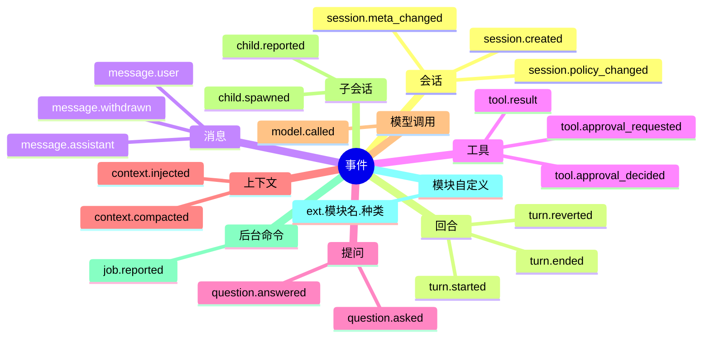
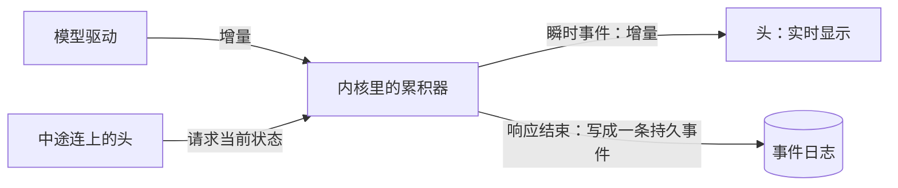
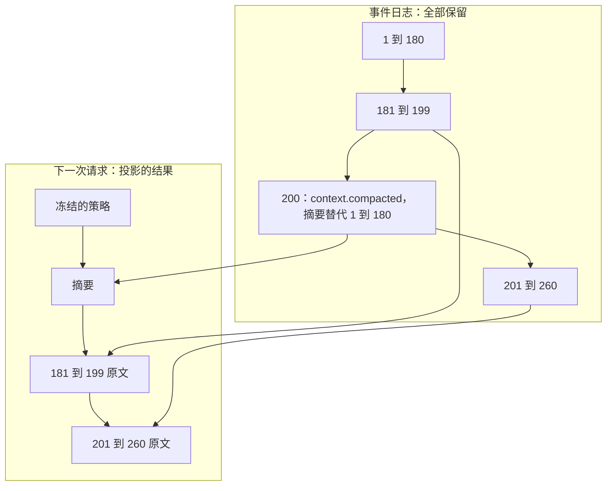

## 事件模型（草案）

状态：E1 到 E6 已定（2026-09-25）。其余内容为草案。

事件是整个系统最底层的契约。内核的输入输出、头看到的内容、存储存下的数据、发给模型的上下文，都由事件构成。它也是以后最难改的东西：日志一旦写进用户的硬盘，之后的每个版本都必须永远读得懂。

### 一、三条总则

1. **事件是已经发生的事实。** 追加进会话的日志，不可修改，不可删除。
2. **撤销也是事件。** 撤销一轮对话、压缩掉一段历史，都是追加一条新事件，旧事件原样留在日志里。
3. **日志记录“发生的顺序”，投影决定“呈现的顺序”。** 事件按到达内核的先后编号。发给模型时怎么排列，由投影按确定的规则决定。两者都是确定的。

### 二、公共字段

每条事件都有同样的外壳：

| 字段 | 含义 | 谁来填 |
|---|---|---|
| `seq` | 会话内序号，从 1 开始，连续递增 | 内核 |
| `at` | 发生时间，UTC，精确到毫秒 | 内核，取自时钟输入 |
| `kind` | 事件种类，形如 `message.user` | 产生者 |
| `turn` | 所属回合，值为该回合 `turn.started` 的序号，`turn.started` 自己填自己的序号。不属于任何回合时为空 | 内核 |
| `by` | 由谁引起：人（附上身份：账号或外部身份，`06-多用户与身份.md` 第二节）、模型、工具、模块（含扩展）、另一个会话、内核 | 内核。取自连接，不取自正文 |
| `cause` | 引起它的命令编号，用于去重和追踪 | 内核 |
| `body` | 这个种类自己的内容 | 产生者 |

`by` 的写法（2026-09-26 补，施工 1-2）。用 `kind` 分开七种：

| 由谁引起 | JSON |
|---|---|
| 人（账号） | `{"kind":"person","account":"alice"}` |
| 外部身份 | `{"kind":"external","venue":"qq:group:123456","id":"qq:10086"}` |
| 模型 | `{"kind":"model","endpoint":"deepseek","model":"deepseek-v4"}` |
| 工具 | `{"kind":"tool","call_id":"call_44_1"}` |
| 模块（含扩展） | `{"kind":"module","id":"memory"}` |
| 另一个会话 | `{"kind":"session","id":"0192f3a0-1111-7abc-8def-001122334455"}` |
| 内核 | `{"kind":"kernel"}` |

会话编号不写在每条事件里，因为日志本身就属于某个会话。事件经协议发给头时，才附上会话编号。会话编号使用按时间有序的全局唯一编号（UUIDv7）。

**编号和时间的写法**（2026-09-26 补，施工 1-1）：

| 名字 | JSON 里 | 写法 | 例子 |
|---|---|---|---|
| 会话编号 | 字符串 | UUIDv7 的标准写法：小写十六进制，8-4-4-4-12 | `"0192f3a0-1111-7abc-8def-001122334455"` |
| 序号 | 数字 | 会话内从 1 开始，连续递增 | `45` |
| 回合编号 | 数字 | 这个回合 `turn.started` 的序号 | `42` |
| 命令编号 | 字符串 | 发送方生成；1 到 128 字节，不含控制字符 | `"cmd-7f3a"` |
| 调用编号 | 字符串 | 内核分配：`call_<助手消息的序号>_<这条消息里的第几个调用>`，从 1 数起 | `"call_44_1"` |
| 账号 | 字符串 | 小写英文字母开头，只用小写字母、数字、`-`、`_`，最长 32 个字符；不能是 Windows 保留的名字（`con`、`nul`、`aux`、`prn`、`com1` 到 `com9`、`lpt1` 到 `lpt9`） | `"alice"` |
| 模块、驱动家族 | 字符串 | 和账号一样：它们也会出现在路径里（`home/<账号>/modules/<模块>/`） | `"memory"`、`"openai-chat"` |
| 场所、外部身份、供应商、模型 | 字符串 | 1 到 128 字节，不含控制字符；内核不解读 | `"qq:group:123456"`、`"qq:10086"`、`"deepseek"`、`"deepseek-v4"` |
| 媒体类型 | 字符串 | 小写的 `类型/子类型` | `"image/png"` |
| 文件名 | 字符串 | 1 到 255 字节，不含控制字符，也不含 `/`、`\` | `"报告.pdf"` |
| 内容哈希 | 字符串 | `sha256:` 加 64 位小写十六进制。blob、策略快照、请求字节都用它 | `"sha256:e3b0c44298fc1c149afbf4c8996fb92427ae41e4649b934ca495991b7852b855"` |
| 时间 | 字符串 | UTC，精确到毫秒，固定 24 个字符 | `"2026-09-25T07:04:05.123Z"` |

- 读和写一样严：写出去是什么样，读进来就只认什么样。对不上的当成坏数据，报错说清是哪一个字段、错在哪。
- 调用编号带着助手消息的序号，所以一个会话里不会重复；供应商自己的编号放进驱动私有数据（第四节）。
- 账号名会出现在路径 `home/<账号>/` 里，又要在三个平台上都能用。macOS 和 Windows 的文件名默认不分大小写，所以只用小写；显示给人看的名字另起，可以用中文。
- 时间只存 UTC。显示成本地时间是头的事；给模型看的时区写在环境事实里（`08-上下文投影.md` C10）。

一条事件的样子：

```json
{
  "seq": 45,
  "at": "2026-09-25T07:04:07.890Z",
  "kind": "message.assistant",
  "turn": 42,
  "by": { "kind": "model", "endpoint": "deepseek", "model": "deepseek-v4" },
  "cause": "cmd-7f3a",
  "body": {
    "blocks": [
      { "type": "text", "text": "我先看一下目录。" },
      { "type": "tool_call", "call_id": "call_45_1", "name": "read", "args": "{\"path\":\"src\"}" }
    ],
    "seen": 44
  }
}
```

**外壳的写法**（2026-09-26 补，施工 1-3）：

- 日志里一条事件占一行，写成紧凑的 JSON，不加空格。上面为了好读才排成了多行。
- 字段的顺序固定：`seq`、`at`、`kind`、`turn`、`by`、`cause`、`body`。
- `turn`、`cause` 没有就不写。读的时候，没有和写成 `null` 都当没有。
- `kind` 是用点分开的几段，至少两段；每段小写字母开头，只用小写字母、数字、`_`、`-`；最长 128 字节。模块自己的种类写成 `ext.<模块>.<种类>`。
- 认识的种类，`body` 照那一种读；读不出来是坏数据，报错说清是哪一种的 `body`。
- 不认识的种类，包括不认识的 `ext.*`，`body` 原样留着，投影跳过它。
- 一行里多出来、不认识的字段，读进内存时不管；日志里的原文照样留着（第八节）。

两个样子。第一个是人发来的一条消息，`message.user` 的 `body` 只有 `blocks`，一串内容块（第四节）；第二个是不认识的种类，`body` 原样留着：

```json
{"seq":41,"at":"2026-09-25T07:04:05.123Z","kind":"message.user","by":{"kind":"person","account":"alice"},"cause":"cmd-7f3a","body":{"blocks":[{"type":"text","text":"看看 src 目录"}]}}
{"seq":43,"at":"2026-09-25T07:04:05.456Z","kind":"ext.memory.recalled","turn":42,"by":{"kind":"module","id":"memory"},"body":{"hits":[{"id":"m1","score":0.87}]}}
```

### 三、事件种类



**持久事件**：落库，是状态和上下文的来源。

| 种类 | 含义 |
|---|---|
| `session.created` | 会话创建。记录会话的属主、场所、父会话或分叉来源、初始策略快照 |
| `session.policy_changed` | 策略变化，下一个回合开始时生效（内核 K3）。权限级别是例外：收紧当场生效，放宽下一步生效（`11-权限与沙盒.md` 第二节） |
| `session.meta_changed` | 标题、置顶等元数据变化 |
| `turn.started` | 回合开始，记下引起它的那条事件（下面「会话与回合的事件怎么写」） |
| `turn.ended` | 回合结束，记录结束原因：完成、打断、出错、步数上限、中断（核心崩溃或重启时没走完，`02-内核.md` 不变量 8） |
| `turn.reverted` | 撤销一个或多个回合，投影从此不再包含它们 |
| `message.user` | 人发来的消息，或另一个会话发来的消息 |
| `message.assistant` | 模型一次响应的完整内容，包括其中的工具调用 |
| `message.withdrawn` | 撤回排着队、她还没听到的消息（`02-内核.md` 第六节「排队的消息」） |
| `tool.result` | 一个工具调用的结果：成功、失败、已取消、被拒绝、已跳过；附带给内核和头看的效果（`10-自带软件.md` 第五节） |
| `tool.approval_requested` | 请人确认一次工具调用的权限 |
| `tool.approval_decided` | 人对权限请求的决定 |
| `question.asked` | 模型向人提问 |
| `question.answered` | 人的回答 |
| `context.injected` | 模块注入进上下文的事实：记忆召回、运行时信息、环境和状态的变化（内核 K2，`08-上下文投影.md` C10）。规则不在这里，写在稳定区（`08-上下文投影.md` C3） |
| `context.compacted` | 压缩：一份检查点，替代某个序号之前的全部内容（`09-压缩.md`） |
| `model.called` | 一次模型请求的记录：端点、模型、请求哈希、用量、耗时、结果 |
| `child.spawned` | 派生子会话 |
| `child.reported` | 子会话的回报。父会话闲着，就由它开一轮（`02-内核.md` 第七节） |
| `job.reported` | 后台命令结束：退出码、耗时，输出存成 blob。命令是在那次 `shell` 调用返回以后才结束的，所以单独记一条；会话闲着，就由它开一轮（2026-09-26 项目主人定） |
| `ext.<模块名>.<种类>` | 模块自定义的事件 |

场所子系统的事件，例如撤回、戳一戳、出站队列的入队与送达，用它的命名空间 `ext.venues.*`；群里的每条消息照常是 `message.user`（`18-通讯平台.md` 第十二节）。

**会话与回合的事件怎么写**（2026-09-26 补，施工 1-4）：

| 种类 | `body` | 说明 |
|---|---|---|
| `session.created` | `{"owner":"alice","venue":"local","policy":"sha256:…","permission":{"level":"workspace","read_only":false}}` | 属主、场所、策略快照、开始时的权限。父会话和分叉来源，做子代理和分叉的那一步再加 |
| `session.policy_changed` | `{"policy":"sha256:…"}` 或 `{"permission":{"level":"workspace","read_only":true}}` | 换了策略快照，或者换了权限；两样也可以一起换。谁换的看 `by`：人改的是配置，内核换的是目录变了 |
| `session.meta_changed` | `{"title":"整理 src 目录"}`、`{"pinned":true}` | 标题、置顶，改了哪项写哪项 |
| `turn.started` | `{"trigger":41}` | 引起这一轮的那条事件的序号：人发来的消息、子代理的回报、后台命令结束 |
| `turn.ended` | `{"reason":"completed"}` | 结束的原因：`completed` 完成、`interrupted` 被人打断、`error` 出错、`step_limit` 走到了步数上限、`aborted` 核心崩了没走完、`restarted` 有计划的重启打断了这一轮（施工 2-8 上） |
| `turn.reverted` | `{"turns":[42,50]}` | 撤销哪几个回合，写回合编号 |

- **权限**写成两格：`level` 是常用的那一级，`workspace` 工作区或者 `full` 完全放开；`read_only` 是叠在上面的只读开关（`11-权限与沙盒.md` 第二节）。两格都写，不省。
- **每一轮都由一条事件引起**：定时触发也一样，定时软件包先写一条自己的事件，再由它开一轮。所以 `trigger` 只写序号；是什么引起的，看那条事件的种类，不在这里再写一遍。
- **取值读到不认识的**（例如新版本给 `reason` 加了一种），不报错，原样留着，写出去还是原样。它当什么处理，由用到它的地方决定：权限的级别不认识，就按最严的算。

**消息和工具结果怎么写**（2026-09-26 补，施工 1-5）：

| 种类 | `body` | 说明 |
|---|---|---|
| `message.assistant` | `{"blocks":[{"type":"text","text":"我先看一下目录。"},{"type":"tool_call","call_id":"call_45_1","name":"read","args":"{\"path\":\"src\"}"}],"seen":44}` | 模型一次响应的完整内容：一串内容块，工具调用也在里面（E1）。`seen` 是发这次请求时日志到第几条为止，这条回复就是看着它们写的（第六节，2026-09-26 补，施工 1-10）。响应中途被打断的，多写一格 `"interrupted":true`；没被打断就不写（第五节） |
| `tool.result` | `{"call_id":"call_45_1","status":"ok","blocks":[{"type":"text","text":"lib.rs\nmain.rs"}],"duration_ms":12}` | 一个工具调用的结果。`status` 是 `ok` 成功、`error` 失败、`cancelled` 已取消、`denied` 被拒绝、`skipped` 已跳过；`blocks` 是给模型看的内容；`duration_ms` 是执行用了多少毫秒，真执行过才写 |

- **撤回排着队的消息**（2026-09-26 补，施工 2-6）：`message.withdrawn` 的 `body` 是 `{"messages":[59]}`，撤回了哪几条 `message.user`。只能撤正在进行的回合里还排着队的，也就是还没被哪次请求看到过的（`02-内核.md` 第六节「排队的消息」）；撤回的消息和这一条都不进有效历史（第七节）。`by` 是撤回的人。
- **结果只写调用编号**：属于哪一次调用，看 `call_id`。那次调用在哪条消息里、是第几个，编号本身就写着（第二节），不另写。
- **已取消、被拒绝、已跳过的，也有给模型看的内容**：内核写一句英文短句，说清发生了什么（`26-提示词.md` J3）。具体写什么，做回合的那几步定（施工 2-4、2-5）。被人拒绝和被守卫拒绝都是 `denied`，谁拒的看 `by`。
- **内核执行之前就拦下的**（2026-09-26 补，施工 2-4）：工具面上没有这个名字、参数不是 JSON 对象，状态是 `error`，`by` 是内核，内容是 `resources/core/tool-results/` 里对应的那一句，没有执行用时（`02-内核.md` 第六节「工具怎么调、下一步怎么走」）。
- **执行用时**从开始执行算到结束，由执行器量好、随结果送进来。等人确认在执行之前，不算在里面。没真执行过的，例如被拒绝、已跳过，不写这一格。
- **效果**（`10-自带软件.md` 第五节）**和大输出的全文**（`08-上下文投影.md` C9）这一步不加：它们的字段要做到文件工具时才定得下来，到时照第八节「可以加字段」加进 `tool.result`。
- 确认的两种事件见下面「确认的事件怎么写」，提问的两种见「提问的事件怎么写」。

**确认的事件怎么写**（2026-09-26 补，施工 2-7 中）：

| 种类 | `body` | 说明 |
|---|---|---|
| `tool.approval_requested` | `{"call_id":"call_67_1","access":"write","rule":{"access":"write","path":"~/.editorconfig"},"detail":{"reason":"outside_workspace","path":"~/.editorconfig"}}` | 请人确认一次调用。`access` 是要的哪一类访问，取值和工具的访问类别一样：`read`、`write`、`execute`、`network`、`outbound`（`05-内核接口.md` 第六节）。`rule` 是提的放行规则，选「本会话都允许」「这个工作区以后都允许」时，放行的就是它；没提的，只能选这一次或者拒绝。`detail` 是给头看的，为什么要问。`by` 是提问的模块 |
| `tool.approval_decided` | `{"call_id":"call_67_1","decision":"deny","reason":"家目录里已经有一份了，别覆盖"}` | 人的决定：`once` 允许这一次、`session` 本会话都允许、`workspace` 这个工作区以后都允许、`deny` 拒绝。`reason` 只跟着拒绝，没写就不写这一格。`by` 是回答的人 |

- **`rule`、`detail` 内核原样记，不看里面**：写法由提问的模块定。样本里是权限策略的样子，做权限策略时（M5）照它的定论改。
- **一个请求怎么了结**：有了决定；或者这个调用先有了结果，例如收紧成只读时被拦下、被打断、被急着插话跳过（`02-内核.md` 第六节「确认怎么走」）。
- **被人拒绝的结果**：`status` 是 `denied`，`by` 是拒绝的人，内容是资源里的那一句，写了理由的带上理由（`resources/core/tool-results/`）。
- **都不进上下文**（`08-上下文投影.md` 第四节）：她看到的只有工具结果。
- 取值读到不认识的（新版本加了一类访问、一种决定），照「会话与回合的事件怎么写」的规矩原样留着。等人的调用要的是不认识的一类访问，收紧成只读时按要写入算。

**提问的事件怎么写**（2026-09-26 补，施工 2-7 下）：

| 种类 | `body` | 说明 |
|---|---|---|
| `question.asked` | `{"call_id":"call_77_1","questions":[{"header":"build","question":"旧的 build 目录要删掉，还是保留？","options":[{"label":"删掉","description":"下次编译从头来"},{"label":"保留","description":"只清掉缓存"}]}]}` | 一个在跑的调用请人回答一组题，`by` 是那次调用。每道题：`question` 问的话；`header` 顶上那一排标签里的短名字，可以不写；`options` 几个选项，每项 `label` 一行标题、`description` 一行说明（可以不写），同一道题里标题不重复，也可以一个都没有；`multiple` 能多选的写 `true`，单选的不写。人总能自己写，不用列成选项 |
| `question.answered` | `{"call_id":"call_77_1","answers":[{"picked":["保留"]}]}` | 人的回答，`by` 是回答的人。照题目的先后一道一条：`picked` 选了哪几项，写选项的标题；`text` 自己写的。两样都没有，就是这道没答；没选、没写的那一格不写 |

- **一组题怎么了结**：有了回答；或者这个调用先有了结果，例如被打断、等的时候来了一句话、没有人能回答（`02-内核.md` 第六节「提问怎么走」）。
- **回答要对得上题目**：几道题几条；选的都是那道题的选项，不重复；单选的至多选一项。对不上的回答，内核在收命令时就拒绝，写不进日志。
- **都不进上下文**（`08-上下文投影.md` 第四节）：她看到的是那次调用的结果，由工具照回答写。

**上下文的事件怎么写**（2026-09-26 补，施工 1-6）：

| 种类 | `body` | 说明 |
|---|---|---|
| `context.injected` | `{"kind":"env","text":"<env time=\"Fri 2026-09-25 16:00\" timezone=\"UTC+09:00\" cwd=\"~/src/miyu\"/>\n"}` | 注入进上下文的一块事实。`kind` 是这一块的类别，写法和模块名一样；`text` 是发给模型的原文。样本会话的第一轮还注入了一块权限：`{"kind":"permission","text":"<permission level=\"workspace\"/>\n"}`（2026-09-26 补，施工 1-13） |
| `context.compacted` | `{"upto":53,"summary":"The user asked to look at the src directory. That turn was undone. Nothing is in progress."}` | 压缩的检查点。`upto` 是它替代到哪个序号为止，这一条也替代掉；`summary` 是摘要的正文 |

- **注入的块存原文**：`text` 就是发给模型的那段字，标签外壳、不可信字段的转义都已经做好（`08-上下文投影.md` C7）。投影只管放，不再改写，所以回放时逐字节相同（内核 K2）。
- **`kind` 用来找同类块**：环境和状态变了才注入，要和投影里最近一次同一个模块、同一个 `kind` 的块比（`08-上下文投影.md` C10）；谁注入的看 `by`。一块里可以有几个标签，例如 `<turn …/>` 加 `<sender …/>`（`26-提示词.md` J2），所以类别单写一格，不从标签里猜。
- **放在哪由投影定**：回合开始时注入的，排在触发消息之前；回合中途注入的，照日志的先后；角色扮演提示排在触发消息之后（`08-上下文投影.md` C2）。这些从日志和 `kind` 都推得出来，事件里不写位置。
- **块里的字怎么写**：环境和状态这两类，见 `08-上下文投影.md` 第五节「环境和状态的事实怎么写」（2026-09-26 补，施工 1-13）；记忆召回这些模块的块，做那个模块时画。
- **检查点替代掉的**，是序号 `upto` 和它之前的全部事件。之后的照常渲染在检查点后面，被动压缩保下来的尾巴就在这里（第七节）。三种压缩方式都写这一种事件（`09-压缩.md` 第三节）。
- **检查点里别的东西**，做压缩的那一步（施工 M6）照第八节「可以加字段」加进来：代码补上的文件清单、取回原文的办法、压完以后重读的文件（存成 blob，`09-压缩.md` 第四节）。摘要外面那层包装，开头结尾各一句英文，是投影的模板，不存在事件里。
- 其余几种和产生它们的机制一起画：`child.spawned`、`child.reported`、`job.reported` 随施工 M7，子会话和后台命令在那里做；三种瞬时事件不落库，外壳见第五节，`body` 随产生它们的那一步画（`model.delta` 施工 2-2，`tool.progress` 施工 2-4，`status` 施工 3-5）。`model.called` 见下面「模型调用怎么写」（施工 2-3）。

**模型调用怎么写**（2026-09-26 补，施工 2-3）：

| 种类 | `body` | 说明 |
|---|---|---|
| `model.called` | `{"seen":44,"endpoint":"deepseek","model":"deepseek-v4","request":"sha256:…","messages":1,"usage":{"uncached":1843,"cache_read":0,"cache_write":0,"output":26},"first_token_ms":812,"duration_ms":2760,"result":"ok"}` | 一次模型请求的记录。`by` 是内核：请求是内核发的。排在这次请求的回复后面；没有回复的，排在 `turn.ended` 前面（`02-内核.md` 第六节「回复怎么收、回合怎么结束」） |

- **`seen`** 是这次请求看到了第几条为止，也是这次请求的名字；有回复的，和回复的 `seen` 一样。
- **`endpoint`、`model`**：请求发给了谁。回复的 `by` 也写着这两样。没发出去就失败了的，没有这两格。
- **`request`**：驱动编码以后的请求字节的 SHA-256（`05-内核接口.md` 第七节）。有了它，线上就能核对同样的日志出同样的字节（内核不变量 3）。没编码就失败了的，没有这一格。
- **`messages`**：统一的请求里有几条消息。
- **`first_difference`**：和这个会话上一次请求比，第一处不同在哪：`{"part":"tools"}`、`{"part":"system"}`，或者 `{"part":"message","index":2,"role":"user"}`，第几条消息从 0 数起（`08-上下文投影.md` 第七节）。只是在上一次后面接着加的，不写；前面没有请求可比的，例如核心重启以后的第一次，也不写。
- **`usage`**：四项都是 token 数：`uncached` 没命中缓存的输入、`cache_read` 缓存读取、`cache_write` 缓存写入、`output` 输出。供应商没报的，没有这一格。
- **`first_token_ms`、`duration_ms`**：从请求发出去算起，到第一段增量、到说完，各用了多少毫秒。没发出去的两格都没有；一段增量都没来的，没有第一格。
- **`result`**：`ok` 说完了，`error` 出错，`interrupted` 被人打断（施工 2-5：用量没有，用时算到打断为止）。出错的多一格 `error`，例如 `{"class":"rate_limited","message":"429 Too Many Requests"}`：
  - `class` 是分类。驱动分的六种（`05-内核接口.md` 第七节）：`retryable` 可重试、`rate_limited` 限速、`context_too_long` 上下文超长、`auth` 认证失败、`content_policy` 被内容策略拦截、`other` 其他。内核自己查出来的两种：`bad_stream` 增量对不上、`empty_reply` 一个块都没有。
  - `message` 是原话，给查问题的人看，不进上下文。

**样本文件**（2026-09-26 补，施工 1-5）：内核认识的每种事件都有一份样本，放在 `docs/designs/samples/events/`，文件名是种类名加 `.jsonl`，内容就是日志里的那几行：这一种事件在样本会话里出现几次，就写几行，一行一条（2026-09-26 改，施工 1-13）。几份样本讲的是同一个会话，第二节的 41 号消息和 45 号那条事件也在里面，序号和时间前后连得上。测试把每一行读进来再写出去，要一字不差；内核认识、却没有样本的种类，测试也报红。瞬时事件也有样本，放在 `docs/designs/samples/transient/`，写法照第五节「瞬时事件的外壳」：它们不进日志，测试在代码里造出同样的几条，写出去要和样本一字不差（2026-09-26 补，施工 2-3）。

**瞬时事件**：不落库，只推给正在连接的头，用于实时显示。

| 种类 | 含义 |
|---|---|
| `model.delta` | 模型输出的增量 |
| `tool.progress` | 工具执行过程中的输出 |
| `status` | 状态提示，例如“遇到 429，5 秒后重试” |

判断标准：重建状态或上下文需要它，或者记账需要它，就是持久事件；只用于实时显示，就是瞬时事件。

`model.called` 里的“请求哈希”，是发出去的请求字节算出的哈希。有了它，线上就能直接核对内核不变量 3（同样的输入，请求逐字节相同）；前缀缓存的取证和用量统计，也都从这条事件推出来。

### 四、内容块

消息和工具结果的内容由内容块组成：

| 块 | 内容 |
|---|---|
| `text` | 文本 |
| `reasoning` | 模型的思考文本，可附驱动私有数据（见第九节） |
| `image` | 引用一个 blob，附媒体类型和尺寸 |
| `file` | 引用一个 blob，附文件名和媒体类型 |
| `tool_call` | 调用编号、工具名、参数原文 |

两条规则：

- **工具调用的参数存模型给出的原文字符串。** 不解析后重新序列化。重新序列化会改变字节，前缀缓存随之失效。
- **调用编号由内核分配。** 供应商自己的编号放进驱动私有数据。这样中途换模型、换供应商，编号依然一致。

图片、文件、超长的工具输出等大内容，按内容哈希存成独立的 blob，事件里只存引用。

每种块在 JSON 里的样子（2026-09-26 补，施工 1-2）。用 `type` 分开：

| 块 | JSON |
|---|---|
| `text` | `{"type":"text","text":"我先看一下目录。"}` |
| `reasoning` | `{"type":"reasoning","text":"…","private":{"driver":"anthropic","data":{"signature":"…"}}}`，`private` 可以没有 |
| `image` | `{"type":"image","blob":"sha256:…","media_type":"image/png","width":800,"height":600}` |
| `file` | `{"type":"file","blob":"sha256:…","name":"报告.pdf","media_type":"application/pdf"}` |
| `tool_call` | `{"type":"tool_call","call_id":"call_44_1","name":"read","args":"{\"path\":\"src\"}"}`，也可以带 `private` |

- **驱动私有数据**：`driver` 是驱动家族，`data` 是任意 JSON，内核不解读，一个字节都不改，原样存、原样带回给同一类驱动（第九节）。供应商自己的调用编号也放在这里。
- **工具名和参数不检查**：模型说了什么就记什么。名字不对、参数坏了，是执行时报给模型的错，不是日志读不进来的错。
- **不认识的种类原样留着**：`by` 的 `kind`、块的 `type` 读到不认识的，整块原样留着，写出去还是原样，投影跳过它。新版本加了种类，旧版本照样读得进来（第八节）。

### 五、持久与瞬时



- 流式输出的增量只推给头，不落库。响应结束时，累积器把完整内容写成一条 `message.assistant`。
- 中途连上的头，先从累积器拿到“到目前为止的内容”，再接着收增量。
- 响应中途被打断：已经收到的文本照样写成一条 `message.assistant`，并标记为被打断；参数还没收全的工具调用直接丢弃，因为它们无法执行。参数已经收全的留在消息里，各自补一条「已取消」的结果（内核不变量 2）；丢弃的那些从没进过日志，也就不需要结果。

**增量和累积器怎么写**（2026-09-26 补，施工 2-2）：驱动把各家的响应分片解码成统一的增量（`05-内核接口.md` 第七节），一共四种：

| 增量 | 带着什么 |
|---|---|
| 一块开始 | 第几块，从 0 数起；种类：正文、思考、工具调用。工具调用带上工具名 |
| 一段字 | 第几块；正文的一段、思考的一段、工具调用参数原文的一段 |
| 私有数据 | 第几块；供应商要原样传回的数据，例如思考块的签名、供应商自己的调用编号（第九节）。只有思考和工具调用有 |
| 一块收全了 | 第几块 |

- 块照开始的先后编号，一块接一块。几块的字可以交错着来。
- 增量对不上是驱动的错：还没开始的块、收全以后又来的字、跳过的编号、给正文块的私有数据。这次响应按出错算，回合那一步照出错处理（施工 2-3）。
- **正常说完**：每一块照收到的先后拼起来。工具调用的编号由内核分配，照这条回复的序号写成 `call_<序号>_<第几个>`（第二节）；供应商自己的编号在私有数据里。一个字都没有的正文块不要；一个字都没有、也没有私有数据的思考块也不要。
- **被打断**：正文和思考，收到多少留多少；工具调用只留收全了的，没收全的丢掉，它们的参数不完整，执行不了。留下的调用，编号照样一个接一个。
- 中途连上的头要的「到目前为止的内容」，做视图投影时加（M8）。

**瞬时事件的外壳**（2026-09-26 补，施工 2-2）：和持久事件同一种写法，只少了 `seq`：它不进日志。`cause` 留着，一个命令引起的事，从持久的到瞬时的，都能一路追下去。

```json
{"at":"2026-09-25T07:04:06.210Z","kind":"model.delta","turn":42,"by":{"kind":"model","endpoint":"deepseek","model":"deepseek-v4"},"cause":"cmd-7f3a","body":{"seen":44,"index":0,"text":"我先"}}
```

- 字段的顺序：`at`、`kind`、`turn`、`by`、`cause`、`body`。
- `model.delta` 的 `body`：`seen` 是这次请求看到了第几条为止，和这次响应最后写成的那条 `message.assistant` 的 `seen` 一样，靠它对上；`index` 是第几块；再加上这一段增量：一块开始写 `"start":"text"`（`reasoning`、`tool_call`，工具调用再带 `"name"`），一段字写 `"text"`，收全了写 `"end":true`。私有数据不推：头用不着，只进最后的那条回复。
- `tool.progress` 的 `body`（2026-09-26 补，施工 2-4）：`{"call_id":"call_45_1","text":"Compiling miyu v0.1.0\n"}`，哪一次调用、一段输出。`by` 是那次调用。结果以 `tool.result` 为准，这些只是给人看着它在跑。
- `status` 照这个外壳，`body` 随施工 3-5 画。

### 六、顺序：日志记发生，投影定呈现

下面是一个回合的日志：

| 序号 | 种类 | 说明 |
|---|---|---|
| 41 | `message.user` | “看看 src 目录，顺便查一下 README” |
| 42 | `turn.started` | 触发：41 |
| 43 | `context.injected` | 当前时间、记忆召回结果 |
| — | `model.delta` × N | 瞬时，不落库 |
| 44 | `message.assistant` | 一句话，加两个工具调用 c1、c2 |
| 45 | `model.called` | 用量、请求哈希 |
| 46 | `tool.result` | c2 先返回 |
| 47 | `message.user` | 工具还在执行时，人又发来一句“只看 .rs 文件” |
| 48 | `tool.result` | c1 后返回 |
| — | `model.delta` × N | 瞬时，不落库 |
| 49 | `message.assistant` | 最终回复 |
| 50 | `model.called` | 用量、请求哈希 |
| 51 | `turn.ended` | 原因：完成 |

发第二次请求时，投影这样排列：44 的两个工具调用；工具结果按**调用顺序**排，先 c1（48）后 c2（46）；然后才是人在中途发来的 47。

- 工具结果按调用顺序排，不按到达顺序排。到达顺序每次都可能不同，不能让它影响请求字节。
- 回合中途到达的消息，排在那一步的全部工具结果之后，工具调用和结果因此永远成对。这条消息是在下一步插入，还是等回合结束再处理，属于策略（内核第六节）。

**照每次请求看到的范围排**（2026-09-26 补，施工 1-10）：一次请求在路上的时候，别的事件照样会到、照样记进日志，所以日志里它们可能排在这次请求的回复前面，可这次请求并没看到它们。投影要照每次请求当时看到的样子排，才对得上她当时的回复，前缀也才接得上：

- 每条回复记着它那次请求看到了第几条为止（`message.assistant` 的 `seen`）。
- 以回复为界切成一段一段：一段是上一次请求看到的之后、下一次请求看到的为止。
- 每一段里，先是这一段开头的那条回复，接着是它的工具结果，按调用的先后；然后是这一段里别的事件，照日志的先后。回合中途来的消息、子代理的回报、状态的切换，都排在这里。
- 第一条回复之前的那一段，照日志的先后。

上面那个回合，44 号回复看到 43，49 号回复看到 48，切成三段：41 到 43；44 到 48，排成 44、48、46、47；49 以后。

### 七、压缩、撤销、分叉



- **压缩**：`context.compacted` 带一份检查点，并写明它替代到哪个序号为止。自动压缩时替代到当前为止的全部内容；被动压缩时保留最近一组原文，上图画的就是这种情况（`09-压缩.md`）。投影从最近一次压缩开始算。被替代的事件不删除，界面上仍然可以查看完整历史，只是不再发给模型。压缩只前进，新摘要替代到的位置必须不早于上一次。
- **撤销**：`turn.reverted` 写明撤销哪些回合，投影从此不包含它们。日志里的原事件保留。只能撤销最近一次压缩之后的回合：更早的已经写进了摘要，没法再「不包含」。要回到那之前，就从那一条分叉（2026-09-25 补）。
- **分叉**：新会话的 `session.created` 记录“从哪个会话的第几条分叉”。它的投影等于原会话到那一条为止的内容，再加上自己的事件。两个会话的请求前缀逐字节相同，所以连供应商的缓存也能共享。
- **隐私抹除**：唯一的例外。人明确要求永久删除某段内容（例如误贴的密钥）时，存储层清空那些事件的内容，保留序号和种类，留下一块墓碑。这是存储层的特殊操作，不是普通事件。

**有效历史**（2026-09-26 补，施工 1-9）：投影要用的那一段，由上面几条推出来。

- **从最近一次压缩算起**：最近一次的检查点，加上序号在它 `upto` 之后的事件。检查点排在最前面，被动压缩保下来的尾巴跟在它后面，就是上图的样子。更早的检查点不再出现：新摘要是从带着旧检查点的那次投影里写出来的，旧的已经包在里面了。
- **去掉撤销的回合**：`turn` 是被撤回合的事件，一律去掉。触发这一轮的那条，是人亲口发来的消息（`message.user`，`by` 是账号）的，也一起去掉，撤了就跟没说过一样。别处来的留着：子代理的回报、后台命令结束、定时触发这类别处发生的事实，群里别人说的话，另一个会话发来的消息。撤掉的只是她对它们的反应（2026-09-26 项目主人定）。
- **去掉撤回的消息**（2026-09-26 补，施工 2-6）：`message.withdrawn` 列出的那几条 `message.user` 去掉。撤回的只会是还没发出去过的，所以发过的请求一个字节都不受影响。
- `turn.reverted`、`message.withdrawn` 本身用过就不留：它们不进上下文（`08-上下文投影.md` 第四节）。
- 内存里只留这一段：压缩一次，就丢掉更早的；撤销一次，就丢掉撤掉的（`07-存储.md` 第七节）。它们都还在磁盘上的日志里，界面照样翻得到。

### 八、格式演进

1. **可以加字段。** 读到不认识的字段，原样保留。
2. **可以加种类。** 读到不认识的种类，原样保留，投影跳过它。
3. **不改含义。** 已有字段和种类的含义永远不变。要改，就起一个新名字。
4. **不删种类。** 旧种类永远读得懂，只是可以不再产生。
5. **日志存原文。** 读取时解码。任何时候都不把解码后的结构重新序列化，去覆盖原文。第 1、2 条之所以成立，靠的就是这一条。

### 九、供应商的原样数据

有些供应商要求把它给出的某些数据原封不动地传回去，否则请求会被拒绝，或者思考链会断掉。例如 Anthropic 思考块的签名、OpenAI 加密的推理内容、Gemini 的思考签名。

- 内容块可以附带驱动私有数据：属于哪一类驱动，以及一段内核不解读的原样数据。
- 同一类驱动发请求时原样带上；其他驱动忽略它。
- 中途换到别的供应商时，思考内容按策略降级：丢弃，或者转成普通文本。

### 十、决定

**E1. 工具调用放在哪里**

- **已定：作为内容块，放在 `message.assistant` 里。** 一次模型响应是一个事实，文本和工具调用的先后顺序原样保留，各家供应商的格式也都是这样。
- 未选：每个工具调用单独一条事件。查找某个调用更直接，但一次响应被拆成了好几个事实。
- 重开条件：出现某家供应商的工具调用无法用内容块表达。

**E2. 供应商的原样数据怎么存**

- **已定：统一格式，加驱动私有附件（第九节）。**
- 未选 A：只存统一格式。回到同一家供应商时，思考链会断，请求可能被拒绝。
- 未选 B：另存完整的原始响应。体积大，而且用户数据里会混进大量供应商私货。调试用的原始抓包应该放在可以随时删除的地方。
- 重开条件：实测驱动私有数据的体积过大。

**E3. 事件用什么编码**

- **已定：JSON。** 人和中等模型都能直接读，调试、迁移、写工具都方便。事件内容以文本为主，二进制编码省不了多少，大块二进制已经按 E4 移走了。
- 未选：二进制编码。体积小，解析快。
- 重开条件：实测解析速度成为瓶颈。

**E4. 大内容怎么存**

- **已定：按内容哈希存成独立的 blob，事件只存引用。** 日志保持小，同一张图只存一份，删除会话时按引用回收。
- 未选：以 base64 内嵌进事件。
- 重开条件：实测大量小 blob 带来的存储开销不可接受。

**E5. 策略快照怎么记**

- **已定：策略按内容哈希存档，会话里记录引用。** 任何时候回放，都能逐字节重现当时的请求。预设升级不会改变已经发出去的请求，之后的回合按 `02-内核.md` K3 换成新版本。代价是多存几份策略文本，体积很小，而且会去重。
- 未选：只记策略名和版本号。预设一升级，老会话当时的请求就重现不出来了。
- 重开条件：实测策略快照的存储开销不可接受。

**E6. 模块能不能定义自己的事件种类**

- **已定：能，名字带模块的命名空间（`ext.<模块名>.<种类>`）。** 记忆、知识库等子系统可以记录自己的事实，不必全挤进 `context.injected`。这些事件怎么投影，由定义它们的模块提供规则。模块被卸载后，这些事件原样保留，投影跳过。
- 未选：不能，只能用内核定义的种类。
- 重开条件：模块自定义事件让投影逻辑明显难以理解。

**后续再定**

- 哪些事件推给哪些头，以及事件的可见性：已定，见 `04-核心协议.md` 第五节
- 日志的存储布局：已定，见 `07-存储.md` 第三节
- 每种事件在请求里怎么渲染：已定，见 `08-上下文投影.md` 第四节
