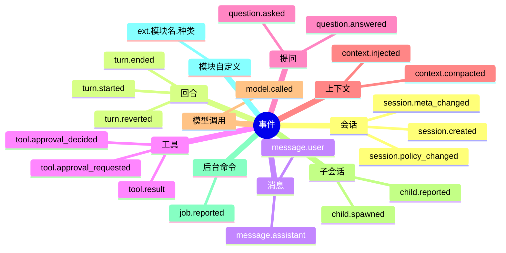
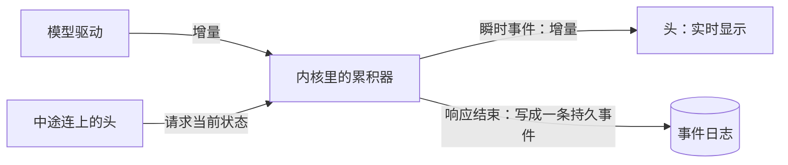
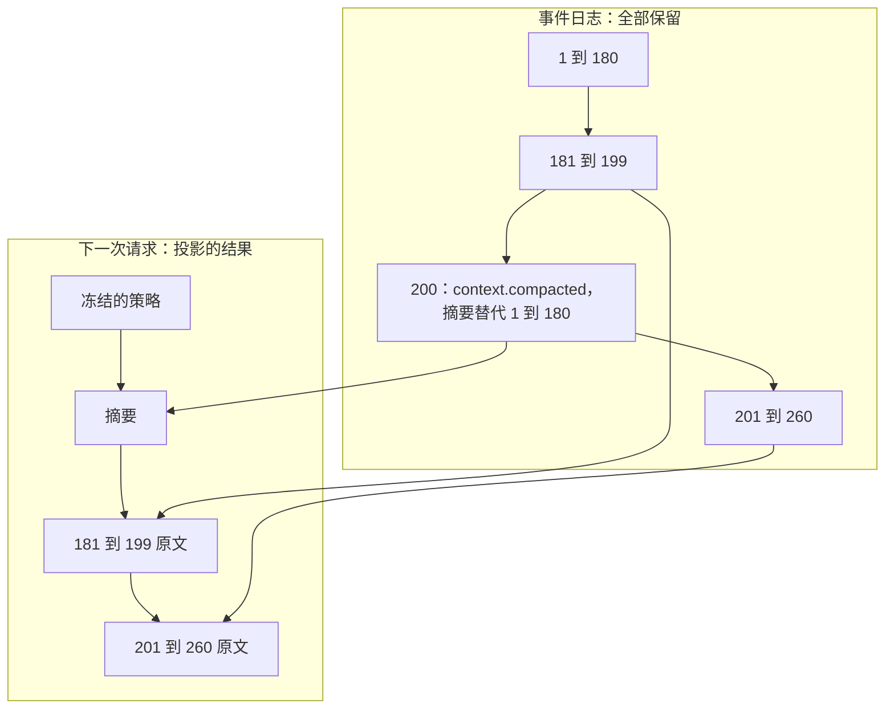

## 事件模型（草案）

状态：E1 到 E6 已定（2026-09-25）。其余内容为草案。

事件是整个系统最底层的契约。内核的输入输出、头看到的内容、存储存下的数据、发给模型的上下文，都由事件构成。它也是以后最难改的东西：日志一旦写进用户的硬盘，之后的每个版本都必须永远读得懂。

### 一、三条总则

1. **事件是已经发生的事实。** 追加进会话的日志，不可修改，不可删除。
2. **撤销也是事件。** 撤销一轮对话、压缩掉一段历史，都是追加一条新事件，旧事件原样留在日志里。
3. **日志记录“发生的顺序”，投影决定“呈现的顺序”。** 事件按到达内核的先后编号。发给模型时怎么排列，由投影按确定的规则决定。两者都是确定的。

### 二、公共字段

每条事件都有同样的外壳：

| 字段 | 含义 | 谁来填 |
|---|---|---|
| `seq` | 会话内序号，从 1 开始，连续递增 | 内核 |
| `at` | 发生时间，UTC，精确到毫秒 | 内核，取自时钟输入 |
| `kind` | 事件种类，形如 `message.user` | 产生者 |
| `turn` | 所属回合，值为该回合 `turn.started` 的序号，`turn.started` 自己填自己的序号。不属于任何回合时为空 | 内核 |
| `by` | 由谁引起：人（附上身份：账号或外部身份，`06-多用户与身份.md` 第二节）、模型、工具、模块（含扩展）、另一个会话、内核 | 内核。取自连接，不取自正文 |
| `cause` | 引起它的命令编号，用于去重和追踪 | 内核 |
| `body` | 这个种类自己的内容 | 产生者 |

会话编号不写在每条事件里，因为日志本身就属于某个会话。事件经协议发给头时，才附上会话编号。会话编号使用按时间有序的全局唯一编号（UUIDv7）。

一条事件的样子：

```json
{
  "seq": 45,
  "at": "2026-09-25T07:04:05.123Z",
  "kind": "message.assistant",
  "turn": 42,
  "by": { "kind": "model", "endpoint": "deepseek", "model": "deepseek-v4" },
  "cause": "cmd-7f3a",
  "body": {
    "blocks": [
      { "type": "text", "text": "我先看一下目录。" },
      { "type": "tool_call", "call_id": "c1", "name": "read", "args": "{\"path\":\"src\"}" }
    ]
  }
}
```

### 三、事件种类



**持久事件**：落库，是状态和上下文的来源。

| 种类 | 含义 |
|---|---|
| `session.created` | 会话创建。记录会话的属主、场所、父会话或分叉来源、初始策略快照 |
| `session.policy_changed` | 策略变化，下一个回合开始时生效（内核 K3）。权限级别是例外：收紧当场生效，放宽下一步生效（`11-权限与沙盒.md` 第二节） |
| `session.meta_changed` | 标题、置顶等元数据变化 |
| `turn.started` | 回合开始，记录触发原因 |
| `turn.ended` | 回合结束，记录结束原因：完成、打断、出错、步数上限、中断（核心崩溃或重启时没走完，`02-内核.md` 不变量 8） |
| `turn.reverted` | 撤销一个或多个回合，投影从此不再包含它们 |
| `message.user` | 人发来的消息，或另一个会话发来的消息 |
| `message.assistant` | 模型一次响应的完整内容，包括其中的工具调用 |
| `tool.result` | 一个工具调用的结果：成功、失败、已取消、被拒绝；附带给内核和头看的效果（`10-自带软件.md` 第五节） |
| `tool.approval_requested` | 请人确认一次工具调用的权限 |
| `tool.approval_decided` | 人对权限请求的决定 |
| `question.asked` | 模型向人提问 |
| `question.answered` | 人的回答 |
| `context.injected` | 模块注入进上下文的事实：记忆召回、运行时信息、环境和状态的变化（内核 K2，`08-上下文投影.md` C10）。规则不在这里，写在稳定区（`08-上下文投影.md` C3） |
| `context.compacted` | 压缩：一份检查点，替代某个序号之前的全部内容（`09-压缩.md`） |
| `model.called` | 一次模型请求的记录：端点、模型、请求哈希、用量、耗时、结果 |
| `child.spawned` | 派生子会话 |
| `child.reported` | 子会话的回报。父会话闲着，就由它开一轮（`02-内核.md` 第七节） |
| `job.reported` | 后台命令结束：退出码、耗时，输出存成 blob。命令是在那次 `shell` 调用返回以后才结束的，所以单独记一条；会话闲着，就由它开一轮（2026-09-26 项目主人定） |
| `ext.<模块名>.<种类>` | 模块自定义的事件 |

场所子系统的事件，例如撤回、戳一戳、出站队列的入队与送达，用它的命名空间 `ext.venues.*`；群里的每条消息照常是 `message.user`（`18-通讯平台.md` 第十二节）。

**瞬时事件**：不落库，只推给正在连接的头，用于实时显示。

| 种类 | 含义 |
|---|---|
| `model.delta` | 模型输出的增量 |
| `tool.progress` | 工具执行过程中的输出 |
| `status` | 状态提示，例如“遇到 429，5 秒后重试” |

判断标准：重建状态或上下文需要它，或者记账需要它，就是持久事件；只用于实时显示，就是瞬时事件。

`model.called` 里的“请求哈希”，是发出去的请求字节算出的哈希。有了它，线上就能直接核对内核不变量 3（同样的输入，请求逐字节相同）；前缀缓存的取证和用量统计，也都从这条事件推出来。

### 四、内容块

消息和工具结果的内容由内容块组成：

| 块 | 内容 |
|---|---|
| `text` | 文本 |
| `reasoning` | 模型的思考文本，可附驱动私有数据（见第九节） |
| `image` | 引用一个 blob，附媒体类型和尺寸 |
| `file` | 引用一个 blob，附文件名和媒体类型 |
| `tool_call` | 调用编号、工具名、参数原文 |

两条规则：

- **工具调用的参数存模型给出的原文字符串。** 不解析后重新序列化。重新序列化会改变字节，前缀缓存随之失效。
- **调用编号由内核分配。** 供应商自己的编号放进驱动私有数据。这样中途换模型、换供应商，编号依然一致。

图片、文件、超长的工具输出等大内容，按内容哈希存成独立的 blob，事件里只存引用。

### 五、持久与瞬时



- 流式输出的增量只推给头，不落库。响应结束时，累积器把完整内容写成一条 `message.assistant`。
- 中途连上的头，先从累积器拿到“到目前为止的内容”，再接着收增量。
- 响应中途被打断：已经收到的文本照样写成一条 `message.assistant`，并标记为被打断；参数还没收全的工具调用直接丢弃，因为它们无法执行。参数已经收全的留在消息里，各自补一条「已取消」的结果（内核不变量 2）；丢弃的那些从没进过日志，也就不需要结果。

### 六、顺序：日志记发生，投影定呈现

下面是一个回合的日志：

| 序号 | 种类 | 说明 |
|---|---|---|
| 41 | `message.user` | “看看 src 目录，顺便查一下 README” |
| 42 | `turn.started` | 触发：41 |
| 43 | `context.injected` | 当前时间、记忆召回结果 |
| — | `model.delta` × N | 瞬时，不落库 |
| 44 | `message.assistant` | 一句话，加两个工具调用 c1、c2 |
| 45 | `model.called` | 用量、请求哈希 |
| 46 | `tool.result` | c2 先返回 |
| 47 | `message.user` | 工具还在执行时，人又发来一句“只看 .rs 文件” |
| 48 | `tool.result` | c1 后返回 |
| — | `model.delta` × N | 瞬时，不落库 |
| 49 | `message.assistant` | 最终回复 |
| 50 | `model.called` | 用量、请求哈希 |
| 51 | `turn.ended` | 原因：完成 |

发第二次请求时，投影这样排列：44 的两个工具调用；工具结果按**调用顺序**排，先 c1（48）后 c2（46）；然后才是人在中途发来的 47。

- 工具结果按调用顺序排，不按到达顺序排。到达顺序每次都可能不同，不能让它影响请求字节。
- 回合中途到达的消息，排在那一步的全部工具结果之后，工具调用和结果因此永远成对。这条消息是在下一步插入，还是等回合结束再处理，属于策略（内核第六节）。

### 七、压缩、撤销、分叉



- **压缩**：`context.compacted` 带一份检查点，并写明它替代到哪个序号为止。自动压缩时替代到当前为止的全部内容；被动压缩时保留最近一组原文，上图画的就是这种情况（`09-压缩.md`）。投影从最近一次压缩开始算。被替代的事件不删除，界面上仍然可以查看完整历史，只是不再发给模型。压缩只前进，新摘要替代到的位置必须不早于上一次。
- **撤销**：`turn.reverted` 写明撤销哪些回合，投影从此不包含它们。日志里的原事件保留。只能撤销最近一次压缩之后的回合：更早的已经写进了摘要，没法再「不包含」。要回到那之前，就从那一条分叉（2026-09-25 补）。
- **分叉**：新会话的 `session.created` 记录“从哪个会话的第几条分叉”。它的投影等于原会话到那一条为止的内容，再加上自己的事件。两个会话的请求前缀逐字节相同，所以连供应商的缓存也能共享。
- **隐私抹除**：唯一的例外。人明确要求永久删除某段内容（例如误贴的密钥）时，存储层清空那些事件的内容，保留序号和种类，留下一块墓碑。这是存储层的特殊操作，不是普通事件。

### 八、格式演进

1. **可以加字段。** 读到不认识的字段，原样保留。
2. **可以加种类。** 读到不认识的种类，原样保留，投影跳过它。
3. **不改含义。** 已有字段和种类的含义永远不变。要改，就起一个新名字。
4. **不删种类。** 旧种类永远读得懂，只是可以不再产生。
5. **日志存原文。** 读取时解码。任何时候都不把解码后的结构重新序列化，去覆盖原文。第 1、2 条之所以成立，靠的就是这一条。

### 九、供应商的原样数据

有些供应商要求把它给出的某些数据原封不动地传回去，否则请求会被拒绝，或者思考链会断掉。例如 Anthropic 思考块的签名、OpenAI 加密的推理内容、Gemini 的思考签名。

- 内容块可以附带驱动私有数据：属于哪一类驱动，以及一段内核不解读的原样数据。
- 同一类驱动发请求时原样带上；其他驱动忽略它。
- 中途换到别的供应商时，思考内容按策略降级：丢弃，或者转成普通文本。

### 十、决定

**E1. 工具调用放在哪里**

- **已定：作为内容块，放在 `message.assistant` 里。** 一次模型响应是一个事实，文本和工具调用的先后顺序原样保留，各家供应商的格式也都是这样。
- 未选：每个工具调用单独一条事件。查找某个调用更直接，但一次响应被拆成了好几个事实。
- 重开条件：出现某家供应商的工具调用无法用内容块表达。

**E2. 供应商的原样数据怎么存**

- **已定：统一格式，加驱动私有附件（第九节）。**
- 未选 A：只存统一格式。回到同一家供应商时，思考链会断，请求可能被拒绝。
- 未选 B：另存完整的原始响应。体积大，而且用户数据里会混进大量供应商私货。调试用的原始抓包应该放在可以随时删除的地方。
- 重开条件：实测驱动私有数据的体积过大。

**E3. 事件用什么编码**

- **已定：JSON。** 人和中等模型都能直接读，调试、迁移、写工具都方便。事件内容以文本为主，二进制编码省不了多少，大块二进制已经按 E4 移走了。
- 未选：二进制编码。体积小，解析快。
- 重开条件：实测解析速度成为瓶颈。

**E4. 大内容怎么存**

- **已定：按内容哈希存成独立的 blob，事件只存引用。** 日志保持小，同一张图只存一份，删除会话时按引用回收。
- 未选：以 base64 内嵌进事件。
- 重开条件：实测大量小 blob 带来的存储开销不可接受。

**E5. 策略快照怎么记**

- **已定：策略按内容哈希存档，会话里记录引用。** 任何时候回放，都能逐字节重现当时的请求。预设升级不会改变已经发出去的请求，之后的回合按 `02-内核.md` K3 换成新版本。代价是多存几份策略文本，体积很小，而且会去重。
- 未选：只记策略名和版本号。预设一升级，老会话当时的请求就重现不出来了。
- 重开条件：实测策略快照的存储开销不可接受。

**E6. 模块能不能定义自己的事件种类**

- **已定：能，名字带模块的命名空间（`ext.<模块名>.<种类>`）。** 记忆、知识库等子系统可以记录自己的事实，不必全挤进 `context.injected`。这些事件怎么投影，由定义它们的模块提供规则。模块被卸载后，这些事件原样保留，投影跳过。
- 未选：不能，只能用内核定义的种类。
- 重开条件：模块自定义事件让投影逻辑明显难以理解。

**后续再定**

- 哪些事件推给哪些头，以及事件的可见性：已定，见 `04-核心协议.md` 第五节
- 日志的存储布局：已定，见 `07-存储.md` 第三节
- 每种事件在请求里怎么渲染：已定，见 `08-上下文投影.md` 第四节
