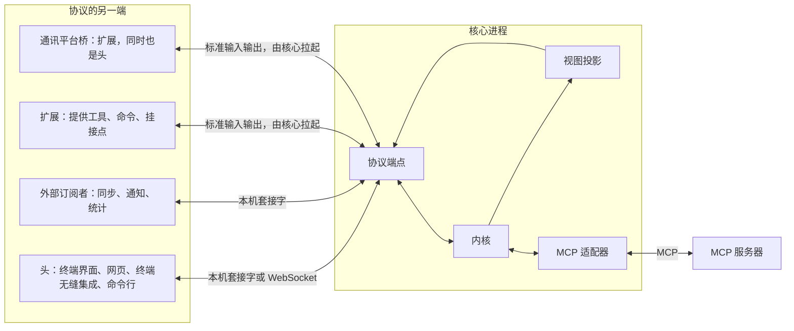
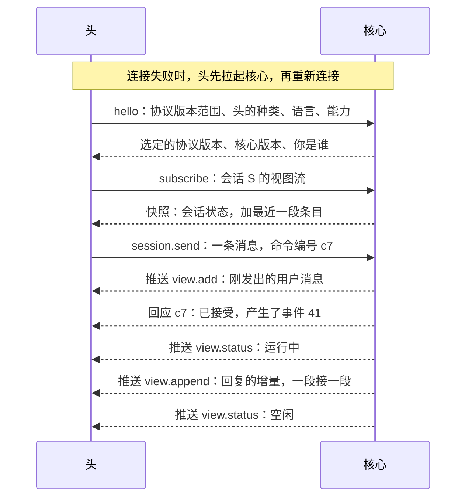
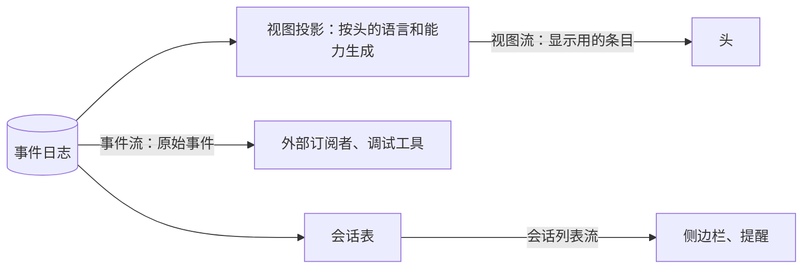
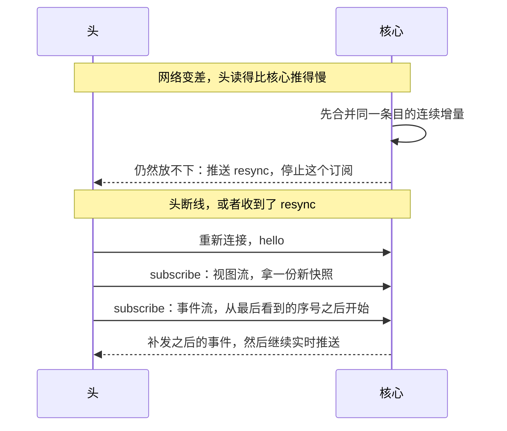

## 核心协议（草案）

状态：P1 到 P6 已定（2026-09-25）。其余内容为草案。

核心协议是核心对外的唯一入口，相当于 Linux 的系统调用接口。头和外部订阅者都只通过它与核心交互。

扩展也说这套协议：它们由核心拉起，经标准输入输出连接，扮演“提供者”，向核心提供工具、命令和挂接点。只提供工具的 MCP 服务器，由核心里的 MCP 适配器接入。细节见 `05-内核接口.md`。

### 一、全景



协议里只有四种消息：

| 消息 | 方向 | 结局 |
|---|---|---|
| 命令 | 头发给核心 | 被接受，回应里带上它产生的事件序号；或被拒绝，附原因 |
| 查询 | 头发给核心 | 返回结果，不改变任何状态 |
| 推送 | 核心发给头 | 事件、视图更新、要求重新订阅 |
| 反向调用 | 核心发给提供者 | 提供者返回结果，例如执行一次工具调用、处理一次挂接。执行中提供者可以发通知报进度（`tool.progress`），核心转成瞬时事件 |

### 二、消息格式与传输

消息格式是 JSON-RPC 2.0（P1）。命令、查询和反向调用是请求，推送是通知。下面的例子为了好读排成了多行，实际传输时每条消息占一行。

握手：

```json
{
  "jsonrpc": "2.0",
  "id": "0192f3a4-7c1e-7d10-9b1a-2f5e6c7d8e90",
  "method": "hello",
  "params": {
    "protocol": [1, 1],
    "head": { "kind": "tui", "version": "0.1.0" },
    "locale": "zh-CN",
    "caps": { "images": true, "input": true, "notify": false }
  }
}
```

发送一条消息，以及被接受时的回应：

```json
{
  "jsonrpc": "2.0",
  "id": "0192f3a4-8a2b-7e20-8c3d-4f6a7b8c9d01",
  "method": "session.send",
  "params": { "session": "0192f3a0-1111-7abc-8def-001122334455", "text": "看看 src 目录" }
}
```

```json
{
  "jsonrpc": "2.0",
  "id": "0192f3a4-8a2b-7e20-8c3d-4f6a7b8c9d01",
  "result": { "events": [41] }
}
```

被拒绝时的回应。`reason` 是稳定的、给程序看的原因码，`message` 是按头的语言写给人看的话：

```json
{
  "jsonrpc": "2.0",
  "id": "0192f3a4-8a2b-7e20-8c3d-4f6a7b8c9d01",
  "error": {
    "code": -32010,
    "message": "这个会话已经被删除了。",
    "data": { "reason": "session_not_found" }
  }
}
```

核心推送的一段流式输出：

```json
{
  "jsonrpc": "2.0",
  "method": "view.append",
  "params": { "session": "0192f3a0-1111-7abc-8def-001122334455", "item": "i-44", "text": "我先看一下" }
}
```

传输方式（P2）：

| 场合 | 传输 | 分帧 |
|---|---|---|
| Linux、macOS 本机 | Unix 域套接字 | 每行一条消息 |
| Windows 本机 | 命名管道 | 每行一条消息 |
| 浏览器、远程 | WebSocket | 每帧一条消息 |
| 核心拉起的扩展、桥 | 标准输入输出 | 每行一条消息 |

JSON 序列化后不含裸换行，字符串里的换行都会被转义，所以按行分帧是安全的。MCP 的标准输入输出传输用的也是这种分帧。

**协议的单一真相源**：消息结构只在 Rust 类型里定义一次。JSON Schema、网页头用的 TypeScript 类型、协议参考文档都由它生成。测试负责检查生成物是否最新。

**各平台的坑**：

- macOS 的 Unix 套接字路径上限是 104 字节，Linux 是 108 字节。套接字必须放在短路径下。
- Unix 上，套接字放在只有本人能进入的目录里（权限 0700）。连接前核对目录属主，防止别人抢先建一个同名套接字冒充核心。
- Windows 命名管道的默认安全描述符允许 Everyone 读取，必须显式设置成只允许当前用户。创建时还要声明“第一个实例”，防止别的进程抢先占用管道名。
- 浏览器不会替 WebSocket 执行同源限制。核心必须自己检查 Origin 头，防止别的网站连进来。

### 三、一次连接的全过程



单次命令行是最薄的头：连上核心，发一条消息，打印回复，等这一回合和它派出去的子代理都回报完就退出（`22-命令行.md` 第三节）。它放到后台的命令留在核心里继续跑，不会因为它退出而被杀掉。它同时也是协议的参考实现，端到端测试都用它来驱动核心。

### 四、身份

- **连接即身份。** 本机连接要同时满足两条：能连上本人的套接字或管道，这由操作系统担保；并且出示本机令牌。本机令牌放在数据根里，只有本人可读，沙盒里的进程读不到（`11-权限与沙盒.md` 第五节）。远程连接凭登录令牌。
- **消息正文里自称的身份一概不作数。**
- **代表别人只能降权，不能提权。** 通讯平台桥是一个扩展，由核心拉起。它转发平台上某个外部用户的命令时，声明“代表某人”，核心就给这些命令外部信任级别。只有被批准了 `act_for_external` 这项扩展能力的扩展，才能做这种声明。唯一的例外是主人绑定：核心按系统配置认出主人的平台账号，在私聊里按本人对待（`18-通讯平台.md` Q7）。这是核心自己的判定，不是桥给自己提权。
- **核心拉起的扩展，身份是扩展自己。** 它能做的事，以清单里声明、安装时批准的能力为限（`05-内核接口.md` 第三节）。
- **远程访问默认关闭（P6）。** 核心默认只监听本机。远程访问要手动开启，并且必须登录。

### 五、三种订阅



- **视图流**：显示用的条目，给头用。能查看这个会话的身份都可以订阅。
- **事件流**：原始事件，完整无删减，包括注入进上下文的内容。给外部订阅者和调试工具用，只对会话的所有者，以及被批准了 `events.read` 能力的扩展开放。
- **会话列表流**：会话的新建、改名、状态变化。给侧边栏、系统提醒用。

**核心决定“显示什么”，头决定“怎么画”（P3）：**

| 核心决定 | 头决定 |
|---|---|
| 显示哪些条目，每个条目的种类和状态 | 布局、换行、宽度适配 |
| 条目里的文字：工具显示名、一句话摘要、折叠汇总、出错说明。按头声明的语言生成，只有折叠汇总例外，永远用英文（`13-终端界面.md` H3） | 颜色、字体、动效 |
| 哪些条目默认折叠 | 人手动展开、收起。这类纯界面状态留在头里，不回传 |
| 会话状态：空闲、运行中、等你回答；正在做什么；用时；上下文用量；累计的 token 与缓存命中率；当前的预设（名字和颜色）、模型、供应商与权限级别；待办；改动的文件；回合数；后台任务表（2026-09-26 补上底栏要的几项） | 输入框、按键、补全菜单的交互 |
| 可用的斜杠命令目录 | 命令面板的样子 |
| 主题色板：由一个种子色生成的整套语义色 | 把语义色映射成终端颜色或网页样式 |

视图条目：

| 条目 | 内容 |
|---|---|
| `user` | 发送者（多人场所才显示名字）、文本、附件 |
| `assistant` | Markdown 文本，以及是否还在输出 |
| `reasoning` | 思考文本，默认折叠 |
| `tool` | 工具显示名、一句话摘要、状态、可展开的详情 |
| `tool_group` | 一串连续工具调用的汇总，例如 `Ran 3 commands · 2 edits · 12s` |
| `question` | 问题、选项、状态：等待回答，或已由谁回答 |
| `approval` | 要做的事、风险说明、状态 |
| `subagent` | 子会话的任务和状态，可以跳转过去 |
| `notice` | 压缩发生了、模型换了、出错了。出错时说清发生了什么、为什么、怎么办 |

- 每个条目有稳定的编号，并记录它来自哪些事件序号。头靠这个发出“撤销到这里”“从这里分叉”之类的命令。
- 视图更新只有五种推送：`view.add`、`view.update`、`view.append`（给正在输出的文本追加内容）、`view.remove`、`view.status`。
- 头在握手时声明自己的能力，例如能不能显示图片。不能显示图片的头，核心在它的条目里用文字占位。能力只影响视图，不影响模型看到的内容（`01-架构.md` 第五节）。
- 后台任务表随 `view.status` 推送，覆盖整个会话树：每一项有种类、标题、父亲是谁、状态、正在做什么（它最新一步的一句话摘要）、用时、用量；等人确认时附上要确认什么。终端界面照它画会话树。任务结束时，时间线里多一条 `notice`（`13-终端界面.md` 第七节）。
- **条目只带摘要**：完整的 diff、长输出，头展开时再用 `view.detail` 按需取。每个会话的视图在它自己的 actor 里算，一个会话的大输出不会拖慢别的会话（2026-09-25 补）。
- **mermaid 图由核心出 SVG**：按「源码加尺寸」的哈希缓存，头经 `view.detail` 按需取。网页直接用这份 SVG；终端界面把它栅格化成图片（`13-终端界面.md` 第九节，2026-09-26 补）。

### 六、命令的五条保证

1. **命令编号由发送方生成，全局唯一。** JSON-RPC 请求的 id 就是命令编号。同一编号重复发送，只生效一次。去重记录随事件一起落盘（事件的 `cause` 字段），核心重启后依然有效，断线重发不会重复执行。
2. **先见结果，后见回应。** 同一个连接上，一个命令直接产生的事件，以及由它们推出的视图更新，一定先于这个命令的回应送达（前提是这个连接订阅了那个会话）。头收到回应时，界面已经是对的，不需要猜。
3. **先答者胜。** 多个头同时打开一个会话时，同一个提问，第一个被接受的回答生效。之后的回答被拒绝，原因是“已经回答过了”，而它们的界面也已经通过推送更新了。
4. **拒绝一定有原因。** 拒绝里带一个稳定的原因码，和一句按头的语言写的人话。
5. **斜杠命令由核心解析（P4）。** 头从命令目录拿到命令名、说明和参数格式，用来做补全。人提交之后，头把原文交给核心解析。只有一个解析器，所以所有头的行为一致；扩展新增的命令，也会自动出现在所有头里。

### 七、慢、断线与重连



- 核心永远不因为某个头慢而等待。每个订阅都有一个有上限的发送队列。
- 队列紧张时，先合并同一条目的连续增量。还是放不下，就推送 `resync`，停止这个订阅。
- 视图流重连时直接拿新快照。快照只包含最近一段条目，更早的条目用 `view.page` 按需往前翻。
- 事件流重连时报出最后看到的序号，核心补发之后的事件。

### 八、版本

- 握手时，头报出自己支持的协议主版本范围，核心选出双方都支持的最高版本。没有交集就拒绝，并用人话说明该怎么办。
- 同一个主版本之内只做加法：可以加方法、加字段，双方都忽略不认识的字段。要改含义，就升主版本。
- 头和核心随同一个发行包升级。头发现核心比自己旧（常见于升级后核心还没重启），就请求核心在空闲时重启自己。

### 九、方法一览

| 族 | 方法 | 类型 |
|---|---|---|
| 握手 | `hello` | 请求 |
| 账号 | `account.login`、`account.logout`、`account.register`、`account.invite`、`account.list`、`account.disable`、`account.login_link`、`profile.set` | 命令。邀请、列出、停用需要“管账号”能力（`06-多用户与身份.md`）；`account.login_link` 给本机的网页一次性登录链接（`21-网页.md` X6）；`profile.set` 写「希望 AI 怎么认识你」 |
| 组与权限 | `group.create`、`group.add_member`、`group.remove_member`、`group.delete`、`permission.set`、`capability.grant`、`capability.revoke` | 命令。`permission.set` 相当于 chmod、chgrp 和 ACL，只有资源的属主能改；管理组、把能力授予组需要“管账号”能力 |
| 会话 | `session.create`、`session.fork`、`session.configure`、`session.set_permission_level`、`session.set_meta`、`session.delete` | 命令 |
| 对话 | `session.send`、`session.interrupt`、`session.answer`、`session.revert`、`session.compact` | 命令 |
| 后台任务 | `job.stop` | 命令 |
| 配置与密钥 | `config.set`、`config.trust`、`secret.set`、`secret.delete` | 命令（`14-配置.md` 第八节；`config.trust` 记下信任哪份项目配置，第三节） |
| 供应商 | `provider.test` | 命令（`15-模型与供应商.md` 第九节） |
| 斜杠命令 | `command.run` | 命令 |
| 附件 | `blob.put` | 命令 |
| 人格与预设 | `persona.save`、`persona.delete`、`preset.save`、`preset.delete` | 命令（`16-人格与预设.md` 第九节） |
| 记忆 | `memory.remember`、`memory.update`、`memory.forget` | 命令（`17-记忆.md` 第九节） |
| 知识库 | `kb.add`、`kb.remove`、`kb.mount`、`kb.reindex` | 命令（`19-知识库.md` 第六节） |
| 语音 | `voice.transcribe`、`voice.synthesize`、`voice.listen`、`voice.dictate` | 命令（`20-语音.md` 第九节） |
| 场所 | `venue.set`，以及桥发来的 `venue.appeared`、`venue.gone` | 命令（`18-通讯平台.md` 第十二节） |
| 软件包 | `pkg.install`、`pkg.enable`、`pkg.disable`、`pkg.remove`、`source.add`、`source.remove` | 命令（`12-进程形态与分发.md` 第四节） |
| 放行规则 | `rule.revoke` | 命令：撤销记住的放行规则（`11-权限与沙盒.md` 第二节） |
| 核心 | `kernel.restart_when_idle` | 命令：空闲时重启自己（第八节） |
| 工具 | `tools.override`、`tools.reset` | 命令：写或删一份工具描述的同名覆盖（`25-工具加载.md` 第七节） |
| 订阅 | `subscribe`、`unsubscribe` | 请求 |
| 查询 | `session.list`、`view.page`、`view.detail`、`events.read`、`command.catalog`、`model.list`、`theme.get`、`kernel.status`、`config.schema`、`config.get`、`config.check`、`secret.list`、`provider.detect`、`provider.catalog`、`session.export`、`usage.query`、`profile.get`、`rule.list`、`persona.list`、`persona.get`、`preset.list`、`preset.get`、`memory.search`、`memory.list`、`kb.list`、`kb.search`、`kb.read`、`voice.status`、`venue.list`、`venue.show`、`pkg.search`、`tools.catalog`、`tools.describe` | 查询 |
| 推送 | `view.add`、`view.update`、`view.append`、`view.remove`、`view.status`、`event`、`sessions.changed`、`config.changed`、`resync` | 推送 |
| 提供者 | `provide`：登记自己提供的工具、命令、挂接点 | 请求 |
| 反向调用 | `tool.call`、`hook.call`、`outbound.send` | 核心发给提供者的请求。`outbound.send` 把出站队列里的一条交给桥（`18-通讯平台.md` 第八节） |

- `session.configure`：换模型、临时开关某个功能这类策略变化，按内核 K3 在下一个回合开始时生效。会话用哪个人格、哪个预设、记忆的范围，在 `session.create` 时定，之后不换（`16-人格与预设.md` Y5、`17-记忆.md` L3）。
- `session.set_permission_level`：开关只读，或者改常用的那一级（工作区、完全放开）。收紧当场生效，放宽下一步生效（`11-权限与沙盒.md` 第二节）。改成完全放开之前，头先请人确认一次。
- `session.interrupt`：打断一个会话正在进行的回合，子代理的会话也一样（`02-内核.md` 第七节）。
- `session.answer`：回答模型的提问，也用来回答权限确认。
- `blob.put`：上传附件。本机的头也可以只传文件路径，由核心自己去读；远程的头只能传内容。
- `kernel.status`：核心的运行状态，包括在跑的会话、调度队列、各模型端点的限速状态、worker 是否存活、内存占用。相当于 Linux 的 `/proc`。

### 十、决定

**P1. 消息格式**

- **已定：JSON-RPC 2.0。** 它自带请求、回应、通知三种消息形态，正好覆盖这里的四种消息；各种语言都有现成的库；MCP 也用它，头的作者和中等模型都熟悉。
- 未选 A：HTTP 接口加 SSE 推送（opencode 的做法）。请求和推送走两条通道，“命令被接受”和“它产生的事件”谁先到达无法保证。
- 未选 B：gRPC。需要代码生成工具链，浏览器还要额外的网关。
- 重开条件：出现 JSON-RPC 表达不了的交互。

**P2. 传输与分帧**

- **已定：本机用 Unix 域套接字（Linux、macOS）和命名管道（Windows），按行分帧；浏览器和远程用 WebSocket，每帧一条消息。**
- 未选：本机也走 TCP 回环。三个平台一致，但任何本机进程都能连上，身份只能靠令牌，失去了操作系统的担保。
- 重开条件：某个平台的本机传输出现无法绕过的限制。

**P3. 显示逻辑放在核心（即 `01-架构.md` 的 D1）**

- **已定：核心提供视图流，头只负责画。同时提供事件流，给需要原始数据的程序。**
- 重开条件：同 D1。

**P4. 斜杠命令由谁解析**

- **已定：核心解析，头只做补全。**
- 未选：每个头自己解析。同一条命令在不同的头里行为可能不一致，正是旧版“一条规则写三遍”的老问题。
- 重开条件：出现只对某一个头有意义的命令，例如终端无缝集成专属的命令。那时再定“头本地命令”的规则。

**P5. 网页的页面由谁提供**

- **已定：核心里的可选 HTTP 模块。** 只有启用网页时才构造它。页面文件从安装目录读取，不编进核心二进制。
- 未选：独立的网页网关进程。多一个进程，多一跳转发。
- 重开条件：网页需要的能力让核心明显变重。

**P6. 远程访问的默认值**

- **已定：默认关闭。** 核心只监听本机；远程访问要手动开启，并且必须登录。
- 重开条件：无。安全默认值不因方便而放宽。

**后续再定**

- 扩展提供的工具、桥提供的平台工具怎么注册：已定，见 `05-内核接口.md`
- 附件的大小上限，以及分块上传
- 终端无缝集成怎么使用这套协议：已定，见 `22-命令行.md` 第七节
