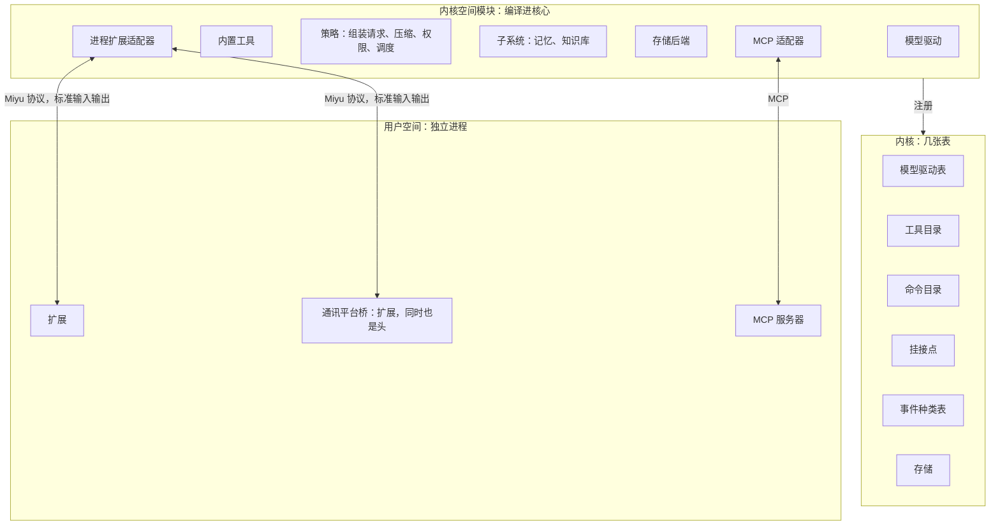
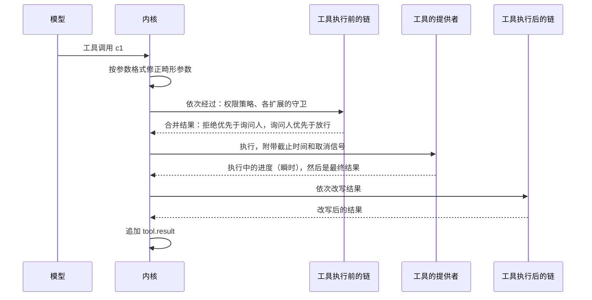
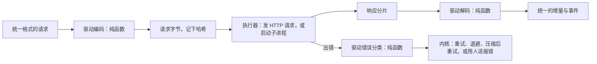
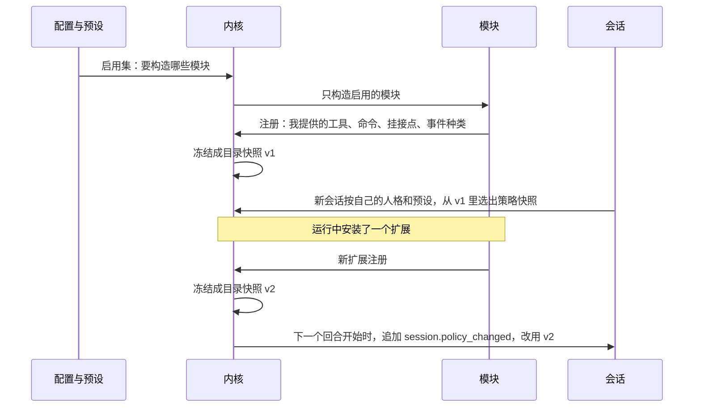
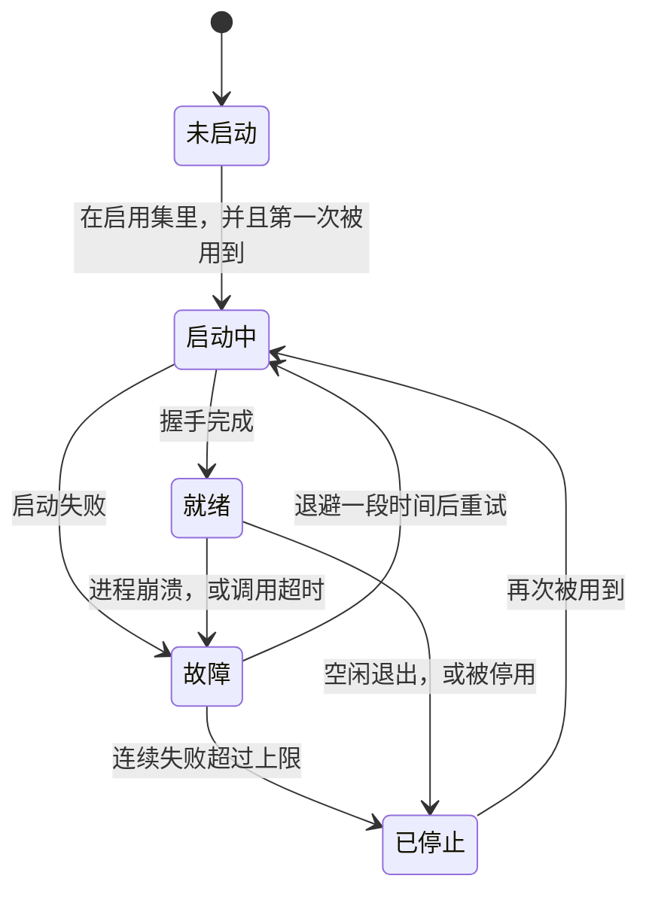

## 内核接口（草案）

状态：I1 到 I8 已定（2026-09-25）。其余内容为草案。

内核接口规定模块怎么插到内核上。它相当于 Linux 的驱动接口，加上可加载模块的机制。

一个前提：Miyu 是开源软件，扩展会来自陌生人。所以这套接口有两个目标：让内置功能即插即用，同时让第三方扩展只能做它被允许做的事。

### 一、一种模块，多种贡献

内核里有几张表，也就是插槽。模块往表里登记自己提供的东西。

每个模块都是同一个形状：**一份清单，加一次注册**。

- **清单**：我是谁，我需要哪些能力。
- **注册**：我提供什么。

内置模块和外部扩展是同一个形状，内置模块不开后门（`00-设计理念.md` 高质量代码第 4 条）。

模块可以提供的东西：

| 贡献 | 登记到 | 例子 |
|---|---|---|
| 模型驱动 | 模型驱动表 | DeepSeek、Anthropic、借用别的 agent CLI 的订阅 |
| 工具 | 工具目录 | 读写文件、运行命令、发群消息 |
| 斜杠命令 | 命令目录 | `/undo`、扩展自带的命令 |
| 挂接点的实现 | 挂接点 | 记忆召回、权限规则、重复调用提醒 |
| 事件种类 | 事件种类表 | `ext.memory.recalled`，连同它的显示规则和进上下文的规则 |
| 存储后端 | 存储 | 默认的本地存储 |
| 场所驱动 | 场所子系统 | QQ 桥、语音 worker（`18-通讯平台.md` 第二节、`20-语音.md` 第四节） |
| 线路规程 | 场所子系统 | 每条都回、叫她才回、看情况插话、唤醒（`18-通讯平台.md` 第六节） |
| 进站链、出站链的规则 | 场所子系统 | 按关键词拦广告（`18-通讯平台.md` 第五节、第八节） |
| 网页页面 | 页面目录 | 记账、表情包这类仪表盘（`21-网页.md` 第五节） |



### 二、清单

两个例子。第一个是内置的记忆模块，第二个是第三方写的天气扩展：

```toml
[module]
id = "memory"
version = "0.1.0"
kind = "builtin"
name = { en = "Memory", zh-CN = "记忆" }

[provides]
tools = ["memory_search"]
hooks = ["turn.start", "turn.end"]
events = ["ext.memory.recalled"]

[needs]
capabilities = ["tools", "context.inject", "events.read", "events.write"]

[depends]
workers = ["embedding"]
```

```toml
[module]
id = "weather"
version = "1.2.0"
kind = "process"
command = ["python3", "weather.py"]
name = { en = "Weather", zh-CN = "天气" }

[provides]
tools = ["weather_now", "weather_forecast"]

[needs]
capabilities = ["tools", "network"]

[settings.units]
type = "choice"
choices = ["metric", "imperial"]
default = "metric"
label = { en = "Units", zh-CN = "单位" }
```

清单里的文字也分两槽：`id`、工具名这类给程序和模型看的，恒为英文；`name` 给人看，跟随界面语言。

扩展的配置项写在 `[settings]` 里，和内置模块的配置项合进同一份配置清单，校验、设置页、编辑器补全都从那里生成（`14-配置.md` 第二节）。

`[depends]` 写依赖的软件包，例如 embedding worker。它们照软件包安装，不算扩展能力（第三节）。

### 三、扩展能力：扩展只能做被批准的事

仿照 Linux 的 capabilities：清单声明需要哪些扩展能力，安装时由人批准，核心强制执行。给人的那一种叫「管理能力」，见 `06-多用户与身份.md` 第四节。

| 扩展能力 | 允许做什么 |
|---|---|
| `tools` | 向工具目录提供工具 |
| `commands` | 提供斜杠命令 |
| `context.inject` | 回合开始时往上下文注入内容 |
| `tool.guard` | 工具执行前放行、拒绝，或要求询问人 |
| `tool.rewrite` | 工具执行后改写结果 |
| `events.read` | 读取会话的原始事件 |
| `events.write` | 追加自己命名空间下的事件 |
| `sessions.drive` | 用命令驱动会话，例如发消息、创建子会话 |
| `act_for_external` | 代表平台上的外部用户发命令。只给通讯平台桥 |
| `network` | 访问网络 |
| `fs.read`、`fs.write` | 读、写指定的路径 |

- 外部扩展运行在沙盒里，沙盒的范围来自它被批准的能力。各平台的沙盒怎么实现，在“权限与沙盒”一步设计。
- 内置模块也写能力清单。它们本来就被信任，写清单一是让所有模块形状相同，二是核心同样会检查，多一道防线。
- 扩展升级后要求更多能力时，要重新批准。

### 四、内核空间模块与外部扩展

- **内核空间模块**：编译进核心，在同一个进程里，直接实现内核接口。
- **外部扩展**：独立进程，由核心拉起，经标准输入输出说 Miyu 协议（`04-核心协议.md`），扮演“提供者”。核心里的**进程扩展适配器**替它实现内核接口，把调用转发给那个进程。这就像 Linux 的 FUSE：内核只认识文件系统接口，FUSE 把调用转给用户空间的进程。
- **MCP 服务器**：只提供工具。核心里的 **MCP 适配器**把它接进来，MCP 生态里现成的服务器都能直接用。
- **脚本**：最简单的外部扩展。一个可执行文件，头部写明它提供的那一件工具：名字、说明、参数、需要的能力；清单里是 `kind = "script"`。每次调用起一个进程，跑完就退出。核心里的脚本适配器把它接成工具，同样受能力和沙盒约束（2026-09-25 补）。
- **通讯平台桥**：一个外部扩展，同时扮演头。它把平台上的人接进会话（`act_for_external`、`sessions.drive`），也提供平台工具，例如发群消息、撤回消息。
- **头也可以同时扮演提供者**，例如终端无缝集成提供“读取刚才那条命令的输出”这样只有它做得到的工具。以本人身份连接的头，能力视同本人已经批准。

只有一套协议：头、扩展、桥说的都是 Miyu 协议，区别只在扮演的角色和被批准的能力。MCP 只作为兼容入口存在。

### 五、挂接点

挂接点有三种插槽。多个模块挂在同一个点上时，按插槽种类合并：

| 插槽 | 规则 |
|---|---|
| 独占 | 同一范围内只用一个实现。组装请求、压缩判断按会话选定，调度全局只有一个。都是同步纯函数 |
| 链式 | 按固定顺序逐个经过。每个实现能做什么，由挂接点决定 |
| 广播 | 全部执行，互不影响 |

全部挂接点：

| 挂接点 | 插槽 | 能做什么 | 外部扩展能否使用 |
|---|---|---|---|
| 命令进入 | 链式 | 放行、拒绝、改写 | 能 |
| 回合开始 | 广播 | 追加事件，也就是往上下文注入内容 | 能 |
| 组装请求 | 独占 | 生成请求 | 不能 |
| 压缩判断 | 独占 | 判断该不该压缩 | 不能 |
| 调度 | 独占 | 决定各会话使用模型的先后 | 不能 |
| 模型输出后 | 链式 | 打标记、追加事件 | 能 |
| 工具执行前 | 链式 | 放行、拒绝、要求询问人 | 能 |
| 工具执行后 | 链式 | 改写结果、追加事件 | 能 |
| 回合结束 | 广播 | 追加事件、发起辅助请求 | 能 |
| 订阅 | 广播 | 只读 | 能 |

四条规则：

1. **工具执行前的链，最严者胜。** 拒绝优先于询问人，询问人优先于放行。排在后面的实现只能收紧，不能放宽前面的决定。这是 dsh 的“单调守卫”。
2. **结果按声明顺序记录，不按到达顺序。** 回合开始时，多个模块并行召回、注入。核心等它们全部返回或超时，再按固定顺序（先按声明的优先级，再按模块编号）追加成事件。和工具结果一样，到达顺序不能影响请求字节。
3. **外部扩展只能挂异步的点。** 独占插槽必须确定、必须快，只对内核空间模块开放。外部扩展想往提示词里加东西，只有两条路：清单里写死的静态片段，进入策略快照（事件模型 E5）；或者回合开始时注入，成为事件（内核 K2）。两条路都保证字节稳定。外部扩展的每次挂接调用都有超时。工具执行前的守卫超时，按「拒绝」算，理由写明「守卫超时」。内核从不等某一个挂接调用，打断随时能进来（2026-09-25 补）。
4. **外部扩展的事件种类用模板声明。** 这些事件怎么显示、怎么进上下文，只能在清单里用模板声明。模板只做字段替换，不含逻辑。这样视图投影和上下文投影依然是确定的纯函数。模板之外，还能用几种现成的视图组件：键值、表格、进度、图片、链接。组件由核心定义，不够用就往核心里加组件，不让扩展把显示塞回消息正文（2026-09-25 补）。

一次工具调用经过的挂接点：



内核怎么等链的结论、怎么问人、人回答以后怎么走，见 `02-内核.md` 第六节「确认怎么走」（2026-09-26 补，施工 2-7 中）。

### 六、工具的规格

| 字段 | 给谁看 | 含义 |
|---|---|---|
| `name` | 模型 | 英文，稳定不变。工具名是最强的能力广告 |
| `description` | 模型 | 英文，不超过三句：是什么、什么时候用、最容易踩的坑 |
| `input_schema` | 模型 | 参数的 JSON Schema |
| `display_name` | 人 | 跟随界面语言 |
| `summary` | 人 | 一句话摘要的模板，例如“读取 {path}”。视图投影用它生成工具条目 |
| `access` | 内核 | 访问类别：只读、写文件、执行命令、访问网络、对外发消息。权限策略、能否并发、撤销前要不要存档，都看它 |
| `timeout` | 内核 | 默认超时 |
| `venues` | 内核 | 哪些场所能用。例如对外的群聊里，不提供执行命令的工具 |
| `group` | 内核 | 按组加载时属于哪一组，默认是所在的软件包（`25-工具加载.md` 第二节） |

- **调用之后才用得上的知识，写进工具自己的输出，不写进描述。** 例如结果字段的含义、分页怎么继续。描述越短，每次请求越便宜。名字和参数格式自己说得清怎么用的，参数说明干脆不写，只写参数壳（`25-工具加载.md` W2）。
- **能否并发不单独声明，由 `access` 推出。** 只读的工具可以并发。
- **畸形参数由内核统一修正。** 按参数格式，把被转成字符串的数组、对象、数字还原回去；声明为字符串的参数一个字节都不碰。报错只说自己真正知道的，例如“期望整数，收到字符串 "1"”。
- **执行时，工具拿到**：调用编号、参数、会话、身份、工作目录、沙盒范围、截止时间、取消信号。
- **工具返回**：状态（成功或失败）和内容块。执行中可以发出进度，作为瞬时事件推给头。

### 七、驱动的规格

驱动是纯粹的翻译器：编码、解码、错误分类都是纯函数，真正发请求的是执行器。



| 字段 | 含义 |
|---|---|
| `family` | 驱动家族。用来认领属于自己的私有数据（事件模型 E2） |
| `models` | 每个模型的上下文窗口、最大输出、能否调用工具、能否看图、有没有思考 |
| `cache` | 缓存类型：契约型、尽力而为、无。压缩策略据此调整 |
| `transport` | HTTP，或者子进程（借用别的 agent CLI 的订阅） |
| `encode`、`decode`、`classify` | 三个纯函数 |

- 错误分类只有几种：可重试、限速（附带要等多久）、上下文超长、认证失败、被内容策略拦截、其他。内核按分类处理：重试、退避、压缩后重试、用人话报错。
- 因为编码是纯函数，每家供应商的请求字节都可以用固定的样本文件检查。改动让某个字节变了，测试当场变红。

### 八、启用、注册与目录快照

- **启用集**：会话的预设决定打开哪些软件，人格只定记忆的范围和她能查的知识库；个人对它们的同名覆盖再改几项，而且只能在装了的里挑（`16-人格与预设.md` 第四节）。
- **只构造用得到的模块。** 核心只构造至少一个会话需要的模块。外部扩展第一次被用到时才拉起，空闲一段时间后退出。
- **外部扩展按账号分进程。** 每个账号用到某个扩展时，各自拉起一份。沙盒范围是这个扩展在那个账号下的数据目录 `home/<账号>/modules/<模块>/`，再加上 `fs.read`、`fs.write` 批准过的路径；密钥和会话日志永远不在里面。一个进程不会同时服务两个账号，扩展也就没有机会在账号之间串数据（`06-多用户与身份.md` U3）。
- **目录快照**：所有注册完成后，内核把各张表冻结成一份目录快照。每个会话从快照里按自己的人格和预设选出一份策略快照（事件模型 E5）。
- **目录变化**：安装、卸载、升级扩展会产生新的目录快照。正在进行的会话在下一个回合开始时切换（内核 K3）。
- **外部扩展的工具目录缓存在磁盘上。** 核心启动时直接用缓存，不等扩展进程就绪。扩展握手后，如果实际目录和缓存不同，就产生新的目录快照。



### 九、模块的一生



- 内置模块构造完就处于就绪状态，没有进程，也就没有故障与重启。
- 外部扩展崩溃后退避重启。连续失败超过上限就停下，并在界面上说明原因。
- **模块故障时，它的工具仍然留在目录里。** 被调用时返回“暂时不可用”和原因。工具从目录里消失，会改变请求字节，还会被模型理解成“这个能力被拿走了”。旧版就出过这个问题。
- 重型 worker（embedding、语音、渲染）是某个模块私有的辅助进程，由核心统一看管，同样按需拉起、空闲退出。有的 worker 同时是场所驱动，例如语音 worker（`20-语音.md` 第四节）。

### 十、稳定性承诺

仿照 Linux：对用户空间的接口承诺稳定，内核内部的接口不承诺。

| 接口 | 承诺 |
|---|---|
| 内核空间接口：Rust 的 trait 与类型 | 不承诺稳定，随重构改动。只有编译进核心的模块用它，改的时候一起改 |
| Miyu 协议里提供者的部分、清单格式、能力名 | 承诺稳定，按协议版本演进（`04-核心协议.md` 第八节） |
| MCP | 跟随 MCP 规范 |

第三方扩展的作者只需要面对承诺稳定的那一层。

### 十一、决定

**I1. 模块的形状**

- **已定：一种模块，一份清单加一次注册。** 所有贡献都是“登记到某张表”。
- 未选：每类贡献各有一套独立的接口和配置。概念多一倍，一个同时提供工具和挂接点的扩展还得写两份。
- 重开条件：出现一种贡献，无法表达成“登记到某张表”。

**I2. 外部扩展说什么协议**

- **已定：Miyu 协议，扮演提供者；MCP 服务器经适配器接入。**
- 未选 A：外部扩展只能是 MCP 服务器。那样只能提供工具，挂接点、命令、事件种类都做不了。
- 未选 B：在 MCP 的实验字段里扩展出 Miyu 的能力。要依赖 MCP 规范和各语言 SDK 对自定义方法的支持，而且会和 Miyu 协议变成两套相似又不同的东西。
- 重开条件：MCP 规范原生支持了挂接点、命令这类能力。

**I3. 独占插槽对谁开放**

- **已定：只对内核空间模块开放。** 外部扩展改提示词只能走静态片段或回合开始时的注入。
- 未选：外部扩展也能实现组装请求。每次请求都要跨进程等待，确定性也只能靠扩展作者自觉。
- 重开条件：出现无法用静态片段或注入实现的合理需求。

**I4. 多个模块挂同一个点时怎么合并**

- **已定：分独占、链式、广播三种插槽；工具执行前的链最严者胜；结果按声明顺序记录。**
- 未选：按注册先后，后注册的覆盖先注册的。结果取决于加载顺序，而加载顺序谁都说不清。
- 重开条件：出现三种插槽都表达不了的合并需求。

**I5. 外部扩展的权限**

- **已定：清单声明能力，安装时由人批准，核心强制执行，进程在沙盒里运行。**
- 未选：完全信任扩展，这是很多插件系统的做法。开源之后，扩展来自陌生人。
- 重开条件：无。这一条不因方便而放宽。

**I6. 故障模块的工具**

- **已定：留在目录里，被调用时报“暂时不可用”。**
- 未选：从目录里移除。请求字节会变，模型也会误以为能力被拿走了。
- 重开条件：目录里的不可用工具多到明显浪费上下文。

**I7. 哪些接口承诺稳定**

- **已定：只对外部接口承诺稳定，也就是协议里提供者的部分、清单格式和能力名。**
- 未选：内核空间接口也承诺稳定。每次重构都会被兼容性绑住手脚。
- 重开条件：出现需要单独分发、不随核心一起编译的内核空间模块。

**I8. 外部扩展的工具目录**

- **已定：缓存到磁盘，核心启动时不等扩展进程就绪。** 旧版就因为启动时等待 MCP 服务器，整个程序卡住过。
- 未选：每次启动都等扩展报出目录。
- 重开条件：缓存和实际目录不一致，频繁造成调用失败。

**后续再定**

- 各平台的沙盒怎么实现：已定，见 `11-权限与沙盒.md` 第六节
- 扩展的打包、安装与更新：已定，见 `12-进程形态与分发.md` 第四节
- 模板的具体语法
