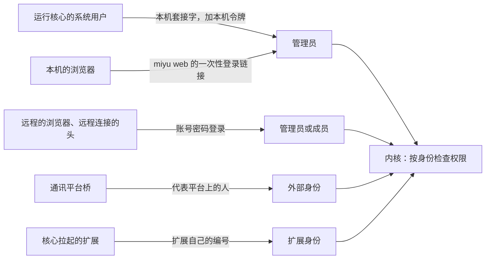
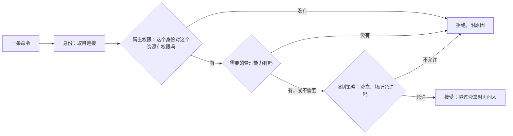
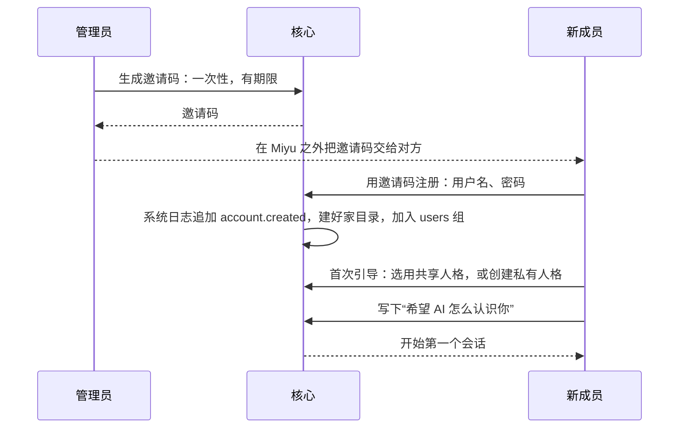
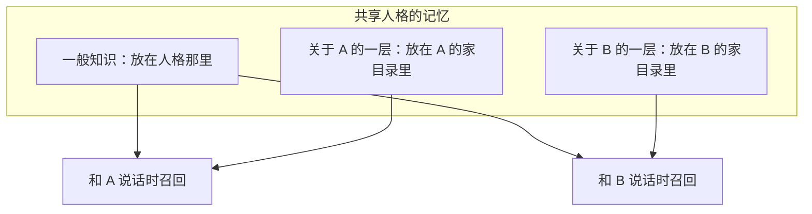

## 多用户与身份（草案）

状态：U1 到 U12 已定（2026-09-25）。其余内容为草案。

### 一、产品前提

2026-09-25 确认了两种用法：

- Miyu 是开源软件。别人会在自己的电脑上装一份，各用各的。
- 别人也会登录到某一个 Miyu 上，和它的主人共用，每人一个账号。

两种用法用同一套设计。**没有“单人模式”**：一个人自己用，就是只有一个账号的多用户（U1）。这样只有一条代码路径，一个人用的时候，也不会遇到“切到多人模式后行为变了”的问题。

**权限模型仿照 Linux**（2026-09-25 确认，U9）：用户、组、资源的属主与权限、拆开的管理能力、强制策略。一个人自己用的时候，这些全都看不见：没有组，所有东西都只属于你，默认值就是对的。

### 二、用户与组

| 词 | 对应 Linux 的 | 定义 |
|---|---|---|
| 账号 | 用户 | 在这个 Miyu 上注册过的人，有自己的家目录 |
| 管理员 | 持有管理能力的用户，但不是 root | 安装并维护这个 Miyu 的账号，对应运行核心的那个系统用户 |
| 成员 | 普通用户 | 由管理员邀请加入的账号 |
| 组 | 组 | 一组账号，用来按组共享资源。所有账号默认都在 `users` 组里 |
| 场所组 | 组 | 每个接入的群自动是一个组，组员就是在这个群里说话的人，由通讯平台桥担保 |
| 外部身份 | `nobody` | 通讯平台上说话的人。没有账号、没有家目录，只通过场所组拿到最少的权限。主人绑定的平台账号：私聊里是本人；群里仍是外部身份，但能用场所里的管理命令（U8、`18-通讯平台.md` 第十节） |
| 身份 | 进程的身份 | 发出一条命令的“谁”：账号、外部身份、扩展，或内核自己 |

- 管理员在本机使用时不需要密码：能连上本人的套接字，操作系统已经担保了身份；本机令牌由头自动读取，不需要人操作（`11-权限与沙盒.md` 第五节）。只有开启远程访问时，管理员才需要设置密码。本机的浏览器读不到本机令牌，由 `miyu web` 打开一次性的登录链接（`21-网页.md` X6）。
- 成员登录后使用 Miyu。任何能登录的头都可以用：网页、远程连接的 TUI。
- 停用一个账号，立刻作废它的全部登录令牌、断开它的连接，数据留着。每个登录令牌都能单独撤销，界面上列出登录过的设备。第一版不限同时在线的会话数（2026-09-25 补）。
- 外部身份只能经通讯平台桥进入会话，信任级别是“外部”（`04-核心协议.md` 第四节）。

### 三、资源的属主与权限

**每个资源都有一个属主、一个属组，以及分别给属主、属组、其他账号的三种权限：读、改、用**（U9）。这对应 Linux 文件的 rwx，“用”对应执行位。

三种权限对不同资源的含义：

| 资源 | 读 | 改 | 用 |
|---|---|---|---|
| 会话 | 看对话 | 在里面说话、发起操作 | 不适用 |
| 人格 | 看她的设定与提示词 | 修改设定 | 选她来对话 |
| 预设 | 看它开了哪些功能 | 修改 | 在自己的会话里用它 |
| 模型 | 看配置 | 改配置 | 用它来对话 |
| 扩展 | 看配置 | 改配置 | 在自己的会话里启用它 |
| 工作区 | 读里面的文件 | 写里面的文件 | 在里面执行命令 |
| 知识库 | 看里面的文档 | 增删文档 | 让自己的会话从中检索 |
| 产物 | 看 | 改 | 不适用 |

**默认权限**（相当于 Linux 的 umask）：

| 资源 | 属主 | 属组 | 默认权限 |
|---|---|---|---|
| 会话 | 创建它的人 | 无 | 只有属主能读、改 |
| 私有人格、私有预设、工作区、知识库、产物 | 创建它的人 | 无 | 只有属主 |
| 共享人格、共享预设 | 管理员 | `users` | 组员能用；能不能读人格的提示词，由管理员决定 |
| 模型、扩展 | 管理员 | `users` | 组员能用 |
| 群的会话 | 管理员 | 这个群的场所组 | 组员能读、能说话 |

- **管理员决定成员能用哪些模型、哪些扩展**，就是改这些资源的属组和“用”权限，不再是写死的规则。
- **外部身份只通过场所组获得权限。** “其他账号”这一类不包括外部身份。
- **界面说人话。** 权限位不直接给人看，界面上只有“只有我、指定的组、指定的人、所有成员”和“能不能改”这样的选项。

**分享（U12）**：资源的属主可以自己把资源分享出去，相当于 chmod、chgrp，以及给指定的人单独授权的 ACL。

- 人格、预设、工作区、知识库、产物可以分享给组，也可以分享给指定的人。
- 会话默认只有属主能看，可以分享给指定的人或组**只读**，例如把一段对话给朋友看。

### 四、管理能力：没有 root

Linux 的 root 什么都能看，但这里要保证“管理员看不到成员的会话”（U2）。所以 **Miyu 没有 root**。唯一不受权限检查的是内核自己，而它不是人。

管理员的权力拆成一项项能力，相当于 Linux 的 capabilities（U10）：

| 管理能力 | 允许做什么 |
|---|---|
| 管账号 | 邀请成员、停用账号、管理组 |
| 装软件 | 系统级地安装、卸载软件包，批准它们申请的能力 |
| 配模型 | 配置模型供应商与密钥 |
| 接平台 | 接入通讯平台、管理群 |
| 看总用量 | 查看所有人的用量 |
| 定上限 | 设定成员越过沙盒的上限，例如管理员放行的网站 |

- 每个账号都可以往自己的家目录里装软件，只对自己生效，不需要“装软件”能力，相当于 Linux 用户装到 `~/.local`（`12-进程形态与分发.md` 第四节）。
- 同理，每个账号都可以配只给自己用的模型，用自己的密钥，不需要“配模型”能力（`15-模型与供应商.md` M6）。
- 管理员持有全部能力。能力可以授予某个组，例如让一个组来管理 QQ 群，相当于把用户加进 Linux 的 wheel 这类组。默认不授予任何人。
- **有一件事不是能力，不能授予：不进沙盒执行命令。** 不进沙盒，就是以管理员的系统账号执行，所以只属于管理员本人（`11-权限与沙盒.md` 第三节）。
- 任何能力都不能越过属主权限。所以管理员看不到成员的会话，这一点在结构上成立，不需要额外的规则。

需要说清楚的是，这是 Miyu 层面的承诺。管理员拥有这台机器，技术上能直接读磁盘上的文件。要防住管理员只能靠加密，第一版不做。

### 五、一次操作最终能不能做

**能不能做 = 属主给的权限 ∩ 管理能力 ∩ 强制策略 ∩ 越界时人的确认**

- **强制策略**相当于 Linux 的 AppArmor、SELinux：会话的属主自己也改不了。例如外部身份永远碰不到主机（主人的私聊按本人对待，`18-通讯平台.md` Q7），成员的命令永远在沙盒里（U5）。
- **模型是替人做事的代理人。** 权限按“这一步是谁要求的”来判，不按“会话属于谁”来判。群友在管理员的群会话里让 Miyu 去读管理员的文件：会话属于管理员，属主权限这一关能过；但群友所在的外部场所有强制策略拦着，所以做不到。这和 `08-上下文投影.md` 的“工具面按会话定，权限按调用者判”是同一个原则。
- 权限检查分两道，都由内核做，扩展绕不过去：
  - **命令进入**：这条命令能不能发。看的是对资源的属主权限和管理能力，是「命令进入」链上内置的第一个实现（`02-内核.md` 第八节）。
  - **工具执行前**：这一步工具调用能不能做。看的是这一步是谁要求的、在哪个场所、权限级别和放行规则（`05-内核接口.md` 第五节、`11-权限与沙盒.md` 第二节）。
- 会话列表、视图流、事件流都按权限过滤。看不到的资源，连它是否存在都不会透露。
- 组、权限和能力的每一次变化，都记在系统日志里（`07-存储.md` 第二节）。当前的权限表是它的投影，相当于 Linux 的 `/etc/group` 加上 auth.log。

### 六、邀请与注册

- 邀请码只能用一次，并且有期限。期限是策略数据，初值 7 天。
- 首次引导只有两步：选用共享人格或创建私有人格；写下“希望 AI 怎么认识你”。
- 注册时如实告诉新成员：管理员拥有这台机器，技术上读得到磁盘上的文件；Miyu 保证的是在它里面看不到（第四节）。
- 这份自述属于这个人，不属于人格，换人格时它还在。它只在这个人自己的会话里使用。群聊面对的是一群人，不使用它，用了就等于把它公开给了这群人；主人的私聊就是主人自己的会话，照常使用（`18-通讯平台.md` Q7）。

### 七、人格与记忆

- 人格和预设都是资源（`16-人格与预设.md`），遵守第三节的属主与权限。共享的属于管理员；私有的属于创建它的人，可以分享。记忆和她能查的知识库跟着人格走（`17-记忆.md`）。
- **记忆的可见性不变量：她不会把一个人的私事说给另一个人听**（U6）。每条记忆都记录它来自谁、来自哪个场所。召回时，只取当前对话者有权知道的内容。

- 关于某个账号的那一层记忆，放在那个账号的家目录里。删除账号时，关于这个人的记忆随之删除。
- 记忆的具体设计，包括一般知识谁说的能进，见 `17-记忆.md`。

### 八、用量

- 用量不单独记账，它是 `model.called` 事件的投影（`03-事件模型.md`）。每个人的用量从他自己的会话里推出来，持有“看总用量”能力的人看到的总表，再把各人的汇总起来。
- 第一版不做按人的额度限制（U7）。第一批成员都是管理员亲自邀请的人，额度控制还没有真实的需求；管理员可以停用账号作为兜底。

### 九、决定

**U1. 要不要单人模式**

- **已定：不要。单人使用就是只有一个账号的多用户。**
- 未选：单人、多人两套模式。两条代码路径，切换时行为会变。
- 重开条件：多用户的开销让单人使用明显变重。

**U2. 管理员能否查看成员的会话**

- **已定：不能，也没有开关。** Miyu 没有 root，任何能力都不能越过属主权限（第四节）。成员把私事说给的是她，不是管理员；一个多人共用的 AI 伙伴，只有在成员相信管理员看不到的时候才成立。
- 未选：给管理员一个查看开关。
- 重开条件：项目主人改变这个产品决定。

**U3. 外部扩展是否按账号分进程**

- **已定：是。** 每个账号用到某个扩展时，各自拉起一份，沙盒范围是这个扩展在那个账号下的数据目录（`05-内核接口.md` 第八节）。
- 未选：所有账号共用一个扩展进程。进程更少，但扩展有机会在账号之间串数据。
- 重开条件：实测多人同时在线时，进程数量成为负担。

**U4. 密码与登录**

- **已定：密码用 argon2id 哈希；登录令牌只存哈希，30 天有效；同一来源 60 秒内失败 5 次，就暂时拒绝登录。** 令牌期限和限流次数是策略数据，这里给的是初值。
- 未选：旧版自己实现的 PBKDF2。argon2id 是当前推荐的密码哈希算法，而且用现成的、经过审计的库，不自己实现。
- 重开条件：出现更好的公认推荐算法。

**U5. 成员的工具在哪里执行**

- **已定：一律在沙盒里，边界是成员自己的工作区 `home/<账号>/workspace/`。成员只能用只读和工作区这两个权限级别（`11-权限与沙盒.md`）。**
- 重开条件：无。这一条不因方便而放宽。

**U6. 记忆的可见性**

- **已定：每条记忆记录来源的人和场所，召回时只取当前对话者有权知道的。私下说的按听众过滤，是机制；群里公开说的进一般知识，在别处提不提由她像人一样判断（`17-记忆.md` L5；项目主人 2026-09-25：「人格，是一个人，人的记忆。」）。**
- 重开条件：无。

**U7. 按人的额度**

- **已定：第一版不做，管理员可以停用账号。** 理由见第八节。
- 重开条件：出现成员滥用额度的实际情况。

**U8. 通讯平台账号与 Miyu 账号是否绑定**

- **已定（2026-09-25 改）：只绑定主人。** 主人在系统配置里写下自己的平台账号，就是绑定：只有能改这台机器配置的人写得了，写下它本身就是证明。在私聊里，这个账号就是管理员本人；在群里，它仍然是外部身份（`18-通讯平台.md` Q7）。其余平台上的人一律是外部身份，成员的平台账号第一版不绑定。
- 原来的定论是谁都不绑定。项目主人确认：旧版里在 QQ 私聊里让她跑命令是天天在用的。
- 重开条件：成员也需要在平台上被认成本人。那时要先有一套验证「这个号属于这个人」的流程。

**U9. 权限模型**

- **已定：仿照 Linux（2026-09-25 确认）。每个资源有属主、属组，以及给属主、属组、其他账号的读、改、用三种权限；默认值相当于 umask；界面只给人话的选项。**
- 未选：按角色写死的权限表。每加一种资源、一种角色，都要改代码。
- 重开条件：出现读、改、用表达不了的资源。

**U10. 管理员的权力**

- **已定：没有 root。管理员的权力拆成能力，可以授予组；任何能力都不能越过属主权限；不进沙盒执行命令不是能力，只属于管理员本人。**
- 未选：管理员就是 root。那样管理员能看到所有成员的会话。
- 重开条件：无。

**U11. 组**

- **已定：有组（2026-09-25 确认）。管理员建的组，加上每个接入的群自动形成的场所组；所有账号默认在 `users` 组里。**
- 重开条件：无。

**U12. 分享**

- **已定：可以分享（2026-09-25 确认）。人格、预设、工作区、知识库、产物可以分享给组或指定的人；会话可以分享给指定的人或组只读。**
- 未选：会话也能分享“能说话”的权限。那就成了多人共用一个会话，第一版先不做。这里说的是把自己的会话分享出去；群的场所会话本来就是多人的，另说（第三节）。
- 重开条件：出现多人一起在同一个会话里对话的真实需求。

**后续再定**

- 记忆一般知识层的防污染：已定，见 `17-记忆.md` L5
- 沙盒的平台实现：已定，见 `11-权限与沙盒.md`
