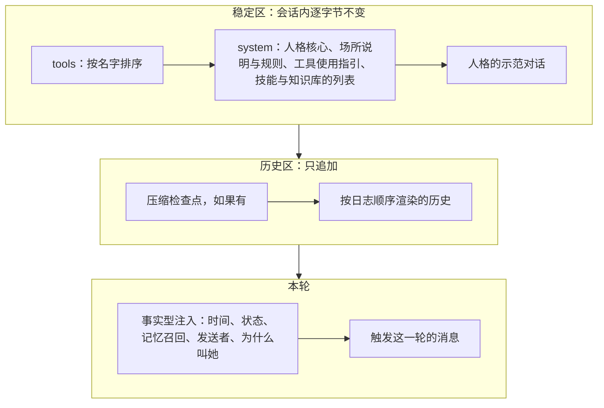
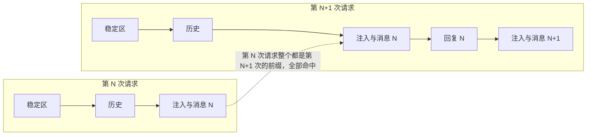

## 上下文投影（草案）

状态：C1 到 C10 已定（2026-09-25；C2、C3、C10 于 2026-09-26 改）。其余内容为草案。

上下文投影是内核里最热的一段纯函数。每次请求模型之前，它把事件日志和冻结在会话上的策略，变成一份统一格式的请求，再交给驱动编码。它决定了三件事：模型看到什么，请求有多贵，缓存能不能命中。

旧版 Miyu 的实测数据在这里只当作证据使用，出处随文注明。设计本身从原则推出，不照搬旧版的做法和参数。

### 一、总则

1. **每一次请求都是日志的投影（C1）。** 本轮第一步的请求、本轮后续步骤的请求、下一轮重放历史的请求，全部由同一个投影函数从日志生成。没有“实时路径”和“回放路径”之分。
2. **先落盘，后请求。** 一条事件要先写进日志，才能出现在请求里（`07-存储.md` S4）。所以实时请求用到的每个字节，重放时都原样存在。
3. **前缀即契约。** 同样的日志加同样的策略，投影出的请求逐字节相同（内核不变量 3）。
4. **只追加。** 新内容只加在末尾。例外只有压缩、撤销、策略变化和目录变化几种，每一次都记下原因（第七节）；压缩只前进（`09-压缩.md`）。
5. **字节、语义、安全三层分开。** 权限由代码判定。提示词里的任何文字都不承担鉴权，所以投影可以为了缓存自由安排字节的位置。

第 1 条是这次重制最重要的结构性修复。旧版最常见的一类缓存事故，就是实时请求边跑边拼、回放时再从存档重建，两边某个细节对不上，下一轮就在那里断前缀（旧版案卷 `2026-09-24-缓存回放与活体对不上`）。在这里，两边由同一个函数生成，结构上不可能对不上。

**投影是增量算的。** 同一个会话里，下一次请求就是上一次请求加上新事件的渲染；只有压缩、撤销、策略变化、目录变化这类记下原因的改写，才整段重算。增量的结果必须和从头算的逐字节相同，由测试门禁照查（第七节）。

### 二、请求的分区



| 分区 | 内容 | 变化规律 |
|---|---|---|
| 稳定区 | tools、system、人格的示范对话 | 会话内不变。策略变化按内核 K3，在回合开始时整体切换一次 |
| 历史区 | 压缩检查点，以及之后按日志顺序渲染的全部历史，工具结果按调用顺序（`03-事件模型.md` 第六节） | 只追加 |
| 本轮 | 事实型注入、触发消息 | 进入历史后永久回放。整个请求从头到尾只追加，没有只在一次请求里出现的内容（C3） |

**统一的请求怎么写**（2026-09-26 补，施工 1-8）：投影交给驱动的就是这一份。它和供应商无关，驱动再把它编码成各家的格式（`05-内核接口.md` 第七节）。样本在 `docs/designs/samples/requests/`。

```json
{
  "tools": [{"name": "read", "description": "Read a text file by line pages, an image, a PDF, or list a directory. …", "parameters": {"type": "object", "properties": {"path": {"type": "string"}}, "required": ["path"]}}],
  "system": "You are a helpful software engineer.",
  "messages": [
    {"role": "user", "blocks": [{"type": "text", "text": "<env …/>"}, {"type": "text", "text": "看看 src 目录"}]},
    {"role": "assistant", "blocks": [{"type": "text", "text": "我先看一下目录。"}, {"type": "tool_call", "call_id": "call_44_1", "name": "read", "args": "{\"path\":\"src\"}"}]},
    {"role": "tool", "call_id": "call_44_1", "error": false, "blocks": [{"type": "text", "text": "lib.rs\nmain.rs"}]}
  ],
  "stable": 0
}
```

| 字段 | 内容 |
|---|---|
| `tools` | 工具面，按名字排好。每件三样：名字、说明、参数格式（JSON Schema，原样照抄）。存根也是这三样，只是说明短、参数宽松（`25-工具加载.md`） |
| `system` | 系统提示词，一整段，照 `26-提示词.md` 第四节的顺序拼好 |
| `messages` | 示范对话、检查点、历史、本轮，照先后排。角色三种：`user`、`assistant`、`tool` |
| `stable` | 稳定区有几条消息，也就是示范对话有几条。缓存标记「稳定区结束」就在它们后面；「请求结束」就是最后一条，不另外标（第六节） |

- **消息里的块，就是事件里的内容块**（`03-事件模型.md` 第四节）：文本、思考（连同驱动私有数据）、图片、文件、工具调用。图片和文件还是 blob 的引用，到编码时才换成字节。
- **工具的结果单成一条 `tool` 消息**：写明是哪一次调用、算不算出错、给模型看的内容。一次调用一条，按调用的先后排（`03-事件模型.md` 第六节）。各家要把结果放在哪、要不要和别的合并，是驱动的事。
- **事实块是 user 消息里的一块**，排在触发消息前面（第五节）。
- **规范的字节**：照上面的字段顺序写成紧凑的 JSON，参数格式原样照抄。同样的请求，字节一定一样（内核不变量 3）。请求的哈希就是这串字节的 SHA-256，写成 `sha256:…`。
- **指纹**：工具面、system、每条消息，各算一个 SHA-256。和上一次请求的指纹一比，就知道第一处不同在哪：工具面、system，还是第几条消息、什么角色。这一次只是在上一次后面接着加的，就没有不同；上一次有、这一次少了的，从少了的那一条算不同（第七节）。只留指纹，不留上一次的请求。
- **不在请求里的**：用哪个供应商、哪个模型、输出的上限。同一份投影可以交给不同的端点（`15-模型与供应商.md` 第四节），这些是发请求的时候才定的。
- 样本里的 `system` 只有人设那一句。场所说明这些，要到组装请求时才拼得出来（施工 1-12）。

### 三、稳定区

**tools**

- 按名字排序，描述和参数格式的字节固定。
- 会话内恒定：来自目录快照（`05-内核接口.md` 第八节），变化按内核 K3 在回合开始时生效。故障扩展的工具留在目录里（I6）。
- **工具面按会话定，权限按调用者判（C4）。** 同一个群里，管理员和群友看到的是同一张工具面。群友调用只有管理员能用的工具时，由“工具执行前”的权限检查拒绝，并返回原因。旧版曾按说话的人切换工具面：管理员说完话，群友接着说，工具面随之缩小，模型把“工具被移除”理解成“工具掉线了”，此后整段会话不再调用任何工具。
- **加载方式（C5）。** 每件工具是全量、存根或关。存根是真名、一行摘要、宽松的参数外壳，完整契约按组经 `load_tools` 的结果获取，不碰前缀。出厂是常用的全量、其余存根，可以按件、按组改，描述也能改（`25-工具加载.md`）。不管怎么配，tools 在会话内逐字节不变，改动按 `02-内核.md` K3 在回合开始时生效。旧版的实测是证据：约束解码的模型面对空壳参数只能发出 `{}`，契约写在对话里也救不回来。

**system**

- 由策略快照组装：人格核心，场所说明，工具使用指引，技能与知识库的列表，以及「装了、但这次没开」的软件那一行（`16-人格与预设.md` Y8）。派子代理时能选哪些人格和预设，也写在这里，不写进 `agent` 工具的说明（`16-人格与预设.md` 第六节）。
- 时间、工作目录这类会变的量，永远不进 system。
- 人格的示范对话放在 system 之后、历史之前，属于稳定区，不落日志，也永远不会被压缩折叠。旧版实测它对保持人格很有效。

### 四、历史区：各种事件怎么渲染

| 事件 | 渲染成 |
|---|---|
| `message.user` | 用户消息。多人场所附带发送者标签。群里两次回合之间的消息，合成一块群聊近况，放在触发消息之前；睡着时收到的不进这一块（`18-通讯平台.md` 第四节） |
| `message.assistant` | 助手消息。内容块原样：文本、思考及其驱动私有数据、工具调用的参数原文 |
| `tool.result` | 工具结果。按调用顺序排列（`03-事件模型.md` 第六节），只渲染事件里记录的内容 |
| `context.injected` | 带 XML 标签的块，放在它所属的那条消息之前 |
| `context.compacted` | 压缩检查点，替代它覆盖的那一段历史（`09-压缩.md`） |
| `child.reported` | 子代理的回报，一块带标签的事实。子代理都在后台跑，派它的那次 `agent` 调用只返回编号（`02-内核.md` 第七节）。回报到了，她闲着就开一轮，这一块就是触发消息；她正忙，就排在下一步的工具结果之后 |
| `job.reported` | 后台命令结束，一块带标签的事实，写法和这种事件一起定（施工 M7）。旧版的「后台任务报告」要改写（`26-提示词.md` 第五节） |
| `turn.ended`（打断、出错、步数上限、中断） | 一个很短的事实块：这一轮被人打断了、出了错、走到了步数上限，或者因为核心重启没走完。正常完成的不渲染 |
| `turn.reverted` | 被撤销的回合整体不再出现 |
| `ext.<模块名>.<种类>` | 按模块清单里的模板渲染 |
| `turn.started`、`model.called`、`session.*`、`tool.approval_*`、`question.*`、`child.spawned` | 不进上下文。被拒绝的调用，由它的工具结果写明“被人拒绝”；提问的回答就是 `ask_user` 的工具结果；派生子代理的那次 `agent` 调用本身就在历史里 |

- **思考内容**：投影保留全部思考块，由驱动按供应商的要求决定发哪些。这个决定只取决于历史本身，所以字节稳定。中途打开或关闭思考，不回头改写已经发过的历史。
- **大工具输出在执行时就定下预览（C9）。** 工具结果事件里记录的，就是模型看到的那份：超过上限的输出只留头尾预览，全文进 blob，预览里写明全文的位置和读法。预览按 token 计算，上限是策略数据，初值由原型实测决定。旧版曾在落盘时才截断：实时请求发的是全文，回放的却是截断版，下一轮在那条工具结果处断前缀，实测命中率 76.3%，对照组 87.6%。

### 五、本轮：规则与事实

本轮要告诉模型的，按性质分两种（C3）：

| 性质 | 例子 | 放在哪里 | 回放吗 |
|---|---|---|---|
| **规则**：该怎么做，一直成立 | 场所说明（回复触发这一轮的那条消息；引用的是别人的话）、工具使用指引、角色扮演的风格 | 稳定区：system 里，会话内逐字节不变（第三节） | 不在历史里，每次请求都一样 |
| **事实**：发生了什么，以后回看仍然为真 | 当前时间、工作目录、权限级别的切换、记忆召回的结果、发送者、这一轮为什么叫她、这一轮由哪条消息触发 | 事实型注入：先成为事件（内核 K2），渲染在触发消息之前 | 永久回放 |

- **指令进稳定区，每一轮的标记记成事实**（C3，2026-09-26 改）。旧版出过的事：把「只回复当前消息」这句指令写进消息块，回放以后成了过期的指令，跨轮错乱。现在规则写在 system 里，一直成立；每一轮不一样的只是一条标记，例如「这一轮由编号 123 的消息触发」，它以后回看仍然为真。规则说「回复触发这一轮的那条」，标记说是哪一条，两样都不会过期。旧版后来也是这样修的：回复对象的规则挪进了系统提示词。
- **没有浮动尾巴，整个请求只追加。** 第一轮的写法是在请求最末尾放一段只在这一次请求里出现的状态。旧版量过它，命中约 99.6%，两天后还是撤了：它每轮都在自己的位置断一次前缀（提交 189a3909）。旧版现在用户消息后面的块全部化石化，每次请求只重建系统提示词；实测末尾多一条 system 消息，那家供应商的缓存命中直接掉到 0%。
- **还剩几步不注入**：走到步数上限，由代码结束这一轮，记一条事实（第四节的 `turn.ended`）。
- **角色扮演提示**隔几轮追加一条，记成事实（初值 3 轮，旧版的实测间隔）。它排在触发消息之后，是 C2 唯一的例外，照旧版做过 A/B 的位置。出厂 Miyu 默认开，每 3 轮一条；软件工程师没有（2026-09-26 项目主人定，`26-提示词.md` J10）。
- **群聊近况不是注入**：它就是两次回合之间那些群消息事件的投影（第四节），不另外注入。
- **事实可以永久回放。** “那一轮的时候，现在是 19:20”，模型读得懂，语义无损。
- **环境和状态，变了才注入**（C10）。环境是当前时间、时区、工作目录、场所信息、工作区的文件清单；状态是权限级别这类很少变、一直作数的设置。每一块都和投影里还在的最近一次同类块比较，逐字节相同就不再注入。压缩替掉的、被撤销的回合里的都不算，否则撤销以后她不知道现在是什么级别（2026-09-26 补）。
  - **状态按会话写**：群聊这类碰不到主机的场所，写场所的强制策略，例如 `no host access`；其余的会话写权限级别（2026-09-26 补）。
  - 时间按粒度写，同一个粒度里字节不变：终端、网页、命令行的会话里到小时，通讯平台和桌面语音这类场所里到分钟（初值，策略数据）。星期用三个字母；时区写成 `UTC+09:00`，裸的偏移量容易被读成时间的一部分。
  - 关掉的东西补一条「已关」，例如沙盒关了。否则模型会以为它还开着。
  - **状态的切换记成事实**：「从这里起，权限级别是只读」以后回看仍然为真，所以原样回放（C3）。回合之间切的，排在下一个回合的触发之前（用户的消息，或者叫醒她的回报），是那条 user 消息里的一块；回合中途切的，收紧当场生效、放宽下一步生效（`11-权限与沙盒.md` 第二节），这一块都排在那一步的全部工具结果之后，和回合中途来的消息同一个位置。来回切了一圈、又回到原样的，不注入（项目主人 2026-09-26：「对话途中切到只读，那么下一次用户消息前就会自动多发一条权限变更的系统提示」）。
  - **压缩以后各写一次**：检查点替掉了原先那几块，所以压缩后的第一次请求里就带上，环境和状态各注入一块，紧跟在检查点后面（`09-压缩.md` 第四节）。回合中途在步的边界压的也一样，紧接着的那次请求就带上（2026-09-26 补）。
  - 人所在终端的信息，只能取头在握手时报的，不能取核心进程自己的环境变量。旧版实测过：核心进程里读到的终端类型和 shell，和人真正用的对不上，既是错的，又白占字数。
  - 为什么：每注入一块，就多一段要全价算的新 token，历史也长一截，离下一次压缩、也就是前缀重置更近。这是旧版一直在用的做法（项目主人 2026-09-25 提醒）：时间和工作目录从 08-16 起这样注入，同一个小时里每轮省下约 100 token（提交 189a3909）；沙盒说明从 09-23 起也挪出了系统提示词，变了才追加。



**位置规则（C2）：当前要回应的那句话，离生成位置最近。** 本轮的顺序是：事实型注入在前，触发消息在最后；唯一的例外是隔几轮一条的角色扮演提示（C3）。群聊近况这类大块背景，也放在消息之前。旧版实测：把当前消息从群聊记录块之前挪到之后，措辞一字不改，跨轮持续的指令遵循率从 80% 升到 100%（N=32，p=0.00012）。

**回合中途来的消息**：冲她来的，在下一步的边界加进来，排在那一步的全部工具结果之后（`03-事件模型.md` 第六节）；群里没冲她来的，等这一回合结束，并进下一回合的群聊近况（`18-通讯平台.md` 第七节）。子代理的回报、后台命令结束、权限级别的切换，也在下一步的边界加进来，位置和冲她来的消息一样。

**写法（C7）：**

- 模型看到的机械文本（标签、注入、报错）一律用英文短句。中文只留给人格侧的文本。
- 每个注入块都有 XML 标签外壳，不裸露。
- 只陈述“这是什么”，不规定“你该怎么做”。例如写 `QQ id is stable, nickname can be changed at any time`，不写“不要凭昵称认人”。旧版实测：行为禁令式的措辞没有作用，位置比措辞重要得多。
- 可信的字段（由内核产生，例如发送者的身份编号）和不可信的字段（用户可控，例如昵称、消息正文）分开承载。不可信文本进请求前一律转义，防止伪造标签或伪造记录。

**模板与转义怎么写**（2026-09-26 补，施工 1-11）：

- **模板**是一段给模型看的原文，用 `{名字}` 标出要换进去的字段，例如 `<sender id="{id}" nickname="{nickname}"/>`。要写 `{`、`}` 本身，就写两遍：`{{`、`}}`。名字只用小写字母、数字、`_`，小写字母开头。只做字段替换，没有条件、没有循环（`05-内核接口.md` 第五节第 4 条）。
- **换进去的每个字段都转义**，可信的、不可信的都一样。可信的字段（编号、身份）本来就没有要转的字，一视同仁最不容易漏。
- **转义照 JSON 字符串的写法**：反斜杠写成 `\\`，换行、制表这些控制字符写成 `\n`、`\t`、`\u001b` 这样；Unicode 的行分隔符、段分隔符也在有的地方当换行，写成 `\u2028`、`\u2029`；再把 `"`、`&`、`<`、`>` 写成 `\u0022`、`\u0026`、`\u003c`、`\u003e`。转出来的是一行字，里面没有引号，也没有尖括号：伪造不了标签，也伪造不了一行一条的记录。模型天天读 JSON，这种写法它认得。
- 模板里的属性一律用双引号括起来。
- 模板里的 `{` 没配上 `}`、名字写错、少了要换的字段，都报错，不猜。
- 旧版的 `safe_prompt_field` 就是先照 JSON 转义、再把 `&`、`<`、`>` 换成 `\u` 的写法，群聊记录一行一条，靠它防伪造记录行。旧版的引号转成了 `\"`，还带着引号，放进标签的属性里不保险，这里改成 `\u0022`（`旧版证据索引.md`）。

### 六、缓存：普适层与投放层

驱动知道自己的供应商属于哪种缓存类型（`05-内核接口.md` 第七节）。旧版 `理念.md` 第六章把供应商分为三类：

| 类型 | 例子 | 特点 |
|---|---|---|
| 契约型 | Anthropic、OpenAI | 缓存写入要付费，换来明确的存活时间 |
| 尽力而为型 | DeepSeek 官方 | 缓存免费，但不承诺存活；写入是异步的 |
| 按次计费型 | 按请求次数计费的网关 | 缓存不省钱，任何“多发请求换命中”的手段都是负收益 |

缓存手段分两层（C6）：

- **普适层，永远开启**：字节纯度、只追加、事实留档、工具面恒定。它们在任何供应商上都只有收益。
- **投放层，默认值由缓存类型推出**：
  - **保温**：会话空闲时，定期把上一次请求的前缀原样重发一次，最多只生成 1 个 token，续住缓存。旧版在 DeepSeek 上实测：空闲 65 秒后的跨轮命中率从 28% 升到 94.9%；在别的供应商上零收益，还白花请求。默认关闭，由使用者按实测决定。
  - **写入宽限**：尽力而为型的缓存写入是异步的。上一次请求刚结束、缓存还没写完就发下一个，会白白错过缓存，所以稍等片刻再发。等多久由对该供应商的实测决定。尽力而为型默认开启。
  - **钉住端点**：同一个会话尽量用同一个端点、同一个 key，因为缓存在那里。契约型和尽力而为型默认钉住，按次计费型默认轮换。旧版是一个全局开关，这里改成按缓存类型推出默认值；池怎么分请求见 `15-模型与供应商.md` M4。
- **缓存标记**：统一格式的请求里，标出“稳定区结束”和“请求结束”这两个位置。驱动按各家的机制使用它们，例如 Anthropic 的 cache_control 断点。不支持的驱动直接忽略。
- **辅助请求隔离**：标题生成、判官、隔离式摘要、看图描述这些辅助请求，各有自己的缓存状态，不共用主会话的缓存键，也不占主会话钉住的端点。唯一的例外是 fork 式摘要（`09-压缩.md`），它刻意复用主会话的前缀。

### 七、度量

- **每次请求记一条 `model.called`**：用量分成未命中输入、缓存读取、缓存写入、输出四项；请求字节的哈希；消息条数；和上一次请求相比，第一处不同出现在第几条消息、是什么角色。最后这一项靠逐条消息的累积哈希得出，缓存一掉，就能直接指出是哪一条被改写了。
- **核心指标：已经发过、却被迫重算的量。** 看绝对值，不看单条请求的命中率百分比。旧版的教训是百分比会说谎：一轮正常加入大段新内容时百分比会下跌，看起来像缓存坏了，其实前缀命中得好好的。
- **每次前缀改写都记录原因**：压缩、撤销、策略变化、目录变化（扩展升级，或者握手报出的目录和磁盘缓存的不一样）。命中率下跌时，必须能归因到某一次有原因的改写。
- **按段记哈希，未命中当场归因**：每次请求分段记哈希（tools、system、示范对话、历史、本轮）。凡是有意改写前缀的代码，都要往一本登记簿里记一笔；没登记的未命中就报警（参考 jcode 的做法，2026-09-25 补）。
- **测试门禁**：
  - 用模拟驱动断言：第 N 次请求是第 N-1 次请求的字节前缀延伸，只有记录了原因的改写点除外。
  - 每家驱动的请求字节用固定样本检查（驱动编码是纯函数）。
  - 回放测试必须带非空的本轮尾巴和注入。旧版的回放测具尾巴全是空的，结果漏掉了一次回归。

### 八、决定

**C1. 实时请求与回放请求**

- **已定：没有两条路径。每次请求都由同一个投影函数从日志生成。**
- 未选：实时请求边跑边拼，回放时从存档重建。这是旧版的做法，也是旧版缓存事故最常见的来源。
- 重开条件：实测投影耗时可以被人感知。

**C2. 本轮的排列顺序**

- **已定：事实型注入在前，触发消息在最后（2026-09-26：浮动尾巴撤掉了，见 C3）。唯一的例外是角色扮演提示，照旧版做过 A/B 的位置排在触发消息之后。**
- 未选：注入放在触发消息之后，也就是旧版的布局。实测表明，当前消息离生成位置越近，指令遵循越好。
- 重开条件：新的实测数据推翻这个结论。

**C3. 哪些内容回放**

- **已定：指令进稳定区，每一轮的标记记成事实，事实永久回放；没有浮动尾巴，整个请求只追加（2026-09-26 项目主人定，改掉第一轮的「当下的状态放进浮动尾巴」）。**
- 未选 A：当下的状态放进浮动尾巴，每次请求都带、不回放（第一轮的定论）。它每轮在自己的位置断一次前缀；旧版量过以后撤掉了（189a3909）。
- 未选 B：指令也写成注入，跟着回放。过期的指令会跨轮错乱，旧版的回复对象就这样出过事。
- 重开条件：出现一种既不是规则、也写不成事实，只在这一次请求里成立的内容。

**C4. 工具面由谁决定**

- **已定：按会话定，权限按调用者判。**
- 未选：按说话的人切换工具面。模型会把工具被移除理解成工具掉线。
- 重开条件：出现必须对某些人隐藏工具存在本身的需求。

**C5. 工具的加载方式**

- **已定（第二轮，2026-09-25）：全量、存根、关三个状态；存根按组加载；出厂是常用的全量、其余存根，可以配置；一个会话能用到的模型里只要有一个不能用存根，存根就一律按全量发。细节见 `25-工具加载.md` W1 到 W8。**
- 未选：第一轮的定论，默认完整声明、存根按模型选。功能全开装多了以后，工具面太重。
- 仍然成立的约束：tools 在会话内逐字节不变；哪些模型能用存根，看模型的资料（`15-模型与供应商.md` 第三节）。
- 重开条件：见 `25-工具加载.md` 各条。

**C6. 缓存手段怎么投放**

- **已定：普适层永远开启；投放层的默认值由驱动报告的缓存类型推出。**
- 未选：所有手段对所有供应商一视同仁。同一个手段，在一家是救命药，在另一家是纯浪费。
- 重开条件：出现无法归入三种缓存类型的供应商。

**C7. 注入的写法**

- **已定：英文短句，XML 标签外壳，只陈述是什么；可信与不可信字段分开，不可信文本转义。**
- 重开条件：新的实测数据表明另一种写法明显更好。

**C8. 缓存度量**

- **已定：看绝对值和“已发过却被迫重算的量”；每次前缀改写都记录原因。**
- 重开条件：无。

**C9. 大工具输出在什么时候截断**

- **已定：执行时就定下预览，事件里记录的就是模型看到的那份，全文进 blob。**
- 未选：落盘时才截断。实时与回放不一致，下一轮断前缀。
- 重开条件：无。

**C10. 环境和状态什么时候注入**

- **已定：变了才注入。和投影里还在的最近一次同类块逐字节相同就跳过，压缩替掉的、撤销掉的不算（2026-09-26 补）；时间按粒度写（终端到小时、场所到分钟，初值），带上时区；关掉的补一条「已关」（2026-09-25 项目主人提醒，旧版的做法）。权限级别这类状态也一样：切换以后在下一个边界注入一条，记成事实、原样回放（2026-09-26 项目主人定）。**
- 未选 A：每轮都注入一遍。内容没变也多一段新 token，历史越拉越长。
- 未选 B：权限级别放进浮动尾巴，每次请求都带（第一轮的写法）。每次都多一段进不了缓存的字；切换本身又是一件以后回看仍然为真的事实，不必当成只在此刻成立的状态。
- 重开条件：实测按粒度写以后，模型常常把时间弄错；或者长会话里，模型常常忘了已经切到只读。

**后续再定**

- 各家驱动怎么落实缓存标记：驱动实现时定
- 保温的间隔与停止条件
- 预览的头尾比例
