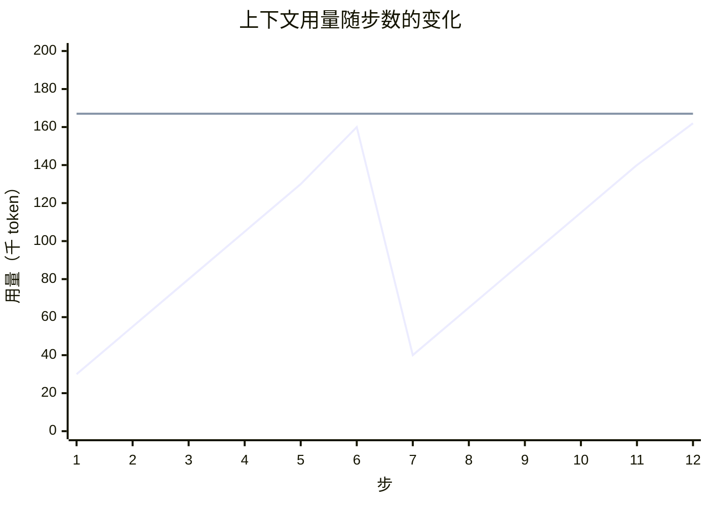
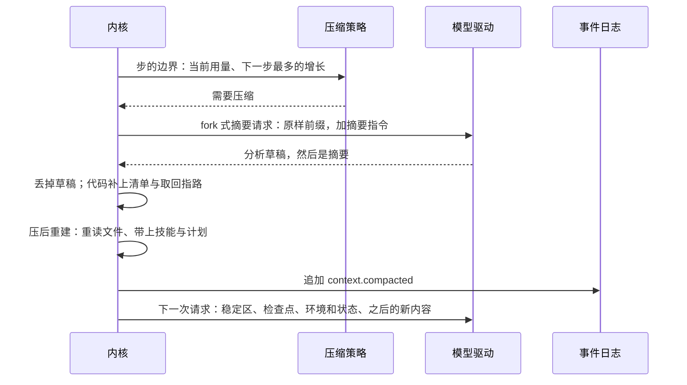
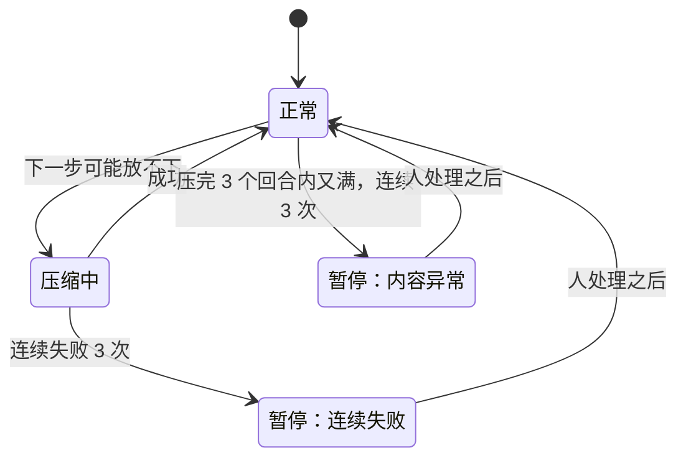

## 压缩（草案）

状态：Z1 到 Z9 已定（2026-09-25；Z9 于 2026-09-26 补）。其余内容为草案。

压缩以 Claude Code 的做法为基准：它在实际使用中效果最好，几乎不出现失忆。具体机制取自本机 Claude Code 2.1.263 的实现。本文只在它没有覆盖的场景做适配：小窗口模型、群聊、无人值守的场所。

### 一、两条原则

**1. 只在上下文不够用时压缩（Z2）。**

每压缩一次，请求前缀就重置一次，重置之后的第一次请求几乎全价。所以不在中途做小压缩：不在空间还够时顺手换出旧的工具输出，也不在缓存变冷时顺手整理。要压就整段压，压一次腾出大量空间，下一次压缩就很远。

折线是上下文用量，水平线是触发线。用量一直增长，直到下一步可能放不下才压一次，压完降到很低，再继续增长。两次压缩之间，历史只追加，缓存持续命中。

**2. 压缩是换出，不是删除（Z1）。**

上下文是内存，事件日志是磁盘（`01-架构.md` 第二节）。压缩只是把旧内容移出上下文，日志里什么都没有丢。模型需要旧的细节时，可以用读取工具从日志里按序号或关键词取回来。Claude Code 做的是同一件事：压缩后附上完整转录文件的路径，模型可以去读。

这个读取工具就是基础系统里的 `history`（`10-自带软件.md` 第三节）。它读的是会话自己的日志，受会话可见性的约束。

### 二、什么时候压缩

在步的边界检查，也就是两次模型请求之间，所以工具调用和结果始终成对。满足下面任意一条就压缩（Z3）：

- **下一步可能放不下**：当前用量 + 下一步最多的增长 + 输出预留 ＞ 窗口
- **摘要请求会放不下**：当前用量 + 摘要请求所需 ＞ 窗口

| 量 | 含义 |
|---|---|
| 窗口 | 驱动报告的模型上下文窗口，不用全局默认值 |
| 输出预留 | 这次请求允许的最大输出，与 20000 取小（Claude Code 的做法） |
| 下一步最多的增长 | 一次工具预览的上限，加一次输出 |
| 摘要请求所需 | 摘要指令，加摘要的输出上限 |
| 当前用量 | 最近一次请求时供应商报告的真实输入加输出，再加之后新增事件的本地估算（Claude Code 的做法） |

- 对大窗口的模型，这两条算出来的触发线，和 Claude Code 的“有效窗口减 13000”基本一致。
- 对小窗口的模型，固定减 13000 会出问题：例如 32k 窗口，压完之后的内容可能本身就超过触发线，刚压完又要压。所以这里用两条条件，而不是固定常数。
- 第二条保证了一点：需要压缩时，摘要请求一定还放得下，不会出现“满到连摘要都做不了”的死局。

另外两种时机：

- **被动压缩**：供应商报告上下文超长（驱动的错误分类）时，压缩后重发一次，只重发一次。模型已经开始输出时不重发，避免半截回答和重复执行有副作用的操作。
- **手动压缩**：人发出 `/compact`，可以附上自己的要求，例如“重点保留数据库设计的讨论”。这些要求追加在摘要指令之后。

界面在用量接近触发线时提示“上下文快满了”，提示的位置由头决定。

### 三、怎么压：跟 Claude Code

| 方式 | 触发 | 保留原文吗 |
|---|---|---|
| 整段压缩 | 自动压缩、手动压缩 | 不保留。检查点替代到当前为止的全部内容 |
| 保尾压缩 | 被动压缩 | 保留最近一组：最后一条助手消息，连同它的工具调用和结果。其余替代掉 |
| 局部压缩 | 人在界面上选中某条消息，“压缩到这里” | 选中消息之前的替代掉，之后的保留原文 |

- 整段压缩不留原文尾巴，这是 Claude Code 的做法：尾巴在检查点之后要重新渲染一遍，本来就不在缓存里；它要保留的信息，由检查点里逐字引用的最近对话承担。
- 保留下来的原文里，思考内容不再渲染。
- 三种方式产生的都是同一种事件：`context.compacted`，写明检查点替代到哪个序号为止（`03-事件模型.md` 第七节）。

### 四、检查点

**任务型模板，用 Claude Code 的九节摘要（Z5）：**

| 节 | 内容 |
|---|---|
| 主要请求与意图 | 用户到底要什么 |
| 关键技术概念 | 涉及的技术、框架、约定 |
| 文件与代码 | 看过、改过的文件，以及关键的代码片段 |
| 错误与修复 | 遇到的错误、怎么修的，以及用户的纠正 |
| 解决过程 | 已经解决的问题，和正在排查的问题 |
| 全部用户消息 | 用户的每一条消息（工具结果除外），逐条列出 |
| 待办 | 明确被要求、还没做的事 |
| 当前工作 | 压缩前正在做什么，越具体越好 |
| 下一步 | 与用户最近一次明确的请求直接相关的下一步，并逐字引用最近的对话，防止跑偏 |

**聊天型模板，按同样的原则改写：** 全部用户消息的要点；人物关系与称呼；正在进行的话题与玩笑；答应过、还没做到的事；当前的情绪基调；逐字引用最近几句对话。Claude Code 没有这类场景，这套模板要靠压缩质量评测来打磨。

**用哪一套是一个配置项**（`compaction.template`，值是 `task` 或 `chat`），跟着人格和预设走（`14-配置.md` 第三节）：开发预设写 `task`；人格给默认值，Miyu 是 `chat`，软件工程师是 `task`；功能全开不写，所以跟着人格走。预设在人格之上，所以 Miyu 配开发预设时用任务型（2026-09-25 补）。

**不交给模型的部分，由代码补上：**

- 读过、改过的文件清单，存过的记忆，创建的产物，派生的子会话。它们能由代码从日志里精确算出来，交给模型只会带来遗漏和编造。
- 取回指路：被替代的原文在日志的哪一段，可以用读取工具按序号或关键词取回。

**压后重建（Claude Code 的做法）：**

| 重建什么 | 默认上限 |
|---|---|
| 最近读过的文件，从磁盘重新读一遍 | 最多 5 个，单个 5000 token，合计 50000 token |
| 用过的技能正文，最近用过的优先 | 单个 5000 token，合计 25000 token |
| 计划、待办清单、还在跑的后台命令和子代理（以及结束了、回报还没交给她的）、还没回答的提问 | 原样带上 |

- 还完整留在原文里的文件，不重复重建。
- 重建的总量还要再封顶，保证压完之后的用量远低于触发线，不超过触发线的一半。否则小窗口的模型刚压完又要压。
- 表里的上限是给大窗口的。小窗口按比例缩：重建的总量不超过上下文窗口的四分之一（初值，实测再定）；窗口太小时（初值 32k 以下）不重读文件，只列出文件名和取回的办法，要用时她自己读（2026-09-25 补）。
- 重新读出的文件内容存成 blob，记进压缩事件（内核 K2），所以重放时逐字节相同。
- 模块也可以在压缩之后补充内容，例如记忆模块重新召回，走“回合开始”同样的注入方式（`05-内核接口.md` 第五节）。
- 环境和状态，也就是时间、工作目录、权限级别这些，不在这里重建：压缩后的第一次请求里就按 `08-上下文投影.md` C10 各注入一块，紧跟在检查点后面；回合中途压的，紧接着的那次请求就带上（2026-09-26 补）。

**检查点的包装：** 以用户角色出现，有标签外壳。开头说明这段对话是从一次上下文用尽的对话接着来的，下面是之前的摘要；结尾说明直接继续工作，不要复述或确认这份摘要。这两句都是模型可见的机械文本，写成英文（`08-上下文投影.md` C7）。

**只有用户角色的消息，才算用户说的话。** 工具输出或模型回复里写着“User: …”的文字不算。否则一段来路不明的文本经过摘要复述，就会以用户的名义重新进入上下文。

### 五、摘要请求

- **fork 式，默认（Z6）**：摘要请求就是“下一次请求的前缀原样”，加上一段摘要指令。前缀逐字节相同，所以几乎全部命中缓存。
- 准确地说，摘要请求是日志到第 N 条为止的投影，加上摘要指令；`context.compacted` 写明替代到第 N 条为止。压缩期间新到的事件排在 N 之后，压完照常渲染在检查点后面。所以 fork 式摘要和「每次请求都是日志的投影」（`08-上下文投影.md` C1）是一回事。
  - 必须用会话自己的驱动、模型和端点。缓存在端点上，换一家就全部落空。
  - 这次请求的末尾不写缓存，因为它的后缀以后不会再用到。
  - 禁止调用工具：驱动支持时直接关闭工具调用，指令里也写明只输出文本。模型仍然调用了工具，这次摘要作废，改走隔离式。
- **隔离式，回退**：只带摘要指令和序列化后的待压缩内容，外加只读的读取工具。用于不能复用前缀的驱动（例如借用别的 agent CLI 的驱动），以及 fork 失败的时候。序列化时明确标出每段内容的角色，工具调用只写工具名和参数的键名。
- **先分析，再摘要**：和 Claude Code 一样，指令要求模型先写一段分析草稿，逐段过一遍对话，再写正式摘要。草稿不进检查点。压缩期间，界面显示进度，不能让人对着空白屏幕等。
- **超时按实际情况推算**：用摘要的输出上限，除以这个模型实测的出字速度，再留出余量。不写死固定的秒数。
- 压缩是会话自己的事，在这个会话的 actor 里进行，不阻塞别的会话。压缩期间，这个会话收到的新消息照常落进日志，压缩完成后按顺序处理。

### 六、失败与熔断

- **摘要请求本身超长**：先砍掉待压缩内容最老的 20%，插一行说明，再试，最多 3 次（Claude Code 的做法）。
- **连续失败 3 次**：暂停自动压缩，并告诉人发生了什么、可以怎么办：重试、换一个模型、开新会话（Z7）。
- **不悄悄降级。** 在有人值守的场所（终端、网页、桌面语音、主人的私聊），压缩失败就如实报错，由人决定。自己凑一份粗糙的摘要继续对话，就等于悄悄失忆。
- **无人值守的场所例外**：群聊这类场所，没有人会来处理报错。这时由代码写一份机械检查点：用户消息的要点逐条列出，加上取回指路，让她保持可用；同时通知管理员。
- **内容异常的熔断（Z9）**：压完之后 3 个回合内又满了，连续发生 3 次，说明有异常巨大的输入，例如一次贴进来的超长文本或工具输出。这时暂停自动压缩，告诉人是哪一条内容太大（Claude Code 的做法）。无人值守的场所没人来处理，不停在暂停上：照上一条写机械检查点，那条太大的内容只留取回指路，同时通知管理员（2026-09-26 补）。
- **通知管理员走会话列表流**：这个会话的状态标成要人处理，写明原因，各个头在会话列表和系统提醒里显示（`04-核心协议.md` 第五节，2026-09-26 补）。
- 上面的次数都是策略数据，初值取 Claude Code 的值。

### 七、群聊用同一套机制

群聊的消息流没有尽头，但不需要另一套机制（Z8）：

- 用聊天型模板。群聊里通常没有工作集，检查点的主体是人物关系、话题和情绪。
- 压缩只在不够用时发生，所以在群聊里天然是隔很久才一次。
- 检查点遵守记忆的可见性不变量（`06-多用户与身份.md` U6）：群聊的检查点里，只有这个群里公开说过的内容。
- 群聊是无人值守的场所，失败时按第六节写机械检查点。

### 八、度量与测试

- 每次压缩记录：压前用量、压后用量、用了哪种请求、摘要请求命中了多少缓存、重建了哪些内容。
- 测试：
  - **字节前缀**：每次压缩恰好让前缀重置一次，重置点就是检查点；两次压缩之间只追加。
  - **不做小压缩**：用量没到触发条件时，任何情况下都不改写前缀。
  - **取回**：被替代的任何一条内容，都能用读取工具按序号原样取回。
  - **并发**：压缩进行时，别的会话照常可用。
  - **贴近实况的验收**：用慢模型加长上下文来验收。旧版的教训是，快模型加短会话恰好绕开了超时的问题。
  - **压缩质量评测**：准备一组固定的长会话，压缩之后问模型之前的约定、让它继续任务，看答对多少。任务型与 Claude Code 的结果对照，聊天型模板靠它来打磨。

### 九、决定

**Z1. 压缩是什么**

- **已定：压缩是把旧内容移出上下文，日志里保留全部；模型可以用读取工具取回。** 和 Claude Code 附上完整转录路径是同一个思路。
- 未选：压缩就是删除，只剩摘要。漏掉的细节就永远丢了。
- 重开条件：无。

**Z2. 什么时候可以改写前缀**

- **已定：只在上下文不够用时压缩。不做中途的小压缩：不在空间还够时换出旧的工具输出，也不在缓存变冷时顺手整理。**
- 未选：用量到一定程度就先做小规模的换出，不够再摘要。每一次小改写都要重置一次前缀，次数多了，缓存损失和失忆的机会都更多。
- 重开条件：无。

**Z3. 触发条件**

- **已定：下一步可能放不下，或者摘要请求会放不下。** 对大窗口的模型，它和 Claude Code 的“有效窗口减 13000”基本一致。
- 未选：固定常数。在小窗口的模型上，压完之后可能仍在线上，刚压完又要压。
- 重开条件：实测这两条条件在某类模型上频繁误判。

**Z4. 压缩的方式**

- **已定：跟 Claude Code。自动与手动压缩整段替代，不留原文尾巴；被动压缩保留最近一组；人可以局部压缩到某条消息；压后重建最近的文件、技能和计划。**
- 未选：摘要加一段按预算保留的原文尾巴。尾巴在检查点之后本来就要重新渲染，占上下文却不省缓存。
- 重开条件：压缩质量评测表明，聊天型模板保留一段原文尾巴明显更好。

**Z5. 检查点的结构**

- **已定：任务型用 Claude Code 的九节；聊天型按同样的原则改写；能由代码算出的由代码写；用哪一套跟着人格和预设走（第四节）。**
- 重开条件：压缩质量评测表明某一节没有用，或者缺了某一节。长会话里“全部用户消息”一节增长过快时，再定它的上限。

**Z6. 摘要请求**

- **已定：fork 式为默认，隔离式为回退；先分析再摘要，草稿不进检查点；超时按实测的出字速度推算。**
- 未选：一律隔离式。每次压缩都要把整段历史按全价重新读一遍。
- 重开条件：某类驱动上 fork 式频繁失败；或者评测表明分析草稿没有收益，而它占用的时间明显影响体验。

**Z7. 摘要失败时**

- **已定：超长时砍掉最老的 20% 重试，最多 3 次；仍然失败，有人值守的场所如实报错、暂停自动压缩；无人值守的场所写机械检查点，并通知管理员。**
- 未选：失败了一律写一份粗糙的摘要继续。那等于悄悄失忆。
- 重开条件：无。

**Z8. 群聊**

- **已定：用同一套机制，换用聊天型模板。**
- 未选：为群聊另做一套滑动窗口。两套机制，两套边界情况。
- 重开条件：实测群聊的压缩频率或成本明显不可接受。

**Z9. 内容异常的熔断**

- **已定：压完 3 个回合内又满，连续 3 次，就暂停自动压缩，并告诉人是哪条内容太大；无人值守的场所不暂停，改为写一份机械检查点，并通知管理员（2026-09-26 补）。**
- 重开条件：无。

**后续再定**

- 读取工具：已定为 `history`，见 `10-自带软件.md`；参数与描述在原型阶段定
- 聊天型模板的正文：压缩质量评测定
- 局部压缩在各个头上的操作方式：`13-终端界面.md`、`21-网页.md` 都还没写，第二轮细纲里随头的样式一起定
