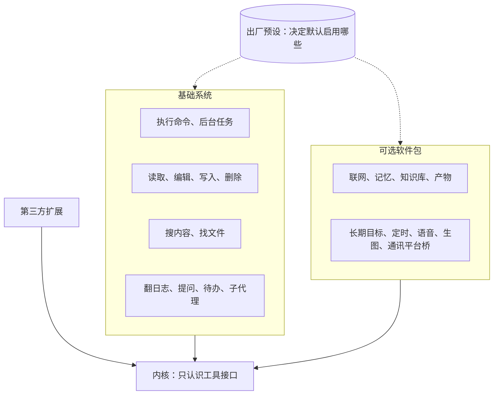
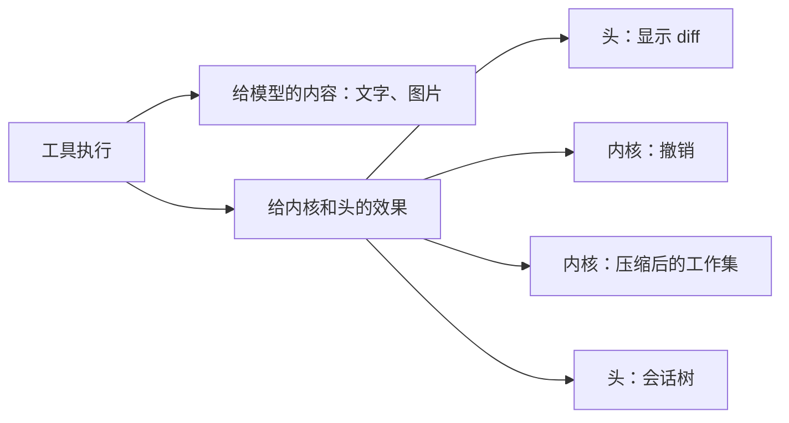

## 自带软件（草案）

状态：B1 到 B10 已定（2026-09-25）。其余内容为草案。

### 一、内核不内置工具，发行版自带软件

工具也是内核之外的软件，可以自由更换。所以这里要回答的问题不是“内置哪些工具”，而是“发行版自带哪些软件”，就像 Linux 发行版通常自带 GNU 的软件（B1）。

| Linux | Miyu |
|---|---|
| 内核只提供系统调用 | 内核只认识“工具”这个接口：派发、权限、记录结果（`05-内核接口.md`），不内置任何具体工具 |
| GNU coreutils、bash | 基础系统：几乎每个预设都打开的软件 |
| 发行版仓库里的软件包 | 可选软件包：随发行附带，由预设决定是否启用 |
| 第三方软件 | 第三方扩展：用户自己安装 |
| 发行版的默认安装清单 | 随发行附带的软件；出厂预设决定默认打开哪些 |

三层软件用同一套接口，自带的软件不开后门。任何一件都可以被替换，只要替换品遵守同样的接口，并报出同样的效果（第五节）。

### 二、判定规则：只问内核看不看得懂

shell 能做成所有的事。但 harness 需要的不只是把事做成，内核和头还要看懂发生了什么。一条 shell 命令在内核眼里只是一串文字。

所以判断一个能力要不要做成结构化工具，只问一个问题（B2）：

> **内核或头需不需要理解这件事的结果？** 需要，就做成结构化工具；不需要，就交给 shell。

“理解”具体指这六件事：

| 需要理解的事 | 为什么 shell 做不到 |
|---|---|
| diff 与撤销 | 内核只知道跑了一条命令，不知道改了什么 |
| 看图 | 命令输出只是文本，图片无法变成模型能看的内容 |
| 压缩后的工作集 | 内核看不见模型读过哪些文件。旧版的实证：读文件全走 `cat`，压缩后要重新读回的文件恒为空 |
| 权限粒度 | 每条命令都可能危险，只能要么全问、要么全放 |
| 三平台一致 | bash 和 PowerShell 的差异直接暴露给模型 |
| 中等模型的可靠性 | 用 sed、heredoc 改文件，引号和转义很容易写错 |

还有一条独立的理由：**有的场所根本不能给 shell**，例如通讯平台上的外部用户。这些场所照样需要的能力，比如翻回日志，就不能只存在于 shell 里。

### 三、基础系统：13 件

| 名字 | 显示名 | 做什么 | 为什么不能只靠 shell | 谁能用、在哪能用 |
|---|---|---|---|---|
| `shell` | 执行命令 | 前台或后台执行命令 | 它就是广度本身 | 本人、成员（成员在沙盒里） |
| `jobs` | 后台任务 | 查看后台命令与后台子代理的状态和输出，或停止它们 | 后台任务跨越多个步骤，内核要追踪，界面要显示，压缩后要重建 | 同 `shell` |
| `read` | 读取 | 读文本（按行分页）、图片、PDF；读目录时列出条目 | 看图；工作集；三平台一致 | 本人、成员 |
| `edit` | 编辑 | 在已有文件里做精确替换，一次可以改多处 | diff、撤销、权限 | 本人、成员 |
| `write` | 写入 | 新建文件，或整体覆盖一个文件 | diff、撤销、权限 | 本人、成员 |
| `trash` | 删除 | 把文件移进系统回收站 | 撤销；删除是最需要确认的操作 | 本人、成员 |
| `grep` | 搜内容 | 在文件里搜索文本，遵守 .gitignore | 三平台一致，不依赖系统里装没装 rg | 本人、成员 |
| `glob` | 找文件 | 按名字模式找文件，遵守 .gitignore | 三平台一致 | 本人、成员 |
| `history` | 翻日志 | 按序号或关键词，读回本会话更早的内容 | 压缩后的换入（`09-压缩.md` Z1）；外部场所也需要 | 所有场所 |
| `ask_user` | 提问 | 向人提问，可以附选项 | 界面要弹出提问面板 | 能弹出提问的场所 |
| `todo` | 待办 | 维护当前工作的待办清单 | 界面要显示；压缩后要重建 | 本人、成员 |
| `agent` | 子代理 | 派生一个子会话去做一件事。它在后台跑，做完了，回报会叫醒她（`02-内核.md` 第七节）；按活的难易挑模型挡位（`15-模型与供应商.md` 第四节） | 子会话是内核的对象 | 本人、成员 |
| `message_agent` | 给子代理留言 | 给自己派出去的子代理追加一条消息：它还在跑，下一步就看到；已经做完，就在它的子会话里另起一轮，结束时照样回报 | 同 `agent` | 本人、成员 |

六点说明：

- **没有单独的列目录工具。** `read` 读到目录时直接列出条目。
- **技能不单独设工具。** 技能的清单写在系统提示词里，模型用 `read` 读技能正文。内核从读取的路径认出“用过哪个技能”，压缩后据此重建（`09-压缩.md` 第四节）。
- **`history` 独立成一个工具，不藏进 `read` 的某种路径前缀里（B10）。** 工具名是最强的能力广告。旧版实测过把一种能力藏进 `read` 的 `kb:` 前缀，模型常常想不起来用它。
- **基础系统本身是一个软件包**，编号是 `basesystem`，借的是 Fedora 里那个同名的包：最先装上，几乎每个预设都打开（`16-人格与预设.md` 第三节）。
- **`history` 只读本会话自己的日志**，关键词走全文索引。场所会话的日志里本来只有这个场所的人看得到的东西，所以不另外过滤。
- **`message_agent` 单独一件，不做成 `agent` 的一个参数**（2026-09-26 项目主人：「还需要一个主会话 AI 能和子代理对话的发 followup 消息的工具」）。旧版两样都有：`subagent` 带上会话编号就能接着派，另外还有一件 `send_subagent_message`。重制只留单独的这一件，一件事一个办法；工具名本身就是能力的广告（B10）。`agent` 的返回只写派出去了、编号是什么，回报会自己送来。

还有两样东西属于机制，不算软件：

- **契约获取**：只在有工具是存根时出现，按组加载（`25-工具加载.md` 第二节），由工具系统自动提供。
- **替不能看图的模型看图**：图片内容遇到不能看图的模型时，由一次辅助请求交给能看图的模型转成文字描述，属于上下文投影的策略。

### 四、可选软件包

随发行附带，默认启用与否由预设决定（B4）：

| 软件包 | 包含 | 开发预设里开不开（功能全开里全开，`16-人格与预设.md` 第八节） |
|---|---|---|
| 联网（`net`） | `web_fetch` 抓取网页、`web_search` 搜索 | 开。搜索需要配置搜索来源 |
| 记忆 | 记忆的写入、查询，回合开始时的召回 | 不开。记下的内容跟着人格走（`17-记忆.md`） |
| 知识库 | 文档入库与检索 | 不开。她能查哪几个库，跟着人格走 |
| 产物 | 在网页上展示的文档、图表 | 不开 |
| 长期目标 | 跨回合持续推进的目标 | 开 |
| 定时 | 定时消息与提醒 | 不开 |
| 语音 | 桌面语音助手、听写、QQ 语音（不朗读回复，`20-语音.md` V1） | 不开。声音跟着人格走 |
| 生图 | 生成图片 | 不开 |
| 通讯平台桥 | 例如 OneBot（QQ） | 桥本身由管理员接入平台时启用；它的平台工具在哪些会话里开，由预设决定，开发预设里不开（`18-通讯平台.md` Q16） |

这些软件包各自的设计，在“子系统”一步进行。

### 五、效果：内核和头看得懂的标准接口

工具的结果分两部分（B5）：

- **给模型看的**：文字、图片等内容块。
- **给内核和头看的**：一组结构化的“效果”。它们随 `tool.result` 事件一起记录（`03-事件模型.md`），不发给模型。

| 效果 | 内容 | 谁用 |
|---|---|---|
| `file.read` | 路径，读了哪几行 | 工作集；路径是技能文件时，登记为“用过的技能” |
| `file.changed` | 路径；改前的内容（blob，新建时为空）；改后的内容（blob） | 显示 diff；撤销；工作集 |
| `file.trashed` | 路径，回收站里的位置 | 撤销 |
| `job.started`、`job.finished` | 任务编号，对应的命令或子会话 | 会话树（`13-终端界面.md` 第七节）；压缩后重建 |

- 效果类型是标准接口，作用相当于 Miyu 自己的 POSIX。第三方编辑器只要报出 `file.changed`，diff 显示和撤销照样能用。替换自带软件因此是安全的。
- `shell` 报出退出码和耗时。命令改动了哪些文件，它不报：内核看不懂，这正是第二节说的。

### 六、编辑的格式

**精确替换（B6）**：参数是 `path`，加一组 `edits`，每项是 `old_text` 和 `new_text`。

- 每一处都对照**原文件**匹配，不是改完一处再对照一次。所以每处的 `old_text` 必须在原文件里唯一，而且互不重叠。
- 先精确匹配。找不到时再做宽松匹配：忽略行尾空白，把弯引号当直引号，做 Unicode 规范化。宽松匹配只影响“找位置”，写回时保留文件原来没被改动的部分。
- 保留文件原来的换行风格（LF 或 CRLF）、编码和 BOM。
- 同一个文件的修改排队执行，不同文件之间照常并行。
- 失败时，报错说清是哪一处没找到，或者哪一处不唯一，并给出最接近的候选位置，让模型下一次自己改对。

选精确替换而不选补丁格式的理由：精确替换是各家模型都训练过的格式，参数就是普通的 JSON；补丁格式要解析一套自定义语法，主要是一家模型在训练。这一节的几条具体规则参考了 pi 的实现。

### 七、撤销

- 撤销一个回合时（`turn.reverted`，`03-事件模型.md`），这一回合里经过 `edit`、`write`、`trash` 的改动，按相反的顺序恢复：用 `file.changed` 里改前的内容写回，从回收站里把 `file.trashed` 的文件移回来（B7）。
- 恢复前先核对：文件现在的内容如果已经不等于当时改后的内容，说明之后又被别的东西改过。这时不覆盖，而是把冲突和 diff 交给人处理。
- 经过 `shell` 的改动无法撤销，界面上要写明这一点。

### 八、三个平台

- **`shell` 在各平台用的是哪个**（B8）：

  | 平台 | 使用的 shell |
  |---|---|
  | Linux | bash |
  | macOS | zsh，系统的默认 shell |
  | Windows | PowerShell：装了 PowerShell 7 就用它，否则用系统自带的 Windows PowerShell |

  工具的描述里写明当前是哪种 shell，模型据此写命令。Windows 上装了 Git Bash 的用户，可以在配置里改用 bash。

- **`grep` 和 `glob` 用自带的实现**，不调用系统命令，所以三个平台的行为和输出格式完全相同（B9）。
- 路径两种分隔符都接受，输出用平台原生的形式。
- `read` 自动识别 UTF-8 与 UTF-16 编码。

### 九、工具面的预算

- 每件工具的描述不超过三句：是什么，什么时候用，最容易踩的坑。调用之后才用得上的知识写进工具自己的输出（`05-内核接口.md` 第六节）。
- 基础系统整面的 token 总量有预算，由测试守住。预算的初值由原型实测决定。
- **工具怎么加载**：第二轮已定，见 `25-工具加载.md`。三个状态：全量、存根、关；存根按组加载；出厂是常用的全量、其余存根，可以配置；描述也能改。名字和参数格式自己说得清的工具，全量声明里只写参数壳（W2）。

  起因是功能全开装的软件一多、再加上平台工具，工具面会很繁杂（`18-通讯平台.md` 第九节）。旧版的实测可以当证据：有的模型解码时受声明的参数格式硬约束，懒加载的空壳会让它只能发出空参数；旧版为此改成按模型选全量或懒加载，后来又删掉了混合方式。

### 十、决定

**B1. 内核内置工具吗**

- **已定：不内置。发行版自带软件，分基础系统和可选软件包；它们和第三方扩展用同一套接口。**
- 重开条件：无。

**B2. 什么能力要做成结构化工具**

- **已定：只问内核或头需不需要理解它的结果；以及有没有不能给 shell 的场所需要它。**
- 未选 A：只给一个 shell。diff、撤销、看图、工作集、权限粒度都无从谈起。
- 未选 B：尽可能多地做成专用工具。工具越多，模型越难选，token 越贵，而且大多数都是 shell 干得更好的事。
- 重开条件：无。

**B3. 基础系统有哪些**

- **已定：第三节那 13 件（2026-09-26 加上 `message_agent`）。**
- 重开条件：原型实测表明某一件几乎没有被用到，或者某个常见任务反复要靠 shell 绕路完成。

**B4. 可选软件包有哪些**

- **已定：第四节的初始清单。** 各包的内容在“子系统”一步细化。
- 重开条件：子系统设计时发现需要拆分或合并。

**B5. 工具怎么让内核看懂自己**

- **已定：结果里带结构化的效果，效果类型是标准接口。**
- 未选：内核从结果文本里猜。换一个编辑器，猜法就全错。
- 重开条件：出现现有效果类型表达不了、又确实需要内核理解的结果。

**B6. 编辑用什么格式**

- **已定：精确替换，一次多处，对照原文件匹配，精确优先、宽松兜底。**
- 未选：补丁格式。要解析自定义语法，而且主要是一家模型在训练。
- 重开条件：实测某类常用模型用精确替换的失败率明显偏高。

**B7. 撤销的范围**

- **已定：只撤销经过编辑类工具（`edit`、`write`、`trash`）的改动；文件在之后被改过时，不覆盖，交给人处理。**
- 未选：连 `shell` 的改动一起撤销。要在每条命令前后给文件系统拍快照，代价太大。
- 重开条件：出现轻量又可靠的快照手段。

**B8. 各平台的 shell**

- **已定：Linux 用 bash，macOS 用 zsh，Windows 用 PowerShell；Windows 上可以改用 Git Bash。**
- 未选：Windows 上要求安装 Git Bash。三个平台的命令写法会一致，但 Windows 用户要多装一样东西，不再是开箱即用。
- 重开条件：实测常用模型写 PowerShell 命令的失败率明显偏高。

**B9. 搜索用什么实现**

- **已定：自带实现，不调用系统命令。**
- 未选：调用系统的 rg、grep、find。各平台装没装、版本和输出格式都不一样。
- 重开条件：无。

**B10. 翻日志放在哪里**

- **已定：独立成 `history` 工具。**
- 未选：藏进 `read` 的某种路径前缀。模型常常想不起来用它。
- 重开条件：无。

**后续再定**

- 每件工具的参数与描述正文：原型阶段定，受第九节的预算约束
- `shell` 命令改动了哪些文件的检测：以后有轻量快照手段时再议
- 权限怎么向人确认、各平台的沙盒怎么实现：已定，见 `11-权限与沙盒.md`
