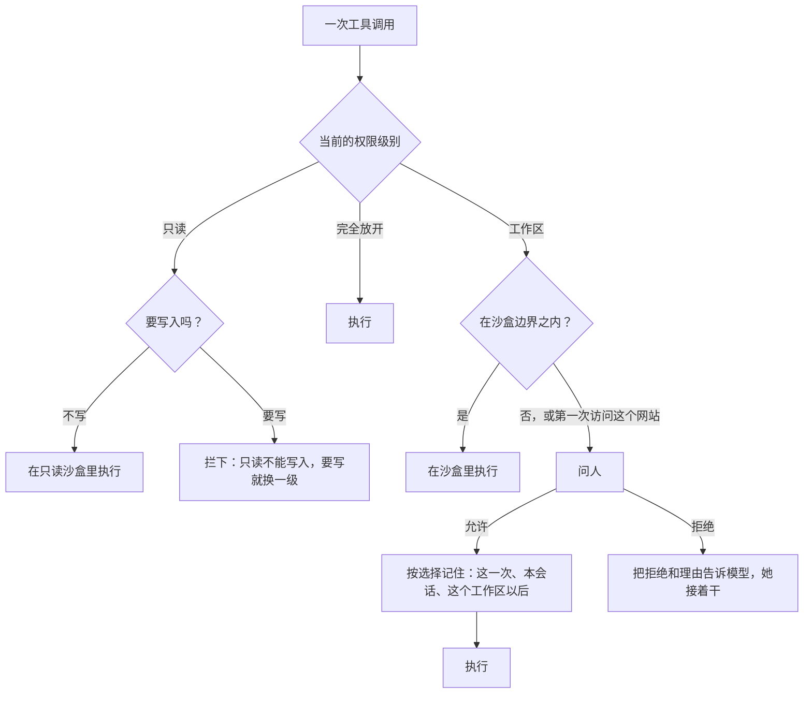
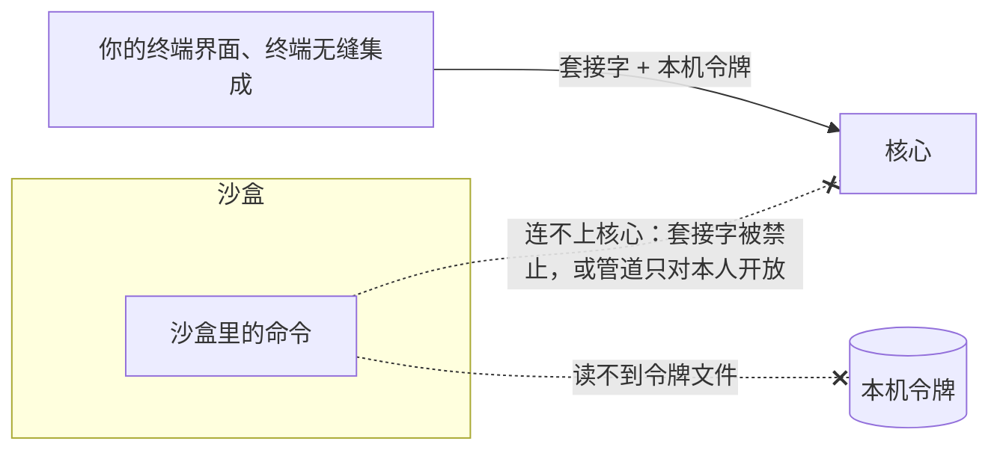

## 权限与沙盒（草案）

状态：A1 到 A13 已定（2026-09-25；A2、A5、A11、A12 于 2026-09-26 改，A13 于 2026-09-26 定）。其余内容为草案。

### 一、两道防线

- **沙盒**：由操作系统强制执行的边界。模型怎么写命令都绕不过去。
- **确认**：由人来判断。只处理沙盒管不住、或者需要越过沙盒的事。

原则只有一条（A1）：**沙盒管得住的，不问人；要越过沙盒的，才问人。** 问得越多，人越会不看就点同意，确认也就失去了意义。

两道防线都由代码执行。提示词里的任何文字都不授予权限（`06-多用户与身份.md` 第五节）。

放到 Linux 的框架里看：沙盒是强制策略，相当于 AppArmor；确认相当于 sudo，“本会话都允许”像 sudo 的免密时限，“这个工作区以后都允许”像 sudoers 里写好的规则。

### 二、三个权限级别

2026-09-26 项目主人定：只留三级（A2）。原来还有一级「逐个确认」，去掉了，理由见下：

| 权限级别 | 沙盒 | 什么时候问人 | 平台 |
|---|---|---|---|
| **只读** | 有，工作区也只读 | 沙盒里的读、搜、不写文件的命令都不问；越界的读取、第一次访问某个网站，照工作区的规矩问人；任何写入都会被拦下 | 全部平台 |
| **工作区**（默认） | 有 | 要越过沙盒时：写工作区之外的文件、读系统家目录（`~`）里没有开放的地方、第一次访问某个网站 | 全部平台 |
| **完全放开** | 无 | 从不问 | 全部平台。只有管理员能用，改成完全放开时要明确确认一次 |

- **只读是叠在上面的一道开关。** 会话有一个常用的级别，工作区或完全放开，开始时取预设里的（`16-人格与预设.md` 第三节）。只读开着，实际的级别就是只读；关掉，就回到常用的那一级。
  - 终端界面里用 `Shift+Tab` 开关只读（`13-终端界面.md` H11），命令是 `/readonly`。
  - 常用的那一级用命令 `/level workspace`、`/level full` 或设置改。改成完全放开时确认一次，之后从只读切回来不再问。预设里写的是完全放开时，新会话一开局确认一次；成员用了这样的预设，退回工作区（`06-多用户与身份.md` U5）。
  - 项目主人的理由（2026-09-26）：开了完全放开的人，多半一直用它，只需要在只读和它之间来回；选工作区的人要的是安全，不会去开完全放开。
- **为什么去掉逐个确认**：它和工作区都是给要安全的人用的。三个平台又都有沙盒（A3），留两个只是多一道选择。
- **某台机器上沙盒用不了时**，例如 Windows 上没有用管理员权限装好沙盒，工作区这一级照样在，只是沙盒该拦的改成问人：执行命令、改文件、删文件之前都问，读取与搜索不问。界面上写明原因。这就是原来逐个确认的做法，只是它不再是一个能选的级别。
- **只读用来做计划**：先让她调查、写计划，保证这期间不会改动任何文件。计划写好后，她只能提醒你；关掉只读由你按 `Shift+Tab`，回到常用的那一级（A12，2026-09-26 项目主人定）。
- 对应 Linux：只读像把工作区以只读方式挂载；工作区像普通用户外加 AppArmor 这类强制策略；完全放开就像你自己在终端里直接敲命令。
- 权限级别是会话的属性，可以随时切换。收紧当场生效：这一步里还没派发的调用按新的级别判，正停在确认上的也按新的级别重判；放宽等到下一步才生效（2026-09-26 补）。叫法是项目主人 2026-09-25 定的：权限的叫「权限级别」，「挡位」只留给模型（`15-模型与供应商.md` M3）。
- 模型需要知道当前的权限级别，否则它会反复尝试被禁止的事。级别变了，就在下一个边界注入一条，记成事实、以后原样回放；没变就不再写（`08-上下文投影.md` C10）。它追加在后面，前缀一个字节都不动。第一轮的写法是放进浮动尾巴，每次请求都带（2026-09-26 改）。
- 子代理继承父会话的权限级别和放行规则，不能比父会话更宽。子代理实际的级别，取它自己的和父会话的当中更严的那个：父会话开了只读，子代理下一步也只读。后台命令保持它启动时的权限级别：已经在跑的进程，沙盒收不紧。
  - 派生时，子会话抄下父会话常用的那一级和工作区。只读开关不抄，一直跟着父会话：父会话开关只读，子会话跟着变，并照 `08-上下文投影.md` C10 在子会话里注入一条。人切进子会话按 `Shift+Tab` 只能收紧：可以只给它开只读，父会话开着只读时关不掉（2026-09-26 补）。

**问人时的四个选项**：允许这一次；本会话都允许；这个工作区以后都允许；拒绝（可以附上理由，理由会告诉模型）。记住的放行规则是策略数据，按“工具 + 匹配规则”记录，例如“`shell` 里以 `git status` 开头的命令”“访问 `crates.io`”（A10）。

**拒绝以后她接着干**（A13，2026-09-26 项目主人定）：她看到被你拒绝了，写了理由就带上理由，自己换个办法接着做。要她停下，就打断。先读了三家的源码：codex、opencode v2、Claude Code 不写理由的拒绝都让这一轮停下；写了理由的，后两家接着干，codex 没有写理由这一项。内核怎么走见 `02-内核.md` 第六节「确认怎么走」。

**没有确认界面的场所**：QQ（群聊和主人的私聊）、桌面语音。需要确认的操作一律拒绝，并告诉模型“这里不能做需要确认的操作”；她会在对话里说明，请人到终端或网页上做（A11）。这些场所也没有提问工具，她有问题就在对话里直接问。联网是例外：公开网站直接放行，拦本机、内网和元数据地址照旧（第四节）。

### 三、谁能用什么

| 身份 | 可用的权限级别 | 工具 |
|---|---|---|
| 管理员 | 三级都能用 | 全部 |
| 成员 | 只读和工作区，沙盒边界是成员自己的工作区 `home/<账号>/workspace/` | 全部，都在沙盒里 |
| 外部身份 | 不适用 | 碰不到主机：没有 `shell`，也没有文件类工具，也不能派子代理。只有翻日志、联网这类工具；联网公开网站直接放行（第四节） |

- 成员可以批准自己的越界请求，但只能在管理员设定的上限之内。例如管理员放行过的网站。自己工作区之外的路径，成员无权批准：Miyu 的家目录里放着密钥和会话日志（`07-存储.md` 第二节）。
- **成员不能使用完全放开**（2026-09-25 确认）。这一级不进沙盒，而核心是以管理员的系统账号运行的：成员的命令会以管理员的身份执行，能读到管理员的密钥和其他成员的对话。
- 某台机器上沙盒不可用时，这台机器上的成员不能执行命令；文件类工具仍然可以用，由内核检查路径，只能碰自己的工作区（第七节）。界面上写明原因（`00-设计理念.md` 跨平台：显式声明缺失，给出降级行为）。

### 四、工作区这一级的沙盒边界

边界是策略数据，下面是默认值（A4）：

| 范围 | 读 | 写 |
|---|---|---|
| 工作区 | 可以 | 可以 |
| 临时目录 | 可以 | 可以 |
| 系统目录：程序、库、系统配置 | 可以 | 不可以 |
| 工具链的目录与缓存，例如 `~/.cargo`、`~/.rustup`、`~/.npm`、`~/.gitconfig` | 可以 | 缓存可以写 |
| 系统家目录（`~`）的其余部分 | **不可以** | 不可以 |
| Miyu 的数据根：日志、密钥、别的会话、本机令牌 | **不可以** | 不可以 |
| 工作区里会在沙盒外被执行的东西，例如 `.git/hooks`、`.git/config` | 可以 | **不可以** |

- **读写都是白名单。** 默认只开放列出来的地方，其余一律不开放。系统家目录（`~`）默认不可读，用来保护密钥、浏览器数据和密码库。需要读其他地方时，走一次确认。
- **为什么 `.git` 的钩子和配置在工作区里也只读**：沙盒里的命令如果能写一个 git 钩子，下次你在沙盒外执行 git，这段代码就在沙盒外被执行了。Codex 也同样保护 `.git`。
- **网络**（A5）：沙盒里的命令不能直接联网，只能经过 Miyu 自带的代理。代理按网站放行，第一次访问某个网站时问人，同意后记住。管理员放行的网站，成员可以直接用。没有确认界面的场所（QQ、桌面语音），公开网站直接放行，不问人，也不维护名单：这些场所碰不到主机（2026-09-26 项目主人：「这个名单不好处理吧？要不都放行？」）。
- **内网与本机地址**：成员和外部场所的网络请求，一律不能访问本机、内网和云上的元数据地址（例如 169.254.169.254）。否则群里的人可以借联网工具去探测管理员家里的路由器。
- **核心进程里的联网工具也走这个出口**（2026-09-25 补）：`web_fetch`、`web_search`、下载，经同一个代理、同一份放行规则和内网拦截。按网站放行，按的是 CONNECT 请求里的主机名和端口，不解密 HTTPS；真正连接之前再核对一次解析出来的地址，防 DNS 重绑定。
- **本机的其他服务**：沙盒里的命令不能连接本机的 Unix 套接字。否则可以借 D-Bus 让 systemd 在沙盒外替它执行命令，或者借 Docker 的套接字拿到 root 权限。Windows 上，只对你开放的命名管道，沙盒用户本来就连不上。
- **环境变量**：沙盒里的命令只拿到白名单里的变量，例如 `PATH`、`LANG`、`TERM`，以及工具链要用的那几个；其余一律不传。确实需要的，在策略里单独放行。原来的写法是按名字后缀去掉密钥类变量，会漏掉 `AWS_ACCESS_KEY_ID` 这种（2026-09-25 改）。
- **会话的工作区**：开会话时定。在终端里开的（终端界面、`miyu ask`），是开会话那一刻的当前目录；网页上开的，新建会话时选，默认是 `home/<账号>/workspace/`。成员只能选自己工作区之内的目录。
  - **当前目录太宽，就不拿它当工作区**：是系统家目录（`~`）本身、根目录 `/`，或者包含 Miyu 的数据根时，退回 `home/<账号>/workspace/`，并在界面上说一句。否则装完第一次在新终端里敲 `miyu`，整个家目录都进了沙盒边界。旧版 09-23 起就是这么做的（2026-09-26 补）。
  - **终端无缝集成每一轮换一次**：工作区是你说这句话时 shell 所在的目录（`22-命令行.md` 第七节）。沙盒的边界和放行规则，都按这一轮的工作区算（2026-09-26 补）。
  - **场所会话**（QQ、桌面语音）默认也是 `home/<账号>/workspace/`，场所规则的 `workspace` 可以改（`18-通讯平台.md` 第三节，2026-09-26 补）。
- **别人分享来的工作区**：会话开始时，按分享的权限加进沙盒边界，只读的分享就只读（`06-多用户与身份.md` U12）。
- **需要本机服务的命令**：沙盒里连不上 Unix 套接字，所以要 ssh-agent 的 `git push`、要 D-Bus 的桌面操作会失败。报错写明是被沙盒挡住的；确实要做，就按第二节越界问人，到沙盒外执行。

### 五、堵上“冒充本人”的口子

`04-核心协议.md` 原先的规则是：能连上本人的套接字，就是本人。但沙盒里的命令也是以本人这个系统用户在运行，它同样能连上核心的套接字，然后冒充你，让核心去做沙盒外的事。Codex 在 Linux 上放弃 Landlock、改用 bubblewrap，给出的理由之一就是 Landlock 隔离不了 Unix 套接字。

两层修法（A6）：

1. **本机连接还要出示本机令牌。** 令牌文件放在数据根里，只有本人可读。头启动时自动读取它，人不需要操作。沙盒读不到数据根，所以沙盒里的进程拿不到令牌。
2. **沙盒里的命令连不上核心。** Linux 和 macOS 上，沙盒禁止连接 Unix 套接字（第四节）；Windows 上，沙盒用户不是本人，连不上只对本人开放的命名管道（第六节）。

### 六、各平台的实现

| 平台 | 文件 | 网络 | 本机服务 |
|---|---|---|---|
| Linux | Landlock | 独立的网络命名空间，只能连到 Miyu 的代理 | seccomp 禁止新建 Unix 套接字 |
| macOS | Seatbelt | Seatbelt 只允许连接本机代理的端口 | Seatbelt 禁止连接 Unix 套接字 |
| Windows | 专用的沙盒系统用户，加访问控制列表；每个会话一个受限令牌 | Windows 防火墙（WFP）的规则按沙盒用户生效，只能连到本机代理的端口 | 沙盒用户不是本人，连不上只对本人开放的命名管道；命令运行在单独的桌面上 |

**Linux（A7）**：

- **文件用 Landlock。** 它在内核里，不需要任何特权，也不依赖用户命名空间。我们支持的最老内核是 6.8，已经带有文件和 TCP 两类规则。Landlock 只能做白名单，不能在开放的范围里再挖掉一块，这正好和第四节的白名单策略一致。
- **网络用网络命名空间。** Landlock 的 TCP 规则只能按端口放行，不能按地址放行。只放行代理的端口的话，命令照样可以直接连到外面主机的同一个端口，按网站放行就形同虚设。所以网络要放进独立的网络命名空间，里面只能通到代理。
- **Ubuntu 系的限制**：Ubuntu 24.04 起，AppArmor 默认限制普通程序创建用户命名空间，Linux Mint 22 跟随 Ubuntu。所以 Ubuntu 和 Mint 的安装包要附带一份 AppArmor 配置，只允许沙盒助手这一个小程序（`miyu-sandbox`）创建命名空间，不给整个 `miyu`（2026-09-25 补）。
- **沙盒助手单独一个小程序**：只做一件事，按核心给的规格先把自己收紧，再执行命令。它只接受核心写好的规格，核心之外没有别的调用方。Debian、Fedora、Arch 默认不限制。
- **命名空间不可用时**，例如用压缩包安装、没有装 AppArmor 配置，沙盒里的网络降级为全部关闭，并在启动时说明原因。需要联网的命令，走一次确认，在只有文件隔离的沙盒里执行。
- 以上几点要在原型阶段逐个发行版实测，尤其是 Ubuntu 24.04 和 Mint 22。

**macOS（A8）**：用 Seatbelt，一份配置同时管文件、网络和 Unix 套接字。Seatbelt 的接口被苹果标为过时，但它仍然可用，Codex 和 Chrome 都在用它。

**Windows（A3）**：照 Codex 的做法，它已经在生产环境里验证过。

- **专用的沙盒用户**：安装时创建一个专用的本地系统用户，沙盒里的命令以它的身份运行。它不是管理员，也不是你，所以默认碰不到你的系统家目录，也连不上只对你开放的命名管道。这个用户不在登录界面上显示。
- **文件**：用访问控制列表给沙盒用户授权：工作区可读写，工具链目录可读，其余照第四节的规则设置。
- **成员之间的隔离**：所有沙盒命令共用同一个沙盒用户，所以每个会话的命令再套一个受限令牌，令牌里带一个只属于这个成员的“限制 SID”。Windows 检查受限令牌的权限时，要求普通身份和限制 SID 两边都被授权。所以一个成员的命令碰不到另一个成员的家目录，即使它们同时在运行。成员注册时，由核心给他的工作区设访问控制：核心是这些文件的属主，改访问控制不需要管理员权限。受限令牌在每次起沙盒命令时现生成。
- **网络**：Windows 防火墙（WFP）的规则按沙盒用户生效，只允许连到本机代理的端口。WFP 能按地址和端口一起过滤，比 Linux 上的 Landlock 精确。
- **桌面**：命令运行在单独的桌面上，不能给你的窗口发送按键，也不能读取你的屏幕。
- **git**：仓库属于你，命令却以沙盒用户的身份运行，git 默认拒绝操作别人的仓库。所以要为沙盒用户登记 git 的 `safe.directory`。
- **安装需要一次管理员权限**：创建系统用户、写入防火墙规则都需要管理员权限，安装时会弹出一次 Windows 的权限确认。没有管理员权限的机器上，沙盒不可用，按第二节降级。
- 微软较新的 MXC 容器接口不需要创建用户，也不需要管理员权限，但要看具体的 Windows 是否支持，Codex 也还只把它作为可选项。它是以后的备选后端。

### 七、核心进程里的文件工具

`read`、`edit`、`write`、`trash`、`grep`、`glob` 跑在核心进程里，不在操作系统的沙盒里（A9）。所以内核要用同一份边界，自己检查它们的路径：

- 路径先解析到真实位置，再和边界比较。符号链接、Windows 的目录联接，都按它们指向的真实位置判断。
- 打开文件时不跟随符号链接，防止检查完之后，文件被换成指向别处的链接。
- 只打开普通文件。遇到 FIFO、设备文件、套接字，一律不打开，报错说明是什么；打开时加上非阻塞，免得卡在一个 FIFO 上（2026-09-25 补）。
- 在工作区之外的几级，这些检查也照样生效，用来执行“成员只能碰自己的工作区”“谁都不能碰数据根”这类规则。

### 八、决定

**A1. 两道防线怎么分工**

- **已定：沙盒管得住的不问人；要越过沙盒的才问人。**
- 未选：每个有副作用的操作都问人。问得越多，人越会不看就点同意。
- 重开条件：无。

**A2. 权限级别**

- **已定：只读、工作区、完全放开三级（2026-09-26 项目主人定）。只读是叠在常用级别上的开关；默认工作区；沙盒用不了的机器上，工作区里沙盒该拦的改成问人；成员只能用只读和工作区；级别变了才注入一条（`08-上下文投影.md` C10）。叫「权限级别」，「挡位」只留给模型（2026-09-25 项目主人定）。**
- 未选：四级，多一级「逐个确认」：不进沙盒，执行命令、改文件之前都问（2026-09-25 的定论）。项目主人：三个平台都有沙盒，这一级就没有意义了。
- 重开条件：实测出现三级之外的常见需求。

**A3. Windows 的沙盒**

- **已定：Windows 也做沙盒（2026-09-25 确认）。照 Codex 的做法：专用的沙盒系统用户、访问控制列表、每个会话一个受限令牌、按用户生效的防火墙规则、单独的桌面；安装时需要一次管理员权限。**
- 未选 A：第一版不做 Windows 沙盒。三个平台就不再是同一个产品。
- 未选 B：AppContainer。不需要管理员权限，但开发工具在里面能不能正常运行没有验证过；它默认连不上本机的回环地址，按网站放行所需的本机代理也就用不上。
- 重开条件：MXC 在我们支持的 Windows 版本上普遍可用时，改用它，或者把它加为第二个后端。

**A4. 沙盒的读写范围**

- **已定：读写都是白名单；系统家目录（`~`）默认不可读，只开放工具链与配置目录；`.git` 里会被执行的部分只读。**
- 未选：全盘可读，只限制写。家目录里的密钥和浏览器数据都能被读走。
- 重开条件：白名单导致常用开发工具频繁失败。

**A5. 沙盒里的网络**

- **已定：只能经 Miyu 的代理，按网站问一次并记住（2026-09-25 确认）；没有确认界面的场所，公开网站直接放行（2026-09-26 项目主人定）；成员和外部场所不能访问本机与内网地址。**
- 重开条件：无。

**A6. 防止沙盒里的命令冒充本人**

- **已定：本机连接要出示本机令牌；沙盒里的命令连不上核心：Linux 和 macOS 禁止连接 Unix 套接字，Windows 靠沙盒用户的身份和命名管道的访问控制。**
- 重开条件：无。

**A7. Linux 的沙盒实现**

- **已定：Landlock 管文件，网络命名空间加代理管网络，seccomp 管套接字；Ubuntu 系的安装包附带 AppArmor 配置；命名空间不可用时，网络降级为全关。**
- 未选：整套用 bubblewrap，也就是 Codex 的做法。它同样依赖用户命名空间，在 Ubuntu 上一样受 AppArmor 限制；而且要么依赖系统里装有 bubblewrap，要么自带一份。
- 重开条件：原型实测表明某个目标发行版上这套组合无法工作。

**A8. macOS 的沙盒实现**

- **已定：Seatbelt。**
- 重开条件：苹果移除 Seatbelt。

**A9. 核心进程里的文件工具**

- **已定：内核用同一份边界检查路径，按真实位置判断，打开时不跟随符号链接。**
- 重开条件：无。

**A10. 放行规则**

- **已定：按“工具 + 匹配规则”记录，范围是这一次、本会话、这个工作区以后；成员只能在管理员设定的上限内批准。**
- 重开条件：无。

**A11. 没有确认界面的场所**

- **已定：QQ（群聊和主人的私聊）、桌面语音里，需要确认的操作一律拒绝，并告诉模型原因；这些场所没有提问工具，有问题就在对话里问（2026-09-26 项目主人定，改掉 09-25 的「主人的私聊在聊天里问确认」）。**
- 未选：在聊天里发一条带编号的确认，回数字才算；语音里口头回答。项目主人：「qq里就不要有这种需要交互的问问题工具了吧？就正常对话交流就行」「你不要这么死板」。
- 重开条件：常见场景里，人在这些场所频繁需要越过沙盒。

**A12. 只读**

- **已定：沙盒里工作区也只读，只有临时目录可写，所以只读的检查命令照常能跑，需要写工作区的命令（包括编译）会失败；文件类工具只能读；越界的读取和联网照工作区的规矩问人；她只能提醒，只读由人按 `Shift+Tab` 关掉，回到常用的那一级（2026-09-26 项目主人定）。沙盒不可用的机器上，只读这一级里 `shell` 的每条命令都要确认。**
- 重开条件：实测只读频繁挡住做计划时必需的操作。

**A13. 拒绝以后**

- **已定：她接着干。她看到被你拒绝了，写了理由的带上理由，自己换个办法；要她停下就打断（2026-09-26 项目主人定）。**
- 未选：不写理由就停下、写了理由接着干（Claude Code、opencode v2 的做法）；一律停下（codex 只有这一种）。
- 重开条件：实际用下来，她被拒绝以后常常换个说法再来问同一件事。

**后续再定**

- 工具链目录白名单的具体清单：按三个平台分别在原型阶段整理
- 代理支持哪些协议：原型阶段定。按主机名放行、不解密、防 DNS 重绑定已定（第四节）
- Windows 上 MXC 后端的可行性：原型阶段实测
