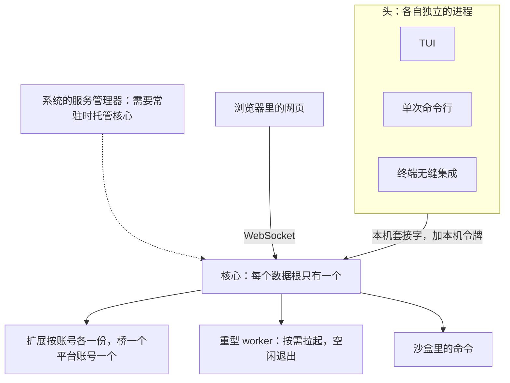
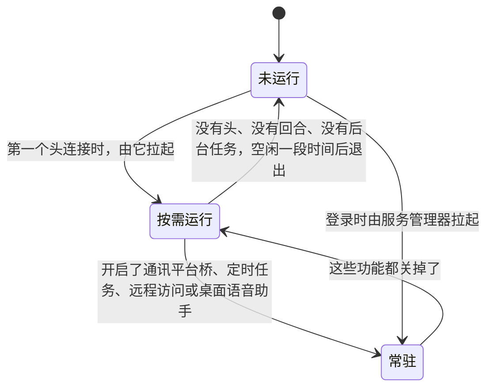
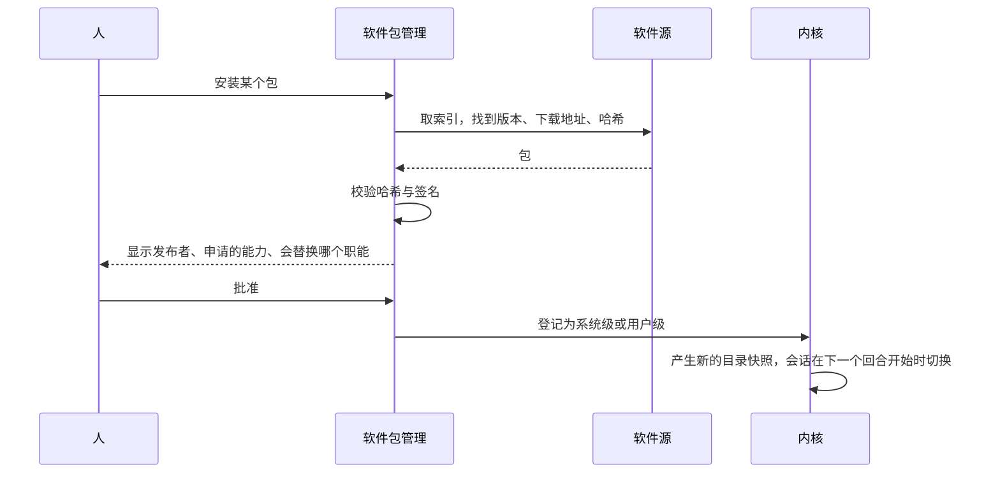

## 进程形态与分发（草案）

状态：R1 到 R14 已定（2026-09-25）。其余内容为草案。

### 一、有哪些进程

- **核心**：每个数据根只有一个（`07-存储.md` 第十节）。
- **头**：各自独立的进程，通过核心协议连接核心（`04-核心协议.md`）。网页头的页面由核心顺带提供（`04-核心协议.md` P5）。
- **核心的子进程**：扩展（每个账号各一份，`06-多用户与身份.md` U3）、桥（一个平台账号一个，属于接入它的管理员）、重型 worker、沙盒里的命令。

**子进程随核心退出，按进程树管理，不按名字杀（R5）**：

| 平台 | 核心退出时，怎么保证子进程也退出 |
|---|---|
| Linux | 子进程设置“父进程死亡时收到信号”，并放进自己的进程组 |
| macOS | 没有同样的机制。子进程监听一条来自核心的管道，管道断开就自己退出 |
| Windows | 子进程放进一个作业对象，作业对象设置为“句柄关闭时结束全部进程” |

- 结束子进程时，只结束核心自己记录在案的那棵进程树。绝不按进程名去结束进程：同名的进程可能属于别人。旧版就出过“按名字结束进程，结果把自己也结束了”的事故。
- 子进程崩溃后按退避重启，连续失败就停下，并在界面上说明（`05-内核接口.md` 第九节）。

### 二、核心什么时候运行

- **按需运行，这是默认（R1）**：第一个头连接时，由它拉起核心（`01-架构.md` D2）。没有头连着，也没有正在进行的回合和后台任务，空闲一段时间后核心自己退出。一个人偶尔用用的时候，不用它时它就不在，符合“低占用”。
- **拉起时的握手**（参考 jcode，2026-09-25 补）：头先拿一把拉起锁，免得几个头同时拉起好几个核心；清掉残留的旧套接字；把一根管道的写端交给核心。核心先 bind 好套接字、能接受连接了，就往管道里写一个字节，恢复会话、回收 blob 这类重活放到这之后。头等这个字节，不轮询。
- **常驻**：有功能需要核心一直在，例如通讯平台桥、定时任务、远程访问、桌面语音助手，核心就不退出。开启这些功能时，Miyu 提议把核心登记为登录时自动启动的服务，由系统的服务管理器托管：

  | 平台 | 登录时自动启动 | 开机后无人登录也运行 |
  |---|---|---|
  | Linux | systemd 用户服务 | systemd 用户服务，加上 `loginctl enable-linger` |
  | macOS | launchd 的 LaunchAgent | 第一版不支持 |
  | Windows | 当前用户的自启动项（注册表的 Run 键），不需要管理员权限 | 第一版不支持 |

- **崩溃之后**：服务管理器托管的，由它自动重启；按需运行的，下一个头连接时再拉起。全部状态从日志重建，未完成的回合标记为中断（`02-内核.md` 不变量 8）。

### 三、一个主程序

**`miyu` 是一个二进制，像 busybox 那样按子命令分发（R2）**。核心、TUI、单次命令行、终端无缝集成、管理命令、软件包管理都在里面。沙盒助手是一个单独的小程序（`miyu-sandbox`），好让 Ubuntu 上 AppArmor 的特许只给它（`11-权限与沙盒.md` 第六节）。代码上各自是独立的库，分发上合成一个文件（`01-架构.md` 第二节）。

| 命令 | 做什么 |
|---|---|
| `miyu` | 打开 TUI |
| `miyu ask "…"` | 单次对话：打印回复后退出 |
| `miyu status` | 核心的运行状态，相当于 Linux 的 `/proc` |
| `miyu doctor` | 检查这台机器上各项能力是否可用，并说明怎么修（第七节） |
| `miyu pkg …` | 软件包：搜索、安装、停用、卸载、管理软件源 |
| `miyu service install`、`miyu service uninstall` | 把核心登记为登录时自动启动的服务，或撤销登记 |
| `miyu sandbox setup`、`miyu sandbox remove` | 完成或撤销需要管理员权限的沙盒安装 |
| `miyu upgrade` | 升级 Miyu 本身，或者告诉人该用哪个包管理器升级 |
| `miyu shell-init <shell>` | 输出终端无缝集成的脚本（`22-命令行.md` 第七节） |

- 这里只列最常用的几条，全表见 `22-命令行.md` 第五节。
- **对话必须显式（R4）**：只有 `miyu ask` 会把文字发给模型。不认识的子命令直接报错，绝不当成对话发出去。旧版出过这样的事：一条打错的子命令被当成对话，发给了正在运行的核心。
- **单独分发的两类程序**：
  - 桌面程序：第一版不做（2026-09-25 确认），网页已经能替代它。
  - 重型 worker，例如语音、本地 embedding：依赖大，作为二进制软件包按需下载。不用的人不下载，符合“谁用谁付”。
- **资源文件不编进二进制（R3）**：出厂的人格与预设、提示词、网页、字体都放在资源目录里，随安装包一起分发。开发时用环境变量把资源目录指向源码树，改提示词不用重新编译。

资源目录的位置：

| 安装方式 | 程序 | 资源 |
|---|---|---|
| deb、rpm | `/usr/bin/miyu` | `/usr/share/miyu/` |
| AUR | `/usr/bin/miyu` | `/usr/share/miyu/` |
| Homebrew | Homebrew 前缀下的 `bin/miyu` | 同一前缀下的 `share/miyu/` |
| 安装脚本（Linux、macOS） | `~/.local/lib/miyu/miyu`，并在 `~/.local/bin/` 放一个链接 | `~/.local/lib/miyu/resources/` |
| 安装脚本（Windows） | `%LOCALAPPDATA%\Programs\Miyu\miyu.exe` | 同目录下的 `resources\` |

用安装脚本安装时，程序和资源**不放**进数据根 `~/.miyu`（`07-存储.md` 第二节）。程序和用户数据混在一起，备份、搬家、卸载时都会出问题。

### 四、软件包

**软件包 = 一份清单 + 一组文件（R6）**。清单就是 `05-内核接口.md` 里的模块清单。

| 种类 | 例子 |
|---|---|
| 扩展 | 天气、通讯平台桥 |
| 技能包 | 一组 `SKILL.md` |
| 脚本 | 一个或几个脚本工具（`05-内核接口.md` 第四节） |
| 人格包、预设包 | 一个或几个人格或预设（`16-人格与预设.md`） |
| 二进制 worker | 语音、本地 embedding，每个平台一个二进制 |

**软件源**：

- 一个软件源就是一份索引，列出包名、版本、各平台的下载地址和哈希。相当于 apt 的源、Homebrew 的 tap、AUR。
- 官方源的包带签名（ed25519），安装时校验。
- 添加第三方源要人明确表示信任，就像给 apt 加一个新源的密钥。
- 安装之前，界面显示发布者、这个包申请的能力、它会替换哪个职能，由人批准（`05-内核接口.md` I5）。

**系统级与用户级（R7，2026-09-25 确认）**：

- **系统级**：装在系统区，所有账号都可以按权限使用（`06-多用户与身份.md` 第三节）。需要“装软件”能力。
- **用户级**：装在自己的家目录里，只对自己生效，相当于 Linux 用户装到 `~/.local`，不需要 root。每个账号都可以做。
  - 只出现在这个人自己的目录快照里。
  - 在这个人的沙盒里运行（`06-多用户与身份.md` U3、U5）。
  - 能申请的能力，不超过管理员设定的上限。

**职能与替换（R8）**，相当于 Debian 的虚拟包和 `update-alternatives`：

- 包在清单里声明自己提供哪些职能，例如 `editor`：提供 `edit` 工具，并报出 `file.changed` 效果（`10-自带软件.md` 第五节）。
- 同名的工具在一个会话里只能有一个提供者。替换就是停用旧的、启用新的。
- 包可以依赖某个职能，而不是某个具体的包。「职能」这个词只用在这里，免得和角色扮演的「角色」混在一起。
- 停用或卸载某个职能的唯一提供者时，先告诉人哪些功能会变弱，例如“撤销将不可用”“压缩后无法重建工作集”。

**停用与卸载（R9）**：

- 编进核心的自带软件只能停用。停用后不构造，不占内存也不占 CPU。
- 其余的包可以卸载，分两种：保留它的数据；连同它的数据一起删除。相当于 apt 的 `remove` 和 `purge`。
- 无论哪种，日志里它产生过的事件都原样保留，投影时跳过（`03-事件模型.md` E6）。

**锁文件**：记下已装的包、版本和哈希。系统级的是 `system/packages.lock`，用户级的是 `home/<账号>/packages.lock`（`07-存储.md` 第二节）。拿到另一台机器上，可以装出一模一样的环境。

**扩展不自动升级**：新版本可能申请更多的能力，要人重新批准。有新版本时只提醒。

### 五、升级 Miyu 本身

- **谁装的谁升级（R10）**：通过 AUR、Homebrew、deb、rpm 安装的，由对应的包管理器升级，`miyu upgrade` 只告诉人该用哪条命令。通过安装脚本安装的，`miyu upgrade` 自己下载、校验、替换。
- **升级之后**：头发现核心比自己旧，就请求核心在空闲时重启（`04-核心协议.md` 第八节）。正在进行的回合不打断。
- **数据不需要迁移**（`07-存储.md` S7）。降级之后，旧版本也读得懂新版本写下的日志：不认识的字段和事件原样保留（`03-事件模型.md` 第八节）。

### 六、各平台的安装

平台与架构（R11，2026-09-25 确认）：

| 平台 | 架构 |
|---|---|
| Linux | x86_64、arm64。以 glibc 2.39 为基线，这是 Ubuntu 24.04 的版本，在它上面构建，更新的发行版都能运行 |
| macOS | arm64（Apple 芯片） |
| Windows | x64。高通芯片的 Windows 笔记本，靠系统自带的模拟运行 x64 版本 |

安装渠道（R12，2026-09-25 确认）：

| 平台 | 渠道 | 额外要做的事 |
|---|---|---|
| Arch | AUR | 无 |
| Debian、Ubuntu、Mint | deb，随 GitHub Releases 发布 | Ubuntu 与 Mint 的包附带 AppArmor 配置，安装时自动生效（`11-权限与沙盒.md` A7） |
| Fedora | rpm，随 GitHub Releases 发布 | 无 |
| macOS | Homebrew 的 tap | 无，Seatbelt 不需要设置 |
| 全部平台 | 安装脚本，从 GitHub Releases 下载 | 见下 |

- **安装脚本**：Linux 与 macOS 用一行 `curl … | sh`，Windows 用一行 PowerShell。都装在当前用户的目录里，不需要管理员权限。
- **需要一次管理员权限的沙盒安装**，由 `miyu sandbox setup` 完成：
  - Windows：创建沙盒用户和防火墙规则（`11-权限与沙盒.md` A3）。安装脚本装完会问要不要现在就做。以后第一次需要沙盒时，如果还没做，也会再问一次。
  - Ubuntu 与 Mint 上用安装脚本安装的：安装 AppArmor 配置。deb 包已经自带，不需要这一步。
  - 不做这一步：Windows 上这台机器就没有沙盒，按 `11-权限与沙盒.md` 第二节降级；Ubuntu 与 Mint 上文件照样由 Landlock 隔离，只是沙盒里的网络全关，按 `11-权限与沙盒.md` A7。
- **卸载时清理**：Windows 上要执行 `miyu sandbox remove`，删除沙盒用户和防火墙规则，同样需要一次管理员权限。
- deb、rpm 只随 GitHub Releases 发布，不建 apt、dnf 软件仓库（2026-09-25 项目主人确认：没有必要）。

### 七、首次运行与自检

**开箱即用**：第一次打开时只问两件事：用哪个模型（填密钥，或者登录已有的订阅），选哪个人格（出厂的是 Miyu 和软件工程师）。其余全部用默认值。不管从哪个头第一次打开，都是这两件事。成员第一次登录时，多写一段「希望 AI 怎么认识你」（`06-多用户与身份.md` 第六节）。终端界面第一次启动时还会问一次看不看得到图标，那是这个头自己的显示设置（`13-终端界面.md` H10），不算在里面。

**`miyu doctor`（R13）**：逐项检查这台机器，每一项都说清楚“是什么、为什么、怎么修”：

- 沙盒能不能用：Landlock 的版本、能不能创建命名空间、AppArmor 配置装没装、Windows 的沙盒安装有没有完成
- 数据根的权限对不对
- 核心和头的版本是否一致
- 模型能不能连通

### 八、构建与发布

- **三个平台的持续集成，从第一个提交就开始**（`00-设计理念.md` 跨平台）。
- **发布前检查安装包（R14）**：资源文件是否齐全；运行包里的二进制，确认它报出的版本号正确。旧版就发布过漏了资源文件的包。
- 每次发布都附带校验和与签名。

### 九、决定

**R1. 核心什么时候运行**

- **已定：默认按需运行，空闲退出；开启需要常驻的功能时，登记为登录时启动的服务，由系统的服务管理器托管。**
- 未选：安装后一直常驻。偶尔用的人，也要一直为它付出内存。
- 重开条件：实测按需拉起的延迟可以被人感知。

**R2. 程序的形态**

- **已定：一个 `miyu` 主程序，按子命令分发；重型 worker 单独分发；沙盒助手是单独的小程序；桌面程序第一版不做。**
- 未选：每个组件一个二进制。安装、升级、版本对齐都更麻烦。
- 重开条件：主程序的体积明显违反“轻量”。

**R3. 资源文件放在哪里**

- **已定：不编进二进制，放在资源目录里随包分发；开发时可以指向源码树；用户级安装时，程序与资源不放进数据根。**
- 未选：编进二进制。每改一句提示词都要重新编译，旧版就是这样。
- 重开条件：无。

**R4. 命令行怎么对话**

- **已定：只有 `miyu ask` 发起对话；不认识的子命令直接报错。**
- 未选：`miyu "问题"` 这种隐式的写法。打错的子命令会被当成对话发出去。
- 重开条件：无。

**R5. 子进程怎么管理**

- **已定：子进程随核心退出；只按核心记录的进程树结束进程，绝不按名字。**
- 重开条件：无。

**R6. 软件包与软件源**

- **已定：软件包是清单加文件；软件源是一份索引；官方源签名，第三方源要人明确信任；安装前显示申请的能力。**
- 重开条件：无。

**R7. 谁能装软件**

- **已定：系统级安装需要“装软件”能力；每个账号都可以做用户级安装，只对自己生效，在自己的沙盒里运行，能力不超过管理员的上限（2026-09-25 确认）。**
- 重开条件：用户级安装带来无法用沙盒控制的风险。

**R8. 替换与依赖**

- **已定：按职能替换，同名工具只能有一个提供者；依赖职能而不是具体的包；卸载唯一提供者前说明哪些功能会变弱。**
- 重开条件：无。

**R9. 卸载**

- **已定：自带软件只能停用；其余的包卸载时，可以选保留数据或连数据一起删除；日志里的事件永远保留。**
- 重开条件：无。

**R10. 升级**

- **已定：谁装的谁升级；核心在空闲时重启；扩展不自动升级。**
- 重开条件：无。

**R11. 平台与架构**

- **已定：Linux x86_64 与 arm64（glibc 2.39 基线），macOS arm64，Windows x64（2026-09-25 确认）。**
- 重开条件：出现 Windows arm64 用户明显的需求。

**R12. 安装渠道**

- **已定：安装脚本加 GitHub Releases、AUR、Homebrew、deb、rpm（2026-09-25 确认）。Windows 用安装脚本安装。**
- 未选：自建 apt、dnf 软件仓库。项目主人（2026-09-25）：没有必要，GitHub 发 Release 就行。
- 重开条件：出现某个渠道的明显需求，例如 winget。

**R13. 自检**

- **已定：`miyu doctor` 逐项检查各项能力，每一项都说清怎么修。**
- 重开条件：无。

**R14. 发布前检查**

- **已定：检查资源文件是否齐全，运行包里的二进制确认版本号。**
- 重开条件：无。

**后续再定**

- macOS 与 Windows 的代码签名：有需要时再定
- macOS、Windows 上开机后无人登录也运行：有需求时再做
