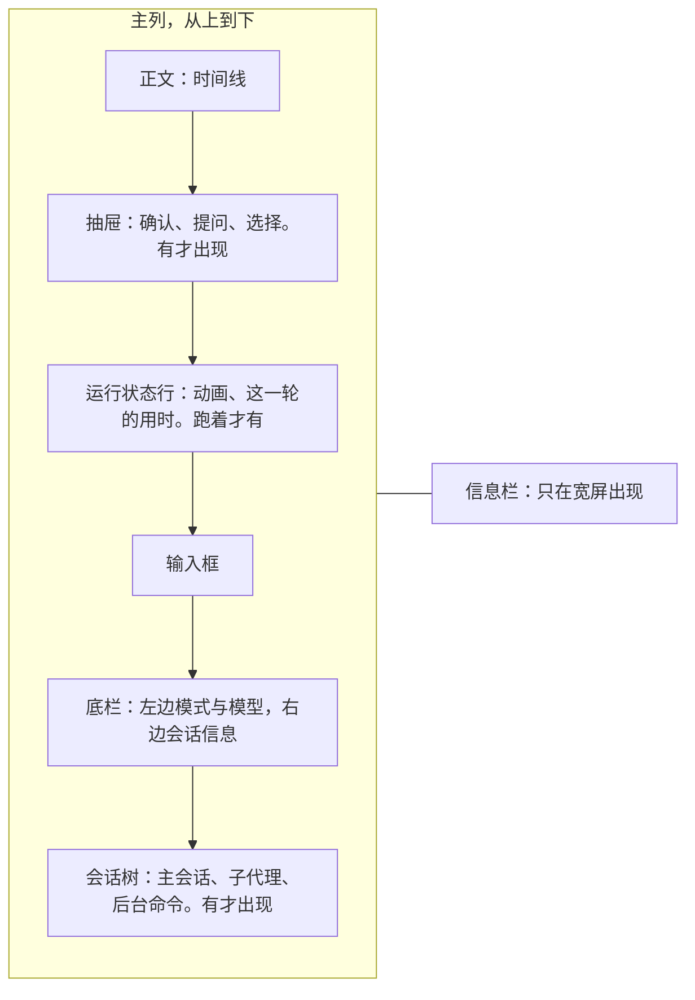

## 终端界面（草案）

状态：H1 到 H14 已定（H1 到 H10 于 2026-09-25，H11 到 H14 于 2026-09-26；H5、H7 于 2026-09-26 改）。其余内容为草案。

效果图在作者私有的 claude.ai 画布上（最上面两排「定稿」），读者看不到，现在由演示程序代替（`README.md` 第二轮细纲一节）。下文的「图 F1」「图 J1」指画布上的图，和各文档的决定编号不是一回事。

能跑的演示程序在本地的 `prototypes/tui-demo/`，还没进仓库（2026-09-26，项目主人：「比起用 artifact，一个 demo 程序也许更直观」）。会话树、切换时输入框里的字跟着走、`Shift+Tab` 开关只读、运行状态行、底栏、确认抽屉、工具设置页都能直接试，数据是假的。画布上的图是 09-25 画的；会话树、运行状态行和底栏，以演示程序为准。

### 一、它是什么

- 终端界面（TUI）是一个头：连上核心，订阅一个会话的视图流，把条目画出来，把按键变成命令（`01-架构.md` 第五节）。
- 它不写业务逻辑。显示哪些条目、条目里写什么字、哪些默认收起，都由核心的视图投影决定，终端界面只决定怎么画（`04-核心协议.md` P3）。
- 全屏运行（H1）。住在 shell 里、随手问一句的场合，归另一个头「终端无缝集成」，另写一份。
- **样子的三个来源**（项目主人 2026-09-26 说清的）：
  - 外观就是 Miyu 现在的样子：输入框左边一根竖线，底栏左边是模式和模型，右边是会话信息（第八节）；
  - 交互取 Claude Code 的会话树：子代理一行一行列着，秒切过去，还能跟它说话（第五节、第七节）；
  - 输出用 Miyu 的时间线和收起式输出，不照搬 Claude Code 的。要显示图片和 mermaid，所以全屏，滚动和回放自己做（第三节、第九节）。
- 同一个会话可以同时开几个终端界面，像 tmux 的多个客户端。各自的焦点和展开状态留在各自那里，不回传核心。

### 二、界面分区



- **宽屏（终端不少于 120 列）**：主列右边加信息栏，放会话标题、回合数与用时、待办、改动的文件（图 F1）。上下文用量在底栏右边，这里不重复。
- **窄屏**：没有信息栏，只把待办进度收进底栏（图 F2）；会话标题、回合数与用时、改动的文件，窄屏时不显示（照演示程序，2026-09-26 补）。
- 正文以外的几块都贴着屏幕底部。抽屉和会话树出现时，正文往上推，不盖住正文（H4）。
- 运行状态行紧贴着输入框。抽屉开着时也一样，抽屉出现在它的上方。

### 三、时间线

沿用旧版的样子（H3）。规则如下：

1. **一步一行**：`图标 显示名 · 用时 · 对象`，整行暗色，太长就截掉，不折行。用时紧跟在显示名后面，不推到最右边（照旧版，2026-09-26 项目主人拿截图对过）。
2. **每一步前面一行连接线**：竖线 `│` 和步骤的图标在同一列，单独占一行，展开时从第一步前面就开始。步骤的正文（命令原文、输出、diff）挂在那一步下面，前面加 `│ `，竖线穿过去。
3. **说话就收起**：一段步骤之后，AI 开口说话，这段步骤就收成一行。收起时行首是 `›`，展开时是 `⌄`。正在进行的那一段不收。
4. **收缩行永远用英文**：跑过命令时以 `Ran 2 commands` 开头，用时挂在最后；没跑命令时以 `Worked for 12s` 开头；只想过的是 `Thought for 3s`。中间依次是 edits、tools、thoughts、err。用英文是为了和中文正文区分开（2026-09-25 确认）。
5. **思考**：进行中是「思考中 · token 数 · 用时」，下面滚动显示最后几行。结束后收成一行：`已思考 · 50 词元 · 7.3s`，暗色。
6. **失败**：整行变红，连接行的颜色不变。
7. **用户的消息**框在一根 `┃` 里，上下各多一行竖线，颜色跟着预设（开发是品红）。AI 的正文平铺，不加框。
8. **通知**：后台任务结束、子代理回报、发生了压缩、换了模型，都是一行：铃铛图标加一句话。
9. **图标**用 Nerd Font，每类工具一个。没有 Nerd Font 时只用 `$`、`?`、`⚙` 三个符号。

| 核心的视图投影决定 | 终端界面决定 |
|---|---|
| 条目的种类与状态；显示名、一句话摘要、收缩行的文字 | 图标、连接行、颜色、折行 |
| 哪些默认收起，包括「说话就收起」这条规则。旧版在终端、网页、子代理三处各写了一份 | 人手动展开、收起 |

### 四、确认、提问和选择：抽屉

- 需要人回应的东西都用抽屉（H4）：权限确认、模型的提问（`ask_user`）、`/models` 这类选择。抽屉画在输入框里，照旧版的提问面板：每一行前面是输入框那根竖线，几道题时顶上一排标签，问题加粗，每个选项一行标题一行暗色说明，选中的那项用预设的颜色，最下面一行按键提示。输入框往上长，把正文往上推（2026-09-26 项目主人拿截图对过）。
- 抽屉打开时焦点在抽屉里：`↑` `↓` 选，`Enter` 确定。抽屉最高占半屏，内容多了在抽屉里滚动。
- `Esc` 收起抽屉，但不作答。这一步在时间线上显示「等你确认」，焦点移到它上面按 `Enter`，抽屉重新打开。
- 几个头同时开着同一个会话时，先答者胜（`04-核心协议.md` 第六节）。其余头上的抽屉自动收起，时间线上写明是谁答的。
- 子代理和后台命令要确认时用同一个抽屉，标题写明是谁在问。
- **切进一个在等你确认的会话，确认抽屉自己打开**；`Esc` 收起以后，不再自己弹出来（照演示程序，2026-09-26 补）。

### 五、子代理

- **子代理都在后台跑**（H5，`02-内核.md` 第七节）。时间线里是派出去的那一步（图 F4）：一行写任务、状态和用时，下面一行是它最新的一步；展开后是它自己的时间线，往里缩一级。它回报了，时间线里出一条通知。它还在跑，会话树里就有它一行（第七节）。
- **切进子会话**：在会话树里选中它按 `Enter`，或者在时间线里那一步上按 `Enter`、点它（图 F5）。顶上两行写明从哪来、它是谁：`↑ 主会话 · 标题` 和 `子代理 · 任务 · 状态 · 模型挡位`。`Esc` 回主会话。
- **切换下一帧就画完**（`23-性能预算.md`）。终端界面订阅着会话树里每个会话的视图，切过去只是换一份来画，不用再向核心要。
- **输入框跟着人走**：输入框属于这个终端界面，不属于哪个会话。打了一半的字，切过去还在（项目主人 2026-09-26：「输入框内容在切换时也会带过去」）。
- **跟子代理说话**：切进去以后，输入框里的话发给它。它还在跑，就在下一步看到；做完了，就另起一轮。
  - 这些话记成你发的；父会话用 `message_agent` 留的言，记成另一个会话发的（`03-事件模型.md` 的 `by`）。
  - 你在子会话里自己开的那一轮，结束时不回报给父会话，你就在旁边看着；这一轮里进过父会话的留言的除外（`02-内核.md` 第七节）。

### 六、焦点与按键

焦点可以移动（H6）。焦点落在哪一块，按键就归哪一块（图 F6）。

| 焦点 | 按键 |
|---|---|
| 任何地方 | `Tab` 在输入框、正文、会话树之间移动焦点。打字时焦点自动回到输入框。`Shift+Tab` 开关只读（H11） |
| 输入框 | `Enter` 发送。输入 `/` 时，`Tab` 先用来补全命令。在第一行按 `↑`、在最后一行按 `↓` 翻输入历史；翻到最新一条再按 `↓`，进入会话树 |
| 正文 | `↑` `↓` 在步骤间移动，`Enter` 展开或收起，`c` 复制，`f` 从这里分叉 |
| 会话树 | `↑` `↓` 选一行，`Enter` 切过去（后台命令是整屏看输出），`x` 停止 |
| 抽屉 | `↑` `↓` 选，`Enter` 确定 |

- `Esc` 由近及远，每按一次关掉一层：抽屉，焦点回到输入框，退出子会话。什么都没开时，才打断正在进行的回合。打断的只是你正在看的这个会话，子代理照常跑。
- 鼠标：可点的行在悬停时提亮，点击展开或打开，滚轮翻正文。拖动选中文字，复制的内容不带左侧的 `┃`。
- 焦点离开输入框时，输入框前面的 `┃` 变暗，底栏最左边写明焦点在哪。
- **权限级别也有命令**：`/readonly` 开关只读，和 `Shift+Tab` 一样；`/level workspace`、`/level full` 改常用的那一级，改成完全放开时先确认一次（`11-权限与沙盒.md` 第二节，2026-09-26 补）。

### 七、会话树与后台任务

有子代理或后台命令在跑时，底栏下方出现一棵会话树（H7）。样子照 Claude Code 的后台代理状态行（项目主人 2026-09-26 给了两张截图）。在主会话里看是这样：

```text
● 主会话
○ 查旧版缓存（+2）  等子代理回报…                     35m 38s · Σ576.3k
○ 找主题映射        读 v1-migrate.ts 的主题映射…      3m 56s · Σ260.7k
```

切进第一个子代理以后：

```text
○ 主会话
● 查旧版缓存        翻子代理的记录…                   38m 35s · Σ577.5k
  ├ ○ 查插件设置    回答 RealContextPluginSet…        25m 55s · Σ417.3k
  └ ○ 查注入        追 one_shot 里的 context.notice…  25m 25s · Σ431.4k
○ 找主题映射        列仓库里的截图文件…               6m 52s · Σ331.9k
```

- **最上面一行是主会话。** 你正在看的会话前面是实心圆 `●`，其余是空心圆 `○`。
- **往里缩两格**，和底栏的字对齐（项目主人：「左侧有合理的缩进」）。
- **颜色**：各行默认暗色；你正在看的那一行亮，焦点在会话树里时改成选中的那一行亮（2026-09-26 项目主人：「状态行应该是暗色，选中项是亮的」）。
- **主会话派出去的子代理、放到后台的命令**，各占一行，和主会话左对齐。
- **更深的一层**，也就是孙代理和子代理放到后台的命令，平时收成父亲那一行后面的「（+x）」。切进那个子代理时，它们在它下面展开，用 `├` `└` 连着，往里缩一级。
- **每行**：圆点、名字、（+x）、正在做什么、用时、用掉的 token。
  - 名字是派它时给的短标题。
  - 正在做什么，是它最新一步的一句话摘要，放不下就截断，加 `…`。
  - 名字和正在做什么各对齐成一列。
- **最多 5 行，不算主会话那一行**（2026-09-26 项目主人定）。多出来的收成一行「还有 N 个 · ↓ 查看全部」，这一行不算在 5 行里（照演示程序，2026-09-26 补）。焦点进来时列出全部。
- **等你确认的标黄**，写明要确认什么，不会被收进「还有 N 个」：在等的多了，超过 5 行也照样列出（照演示程序，2026-09-26 补）。它被收在（+x）里时，父亲那一行标黄，写明有几个在等你。
- **打开**：子代理切进子会话（第五节）；后台命令整屏看输出（H8，图 J3），`x` 停止，`Esc` 回来；等你确认的打开确认抽屉。
- **结束时**：那一行消失，时间线里出一条通知，例如「命令完成 · 标题 · 用时」，失败时是红色的「命令失败 · 标题 · 退出码」。终端不在前台时弹系统通知。子代理的回报怎么交给父会话，见 `02-内核.md` 第七节。
- **数据从哪来**：核心推送的会话状态里带着后台任务表，每一项写明父亲是谁（H9，`04-核心协议.md` 第五节）。终端界面照它画，不轮询。
- **停止**是发给核心的一条命令，和终端界面当时在做什么无关。旧版的回合循环不看停止标记，AI 说话时按 `x` 停不掉。

### 八、运行状态行与底栏

- **输入框**上下各留一行竖线：空行、输入行、空行，然后是底栏，竖线一直连到底栏（照旧版）。
- **运行状态行**就画在输入框最上面那一行里：竖线后面一段一直在动的动画，右边是这一轮的总用时，写法照旧版，例如 `12s`、`1m 05s`、`1h 02m 05s`（H12）。
  - 从这一轮开始动到这一轮结束，等工具、等你确认时也不停。空闲时不显示。
  - 重试这类临时的状态提示（`status` 事件，`03-事件模型.md` 第三节），跟在用时后面，过了就消失。
  - 动画的样子出图时定。
- **底栏左边**是模式、模型和供应商，例如 `功能全开 · deepseek-v4.1-flash opencodego`（H13）。
  - 模式就是这个会话的预设，用预设的颜色，和输入框左边那根竖线同色。
  - 只读、完全放开时，级别的名字顶替模式的名字。旧版的只读就是这样。
- **底栏右边**是会话信息：上下文用了多少、窗口多大、占几成，加上累计用掉的 token 和缓存命中率，例如 `41.1k/1M(4.1%) · Σ1.4M(C89%)`。
  - 一行放不下时，照旧版的顺序往下丢，上下文用量留到最后。
  - 窄屏再把待办进度收进来。
- 这些文字都来自核心推送的会话状态（`04-核心协议.md` P3）。

### 九、形态与性能

- **全屏**（H1）：程序自己管回翻、选区和复制。复制走 OSC 52，不依赖终端自己的选区。
- **只重画变了的行**，空闲时不重画。每一帧用同步输出包起来，支持的终端不会闪。重画由事件驱动，空闲时的心跳分几档放慢；转轮、动画只改它们自己那一两格（参考 jcode，2026-09-25 补）。
- **先画后连**：启动时先把界面画出来、能打字，同时去连核心；连上之前打的字照常显示，回车后排队，连上再发。查终端背景色这类要等回应的查询，和建连并行做。
- **图片**：认得 kitty、sixel、iTerm2 三种图片协议之一的终端直接显示，图片随正文滚动；其余终端显示文字占位。头在握手时声明自己能不能显示图片（`04-核心协议.md` 第五节）。
- **mermaid 也显示成图**（项目主人 2026-09-26）。旧版和 jcode 都是渲染成图片，不是用字符画，用的还是同一个纯 Rust 的库 mermaid-rs-renderer（它的作者就是 jcode 的作者）。SVG 由核心出，终端界面经 `view.detail` 取来，自己栅格化（`04-核心协议.md` 第五节，2026-09-26 补）。照旧版磨出来的三条规矩：
  - 先算出图要占几格、乘出像素数，用 resvg 一次渲到那个尺寸，不再缩放。旧版先出自然尺寸再缩，字糊成一团。
  - 不为塞进一屏而缩小，高的图就占几屏，只限宽度。
  - 核心出的 SVG 按「源码加尺寸」的哈希缓存在磁盘上。取图和栅格化放在后台线程，先画占位，渲好再换上：一张 24 个节点的图，旧版实测 139 ms，放进一帧就卡了。
- **图片协议认 kitty、sixel、iTerm2 三种**，都在进程里编码（jcode 用 ratatui-image 这样做）。旧版只直接认 kitty，其余终端靠外面装的 chafa 起子进程。三种都不认的终端显示源码，不用半格字符拼图：那样拼出来的图，字认不出来。网页直接用核心出的 SVG（`04-核心协议.md` 第五节），不另带 mermaid.js。
- **宽度变了就重新折行。** 折好的行按宽度和显示开关缓存，只画视口里看得见的那一段。
- **内存**：界面自身以 MB 计。旧版的全屏演示在 110×32 的终端里放五条长回复，实测不到 4MB。
- **三个平台**：Linux 和 macOS 的常见终端；Windows 以 Windows Terminal 为准。终端不支持的能力（鼠标、同步输出、图片）逐项降级。

### 十、沿用旧版的细节

下面这些是旧版磨出来的细节。按约定（`README.md`），旧版的产品口径要重新确认：2026-09-25 确认全部沿用（H10）。

| 细节 | 旧版的做法 |
|---|---|
| 输入框上方的浮动内容 | 命令列表、复制提示这类浮动内容，不加左侧的 `┃` |
| 斜杠命令列表 | 输入 `/` 时锚在输入框上方，只占 4 行，边打边筛，不写按键说明 |
| 粘贴与图片 | 大段粘贴和图片在输入框里显示成占位符，例如 `[粘贴 1: ~120 行]`、`[Image 1: 截图.png]`，洋红色，整块跳过、整块删除 |
| 复制提示 | 输入框上方一个绿色细边框的小盒子，2.5 秒后消失 |
| 空会话的开场 | 星空动画、标志和一句开场白 |
| `Esc` 的顺序 | 由近及远一层层关，什么都没开时才打断回合。第六节已经按这个写 |
| 系统通知 | 终端不在前台时，回合结束、等你确认都弹通知并响一声；在 herdr 里由 herdr 来响 |
| 没有 Nerd Font | 只用 `$`、`?`、`⚙` 三个符号。新增一条提议：第一次启动时显示一个图标，问看到的是图标还是方块，记进设置 |

### 十一、决定

**H1. 全屏，还是跟着 shell 滚动**

- **已定：全屏。** 程序自己管回翻、选区和复制，抽屉、焦点移动、鼠标悬停才好做。旧版从 2026-09-11 起就是全屏。项目主人 2026-09-26 再次确认：要显示图片和 mermaid，全屏、自己做滚动和回放更好。
- 未选：跟着 shell 滚动（旧版最早的形态）。终端原生的回翻和复制能用，但每一块浮动界面都要按行号自己记账，旧版在这上面反复出过残影和错位。随手问一句的场合，由终端无缝集成这个头负责。
- 重开条件：出现全屏做不到、跟着 shell 滚动能做到的需求。

**H2. 布局**

- **已定：宽屏右侧加信息栏，窄屏只把待办进度收进底栏（图 A2 与 A1，2026-09-25 确认）。宽窄的分界是 120 列。**
- 未选：只做单栏，或者只做带信息栏的。
- 重开条件：120 列的分界在常见的终端尺寸下不合适。

**H3. 时间线**

- **已定：沿用旧版的样子，步骤之间有连接行，收缩行用英文（图 T1，2026-09-25 确认）。** 项目主人的理由：去掉连接行「会很拥挤」；收缩行用英文「和中文有区分」。
- 未选 A：去掉连接行（图 T2）。每段步骤能省三成的行。
- 未选 B：收缩行跟随界面语言（图 T3）。
- 重开条件：实际用下来，长回合里一屏看不到足够的内容。

**H4. 浮层**

- **已定：抽屉，出现在输入框上方，把正文往上推（图 B2，2026-09-25 确认）。确认、提问、选择都用它。**
- 未选 A：浮层盖在输入框上方（图 B1）。最新的输出就在输入框上面，盖住的正好是它。
- 未选 B：右侧抽屉（图 B3）。窄屏放不下，视线还要横着跳。
- 重开条件：矮终端里抽屉把正文挤得看不见。

**H5. 子代理**

- **已定：时间线里一张卡片，要细看时切进子会话（图 D2 加 D1，2026-09-25 确认）。子代理都在后台跑；切换下一帧画完，输入框里的字跟着过去（2026-09-26 项目主人定）。**
- 未选 A：分屏并排（图 D3）。终端的宽度装不下两份时间线。
- 未选 B：前台子代理，父会话停下来等它做完（第一轮的写法）。等的时候主会话被堵住，见 `02-内核.md` 第七节。
- 重开条件：常见场景里需要同时盯着两个子代理。

**H6. 焦点**

- **已定：焦点可以移动（图 E2，2026-09-25 确认）。**
- 未选：焦点固定在输入框（图 E1）。正文里的步骤和后台任务行只能靠鼠标。旧版的后台任务行就只能用鼠标点开。
- 重开条件：焦点移动带来的误操作，比它省下的操作还多。

**H7. 会话树**

- **已定：底栏下方一棵会话树，照 Claude Code 的后台代理状态行。主会话在最上面；当前的是实心圆，其余是空心圆；更深一层收成「（+x）」，切进去才展开；最多 5 行，不算主会话；等你确认的标黄，不被收起（2026-09-26 项目主人定）。** 样子以演示程序为准（本文开头），画布上的图 J1 是上一版。
- 未选 A：逐条平铺，最多 3 条，等你确认的排最前（2026-09-25 的定论，图 J1）。看不出谁是谁派的，一展开孙代理就放不下。
- 未选 B：一行汇总，要看再展开（图 J2）。永远只占一行，但看不出谁在跑，要确认什么也写不下。
- 重开条件：常见场景里 5 行不够用。

**H8. 打开一条后台命令**

- **已定：整屏看输出，和切进子会话一个样子（图 J3）。** 命令的输出往往很长，抽屉装不下。
- 未选：在抽屉里显示输出的最后几行。
- 重开条件：多数后台命令的输出短到抽屉就够。

**H9. 后台任务表从哪来**

- **已定：核心在会话状态里推送后台任务表，头不轮询。停止任务是 `job.stop` 命令。**
- 未选：头定时去拉。旧版每秒拉一次，新开终端或换会话时会先闪出别的会话的任务，数字也慢一拍。
- 重开条件：无。推送是协议本来的形态（`04-核心协议.md` 第五节）。

**H10. 旧版的细节**

- **已定：第十节列的八条全部沿用，包括新提议的「第一次启动时问看不看得到图标」（2026-09-25 确认）。** 项目主人：「就先这样吧。反正头是可以换的，如果设计的不好大不了后期直接重新做。」
- 重开条件：用下来哪一条不顺手。

**H11. 权限级别的按键**

- **已定：`Shift+Tab` 开关只读；常用的那一级（工作区或完全放开）用 `/level` 命令或设置改；会话的模式由预设定，没有切换的键（2026-09-26 项目主人定）。** 项目主人：开了完全放开的人，多半一直用它，只需要在只读和它之间切。
- 未选 A：`Tab` 开关只读、`Shift+Tab` 轮换别的级别。`Tab` 要留给焦点移动（H6）。
- 未选 B：`Shift+Tab` 轮换全部级别。最常用的来回要多按几下，还要经过完全放开的确认。
- 重开条件：常见场景里要频繁换常用的那一级。

**H12. 运行状态行**

- **已定：紧贴在输入框左上角，一段一直在动的动画，右边是这一轮的总用时（2026-09-26 项目主人定）。** 正在做什么不写：时间线最下面那一步、会话树已经写了。
- 未选：写上正在做什么，例如「等子代理 · 1m20s」，和输入框隔一行（第一轮的写法）。
- 重开条件：常见场景里看不出她在干什么。

**H13. 底栏**

- **已定：左边是模式、模型和供应商，只读和完全放开顶替模式的名字；右边是会话信息：上下文用量、累计的 token 和缓存命中率（2026-09-26 项目主人定：「opencode 的样式，指的其实就是 Miyu 现在这样的效果」）。**
- 未选：右边放声波（第一轮的写法）。动画挪到了运行状态行。
- 重开条件：无。

**H14. 不做 `@` 选文件**

- **已定：输入框里不做 `@` 选文件（2026-09-26 项目主人定：「没必要做」）。要给她文件，写路径或者粘贴。**
- 重开条件：常见场景里写路径明显不顺手。

**后续再定**

- 主题：核心按一个种子色生成整套语义色（`04-核心协议.md` P3），终端里怎么映射成 256 色和真彩色
- 设置页：照 `14-配置.md` 第九节，按配置清单画，具体样子另出图
- 会话树、运行状态行、底栏和工具设置页（`25-工具加载.md` 第六节）的效果图：已由演示程序代替，见本文开头
- 运行状态行的动画：出图时定
- 大的 mermaid 图能不能钉在信息栏里看：jcode 有这个做法，出图时一起看
- 终端无缝集成、单次命令行、网页：已定，见 `21-网页.md`、`22-命令行.md`
