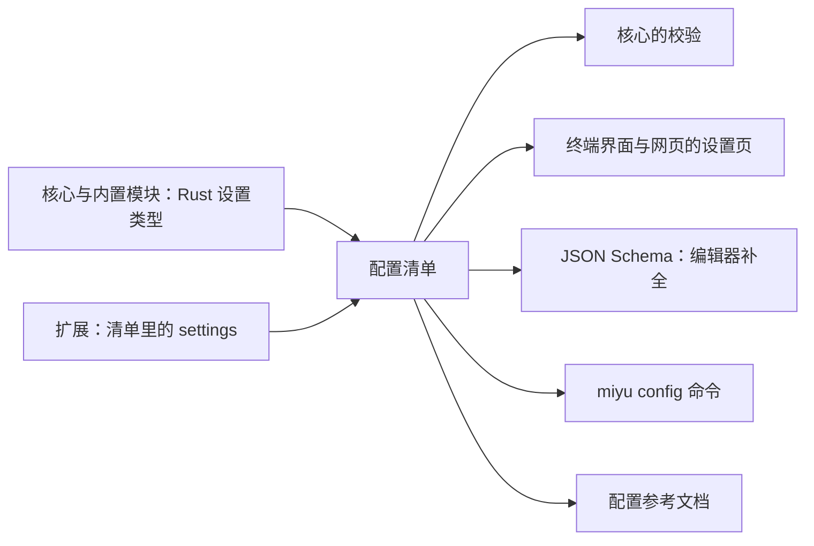
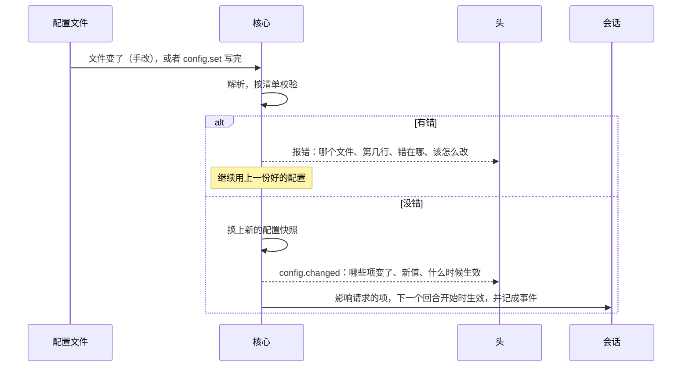

## 配置（草案）

状态：G1 到 G10 已定（2026-09-25；G7 于 2026-09-26 改）。其余内容为草案。

「无硬编码」原则（`00-设计理念.md` 第六节）落在这里。手改文件、命令行、终端界面、网页，是四种编辑配置的方式，都是头的事。配置本身，也就是有哪些配置项、存在哪、谁能改、什么时候生效、写错了怎么办，是核心的事。本文讲后者。

### 一、配置是什么，不是什么

| 东西 | 例子 | 住在哪 | 怎么改 |
|---|---|---|---|
| **配置** | 默认模型、界面语言、启用哪些功能、放行的网站 | 人手写的 TOML 文件（`07-存储.md` S9） | 手改文件，或者经核心改 |
| 会话里的选择 | 这个会话用哪个人格、哪个预设（开始时定，之后不换）、哪个模型、哪个权限级别 | 会话日志里的事件 | `session.create`、`session.configure`、`session.set_permission_level`（`04-核心协议.md` 第九节） |
| 内容 | 人格里的人设、示范对话、角色扮演提示、开场白；「希望 AI 怎么认识你」 | 各自的文件 | 编辑器，或者专门的界面 |
| 密钥 | 模型供应商的密钥 | `system/secrets.toml`（`07-存储.md` S8） | 只能写入、替换、删除，不能读回 |

- 配置是默认值和规则，以后的每个会话都照着它来。
- 会话里的选择只管这一个会话，记在日志里，回放时逐字节一样（`02-内核.md` K2）。
- 本文只讲配置。

### 二、一份清单，处处推导

每个配置项只在「配置清单」里声明一次（G1）：

| 字段 | 含义 |
|---|---|
| 键 | 例如 `ui.language`、`models.chat`、`memory.recall_limit`。恒为英文。内置模块用自己的编号做第一段；第三方扩展放在 `ext.<扩展>` 下面，例如 `ext.weather.units` |
| 类型 | 开关、整数、小数、文字、选项、时长、路径、网址、列表、表、对别的东西的引用（例如某个模型）、密钥 |
| 默认值 | 一项都不改时的值，也就是推荐值 |
| 取值范围 | 最小值与最大值、可选的选项、格式 |
| 名字和说明 | 给人看，跟随界面语言，放在代码之外的资源文件里 |
| 能放在哪几层 | 例如界面语言可以放进个人设置，监听端口只能放在系统配置里（第三节） |
| 谁能改 | 本人、管理员，或者持有某项能力的人（`06-多用户与身份.md`） |
| 什么时候生效 | 当场、下一个回合开始时、重启核心（第五节） |
| 界面提示 | 在哪一页哪一组、是不是常用项、用什么控件 |

清单从哪来：

- **核心和内置模块**：写在 Rust 的设置类型上，编译时生成。和协议一样，结构只在 Rust 类型里定义一次（`04-核心协议.md` 第二节）。
- **第三方扩展**：写在扩展清单的 `[settings]` 里（`05-内核接口.md` 第二节）。
- 核心把两者合成一份，和工具目录一起冻结进目录快照（`05-内核接口.md` 第八节）。



为什么非这样不可：旧版的终端设置页是手写的表单，字段靠下标对应；网页的字段表是从终端那边的中文字符串里抽出来的第二份。运行时把 embedding 的配置挪到了全局，两个设置页都还绑着旧字段，于是界面上显示「未配置」。

### 三、分层：一个值从哪来

从下往上，上层覆盖下层（G2）：

| 层 | 住在哪 | 谁写 | 仿 Linux |
|---|---|---|---|
| 默认值 | 配置清单 | 随包发布 | 软件包自带的默认配置 |
| 系统配置 | `system/config.toml` | 管理员 | `/etc` |
| 人格 | 这个会话的人格（`16-人格与预设.md`） | 人格的作者；出厂的用同名覆盖来改 | 软件包放进来的配置片段 |
| 预设 | 这个会话的预设（同上） | 预设的作者；出厂的用同名覆盖来改 | 同上 |
| 个人设置 | `home/<账号>/settings.toml` | 本人 | `~/.config` |
| 项目配置 | 代码仓库里的 `.miyu/config.toml` | 仓库的作者 | 项目里的 `.editorconfig` |
| 会话里临时改的 | 会话日志里的事件 | 本人，经命令 | 命令行参数 |

- **锁**：管理员可以在系统配置里锁住某些项。被锁住的项，系统配置里的值就是最终值，上层写了也不算。界面上显示成只读，写明「管理员锁定」。这是强制策略在配置上的体现（`06-多用户与身份.md`），仿 dconf 的 locks。
- **场所规则不是一层**：`system/venues.d/` 里的规则只给场所配它专属的属性，例如人格、预设、线路规程、限流、睡眠，用同一份配置清单校验（`18-通讯平台.md` 第三节）。场所会话里的其余各项，照样按这七层算：场所配的预设，就是这个会话预设的那一层。
- **跟着人格或预设走的项**：记忆、功能开关、提示词这类项，个人设置里不能全局改，只能改在某个人格或预设上，也就是写一份同名覆盖（`16-人格与预设.md` 第四节）。界面语言这类跟着人走的项，个人设置里改一处，处处生效。
- **最终值按会话算**：同一个人同时开两个会话，人格、预设和项目不同，最终值也可以不同。
- **说得出来源**：每个最终值都知道自己来自哪一层、哪个文件的第几行，像 `git config --show-origin`：

```text
$ miyu config explain models.chat
deepseek-v4      个人设置   home/shorin/settings.toml 第 3 行   ← 生效
claude-sonnet-5  系统配置   system/config.toml 第 12 行
```

**项目配置只认安全的那部分**（G3，2026-09-25 确认）：

- 仓库是别人写的，项目配置不可信。它只能收紧，不能放宽：可以指定默认模型、把权限级别收紧到只读；不能放宽权限级别，不能放行网站和目录，不能启用扩展，不能写任何会执行命令的配置。
- 清单里每一项标明项目配置能不能写，默认不能。
- 第一次在某个仓库里遇到项目配置时，先问你信不信任它。信任按仓库路径和配置内容的哈希记住（`home/<账号>/trust.toml`），内容变了再问一次，像 direnv 的 `direnv allow`。

### 四、写入：只有核心写文件

- 终端界面、网页、命令行都不直接写文件，而是把改动发给核心（`config.set`）。核心校验、写盘、广播（G4）。
- 手改文件是另一条路：核心监视文件，文件变了就重读（第五节）。
- 界面里改一项存一项（G6，2026-09-25 确认）：每一项当场校验、当场写盘。「恢复默认」就是把这一项从这一层删掉。

写盘的规矩（G5）：

1. **只改动那一项**。注释、排版、顺序、不认识的字段原样保留（`07-存储.md` S9）。
2. **先写临时文件，再替换**。写到一半断电，也不会留下半个文件。
3. **顺着符号链接写**。文件是符号链接时，写到它指向的真正文件上，链接本身不动。配置放进 dotfiles 仓库再链接过来，不会被写断。旧版更新 shell 钩子时，就出过「替换文件把符号链接变成了普通文件」的事。
4. **不覆盖手改的内容**。核心记着每个文件读进来时的样子。写之前发现文件被手改过，就先重读、重新校验，再把这一项改上去。
5. **两个头同时改同一项**：`config.set` 带着头读到的版本号。这一项在此期间被别处改过，就拒绝，并告诉头现在的值。
6. **留痕**：谁在什么时候改了哪一项，记进账号日志；改系统配置的，记进系统日志（`07-存储.md` 第二节）。

### 五、读取与生效



- **监视**：Linux 用 inotify，macOS 用 FSEvents，Windows 用 ReadDirectoryChangesW。很多编辑器存盘时是先写新文件再改名，所以核心监视文件所在的目录，按文件名认。
- **生效时机**在清单里逐项标明（G7）：

| 时机 | 例子 | 为什么 |
|---|---|---|
| 当场 | 界面语言、主题、通知 | 只影响显示 |
| 下一个回合开始时 | 模型、人格的提示词、预设的开关、工具描述 | 这些会改变发给模型的内容。统一在回合开始时换，这一回合前后一致，前缀缓存也只失效这一次（`02-内核.md` K3） |
| 重启核心 | 监听地址 | 少数几项。界面上写明「重启核心后生效」，核心空闲时可以自己重启 |

- 正在进行的回合用的是回合开始时冻结的快照，改配置不影响它。
- 界面里改完一项，旁边写明它什么时候生效，不让人猜。

### 六、校验与报错

- **类型、范围、格式、引用都查**。引用是指「默认模型必须是已经配好的某个模型」这类跨项的约束。
- **写错了**：报出文件、行、列，期望什么、收到了什么、该怎么改。键名拼错时，给出最接近的正确键名：

```text
settings.toml 第 7 行：没有 ui.langauge 这一项。是不是想写 ui.language？
```

- **不认识的键**：警告，不算错误，原样保留。新版本写进去的配置，旧版本照样读得进来（`07-存储.md` S7）。
- **改了名的键**：清单里记着旧名字，旧名字继续有效，同时提示新名字。核心不自动改写你的文件。
- **写错不致命**（G8）：文件读不进来时，核心继续用上一份好的配置，所有头都显示这条错误，`miyu doctor` 也会报。核心启动时就读不进来，就用默认值启动，同样报错。

### 七、密钥

- 密钥单独放在 `system/secrets.toml`（`07-存储.md` S8）。配置里只写密钥的名字（G9）：

```toml
[providers.deepseek]
keys = [{ secret = "deepseek" }]
```

- 也可以写环境变量的名字：`keys = [{ env = "DEEPSEEK_API_KEY" }]`。用 pass、1Password 命令行这类工具管密钥的人，可以不把密钥交给 Miyu 保存。
- 成员配了只给自己用的模型时，密钥放在自己家目录的 `secrets.toml`（`15-模型与供应商.md` M6）。
- 界面上密钥只显示「已设置」或「未设置」，能写入、替换、删除，不能读回。

### 八、协议

| 方法 | 类型 | 做什么 |
|---|---|---|
| `config.schema` | 查询 | 配置清单：按头的语言给出名字和说明，带分页、分组和控件提示 |
| `config.get` | 查询 | 某一层的值，或者最终值；每个值附上来自哪一层、哪个文件的第几行 |
| `config.set` | 命令 | 在某一层改一项或几项、恢复默认；带上读到的版本号 |
| `config.check` | 查询 | 校验一段配置文本，但不生效。给 `miyu config edit` 和编辑器插件用 |
| `config.changed` | 推送 | 哪些项变了、新值、什么时候生效 |
| `secret.set`、`secret.delete` | 命令 | 写入、删除密钥 |
| `secret.list` | 查询 | 只列名字和是否已设置 |

- **权限**照 `06-多用户与身份.md`：改系统配置要有对应的能力，例如「配模型」；改个人设置只能是本人；锁住的项谁也改不了，要先由管理员解锁。
- **扩展**拿到的是属于自己的那一块的最终值：握手时给一次，变了就推送 `config.changed`。扩展不直接读配置文件。

### 九、四种改法

| 改法 | 做法 |
|---|---|
| 手改文件 | 核心生成一份 JSON Schema。配置文件第一行用一条注释指向它，写的是相对路径。装了 Taplo 这类 TOML 语言服务的编辑器（VS Code、Helix、Zed、Neovim 都能装），写配置时有补全、悬停说明和实时校验。另有一份只读的参考文件，列出全部配置项和默认值，每次升级重新生成，核心不读它 |
| 命令行 | `miyu config get`、`set`、`unset`、`edit`、`check`、`explain`、`path`。`edit` 像 visudo：用 `$EDITOR` 打开，存盘后先校验，有错就指出来，再打开让你改。默认打开个人设置，`--system` 打开系统配置 |
| 终端界面 | 设置页照着清单画：分页、分组，常用项在前，可以搜索。改一项存一项 |
| 网页 | 同一份清单、同一种画法。少数复杂的类型，例如模型池、供应商的接入向导，两个头各做一个专门的编辑器，其余全用通用控件 |

- 四种改法看到的永远是同一份配置：界面里改的，文件里马上看得到；文件里改的，界面上马上跟着变。
- 每一项旁边写明它来自哪一层；改过的项有「恢复默认」。
- 第一次启动时的引导也只是一个界面，它写入的配置同样经过核心。

### 十、代码里的规矩

- 模块要一个可调的值，就在自己的设置类型上加一个字段，写上默认值、范围和说明。代码只通过这个类型读它，不直接读文件，也不自己另写常量。
- 由测试守住：每一项都有默认值；数值都有范围；每一项在每种随包发布的界面语言里都有名字和说明；默认值能通过自己的校验；两个键不指同一件事。
- 什么该进清单，按 `00-设计理念.md` 第六节的判断准则：会不会有人合理地想要另一个值。

### 十一、决定

**G1. 配置项在哪里声明**

- **已定：一份配置清单。** 核心和内置模块写在 Rust 的设置类型上，扩展写在扩展清单里。校验、设置页、编辑器补全、命令行、参考文档，全部从它生成。
- 未选 A：每个头自己写表单。这是旧版的做法：终端手写表单，网页另抄一份字段表，运行时挪了字段，两边都没跟上。
- 未选 B：只按值的类型自动生成表单，没有名字、说明和分组。旧版网页最早就是这样，对象和列表全变成大文本框。
- 重开条件：无。

**G2. 分层**

- **已定：默认值、系统配置、人格、预设、个人设置、项目配置、会话里临时改的，上层覆盖下层；跟着人格或预设走的项，个人只能改在某个人格或预设上；管理员的锁压过一切；场所规则只给场所配专属的属性，不算一层（2026-09-25 补）。**
- 未选：只有一份配置文件。多人登录时分不清是谁的设置，管理员也没法锁住某一项。
- 重开条件：实际用下来，某一层从来没人用。

**G3. 项目配置**

- **已定：做，只认清单里标明安全的项，只能收紧不能放宽；第一次遇到时问信不信任，按内容的哈希记住，内容变了再问（2026-09-25 确认）。**
- 未选：第一版不做，只有系统配置和个人设置。
- 重开条件：出现只靠收紧满足不了、又确实需要跟着仓库走的配置。

**G4. 谁写文件**

- **已定：只有核心写。** 界面和命令行都把改动发给核心；手改文件由核心监视重读。
- 未选：各个头直接写文件。几个头同时写会互相覆盖，校验也要每个头各写一份。
- 重开条件：无。

**G5. 怎么写盘**

- **已定：只改动那一项，保留格式；先写临时文件再替换；顺着符号链接写；写之前检查文件有没有被手改过。**
- 未选：每次整份重新生成。注释和手排的顺序会丢。
- 重开条件：无。

**G6. 界面里怎么保存**

- **已定：改一项存一项（2026-09-25 确认）。**
- 未选：先改成草稿，最后点保存。旧版网页就是这样，界面和文件之间多了一份没保存的状态。
- 重开条件：出现几项必须一起改才成立的配置。那时给这几项做一个一起提交的专门编辑器，其余不变。

**G7. 什么时候生效**

- **已定：每一项在清单里标明当场、下一个回合开始时，还是重启核心；影响请求的项，一律在下一个回合开始时生效（`02-内核.md` K3）。例外是权限级别：收紧当场生效，放宽下一步生效；切换记成一条事实，回合之间切的排在下一个回合的触发之前，回合中途切的排在那一步的全部工具结果之后，也不影响前缀缓存（`11-权限与沙盒.md` 第二节、`08-上下文投影.md` C10，2026-09-26 改）。**
- 未选：一律当场生效。回合进行中换模型或工具，这一回合前后就不一致了。
- 重开条件：同 `02-内核.md` K3。

**G8. 写错了怎么办**

- **已定：继续用上一份好的配置，所有头都显示错误，写明行号和改法；不认识的键只警告并保留；改了名的键，旧名字继续有效。**
- 未选：拒绝启动。一处笔误就让整个 Miyu 起不来。
- 重开条件：无。

**G9. 密钥在配置里怎么写**

- **已定：配置里只写密钥的名字，或者环境变量的名字；界面能写入、替换、删除密钥，不能读回。**
- 未选：密钥直接写在配置文件里。配置文件会被放进 dotfiles 仓库、贴进 bug 报告。
- 重开条件：无。

**G10. 手改文件时的补全**

- **已定：核心生成 JSON Schema，配置文件第一行用注释指向它（相对路径）；另生成一份只读的参考文件。**
- 未选：不做，手改配置只能查文档。
- 重开条件：常用编辑器的 TOML 语言服务不再支持 JSON Schema。

**后续再定**

- 各模块具体有哪些配置项、键名和默认值：随各模块的设计定
- 模型与供应商的配置结构，包括模型池：已定，见 `15-模型与供应商.md`
- 网页设置页的样子：照清单生成，已定，见 `21-网页.md` X4；工具加载那一块第二轮细纲定
