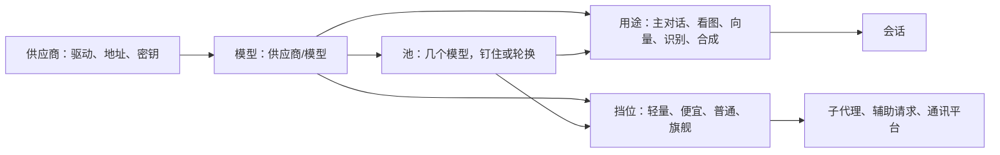
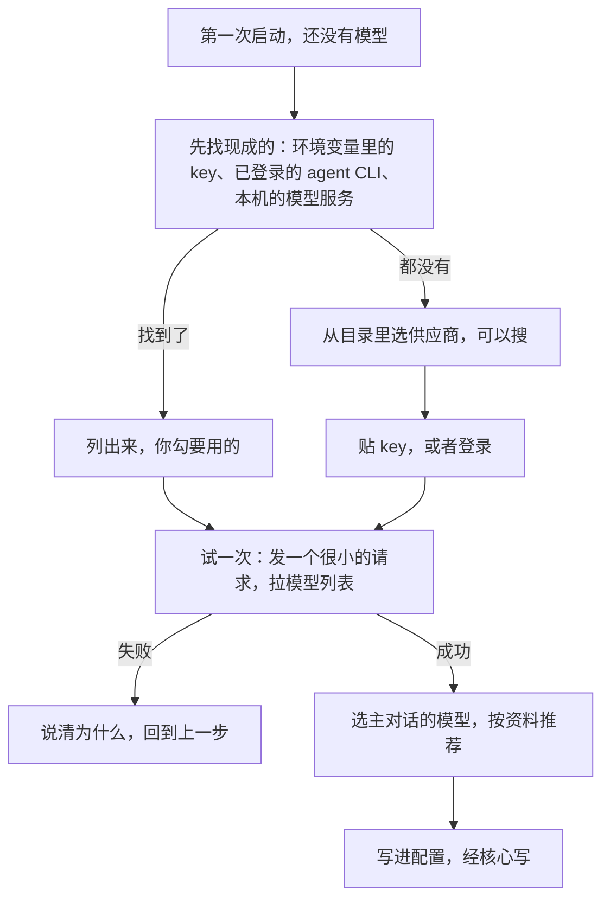

## 模型与供应商（草案）

状态：M1 到 M9 已定（2026-09-25）。其余内容为草案。

配置的通用规矩见 `14-配置.md`。本文讲模型这一块：怎么接上供应商、模型的资料从哪来、主对话和子代理各用哪个模型、几个模型怎么分请求、出错了怎么办、第一次启动怎么接入。

### 一、四个概念

| 概念 | 是什么 | 例子 |
|---|---|---|
| **供应商** | 一条通往模型的路：用哪个驱动、地址、凭据 | `deepseek`、本机的 Ollama、已登录的 Claude Code |
| **模型** | 某个供应商提供的一个模型，写成「供应商/模型」 | `deepseek/deepseek-v4` |
| **池** | 几个模型组成一组，按规则分请求 | 几家的免费额度组成一个池，轮着用 |
| **挡位** | 按能力和成本分的四挡：轻量、便宜、普通、旗舰。每一挡配成一个模型或一个池 | 子代理干简单的活用轻量挡 |



配置里凡是要指定模型的地方，都有三种写法（M1）：

| 写法 | 指的是 | 例子 |
|---|---|---|
| `供应商/模型` | 一个模型 | `"deepseek/deepseek-v4"` |
| `@名字` | 一个池 | `"@free"` |
| 挡位名 | 一个挡位 | `"lite"`、`"cheap"`、`"standard"`、`"flagship"` |

### 二、供应商

```toml
[providers.deepseek]
driver = "openai-chat"
base_url = "https://api.deepseek.com"
keys = [{ secret = "deepseek" }]

[providers.bigmodel]
driver = "openai-chat"
base_url = "https://open.bigmodel.cn/api/paas/v4"
keys = [{ env = "ZHIPU_API_KEY" }, { secret = "bigmodel-2" }]

[providers.claude]
driver = "claude-code"
```

- **模型驱动**决定怎么说话（`05-内核接口.md` 第七节）。常见的几类：

| 模型驱动 | 例子 |
|---|---|
| OpenAI 兼容的对话接口 | DeepSeek、智谱、OpenRouter、opencode Zen，本机的 Ollama、LM Studio |
| OpenAI 的 Responses 接口 | OpenAI 官方 |
| Anthropic 的消息接口 | Anthropic 官方 |
| 借用 agent CLI 的订阅 | Claude Code、Codex、Antigravity、CodeBuddy，走子进程 |

- **密钥**照 `14-配置.md` 第七节：只写密钥的名字或环境变量的名字。
- **一个供应商可以配几个 key**，分摊限速。按会话分，不按请求轮：一个会话钉在一个 key 上，它出错了才换，否则契约型的缓存每次都掉（`08-上下文投影.md` C6）。每个 key 单独冷却（第五节）。
- 地址和凭据以外的东西，例如上下文多长、能不能看图，不用写，从模型资料里查（第三节）。
- **成员可以配只给自己用的供应商**（M6，2026-09-25 确认）。它写在成员自己的个人设置里，密钥放在成员家目录的 `secrets.toml`，只有本人能用。这不需要「配模型」能力，和成员可以装用户级软件包是同一个道理（`06-多用户与身份.md` 第四节）。管理员拥有这台机器，技术上看得到这些文件，界面上会写明这一点。

### 三、模型和它的资料

- **写法**：`供应商/模型`，模型名照供应商那边的叫法。
- **列出哪些**：默认列出供应商模型列表里的全部。也可以在配置里只挑几个，或者给模型起个别名。
- **资料**：上下文长度、最长输出、能收哪些输入（文字、图片、PDF、音频）、能不能调工具、能不能用存根（供应商用约束解码的就不能，`08-上下文投影.md` C5）、思考强度有哪几级、缓存属于哪一类（`05-内核接口.md` 第七节）、工具结果里能不能放图片、价格。

资料按下面的顺序查，前面的覆盖后面的（M2）：

| 来源 | 说明 |
|---|---|
| 手写 | 配置里 `[providers.<供应商>.models."<模型>"]` 下写的 |
| 用出来的 | 例如某个端点不收工具结果里的图片，撞过一次就记住。它是派生数据，删掉了会重新学 |
| 供应商的模型列表 | 驱动能拉到的，例如 OpenAI 兼容接口的 `/models` |
| models.dev 目录 | 社区维护的模型目录。缓存在系统的缓存目录里，后台定期更新；安装包里带一份快照，离线也能用 |
| 驱动的保守默认 | 都查不到时才用，例如当作不能看图 |

- 对目录时，先按供应商的 id 对，再按地址对。对不上就不猜：同一个模型在不同渠道，上下文长度和价格都可能不同。
- 谁在用这些资料：压缩的触发线（`09-压缩.md`，用驱动报告的窗口）、看图的退路（第四节）、思考强度的菜单、工具结果里怎么放图、界面上的能力标记。
- 代码里没有模型表。出了新模型，更新目录就行，不用发新版（`00-设计理念.md` 第六节）。

### 四、用途与挡位

**用途**：

| 用途 | 做什么 | 没配时 |
|---|---|---|
| `chat` 主对话 | 新会话默认用的模型 | 必须有，第一次接入时定 |
| `vision` 看图 | 主对话的模型看不了图时，替它看图 | 主对话的模型能看图就不需要；都不能看，就如实说看不了 |
| `embedding` 向量 | 记忆与知识库的检索 | 本机的小模型（`17-记忆.md` 第四节） |
| `speech_in` 识别 | 把语音转成文字 | 本机的 SenseVoice（`20-语音.md` 第七节） |
| `speech_out` 合成 | 把文字念出来；用哪个音色写在人格里 | macOS 上用系统的 `say`；别的平台要配一个云端引擎 |

**挡位**（M3，2026-09-25 确认保留四挡；叫法也是那天项目主人定的：模型叫「挡位」，权限叫「权限级别」）：`lite` 轻量、`cheap` 便宜、`standard` 普通、`flagship` 旗舰。

- **子代理**：主模型派子代理时，按活的难易挑挡位。`agent` 工具的参数里写的是挡位，不是模型名。所以换模型不会改工具说明，前缀缓存不受影响（`08-上下文投影.md`）。
- **辅助请求**：起标题、整理记忆、解释选中的文字这类请求，各自默认走某一挡，可以逐项改成别的挡位或模型。它们的缓存与主对话互不相干。
- **通讯平台**：判官、入群审批这几处辅助请求按挡位走；群里的主对话用哪个模型，由场所配的预设决定（`18-通讯平台.md` 第三节）。旧版那六个层层继承的模型槽不再有。
- **没配的挡位用主对话的模型，不借用相邻的挡位。** 这样结果只有两种：你给这一挡配的那个，或者主对话的模型，都猜得到。

```toml
[models]
chat = "deepseek/deepseek-v4"
vision = "bigmodel/glm-5v"

[models.tiers]
lite = "@free"
cheap = "@free"
flagship = "claude/opus"
```

### 五、池

```toml
[pools.free]
# 几家的免费额度
models = ["bigmodel/glm-5.3-flash", "deepseek/deepseek-v4.1-flash"]
strategy = "rotate"
```

**两种分法，每个池自己选**（M4，2026-09-25 确认）：

| 分法 | 怎么分 | 适合 |
|---|---|---|
| **钉住**（默认） | 新会话轮着分到池里的各个模型。一个会话钉住分到的那一个，它出错了才换到下一个 | 付费的模型。一个会话一直用同一个模型，前缀缓存保得住 |
| **轮换** | 每次请求都换下一个 | 几家的免费额度。要的是量，不在乎缓存 |

旧版只有轮换，是为了把各家的免费 API 轮着用（项目主人 2026-09-25）。钉住是新加的，给付费的模型用：换一次模型，前缀缓存整段变冷，长对话每次都要全价重读。

「新会话轮着分」用的指针是派生数据，放在 `state/` 里；丢了就从头轮，不影响正确性。

**出错了怎么换**（M5）。错误的分类见 `05-内核接口.md` 第七节：

| 错误 | 怎么办 |
|---|---|
| 限速、额度用完 | 这个端点冷却一段时间，换下一个 |
| 连不上、超时 | 冷却短一些，换下一个 |
| 认证失败 | 冷却很久，界面上提示去检查密钥 |
| 请求本身有错，例如参数不对 | 不换。换了还是一样错，白白烧掉别家的额度 |
| 上下文超长 | 不换，先压缩（`09-压缩.md`） |
| 被内容策略拦下 | 不换，如实告诉人 |

- 连续失败，冷却时间翻倍，有上限。冷却到期先试一次，真正成功一次才清零。旧版实测：固定的冷却时间，会让一个一直挂着的端点每两分钟就被重新信任一次。
- **已经给人看过的输出不回退。** 流式输出开始之后才出错，就不换端点重来，否则同一段话会说两遍。这一回合如实报错，人可以重试。
- **出错自动重试，最多 5 次**（2026-09-26 项目主人：「如果是api错误中断了，那么应该有5次重试，不行就终端等我开口」）：5 次都不行，这一轮以出错结束，等人开口。
  - **说到一半断了，带上半截接着说**（2026-09-27 项目主人定，原话：「比方说在思考的时候断了，我们重新请求的时候肯定要把之前的思考内容带上，还会有一个中断的提示对吧？是这种续」）：收到的半截照打断的规矩留下来，写成她的回复：思考、正文收到多少留多少，没收全的工具调用丢掉。后面跟一句被打断的提示，再请求一次，她看到自己说了一半、被打断了，接着往下说。
    - 前面的请求原样都在，这一次是上一次的前缀延伸，缓存照样命中；她不用把说过的再说一遍。
    - 界面上那半截不收起来，下面标上断了、第几次，接着出。
    - 还没收到内容就断了的（连不上、限速、5xx），原样重发同一份请求，不用提示。
    - 断的只是那一次请求，不是整轮：这一轮前面调过的工具、说过的话都留着。重来的还是原来那个端点：上一条「已经给人看过的输出不回退」说的是不换端点重来。
    - 不是哪一家的续写接口，每家都能用。DeepSeek 的前缀续写问过，不是这个意思（2026-09-27）。
    - 等多久：供应商说了的照它，最多 2 分钟，更久的不等；没说的 1、2、4、8、16 秒。哪几类重试、在等的时候怎么办，见 `02-内核.md` 第六节「回复怎么收」第 4 条。
- **流式输出的空闲超时**：基数初值 180 秒，按思考强度放大（高 2 倍、更高 3 倍、最高 4 倍）。等第一个字的时候，核心定时给头发心跳；头的超时总比核心的长，所以总是核心先说清楚出了什么事（参考 jcode，2026-09-25 补）。
- **连接预热**：驱动可以趁人打字，先把连接和静态前缀准备好，例如 OpenAI 的 Responses WebSocket。jcode 的实测是首字快了 12% 到 27%（各 10 对，只测了一个模型）。预热没做完时，正式请求不等它。第一版可选，按驱动实测再开。
- 换到了另一个模型，时间线上出一条通知（`13-终端界面.md` 第三节），底栏跟着变。
- 池里的模型全在冷却：说清哪个模型为什么不能用、多久以后恢复。
- 每个端点的并发数、限速和优先级，由内核的资源调度器管（`02-内核.md` 第七节）。有人在等的回合，排在辅助请求这类没人等的工作前面。

### 六、会话里换模型

- 在会话里用 `/models` 换模型，打开的是抽屉（`13-终端界面.md` H4）：按供应商分组，标出能力，池和挡位也在里面。换完是 `session.configure`，下一个回合开始时生效（`02-内核.md` K3）。
- **会话钉着的模型没了**，例如供应商被删了、模型下架了：回到这个用途的默认模型，时间线上说明换成了哪个，不报错、不断开（M7）。旧版就出过这种事：核心直接断开连接，界面上只说「无效响应」。
- 压缩用这个会话自己的模型。fork 式的摘要要复用同一段前缀（`09-压缩.md`）。

### 七、第一次接入



- **先找现成的**（M8）：
  - 环境变量里的 key，例如 `DEEPSEEK_API_KEY`、`OPENAI_API_KEY`。找哪些环境变量，是一份数据，不写死在代码里。
  - 已经登录的 agent CLI，例如 Claude Code、Codex。
  - 本机跑着的模型服务，例如 Ollama、LM Studio 的默认端口。
- 环境变量里的 key 直接引用（`{ env = "…" }`），不复制进 Miyu。
- 选主对话的模型时，按资料推荐：要能调工具，上下文要够长。挡位和看图可以先不配，没配就用主对话的模型。
- 引导只是一个界面（`14-配置.md` 第九节）。终端界面、网页、`miyu setup` 走同一组协议方法（第九节）。

### 八、用量与花费

- **用量永远记**：每次请求的输入、缓存命中、缓存写入、输出、思考的 token 数，都记成事件。
- **金额算得准才显示**（M9）。目录里的价格是公开标价，不含折扣、分段计价和汇率，和实际账单常常对不上。看起来精确、其实不准的数字会误导人。项目主人在旧版说过：「如果价格不能精准计算的话我宁愿没有价格显示。」
- 算得准的情况：供应商在响应里直接给出这一次的费用，例如 OpenRouter。这时照它给的显示。

### 九、协议

| 方法 | 类型 | 做什么 |
|---|---|---|
| `provider.detect` | 查询 | 找现成的：环境变量里的 key、已登录的 agent CLI、本机的模型服务 |
| `provider.catalog` | 查询 | 目录里的供应商，给第一次接入时选 |
| `provider.test` | 命令 | 用一个很小的请求试这个供应商，并拉模型列表。会真的花一点额度 |
| `model.list` | 查询 | 模型、资料、当前状态：能用、冷却中、多久后恢复（`04-核心协议.md` 第九节已有） |

- 增删改供应商、池、挡位，都是改配置，走 `config.set`（`14-配置.md` 第八节）。
- 端点的健康状态也出现在 `kernel.status` 里，`miyu doctor` 会逐个试供应商。

### 十、决定

**M1. 四个概念与三种写法**

- **已定：供应商、模型、池、挡位；模型写成「供应商/模型」；要指定模型的地方可以写模型、`@池`，或者挡位名。**
- 未选：旧版的全局文本池、多模态池、分级池、平台槽各成一套。概念多，继承关系还要专门去算。
- 重开条件：出现三种写法表达不了的指定方式。

**M2. 模型资料从哪来**

- **已定：手写的、用出来的、供应商的模型列表、models.dev 目录、驱动的保守默认，前面的覆盖后面的；对不上目录就不猜。**
- 未选：在代码里维护一张模型表。每出一个新模型都要发新版。
- 重开条件：models.dev 停止维护。那时换一个目录来源，顺序不变。

**M3. 挡位**

- **已定：保留四挡，轻量、便宜、普通、旗舰（2026-09-25 确认）；没配的挡位用主对话的模型，不借用相邻的挡位。**
- 未选 A：三挡，像 Claude Code 的 haiku、sonnet、opus。
- 未选 B：不要挡位，各处直接写模型或池。子代理的工具说明里就得写模型名，换模型就改了工具说明。
- 重开条件：四挡里有一挡长期没人配。

**M4. 池怎么分请求**

- **已定：每个池自己选钉住或轮换，默认钉住（2026-09-25 确认）。** 轮换留给免费 API 组成的池；钉住给付费的模型，保住前缀缓存。按次计费的端点钉不钉都一样（`08-上下文投影.md` 第六节），由它们组成的池默认轮换。一个供应商的几个 key 也按会话钉住（第二节）。
- 未选：只做轮换，也就是旧版的做法。付费模型的长对话每次请求都要全价重读。
- 重开条件：出现两种分法都不合适的用法，例如按权重分。

**M5. 出错了怎么换**

- **已定：按错误的类型决定换不换、冷却多久；连续失败冷却翻倍、有上限，真正成功一次才清零；已经给人看过的输出不回退。**
- **已定（2026-09-27 项目主人）：说到一半断了也自动接着来，最多 5 次：收到的半截留下来写成回复，后面跟一句被打断的提示，再请求一次，她接着往下说；什么都没收到的，原样重发。**
- 未选 A：半截收起来，重发同一份请求，她从头再说一遍。说过的要再说一遍，第二遍可能和第一遍不一样。
- 未选 B：用 DeepSeek 的前缀续写，把半截当开头让它往下写。只有几家有，思考模式下能不能用，文档没写。
- 未选 C：开始说了就不重试，这一轮报错，等人开口。不会说两遍，可断一次就要人管一次。
- 未选：任何错误都换下一个。参数错误会把池里每一家的额度都烧一遍。
- 重开条件：无。

**M6. 成员自带模型**

- **已定：成员可以配只给自己用的供应商，写在个人设置里，密钥放在自己家目录；不需要「配模型」能力（2026-09-25 确认）。**
- 未选：模型全由管理员配，按组分享给成员。
- 重开条件：无。

**M7. 会话钉着的模型没了**

- **已定：回到这个用途的默认模型，时间线上说明，不报错、不断开。**
- 未选：报错，让人自己去换。旧版就是这里出的事故。
- 重开条件：无。

**M8. 第一次接入**

- **已定：先找现成的（环境变量里的 key、已登录的 agent CLI、本机的模型服务），找不到再从目录里选；环境变量里的 key 直接引用，不复制。**
- 未选：直接让人从供应商列表里选。机器上本来就有的东西，还要人再贴一遍。
- 重开条件：无。

**M9. 金额**

- **已定：用量永远记；金额只在算得准时显示，也就是供应商直接给出费用的时候。**
- 未选：按目录价格估算，标上「约」。看起来精确的数字，实际对不上账单。
- 重开条件：目录能给出和账单一致的价格。

**后续再定**

- 第一版带哪些驱动：随驱动的实现定
- 借用 agent CLI 订阅的细节：工具怎么桥接、会话怎么续上
- 辅助请求有哪些、各自默认走哪一挡：随各子系统定
- 设置页里供应商与池的专门编辑器长什么样：出图再定
