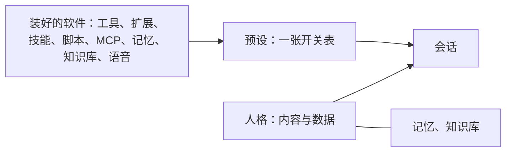
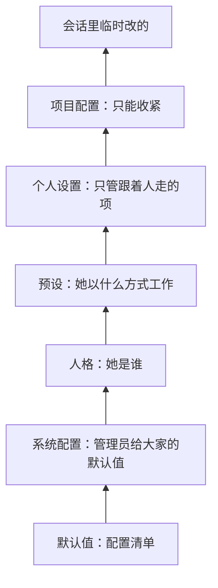

## 人格与预设（草案）

状态：Y1 到 Y8 已定（2026-09-25）。其余内容为草案。

「开箱即用的预设」「可用于开发，也可用于角色扮演、娱乐」（`00-设计理念.md` 的设计理念一节）落在这里。一个会话由一个人格和一个预设组成：人格决定她是谁，预设决定她以什么方式工作（Y1）。

### 一、一条规则：人格管内容，预设管开关

| | 人格 | 预设 |
|---|---|---|
| 回答什么 | 她是谁 | 她以什么方式工作 |
| 里面有什么 | 人设提示词、示范对话、角色扮演提示、开场白、声音、唤醒词 | 打开哪些装好的软件；没列出来的默认开还是关；权限级别这类工作方式 |
| 跟着它走的数据 | 记忆（`17-记忆.md`）、她能查的知识库 | 没有。预设只是一张开关表 |
| 出厂的 | Miyu、软件工程师 | 功能全开、开发 |



- 项目主人的原话（2026-09-25）：「人格决定的是提示词、记忆跟随、知识库、示范对话、角色扮演提示、开场白、声音（如果有语音系统的话）这类角色扮演相关的东西；而预设决定了这个角色以何种方式工作。」「本质只是开关插件、系统、功能而已。」
- **一样东西归谁，问一句就知道**：它是内容或数据，归人格；它是开关，归预设。以记忆为例：记下了什么、跟随人格还是跟随会话，归人格；这一次开不开记忆，归预设。
- **人格和预设随意搭配。** 软件工程师配开发预设写代码；想让她也记事、查知识库，就给她配功能全开。
- **除了内容和开关，两边的文件里还能写配置值**（第三节）。它们是配置里的两层（第五节）：一项配置写在人格还是预设，看它随「她是谁」变，还是随「这次怎么工作」变。偏好的模型、压缩模板都属于这种。
- **每个会话都有一个人格。** 人格的提示词可以只有一句，也可以是空的。
- 旧版的普通模式和开发模式，现在是两个预设；旧版开发模式单独的那套提示词，现在是软件工程师这个人格。代码里没有「模式」这个东西（`00-设计理念.md` 第六节）。配置里写 `persona` 和 `preset`。
- 这两样都不管的：这个人的自述「希望 AI 怎么认识你」，它属于人（`06-多用户与身份.md` 第六节）；供应商和密钥（`15-模型与供应商.md`）。

### 二、仿 Linux：软件随便装，预设只挑哪些开

| Linux | Miyu |
|---|---|
| 内核加上基础系统 | 核心加上基础系统的 13 件（`10-自带软件.md` 第三节） |
| 软件包和软件源，想装什么就装什么 | 扩展、技能、脚本、MCP 服务器，连同记忆、知识库、语音，全都是软件包（`12-进程形态与分发.md` 第四节） |
| systemd 的 target：装的软件一样，选不同的 target，启动不同的一组 | 预设：功能全开像图形界面的 target，什么都开；开发像只有命令行的 target，只开必需的 |
| 用户装到自己的 `~/.local` | 你自己的技能和脚本装在自己的家目录里，只对你生效 |

- 内核不认识「人格」「预设」「记忆」这些词（`02-内核.md` 第三节）。它们都只是数据和软件：
  - 加一种能力，就是装一个软件包；
  - 换一种工作方式，就是写一个预设；
  - 换一个角色，就是写一个人格。
  
  都不用改代码。
- 内置的功能和第三方的软件走同一条路，预设对它们一视同仁（`00-设计理念.md` 第六节）。

### 三、文件

```text
personas/miyu/
├── persona.toml         名字、说明、开场白、声音、唤醒词、记忆的范围、能查的知识库
└── prompts/
    ├── persona.md       人设和说话的方式
    ├── examples.md      示范对话
    └── reminders.md     角色扮演提示：防止她说着说着忘了自己是谁

presets/dev.toml         一张开关表，加上工作方式的配置
```

软件工程师这个人格：

```toml
[persona]
id = "engineer"
name = { en = "Software Engineer", zh-CN = "软件工程师" }
summary = { en = "A helpful software engineer", zh-CN = "乐于助人的软件工程师" }

[memory]
scope = "persona"

[knowledge]
bases = []

[compaction]
template = "task"
```

它的 `prompts/persona.md` 只有一句：`You are a helpful software engineer.`

开发预设：

```toml
[preset]
id = "dev"
name = { en = "Dev", zh-CN = "开发" }
summary = { en = "Only what coding needs", zh-CN = "只开写代码必需的" }
default_persona = "engineer"
unlisted = "off"

[software]
basesystem = true
net = true
goal = true

[permissions]
level = "workspace"          # 或 full。只读是叠在上面的开关（11-权限与沙盒.md 第二节）

[compaction]
template = "task"

[loading]
unlisted = "full"
```

- **`unlisted`**：没在 `[software]` 里列出来的软件，包括以后新装的，默认开（`on`）还是关（`off`）（Y7）。功能全开写 `on`，开发写 `off`。
- 开关以软件包为单位，`basesystem` 就是基础系统那 13 件（`10-自带软件.md` 第三节）；也可以细到单个工具，例如只关掉 `shell`。
- **强调色**：预设可以声明一个强调色（`[preset]` 里的 `color`），终端界面底栏里的预设名、输入框左边的竖线都用它（`13-终端界面.md` 第八节）；不写，就由主题的种子色派生（`04-核心协议.md` 第五节，2026-09-26 补）。
- **没开的软件也让她知道**（Y8）：装了、但这个预设没开的软件，系统提示词里只列一行名字（`08-上下文投影.md` 第三节）。有人让她做这些事时，她会说该换哪个预设、打开哪一项，不会自己去想办法绕过去。旧版终端里没有 QQ 的工具，她就用 curl 去猜平台的接口（旧版 issue #49，`18-通讯平台.md` 第九节）。
- `[persona]`、`[preset]` 以外的表都是配置值，键和配置文件里的一样（`14-配置.md`）。写错了一样报错，编辑器里一样有补全。
- 提示词放进请求的哪个位置，由上下文投影决定（`08-上下文投影.md` 第三节）。

### 四、改出厂的，只写改了的项

人格和预设用同一套办法（Y3）：

- **`base`**：写 `base = "dev"`，就以开发预设为底。配置值和开关逐项覆盖；人格的提示词文件同名替换，没写的沿用。
- **同名覆盖**：在自己的家目录里建一个和出厂的同名的人格或预设，只写改了的项，不用写 `base`。出厂的升级时，你没改的部分照样跟着升级。像 systemd 的 `systemctl edit`：不复制原文件，只写一份覆盖片段。
- **找的顺序**：自己的家目录、系统区、出厂的。出厂的随发行附带，放在资源目录里，只读（`12-进程形态与分发.md` R3、`07-存储.md` 第二节）。同名的，前面的叠在后面的上面。
- 以谁为底绕成了圈，就报错，指出是哪几个。
- **自己长出来的技能和脚本**，也就是用写技能、写脚本的那两件能力做出来的，装在自己的家目录里，是用户级的软件（`12-进程形态与分发.md` 第四节）。在哪个预设里做出来的，就在那个预设里打开：那个预设如果不开没列出来的软件，就往你那一份同名覆盖里添上这一项。

### 五、在配置层级里的位置



- **人格和预设都在系统配置之上**（Y4）：管理员在系统配置里给的是大家的默认值，会话选的人格和预设可以改掉它们。管理员不想让它们改的项，就锁住（`14-配置.md` 第三节）。
- **预设在人格之上**：两边都写了同一项时，这一次的工作方式说了算。例如人格偏好一个擅长聊天的模型，开发预设指定了一个擅长写代码的，写代码时就用后者。
- **每一项标明跟着谁走**：人格、预设，还是人。跟着人格或预设走的项，个人设置里不能全局改，只能改在某个人格或预设上，也就是写一份同名覆盖。界面语言这类跟着人走的项，个人设置里改一处，处处生效。
- **只能在装了的软件里挑。** 预设打开了某个软件、这台机器却没装它，这一项就不生效，界面上写明「没安装」。

### 六、会话用哪个人格、哪个预设

- **新会话**按下面的先后找：
  1. 开会话时指定的；
  2. 场所规则定的，例如某个 QQ 群配了 Miyu 和功能全开（`18-通讯平台.md` 第三节）；
  3. 个人设置里的默认；
  4. 系统配置里的默认。
- **预设可以带一个默认人格**：开发预设默认用软件工程师。
- **钉在会话上**（Y5，2026-09-25 确认）：人格、预设、记忆的范围（`17-记忆.md` L3），都在开会话时定，之后不换。要换就开一个新会话，或者回到那个组合最近的一个会话。旧版的 `/dev` 就是这样。
- 会话里可以临时改几项，例如临时打开一个软件（`14-配置.md` 第三节）。人格和预设本身不变。
- **文件改了**，例如改了人设：用它的会话在下一个回合开始时用上新版本，并记成事件（`02-内核.md` K3、`03-事件模型.md` E5）。
- **被删了**：用它的会话照样能继续，用的是存档里的最后一份（`03-事件模型.md` E5），界面上写明「已经删除」。
- **子代理**默认用父会话的预设，人格用软件工程师，不召回也不记下记忆。派子代理时可以指定别的人格和预设。能选哪些人格和预设，写在系统提示词的稳定区里（`08-上下文投影.md` 第三节），不写进 `agent` 工具的说明：工具描述要保持常量。名单变了按 `02-内核.md` K3 生效。

### 七、谁能用、谁能改

- 人格和预设都是资源，遵守属主与权限（`06-多用户与身份.md` 第三节）。共享的属于管理员，组员能用；私有的属于创建它的人，可以分享给组或指定的人。
- 共享人格的提示词给不给成员看，由管理员决定（同一节）。
- 出厂的只读。要改就写同名覆盖（第四节）。
- 任何账号都可以在自己的家目录里建私有的人格和预设，不需要任何管理能力。

### 八、出厂的人格与预设

（Y6，2026-09-25 项目主人定）

| 种类 | 名字 | 内容 |
|---|---|---|
| 人格 | **Miyu**（默认） | 人设、示范对话、角色扮演提示、开场白；记忆跟随人格 |
| 人格 | **软件工程师** | 一句话：`You are a helpful software engineer.`；记忆跟随人格 |
| 预设 | **功能全开**（默认） | 装了的软件全部打开，以后新装的也打开 |
| 预设 | **开发** | 只开写代码必需的：基础系统、联网、长期目标。不开记忆、角色扮演提示、知识库。默认人格是软件工程师 |

- 想要一个有记忆、有知识库的开发预设：以开发为底，打开这几项（第四节）。
- 旧版 Miyu 的生活助理脚本，只是装好的软件：功能全开里有，开发里没有。
- 功能全开会随着装的软件变多而变重。每个软件包的工具描述照样受三句话的规矩约束（`10-自带软件.md` 第九节）；装得实在太多时怎么办，实测后再定。
- 可选软件包在开发预设里开不开，见 `10-自带软件.md` 第四节。

### 九、协议

| 方法 | 类型 | 做什么 |
|---|---|---|
| `persona.list`、`preset.list` | 查询 | 能用的人格、预设：名字、说明、来自哪一层（出厂、系统、自己的）、能不能改 |
| `persona.get`、`preset.get` | 查询 | 合成之后的样子，每一项来自哪一层 |
| `persona.save`、`preset.save` | 命令 | 新建或修改，校验后写盘；出厂的只能写同名覆盖 |
| `persona.delete`、`preset.delete` | 命令 | 删除自己的，或者删掉同名覆盖、回到出厂的样子 |

- 开会话时选人格、预设和记忆的范围，是 `session.create` 的参数（`04-核心协议.md` 第九节）。
- 写盘的规矩同配置文件：只有核心写，保留格式，顺着符号链接写（`14-配置.md` 第四节）。

### 十、决定

**Y1. 人格与预设**

- **已定：人格管内容与数据，预设管开关；两者随意搭配；每个会话都有一个人格（2026-09-25 项目主人提出）。**
- 未选 A：人格并进预设，只有预设一样东西。这是同一天的第一版草稿。同一个人格想换一种工作方式，就得复制一份人设。
- 未选 B：技能、脚本、MCP 住在预设里。这是同一天的第二版草稿。同一个脚本要在几个预设里各放一份。
- 重开条件：无。

**Y2. 各自装什么**

- **已定：人格装人设提示词、示范对话、角色扮演提示、开场白、声音、唤醒词，记忆和她能查的知识库跟着人格走；预设只装开关，以及权限级别这类工作方式的配置。**
- 未选：技能和脚本跟着人格走，也就是旧版的做法。换一个工作方式，能用的工具却还是那个人格的那一套。
- 重开条件：出现一样东西，既不是内容和数据，也不是开关。

**Y3. 怎么改出厂的**

- **已定：同名覆盖，或者用 `base` 以它为底；都只写改了的项，不整份复制。**
- 未选：复制一份再改。出厂的以后的改进，就再也到不了你那一份。
- 重开条件：无。

**Y4. 在配置层级里的位置**

- **已定：系统配置之上是人格，人格之上是预设，再往上是个人设置；每一项标明跟着人格、预设还是人走；只能在装了的软件里挑。**
- 未选：人格和预设压在个人设置之上。那样你的界面语言也会被它们改掉。
- 重开条件：出现一项配置，同时要跟着人和跟着预设走。

**Y5. 会话中途能不能换**

- **已定：不能。人格、预设和记忆的范围都钉在会话上（2026-09-25 确认）。要换就开新会话，或者回到那个组合最近的会话。**
- 未选：下一个回合开始时换。新人格会读到旧人格说过的话，前缀缓存也整段变冷。
- 重开条件：出现确实需要在一段对话里换人格或预设的用法。

**Y6. 出厂的**

- **已定：人格 Miyu 和软件工程师；预设功能全开和开发；开发默认配软件工程师（2026-09-25 项目主人定）。**
- 未选：开发预设不带人格，也就是旧版开发模式的做法。那样开发就成了一个特例，每个会话都有人格这条规矩就不成立了。
- 重开条件：开源以后，多数新用户想要的默认组合不是这两对。

**Y7. 装好的软件和预设**

- **已定：技能、脚本、MCP 和别的软件一样，是装好的软件，不住在预设里；每个预设写明没列出来的软件默认开还是关；自己做出来的技能和脚本装在自己的家目录里，并在做出它的那个预设里打开。**
- 未选 A：新装的软件在所有预设里都默认打开。开发预设会越来越胖。
- 未选 B：新装的软件在所有预设里都默认关着。装了以后，还得挨个预设去开。
- 重开条件：无。

**Y8. 没开的软件她知不知道**

- **已定：装了、但这个预设没开的软件，系统提示词里只列一行名字；被问到时，她说换哪个预设或打开哪一项，不自己去绕。**
- 未选：什么都不说。旧版终端里没有 QQ 的工具，她就用 curl 去猜平台的接口，猜错了还下结论说平台不支持（旧版 issue #49）。
- 重开条件：装的软件多到这一行太长。

**后续再定**

- 提示词分几份、各自怎么写，包括角色扮演提示：见 `26-提示词.md`。人格侧的三份（人设、示范对话、角色扮演提示）照搬旧版一直在用的原文（J7）
- 声音：已定，见 `20-语音.md` 第七节
- 场所怎么绑定人格和预设：已定，见 `18-通讯平台.md` 第三节的场所规则
- 功能全开装得太多时的工具面：实测后定
