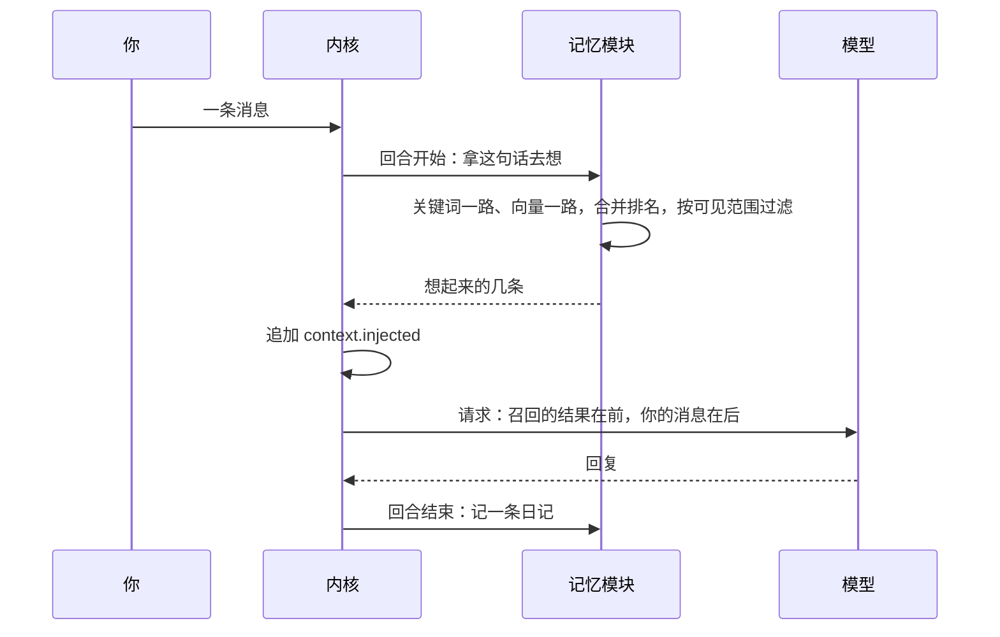

## 记忆（草案）

状态：L1 到 L7 已定（2026-09-25）。其余内容为草案。

### 一、记忆是什么，不是什么

- **记忆是人格的**：她记得你们聊过什么、你是什么样的人。记忆跟着人格走，不跟着预设走（L1，`16-人格与预设.md` Y1）。同一个人格换了预设，记忆还是那一份；只是有的预设不开记忆，例如开发预设。
- **不是会话历史**：会话日志本身什么都记着。记忆是跨会话、压缩之后还想得起来的那一部分。
- **不是知识库**：知识库里是你放进去的文档；记忆是她自己从对话里记下的。
- **不是自述**：「希望 AI 怎么认识你」是你自己写的，属于你（`06-多用户与身份.md` 第六节）；记忆是她整理出来的。

### 二、两种范围

| 范围 | 记在哪 | 在哪里想得起来 | 适合 |
|---|---|---|---|
| **跟随人格**（默认） | 这个人格的记忆库 | 用这个人格的所有会话，不管开的是哪个预设 | 日常：Miyu 一直记得你 |
| **跟随会话** | 这个会话自己 | 只在这个会话里 | 一段一段独立的故事。删掉会话，记忆一起删掉 |

- 两种范围都是项目主人要的（L2，2026-09-25）。
- **开会话时定，之后不改**（L3，2026-09-25 确认）。默认值由人格给出（`16-人格与预设.md` 第一节），开会话时可以换一种。这和人格、预设钉在会话上是一个道理：不会出现「已经记下的，算谁的」。
- 子代理默认不召回、也不记下记忆。

### 三、三类记忆

沿用旧版的结构（L4，2026-09-25 确认）：

| 类 | 记什么 | 怎么来 | 多久 |
|---|---|---|---|
| **日记** | 每一轮聊了什么，一轮一条 | 每轮结束时自动记，不用模型 | 保留一段时间；被想起来会续期 |
| **经历** | 值得以后回想的事 | 从日记里整理出来 | 随时间变淡，被想起来一次算复习一次 |
| **知识点** | 长期有效的事实，例如「用户用 N 卡」 | 从日记里整理出来；也可以直接叫她记住 | 同上 |

- **整理**：日记攒够一批，后台发一次辅助请求去整理，默认走便宜挡（`15-模型与供应商.md` 第四节）。被想起来好几次的日记会提前整理。整理失败就退避重试，不会挡住回复。
- **遗忘**：经历和知识点的强度随时间衰减。低于某个值就算忘了：不再被自动想起来，但还能搜到。被想起来一次，强度就回升一次，相当于复习。
- 多少条算一批、保留多久、衰减多快，都是配置项。初值在实现时实测再定，不照搬旧版的数字（`README.md` 的约定）。

### 四、想起来：每轮开始时召回

- **回合开始时**（`05-内核接口.md` 第五节的「回合开始」挂接点），拿这一轮的原话去检索：关键词一路，向量一路，两路的排名合并。中文先分词。向量那一路用不了时只剩关键词，召回不会因此停下。
- **召回的结果**记成一条 `context.injected` 事件（`03-事件模型.md`），放在触发这一轮的消息前面（`08-上下文投影.md` C2），以后原样回放。它是事件，所以不会破坏前缀缓存（`02-内核.md` K2）。旧版把召回结果放在消息后面，重制版按上下文投影的实测结论改到前面。
- **她也可以主动搜**：`memory_search` 工具。
- **向量**用 `embedding` 这个用途配的模型（`15-模型与供应商.md` 第四节）。默认是本机的小模型，跑在 embedding worker 里（`01-架构.md` 第八节），第一次用时下载到系统的缓存目录。

### 五、谁能想起什么

- 每条记忆都记着：说这话的是谁，在哪个场所说的，从哪个会话的哪一轮来的。
- **召回时看这次回复会被谁看到，只召回这些人全都有权知道的**（L6）。私聊里就是你一个人；群里是群里的所有人。所以你私下告诉她的事，她不会在群里说出来。这就是 `06-多用户与身份.md` U6 的落地。
- **一般知识谁说的都能进**（L5，2026-09-25 确认）：群里大家公开聊出来的，也可以整理进人格的一般知识。每一条都记着是谁说的，整理和召回时一起交给模型判断。你能在记忆页里看到它们，也能删掉。
- 私下说的只进说话人自己那一层，不进一般知识。按说话的人归：A 私下说起 B 的事，记在 A 那一层，写明是「A 说的关于 B」，不写进 B 那一层。
- 关于某个人的那一层记忆，放在那个人的家目录里；删掉账号，这一层一起删掉（`06-多用户与身份.md` 第七节）。

### 六、出处与撤回

- 每条记忆都知道自己从哪一轮来（L7）。
- **撤销一轮**（`03-事件模型.md` 的 `turn.reverted`）或**删掉一个会话**时：
  - 从那里记下的日记跟着撤回；
  - 整理出来的经历和知识点，如果只来自被撤回的内容，也跟着撤回；还有别的出处的，只去掉这一条出处。
- 旧版的教训：一个 bug 让她说了错话，这些错话被记成了记忆。bug 修好以后，错的记忆还在，得手动去记忆库里查。

### 七、存在哪

- **真相是事件**（`07-存储.md` S1）。记忆模块把「记下」「整理出」「撤回」「忘了」都记成自己命名空间下的事件（`ext.memory.*`）。
  - 跟随人格的：一般知识记在人格那里，`personas/<人格>/memory.jsonl`；关于某个人的，记在那个人的家目录里，`home/<账号>/modules/memory/`（`07-存储.md` 第二节）。
  - 跟随会话的：记在这个会话自己的日志里。
- **检索用的索引**（关键词、向量）是派生数据，放在 SQLite 里，删掉了会重建（`07-存储.md` S3）。

### 八、你能做什么

- **看、搜、改、删**：终端界面和网页里各有一个记忆页；命令行用 `miyu memory`。
- **叫她记住**：直接说「记住……」，或者用 `/remember`。
- **叫她忘掉**：`/forget`，或者在记忆页里删。
- **清空**，只有三种，名字各说各的：

| 操作 | 清什么 |
|---|---|
| 清掉这个会话记下的 | 从这个会话来的记忆 |
| 清掉她关于我的记忆 | 这个人格关于你的那一层 |
| 清掉她的一般知识 | 这个人格的一般知识，只有人格的属主能做 |

- 旧版有五种重置命令，语义还互相重叠，所以文档里专门有一节提醒「别混」。这里只留三种，每种清什么，看名字就知道。

### 九、协议与配置

| 方法 | 类型 | 做什么 |
|---|---|---|
| `memory.search` | 查询 | 搜记忆，可以包括已经忘了的 |
| `memory.list` | 查询 | 按类、按人、按会话列出 |
| `memory.remember` | 命令 | 直接记下一条 |
| `memory.update` | 命令 | 改一条的内容 |
| `memory.forget` | 命令 | 删一条，或者按第八节的三种清空 |

- 只列出、只搜得到调用者有权看到的记忆（第五节）。

| 配置项 | 跟着谁走 | 说明 |
|---|---|---|
| 开不开记忆 | 预设 | 记忆是一个软件包，由预设打开或关掉；开发预设不开（`16-人格与预设.md` 第八节） |
| `memory.scope` | 人格 | 默认范围：`persona` 跟随人格，`session` 跟随会话 |
| 整理与遗忘的参数 | 人格 | 一批多少条、保留多久、衰减多快 |
| `memory.organizer_tier` | 人格 | 整理走哪一挡，默认便宜挡 |

### 十、决定

**L1. 记忆跟着谁走**

- **已定：跟着人格（2026-09-25 确认）。** 项目主人：「记忆跟人格走，技能/脚本/mcp跟预设走。」后来定为：技能、脚本、MCP 是装好的软件，由预设开关（`16-人格与预设.md` Y7）。
- 未选：跟着预设走。换一个预设，她就不认识你了。
- 重开条件：无。

**L2. 范围**

- **已定：两种，跟随人格（默认）和跟随会话（2026-09-25 项目主人提出）。**
- 未选：只有跟随人格。一段独立的故事，会串到另一段故事里。
- 重开条件：出现两种都不合适的用法，例如按项目分开的记忆。

**L3. 范围什么时候定**

- **已定：开会话时定，之后不改（2026-09-25 确认）。**
- 未选：会话里随时可以改。从跟随会话改成跟随人格时，之前记下的并不并过去，还得再问一次。
- 重开条件：无。

**L4. 记忆的结构**

- **已定：沿用旧版的日记、经历、知识点三类，后台整理，强度随时间衰减，想起一次算复习一次（2026-09-25 确认）。参数实测再定。**
- 未选：只记知识点。结构简单，但她记不住「那天我们聊了什么」这类经历。
- 重开条件：实测整理的花费或召回的质量不可接受。

**L5. 一般知识谁说的能进**

- **已定：谁说的都能进，每一条记着是谁说的（2026-09-25 确认）。私下说的只进说话人自己那一层。**
- 公开说的在别处提不提，由她像人一样判断，不做成机制（2026-09-25 确认）。项目主人：「人格，是一个人，人的记忆。」私下说的仍然按听众过滤（L6）。
- 未选：只有主人说的能进。更防故意灌输，但群里大家一起聊出来的东西，她记不住。
- 重开条件：出现有人故意灌输错误内容、而且造成了实际影响的情况。

**L6. 召回时按谁判断能不能说**

- **已定：按这次回复会被谁看到。只召回这些人全都有权知道的。**
- 未选：按会话的属主判断。群会话的属主是管理员，那样管理员的私事就会被说给整个群听。
- 重开条件：无。

**L7. 出处与撤回**

- **已定：每条记忆记着出处；撤销一轮、删掉会话时，只来自那里的记忆跟着撤回。**
- 未选：记忆一旦记下就独立存在。旧版就是这样，bug 修好以后错的记忆还在。
- 重开条件：无。

**后续再定**

- 整理用的提示词怎么写：随提示词的设计定
- 本机向量模型选哪一个：实测中文召回质量和内存占用再定
- 召回几条、多长：随上下文预算实测再定
