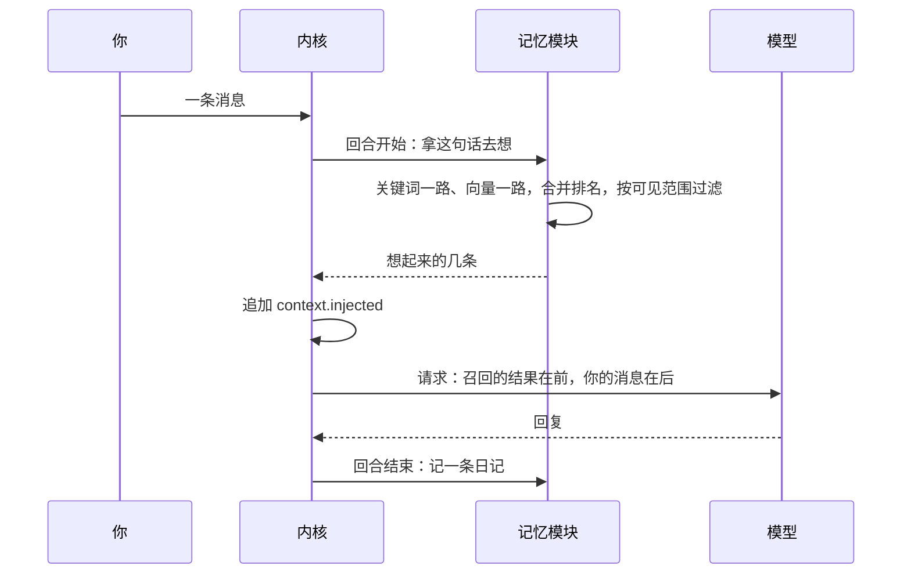

## 记忆（草案）

状态：L1 到 L7 已定（2026-09-25），L8 到 L16 已定（2026-10-07）。图纸是蓝图 `memory.md`、`recall.md`。

- **2026-10-07 和项目主人从头过了一遍**（2026-09-26 定的「做之前再详细讨论、不照搬旧版」）：调研和每一条的拍板记在 `docs/reviews/2026-10-07-记忆知识库embedding调研.md`。下面第三、四节照新的定论改过，旧版的做法只当证据。

### 一、记忆是什么，不是什么

- **记忆是人格的**：她记得你们聊过什么、你是什么样的人。记忆跟着人格走，不跟着预设走（L1，`16-人格与预设.md` Y1）。同一个人格换了预设，记忆还是那一份；只是有的预设不开记忆，例如开发预设。
- **不是会话历史**：会话日志本身什么都记着。记忆是跨会话、压缩之后还想得起来的那一部分。
- **不是知识库**：知识库里是你放进去的文档；记忆是她自己从对话里记下的。
- **不是自述**：「希望 AI 怎么认识你」是你自己写的，属于你（`06-多用户与身份.md` 第六节）；记忆是她整理出来的。

### 二、两种范围

| 范围 | 记在哪 | 在哪里想得起来 | 适合 |
|---|---|---|---|
| **跟随人格**（默认） | 这个人格的记忆库 | 用这个人格的所有会话，不管开的是哪个预设 | 日常：Miyu 一直记得你 |
| **跟随会话** | 这个会话自己 | 只在这个会话里 | 一段一段独立的故事。删掉会话，记忆一起删掉 |

- 两种范围都是项目主人要的（L2，2026-09-25）。
- **开会话时定，之后不改**（L3，2026-09-25 确认）。默认值由人格给出（`16-人格与预设.md` 第一节），开会话时可以换一种。这和人格、预设钉在会话上是一个道理：不会出现「已经记下的，算谁的」。
- 子代理默认不召回、也不记下记忆。通讯平台的支线不是子代理：它就是她在回话，照主线召回、记日记（`18-通讯平台.md` 第八节、第十五节，2026-10-07）。

### 三、日记和记下的记忆

- **日记就是回合索引**（L8）：用这个人格的会话里，人开的每一个回合（人的话加她最后的回答）照会话日志派生成一条，能搜，不另存。只收人开的回合：自动续轮、回报叫醒、别的会话发来的开的都不算。撤销、恢复、删会话自动跟着走。
- **记下的记忆分四类**（L9）：

| 类 | 记什么 |
|---|---|
| **关于你**（`user`） | 你是什么样的人，例如「用户用 N 卡」 |
| **你要她怎样**（`feedback`） | 你的纠正和确认，带「为什么」 |
| **经历**（`episode`） | 一起经历过、值得以后回想的事 |
| **参考**（`reference`） | 长期有效的事实 |

- **怎么来**（L10、L11）：她当场记（人说「记住……」「忘掉……」，她当场调工具）；后台在会话闲了几分钟、缓存还热的时候，对新的一段发一次抽取请求；隔一段时间合并一次：去重、相对日期改成绝对日期、作废被推翻的、重写摘要。只追加，不原地改：改是新写一条指着旧的，忘是写一条作废。
- **遗忘**（L12）：不存会变的「强度」，排名时照「多久没用到」「用到几次」算；低于门槛的不再被自动想起来，但还能搜到。越久没想起越淡，想起一次又亮一点，意思和原来一样。
- 数（多久算闲、间隔、上限、半衰期）都是起点，实测再定，不照搬旧版的数字（`README.md` 的约定）。

### 四、想起来

三层（L13，2026-10-07 项目主人定）：常驻的记忆摘要（会话第一轮、压缩以后各注入一次，有硬上限，会话中途不变）；她的工具（搜、记、忘）；每轮的联想（下面，过门槛才带，每轮约 150 token、一段上下文累计 2000 token，L14）。施工上先做摘要和工具，联想单独一步实测后再开。

**每轮的联想**

```mermaid
sequenceDiagram
    participant U as 你
    participant K as 内核
    participant M as 记忆模块
    participant L as 模型
    U->>K: 一条消息
    K->>M: 回合开始：拿这句话去想
    M->>M: 关键词一路、向量一路，合并排名，按可见范围过滤
    M-->>K: 想起来的几条
    K->>K: 追加 context.injected
    K->>L: 请求：召回的结果在前，你的消息在后
    L-->>K: 回复
    K->>M: 回合结束：记一条日记
```

- **回合开始时**（`05-内核接口.md` 第五节的「回合开始」挂接点），拿这一轮的原话去检索：关键词一路，向量一路，两路的排名合并。中文先分词。向量那一路用不了时只剩关键词，召回不会因此停下。
- **召回的结果**记成一条 `context.injected` 事件（`03-事件模型.md`），放在触发这一轮的消息前面（`08-上下文投影.md` C2），以后原样回放。它是事件，所以不会破坏前缀缓存（`02-内核.md` K2）。旧版把召回结果放在消息后面，重制版按上下文投影的实测结论改到前面。
- **她也可以主动搜**：`memory_search` 工具。
- **向量**用 `embedding` 这个用途配的模型（`15-模型与供应商.md` 第四节）。默认是本机的 bge-small-zh-v1.5（L15），跑在 embedding worker 里（`01-架构.md` 第八节），第一次用时从 Miyu 自己的 GitHub Release 下载到系统的缓存目录；模型能换。

### 五、谁能想起什么

- 每条记忆都记着：说这话的是谁，在哪个场所说的，从哪个会话的哪一轮来的。
- **召回时看这次回复会被谁看到，只召回这些人全都有权知道的**（L6）。私聊里就是你一个人；群里是群里的所有人。所以你私下告诉她的事，她不会在群里说出来。这就是 `06-多用户与身份.md` U6 的落地。
- **一般知识谁说的都能进**（L5，2026-09-25 确认）：群里大家公开聊出来的，也可以整理进人格的一般知识。每一条都记着是谁说的，整理和召回时一起交给模型判断。你能在记忆页里看到它们，也能删掉。
- 私下说的只进说话人自己那一层，不进一般知识。按说话的人归：A 私下说起 B 的事，记在 A 那一层，写明是「A 说的关于 B」，不写进 B 那一层。
- 关于某个人的那一层记忆，放在那个人的家目录里；删掉账号，这一层一起删掉（`06-多用户与身份.md` 第七节）。

### 六、出处与撤回

- 每条记忆都知道自己从哪一轮来（L7）。
- **撤销一轮**（`03-事件模型.md` 的 `turn.reverted`）或**删掉一个会话**时：
  - 从那里记下的日记跟着撤回；
  - 整理出来的经历和知识点，如果只来自被撤回的内容，也跟着撤回；还有别的出处的，只去掉这一条出处。
  - 撤销以后又恢复的（`turn.unreverted`，施工 2-8 下）跟着回来（2026-10-07 定）：不写撤回的事件，召回、列出时照有效历史看出处还活不活，出处全死了的当它不在，恢复了又在（蓝图 `memory.md` 第二条第 3 款）。
- 旧版的教训：一个 bug 让她说了错话，这些错话被记成了记忆。bug 修好以后，错的记忆还在，得手动去记忆库里查。

### 七、存在哪

- **真相是事件**（`07-存储.md` S1）。记忆模块把「记下」「整理出」「撤回」「忘了」都记成自己命名空间下的事件（`ext.memory.*`）。
  - 跟随人格的：一般知识记在人格那里，`personas/<人格>/memory.jsonl`；关于某个人的，记在那个人的家目录里，`home/<账号>/modules/memory/`（`07-存储.md` 第二节）。
  - 跟随会话的：记在这个会话自己的目录里（`sessions/<会话>/memory/`），删会话、进回收处、恢复都跟着目录走。原来写的是「记在这个会话自己的日志里」：会话日志只有会话 actor 一个写的人，工具绕不过它，2026-10-07 施工 R-3 下改成单开一处（技术细节，主会话定）。
- **检索用的索引**（关键词、向量）是派生数据，放在 SQLite 里，删掉了会重建（`07-存储.md` S3）。

### 八、你能做什么

- **看、搜、改、删**：终端界面和网页里各有一个记忆页；命令行用 `miyu memory`。
- **叫她记住**：直接说「记住……」，或者用 `/remember`。
- **叫她忘掉**：`/forget`，或者在记忆页里删。
- **清空**，只有三种，名字各说各的：

| 操作 | 清什么 |
|---|---|
| 清掉这个会话记下的 | 从这个会话来的记忆 |
| 清掉她关于我的记忆 | 这个人格关于你的那一层 |
| 清掉她的一般知识 | 这个人格的一般知识，只有人格的属主能做 |

- 旧版有五种重置命令，语义还互相重叠，所以文档里专门有一节提醒「别混」。这里只留三种，每种清什么，看名字就知道。

### 九、协议与配置

| 方法 | 类型 | 做什么 |
|---|---|---|
| `memory.search` | 查询 | 搜记忆，可以包括已经忘了的 |
| `memory.list` | 查询 | 按类、按人、按会话列出 |
| `memory.remember` | 命令 | 直接记下一条 |
| `memory.update` | 命令 | 改一条的内容 |
| `memory.forget` | 命令 | 删一条，或者按第八节的三种清空 |

- 只列出、只搜得到调用者有权看到的记忆（第五节）。

| 配置项 | 跟着谁走 | 说明 |
|---|---|---|
| 开不开记忆 | 预设 | 记忆是一个软件包，由预设打开或关掉；开发预设不开（`16-人格与预设.md` 第八节） |
| `memory.scope` | 人格 | 默认范围：`persona` 跟随人格，`session` 跟随会话 |
| 整理与遗忘的参数 | 人格 | 一批多少条、保留多久、衰减多快 |
| `memory.organizer_tier` | 人格 | 整理走哪一挡，默认便宜挡 |

### 十、决定

**L1. 记忆跟着谁走**

- **已定：跟着人格（2026-09-25 确认）。** 技能、脚本、MCP 跟预设走：它们是装好的软件，由预设开关（`16-人格与预设.md` Y7）。
- 未选：跟着预设走。换一个预设，她就不认识你了。
- 重开条件：无。

**L2. 范围**

- **已定：两种，跟随人格（默认）和跟随会话（2026-09-25 项目主人提出）。**
- 未选：只有跟随人格。一段独立的故事，会串到另一段故事里。
- 重开条件：出现两种都不合适的用法，例如按项目分开的记忆。

**L3. 范围什么时候定**

- **已定：开会话时定，之后不改（2026-09-25 确认）。**
- 未选：会话里随时可以改。从跟随会话改成跟随人格时，之前记下的并不并过去，还得再问一次。
- 重开条件：无。

**L4. 记忆的结构**

- **已定：沿用旧版的日记、经历、知识点三类，后台整理，强度随时间衰减，想起一次算复习一次（2026-09-25 确认）。参数实测再定。**
- 2026-10-07 重开：日记改成回合索引（L8），类改成四类（L9），整理的时机（L10），强度改成排名时算（L12）。后台整理、想起一次算复习一次的意思不变。
- 未选：只记知识点。结构简单，但她记不住「那天我们聊了什么」这类经历。
- 重开条件：实测整理的花费或召回的质量不可接受。

**L5. 一般知识谁说的能进**

- **已定：谁说的都能进，每一条记着是谁说的（2026-09-25 确认）。私下说的只进说话人自己那一层。**
- 公开说的在别处提不提，由她像人一样判断，不做成机制（2026-09-25 确认）：人格是一个人，记忆照人的记忆来。私下说的仍然按听众过滤（L6）。
- 未选：只有主人说的能进。更防故意灌输，但群里大家一起聊出来的东西，她记不住。
- 重开条件：出现有人故意灌输错误内容、而且造成了实际影响的情况。

**L6. 召回时按谁判断能不能说**

- **已定：按这次回复会被谁看到。只召回这些人全都有权知道的。**
- 未选：按会话的属主判断。群会话的属主是管理员，那样管理员的私事就会被说给整个群听。
- 重开条件：无。

**L7. 出处与撤回**

- **已定：每条记忆记着出处；撤销一轮、删掉会话时，只来自那里的记忆跟着撤回。**
- 未选：记忆一旦记下就独立存在。旧版就是这样，bug 修好以后错的记忆还在。
- 重开条件：无。

**L8. 日记**

- **已定（2026-10-07 项目主人）：不另存，是会话日志派生的回合索引，只收人开的回合。**
- 未选：照旧版每轮另写一条日记事件，有自己的保留期。多一份要和日志对齐的数据，撤销要另写撤回；旧版自己造的回合（自动续轮）也混进了日记。
- 重开条件：回合索引表达不了某种要记的「那天聊了什么」。

**L9. 记下的记忆分几类**

- **已定（2026-10-07 项目主人，重开 L4 的这一半）：四类，关于你、你要她怎样（带为什么）、经历、参考。** 照 Claude Code 的封闭四类改给陪伴用。
- 未选：旧版的经历、知识点两类。「你要她怎样」混在知识点里，会被当成闲聊衰减掉。
- 重开条件：实测整理时她分不清某两类。

**L10. 后台什么时候整理**

- **已定（2026-10-07 项目主人）：会话闲了几分钟、缓存还热的时候抽这一段（fork 式和只发这一段，照用量算哪个便宜）；隔一段时间合并一次。和压缩（包括提前压缩）分开，互不等待。整理的模型默认 `models.chat`，能配；默认不设花费上限，只记账（用途 `memory`）。**
- 未选 A：照旧版攒够一批就整理。不复用前缀，每次全价，也没有合并这一段。
- 未选 B：照 Codex 闲 6 小时再抽。缓存早没了，fork 反而全价重读整个前缀。
- 未选 C：照 Claude Code 每轮结束就抽。每轮多一次请求，最贵。
- 重开条件：实测抽取的花费或质量不可接受。

**L11. 人说「记住」「忘掉」**

- **已定（2026-10-07 项目主人）：她当场调工具记、当场作废，带出处；撤销那一轮跟着撤回；那一段后台不再抽。**
- 未选：照 Codex 只记一条笔记、合并时吸收。「忘掉」要等合并才生效。
- 重开条件：无。

**L12. 遗忘**

- **已定（2026-10-07 项目主人，重开 L4 的这一半，意思不变）：不存强度，排名时照多久没用到、用到几次算。**
- 未选：旧版存一个随时间衰减、召回加分的强度。每次召回都要写一笔，还要防它和日志对不上；旧版一条被召回 5197 次霸屏。
- 重开条件：实测排名算的分达不到旧版的效果。

**L13. 想起来分几层**

- **已定（2026-10-07 项目主人）：常驻的摘要、她的工具、每轮的联想三层；先做前两层。** 摘要照 Codex、Claude Code：一段上下文一份，第一轮、压缩以后注入。
- 未选 A：只要摘要和工具（照 Codex）。「一提到就想起来」要靠她自己记得去搜。
- 未选 B：每轮让一个小模型从清单里挑（照 Claude Code）。每轮花钱、多一次往返。
- 重开条件：实测联想带进来的大多和这一轮不相干。

**L14. 缓存和 token**

- **已定（2026-10-07 项目主人提，旧版在这上面踩过坑）：记忆不进 system、不改工具面、不改发过的话；联想每轮约 150 token，最近一次压缩以后累计 2000 token，过门槛才带、带过的不再带；每一步验收量缓存命中和每轮多的 token。** 旧版 64% 的回合带着联想、每块约 789 字，作为「化石」一直回放；一个会话里联想累计约 9.5 万字。
- 未选：照旧版的量（每轮约 400 token、不设累计）。
- 重开条件：实测门槛下带进来的太少、她明显该想起的想不起。

**L15. 本机 embedding**

- **已定（2026-10-07 项目主人）：bge-small-zh-v1.5（int8，24 MB，MIT），做成可更换的；模型文件放 Miyu 自己的 GitHub Release，第一次用时下载、校验。** 旧版实测效果不错：两路合并比只用关键词 hit@3 高 18 个点。
- 未选 A：granite-embedding-97m-multilingual-r2（中英日都行，98 MB、内存约 385 MB）。
- 未选 B：模型随发行包带上。不用记忆的人也背着。
- 重开条件：英文、日文的记忆召回明显不行。

**L16. 外面来的内容、群里的她、开给谁**

- **已定（2026-10-07 项目主人）**：
  - 外面来的内容（网页、工具输出、以后的 MCP）照抽，事实只从人说的、人确认过的里取，它们只当数据。未选：照 Codex，用过网搜的会话整段不抽。
  - 群里的她和终端里的她同一份记忆，靠听众过滤（L6）；主人在群里说的记在主人名下、听众是那个群；群友说的能进，带着谁说的。未选：群里单独一份；群里不用也不记（照 ChatGPT）。
  - 没有预设以前，出厂的软件工程师也开记忆；`--no-memory` 照旧能关。未选：照 16 第八节关着。做预设时照这一条重议 16 第八节。
- 重开条件：出现私事在群里被说出来的情况。

**L17. 开不开、没有人格时、叫什么**

- **已定（2026-10-08 项目主人）**：
  - 开不开记忆照预设，默认开：功能全开的预设开，开发预设关，和人格无关；人格的 `persona.toml` 只写范围（L3）。出厂不再带人格（16 Y11 改了），L16 第三条「出厂的软件工程师也开记忆」跟着不要了。
  - 不带人格的会话，记忆不生效：范围一律 `off`，不召回、不记、没有记忆的工具（和子代理一样，P-4 写进快照）。第一个人格在 OOBE 里引导建，不为「一个人格都没有」专门设计。未选：不带人格的会话记在账号那一间（同一天先选过，后来改定）；只在这个会话里记。
  - 记忆这个软件包给人看的名字叫「人格记忆」（英文 Persona memory，日文 ペルソナの記憶），编号照旧 `memory`。
- 重开条件：不带人格的会话成了常用的用法。

**后续再定**

- 抽取、合并的提示词：随施工（R-6、R-7），量 token、进登记簿。
- 联想的门槛、摘要和联想的上限、半衰期：测评集上实测再定。
