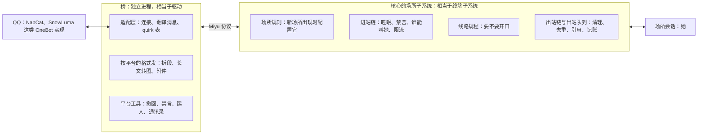
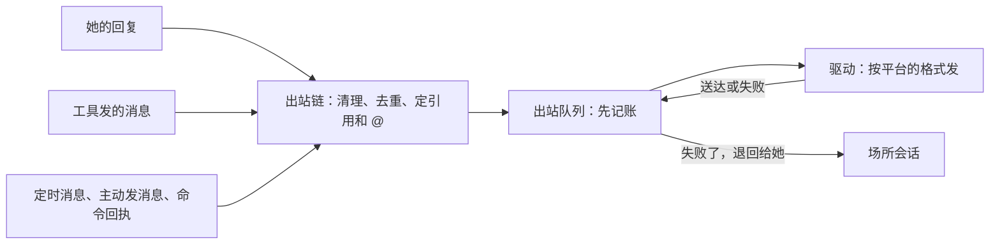

## 通讯平台（草案）

状态：Q1 到 Q16 已定（2026-09-25）。其余内容为草案。

旧版 QQ 这一套**效果很好，后端很乱**（项目主人 2026-09-25）。所以这里的做法是：旧版磨出来的效果照搬，后端从头分层，而且照着 Linux 来搭（第二节）。第一版只接 QQ（Q9），但除了驱动那一层，其余全部和平台无关，以后接别的平台直接共用。

### 一、分工：桥只翻译，核心做决定



| 桥 | 核心 |
|---|---|
| 连 QQ，收发消息 | 场所、场所规则、会话、事件日志 |
| 把 QQ 的消息、通知、请求翻译成统一的形状 | 进站链、线路规程、判官、冷静机制 |
| 按平台的格式发出去：拆段、长文转图、表情包、图片文件语音 | 出站链与出站队列：清理、去重、引用和 @、记账 |
| 提供平台工具：发消息给任意好友或群、撤回、禁言、踢人、头衔、通讯录 | 上下文、记忆（按谁看得到召回）、群管策略、入群审批 |
| quirk 表：关住平台实现各自的毛病（第十一节） | 命令、权限、模型调用 |

- **桥是一个头，同时是一个扩展**（`01-架构.md` D3、`05-内核接口.md` 第四节）。它代表平台上的人发命令（`act_for_external`），也向核心提供平台工具。
- **凡是要用模型的决定都在核心**：判官、入群审批，都是核心里的策略，按模型挡位发辅助请求（`15-模型与供应商.md` 第四节）。桥不碰模型。
- **所以换平台只换桥**。以后接 Telegram、Discord，写一个新的桥，线路规程、冷静机制、记忆这些全都不用再写一遍。旧版的这套逻辑写在 QQ 平台层的插件里，换平台就得重写。

**旧版乱在哪里**。子代理逐文件核对过旧版 3.9 万行的平台层，问题主要是这几类：

| 问题 | 证据 |
|---|---|
| 把核心该做的事又做了一遍 | 自己的回合排队与抢占，大约有八套机制；自己的插件系统，17 个挂接点；自己的权限判断；自己的聊天记录库，还带迁移；判官、好感度、入群审批三处各自直连模型、各自重试 |
| 同一条规则写了好几遍 | 「是不是管理员或白名单」至少算了 7 处，其中一处漏看了动态授权；取出站文字的函数有三四份；长文转图的渲染器开了两个 |
| 上帝对象和巨型函数 | 一个 25 个字段的回合上下文；处理一条消息的函数约 720 行，判断要不要开口的约 590 行 |
| QQ 的细节漏到了下层 | 14 种 `<qq-*>` 提示词标签散在 11 个文件里；最底层的公共代码里放着 QQ 头像的地址和 QQ 专用的端口 |
| 一个群的状态散在好几处 | 聊天记录库、会话历史、插件的键值表、核心的几张表，外加只放在内存里的冷静和续聊状态，一重启就丢 |
| 入口各走各的 | 进来的消息、命令、后台唤醒、定时消息、主动发消息，排队的方式和拼提示词的方式都不一样 |

### 二、仿 Linux：Linux 上的 Linux

项目主人（2026-09-25）：希望「接入通讯平台这个子系统也要仿照 Linux 进行设计。这样后端可能会更清晰，扩展起来也更方便一些」。Miyu 整体像一台操作系统（`01-架构.md` 第二节）；通讯平台这个子系统里再套一层，照 Linux 的终端子系统来搭：

| Linux | 通讯平台子系统 | 说明 |
|---|---|---|
| 终端驱动：串口、USB 串口、伪终端 | 桥的适配层 | 把一种平台的线路协议翻译成统一的消息 |
| 设备节点 `/dev/tty*` | 场所 | 一个群或一个私聊，就是一个设备 |
| 进程的控制终端 | 场所会话 | 她挂在这个场所上说话 |
| 线路规程（line discipline） | 要不要开口的策略 | 决定进来的消息什么时候交给她；每个场所挂一个，可以换 |
| udev 规则 | 场所规则 | 新场所出现时，按规则决定它的人格、预设、线路规程、限流 |
| netfilter 的链 | 进站链、出站链 | 一条条规则按顺序过，每条给出结果 |
| 邮件系统的队列 | 出站队列 | 先入队再发送，失败了退回，过期作废 |
| `ioctl` | 平台工具 | 收发之外，每种设备自己提供的操作：撤回、禁言、踢人 |
| 驱动的 quirk 表 | 平台实现的毛病 | 按连上来的是哪个实现、哪个版本，打开对应的修正 |
| 信号 | 命令与连接状态 | `/stop` 相当于 Ctrl+C；桥断线相当于挂断 |
| `udevadm info`、`stty` | `miyu venue show`、`miyu venue set` | 看一个场所的属性和它们的来处，改一个场所 |
| `stty -F /dev/ttyS0` | 从别处操作一个场所 | 在终端的会话里，写明操作的是哪个群、哪个好友（第九节） |
| `~/.ssh/authorized_keys` | 主人绑定 | 写在这台机器上的一条记录，把远端的身份认成本机的用户 |

这一篇里说的「驱动」都是场所驱动，和把请求翻译给模型供应商的模型驱动（`05-内核接口.md` 第七节）不是一回事。

每一种扩展都有固定的插口，都不用改核心：

| 想做的事 | 插口 |
|---|---|
| 接一个新平台 | 写一个驱动，也就是一个新的桥 |
| 换一种开口的方式 | 写一个线路规程 |
| 加一道过滤，例如拦广告 | 往进站链或出站链里加一条规则 |
| 改新场所的默认 | 加一条场所规则 |
| 加一种平台操作 | 驱动多提供一件平台工具 |
| 平台实现又出了新毛病 | quirk 表里加一行 |

### 三、场所与场所规则

- **场所**在这一篇里指通讯平台上的一个群、一个私聊，以及桌面语音（`20-语音.md` V3）。本机的头也算场所（`01-架构.md` 第五节），但它们不走这一篇的场所规则和进站链。每个场所一个会话，一直续下去；太长了照常压缩（`09-压缩.md` Z8）。
- **场所出现**：驱动报告有一个新场所，例如机器人被拉进一个新群、有人第一次私聊她。核心按场所规则把它配好，就像插上一个设备，udev 按规则给它命名、设权限。
- **场所规则**（Q13）放在 `system/venues.d/` 下，按文件名的顺序套用。每条规则有匹配条件和要设的属性；一个场所匹配到的规则全都套上，后面的覆盖前面的。

```toml
# system/venues.d/50-defaults.toml
[[rule]]
match = { kind = "group" }
persona = "miyu"
preset = "full"
discipline = "chatty"
rate = "5/300s"

[[rule]]
match = { kind = "private" }
discipline = "every-message"
```

```toml
# system/venues.d/80-my-groups.toml
[[rule]]
match = { platform = "qq", group = [123456, 234567] }
rate = "30/60s"
managers = [10002]
```

规则能设的属性：

| 属性 | 管什么 |
|---|---|
| `persona`、`preset` | 这个场所用谁、以什么方式工作（`16-人格与预设.md` 第六节）。群里要用别的模型，就给它配一个预设，不另开一套模型路由 |
| `discipline` | 线路规程（第六节） |
| `allow` | 这个场所能不能叫她 |
| `keywords` | 除了 @ 她、回复她之外，还有哪些词能叫她 |
| `restraint` | 冷静机制开不开 |
| `rate` | 限流 |
| `sleep` | 睡眠时间，例如 `23:00-07:00`，可以跨午夜 |
| `managers` | 谁能在这里用 `/reset` 这类命令 |
| `show_ids` | 她看不看得到发送者的号码 |

- **看和改**：`miyu venue show` 列出一个场所的每一项属性，以及它来自哪条规则，像 `udevadm info`。`miyu venue set` 写一条只匹配这个场所的规则，像 `stty`，但会留下来。终端界面和网页看到的是同一份。
- **旧版的白名单、按会话的专属配置、平台的默认，是三套各自的东西**，现在都是规则。旧版 QQ 这条线有大约 195 个配置项，光「要不要开口」就占了 95 个，存成不带类型的 JSON，每轮重新解析。这里规则只有上表这些属性，按配置清单声明（`14-配置.md`）；判官的权重、窗口的长短这类数字，是软件包里的默认值，不放上界面。
- **人的名单**写在系统配置里，不在场所规则里：
  - **主人**（Q7，2026-09-25 确认）：写下你的 QQ 号就是绑定，像 `authorized_keys`。只有能改这台机器配置的人写得了，写下它本身就是证明。
    - 在私聊里，你就是你本人：她有你全部的工具，照你的权限级别来；要确认的事就在聊天里问你，你回一句就行。
    - 在群里，仍按群的规矩：群里还有别人，别人的话也会进她的上下文，所以不碰主机。你在群里多的是管理命令的权限。
    - 代价要说清楚（2026-09-25 项目主人确认：用法照旧，风险写明）：
      - QQ 号被盗，就等于这台机器在你的权限级别下被别人用；
      - 「这是主人发的」只能听桥和 OneBot 实现报上来的。OneBot 实现被人拿下，或者本身不怀好意，就能伪造你的私聊；
      - 网页、文件里藏着的提示词注入，可能让她提出危险的操作，你在聊天里随手回一句「好」，它就执行了。
    - 不改用法的加固：OneBot 实现默认只接本机的，并且要带访问令牌；她在聊天里问确认时，把要执行的命令原样写出来；所有操作都记在日志里，QQ 那边撤回的只是命令回执，日志里照样在。
  - **自己人**：私聊里能叫她，不限流，睡眠时间里私聊也放行。
- **场所组**：每个群自动是一个组，组员是在群里说话的人，由桥担保（`06-多用户与身份.md` 第二节）。群里的人是外部身份，碰不到这台机器。

### 四、群里的每条消息都是事件

- **群里的每一条消息，不管是不是冲她来的，都记成这个场所会话的事件**：谁说的、说了什么、引用了哪条、带了什么图和文件。撤回、戳一戳、禁言、有人进群退群，也都是事件（Q2）。
- **聊天记录就是会话日志。** 她搜聊天记录，搜的是它的派生索引（`07-存储.md` S3）。旧版另开了一个聊天记录库，和会话各存一份，两份真相。
- **撤回的消息照样看得到**：标明被撤回，写明是谁撤的。旧版把撤回的标记记下了，但读的那一侧从来没人去看，撤回的消息在历史里凭空消失。
- 图片、文件、视频先只记下编号，她要看时再由桥去取（懒下载）。
- 合并转发的消息，进来时就展开，里面的每一条都记下，不用以后再去平台取。里面的图片、文件、视频同样先只记编号，要看时再取。
- **同一条消息只记一次**：桥把平台的消息编号当作命令编号（`04-核心协议.md` 第六节）。连接断了重连、平台重发，核心也只收一次。旧版在进门之前没有按消息编号去重。
- **睡着时收到的消息照样记下，但她看不到**：不进群聊近况，醒来以后也不补看（第五节）。旧版的文档说这段时间的消息不进历史，代码却在准入之前就存了；这里明确成记下、不给她看（2026-09-25 确认：「那是消息记录，睡着时也记录，正常。」）。

### 五、进站链：先过这一道

进来的每条消息，先过进站链，像 netfilter 的 INPUT 链：一条条规则按顺序过，每条给出一个结果（Q6、Q14）。

| 结果 | 意思 |
|---|---|
| 放行 | 交给这个场所的线路规程（第六节） |
| 只记下 | 记成事件，不往下走 |
| 拒绝并回一句 | 记成事件，回一句说明，例如限流的提示 |

自带四条规则，按这个顺序：

1. **睡眠时间**：时段内只放行主人（私聊、群聊都行）和自己人（只在私聊）。其余的消息只记下（第四节）：不参与主动插话，不占限流额度，也不回话。醒来以后照旧，睡着时错过的不补看。
2. **她被禁言了**：只记下。这像串口的 XOFF：出站也同时暂停（第八节）。禁言的状态以平台的通知为准，并且定时去平台复查（第十一节）。
3. **谁能叫她**：按场所规则的 `allow`，以及人的名单（第三节）。
4. **限流**：数的是她要跑的回合，不是群里的消息条数。超了先拒绝并回一句「消息太频繁了，请稍候再发。」，之后只记下，主动插话也暂停。主人和自己人不计数。它是防滥用、防花费的兜底，不管她话多不多；话多话少归冷静机制管。

- 扩展可以往进站链里加规则，例如按关键词拦广告。加在哪个位置，清单里写明（`05-内核接口.md` 第五节的链式插槽）。

### 六、线路规程：要不要开口

线路规程决定进来的消息什么时候交给她，每个场所挂一个，可以换（Q12）。自带四个：

| 线路规程 | 什么时候交给她 | 默认用在 |
|---|---|---|
| **每条都回** `every-message` | 有字的消息都交给她 | 私聊 |
| **叫她才回** `when-called` | 冲她来的才交给她：@ 她、回复她、叫到她的名字或触发词；她刚回过的人接着说；同一个人接连发的几条 | 想让她安静的群，例如工作群 |
| **看情况插话** `chatty` | 冲她来的一定交给她；没人叫她时，判断要不要插一句 | 群的默认 |
| **唤醒** `wake` | 听到唤醒词才交给她；回复以后一小段时间内不用再叫 | 桌面语音（`20-语音.md` 第四节） |

看情况插话就是旧版的那一套，效果照搬（Q4）：

- **触发条件是一个集合，不是互斥的梯子**：
  - 冲她来的：@ 她、回复她的消息、叫到她的名字或触发词；
  - 续聊：她刚回过某人，这个人接着说；
  - 刚说过话：她刚在群里说过话，一小段时间内大家接着聊；
  - 顶替：同一个人在很短的窗口里接连发了几条，后一条接过前一条的回合（旧版定为 7 秒）。

  几个条件同时成立时，各自的加分相加，不封顶。旧版原来是一条 if-else 优先级的梯子，几个机制只能互相抢，后来才改成集合。
- **主动插话**：没人冲她来时，按一个小概率抽样，交给判官判断要不要插一句。判官从相关度、意愿、社交、时机、连贯五个方面打分，并说明这句话是不是在跟她说话。
- **冷静机制只管插嘴**：冲她来的话都不受它压，这是按真人聊天的样子定的。每说一轮，「最近说了多少」加一，随时间按半衰期回落；插嘴的门槛按一条内置的曲线往上抬，一两句几乎不抬，连说三四句才明显。
  - 这条曲线不给旋钮，只留一个开关。项目主人在旧版说过：「没有人回去调挡位的」。
- **这些状态都从日志里算出来**：最近说了多少、续聊的窗口、正在等判官的消息，都是场所会话日志的投影，核心重启以后照样在。旧版把它们放在内存里，一重启就没了。
- **两边各看各的**：判官看不到程序的加减分，主模型看不到判官的打分。旧版把程序的加减分写进判官的提示词，判官就重复算分；分数一旦摆在模型面前，她就会拿它立规矩。
- **违规审核**：判官同时检查违规。命中时不管有没有人叫她，都会触发，并附上审核提示。
- **不做好感度**（2026-09-25 项目主人：「移除好感度系统吧，这东西没用。」）。

**不管哪个线路规程，群里的每个回合都能不说话，而且知道为什么叫她**（Q5）：

- 群里的每个回合都有一个明确的「这次不说话」的工具（`skip_reply`）。用了它，这一回合就不发任何消息，理由只记进日志。它由场所子系统提供，只在场所会话里有（第九节）。
- 每个回合开头都写明她为什么被叫来：被 @ 了、有人回复她、有人接着她的话，还是「没人叫你，这是一次插话的机会」。这是一条事实型注入，用英文写（`08-上下文投影.md` C2）。
- 这两条针对的是旧版的一个真问题：好几条路径会硬起一个「必须说点什么」的回合，既不说明为什么叫她，也不给她不说话的路。她只好把「这没 @ 我，我先旁听」说出口。这句话被记进群聊历史，又被原样回放，最后变成了她的自我认知。

### 七、她看到什么

- **群聊近况**：两次回合之间群里的消息，在下一个回合里作为一块，放在触发消息的前面（`08-上下文投影.md` C2）。它就是这些事件的投影，不另外注入；太多时只放最近的一段，更早的她可以用工具去搜。
- **发送者**：平台给的身份（号码、群里的角色）是可信的字段；昵称、群名片、正文是不可信的字段。不可信的文字进提示词之前先清洗，防止有人伪造一条记录行。
- **引用**：被引用的是一条旧消息，作者是被引用的那个人，不是在跟她说话。这条规矩写在系统提示词的场所说明那一段里（`08-上下文投影.md` 第三节）。旧版一开始没写，她把群友引用的别人的话当成是对她说的。
- **撤回**：标明被撤回，以及是谁撤的（第四节）。
- **记忆**：按这次回复会被谁看到来召回。群里就是群里的所有人，所以你私下告诉她的事，她不会在群里说出来（`17-记忆.md` L6）。
- **回合进行中又来了消息**：冲她来的（@ 她、回复她），在下一步的边界加进来；其余的等这一回合结束，并进下一回合的群聊近况（`08-上下文投影.md` 第五节）。
- **工具**：群里能用的工具，是预设打开的，再去掉碰主机的（`05-内核接口.md` 第六节的 `venues`）。群里需要确认的操作一律拒绝，并告诉她原因（`11-权限与沙盒.md` A11）。

### 八、出站：出站链、出站队列、驱动

她要说出去的一切，走同一条路（Q8、Q15）：



**出站链**在核心里，和平台无关，像 netfilter 的 OUTPUT 链（Q14）：

1. **清理**：漏进正文的工具调用格式去掉；整条只有括号里的旁白，就不发。
2. **去重**，只在同一个回合里生效：图片按内容的哈希去重；文字按归一化后的相似度去重。旧版实测：端点出故障的那天，她会把「发送」这一步一遍遍重做，每次换一种说法。两道闸都不能拆。
3. **引用和 @**：回复谁、要不要引用、要不要 @ 对方。沿用旧版的规矩：中间隔了几条别人的消息才引用，隔了一会儿才 @。

- 她的回复和工具发的消息走同一条链。旧版这两条路各走各的：工具发的消息查两道去重，最终回复只查一道，而且不记账。
- 扩展可以往出站链里加规则。

**出站队列**像邮件系统的队列（Q15）：

- 每一条先记成「入队」的事件，再交给驱动；驱动报回送达或失败，也记成事件。先记账再发送，核心重启了也知道哪些发了、哪些没发。
- 发不出去就退回给她，像退信：她在下一步知道这条没发出去，以及为什么。
- **定时消息**就是带着「不早于某个时间」入队；过了时间点还没发出去就作废，不补发。
- **命令回执**带着「3 秒后撤回」入队：`/reset` 这类命令的回执发出 3 秒后自动撤回，群里不留机器人的内部状态。发命令的那条消息不撤。
- **她被禁言时，队列暂停**。过期的作废，不会在解禁以后一股脑发出去。

**驱动**在桥里，按平台的格式发：

- 她说的每一段都发出去，工具调用本身不发。Markdown 转成纯文本，太长的按段拆开。
- **长文转图**：超过一定长度就把 Markdown 画成图片发出去，发失败了退回原文。版式照旧版：长宽跟着内容自动定，尽量接近方形，表格续栏时重复表头。也可以改成合并转发。
- **表情包、图片、文件、视频、语音**：表情包单独发一条，和正文之间隔一小会儿。语音由语音子系统转，播报时把原文一起记进历史。
- 出站的附件交给平台时，用短时有效的地址，过期作废。

### 九、平台工具：像 `ioctl`

收发消息之外，每个平台自己的操作由驱动提供，像设备的 `ioctl`。桥没连着时，这些工具照样留在目录里，调用时返回「桥离线」（`05-内核接口.md` I6）。

| 能力 | 做法 | 谁提供 |
|---|---|---|
| 发消息 | 发给任意好友或群，收件人从通讯录里找，名字对不上时列出候选 | 桥 |
| 通讯录 | 好友和群的名单 | 桥 |
| 场所总览 | 最近哪些场所有新消息、谁找过你、有没有人 @ 她 | 核心，读场所会话的日志 |
| 聊天记录 | 按场所、关键词、人、时间范围搜 | 核心，读场所会话的日志（第四节） |
| 群文件 | 列出群文件，按文件夹找 | 桥 |
| 下载文件 | 群文件和聊天里的文件：在终端里下载到这个会话的工作区，在群里作为附件 | 桥 |
| 补拉消息 | 桥断线时漏掉的消息，从平台补回来；补回来的只进聊天记录，不进群聊近况 | 桥 |
| 撤回 | 撤自己的消息直接撤；在群里撤别人的，要她是群主或群管理员；撤回的目标永远以回复的那条为准，不信模型给的编号 | 桥 |
| 群管 | 禁言（单位是秒，返回里写明换算成多久）、踢人、拉黑、头衔；默认不能动群主和群管理员 | 桥 |
| 二次确认 | 不是管理的人让她做群管操作时，要她在同一轮里把这次调用原样再发一遍，防止手滑 | 核心 |
| 不说话 | `skip_reply`：这一回合不发任何消息，理由只记进日志 | 核心，场所子系统 |
| 互动 | 戳一戳，给消息贴表情 | 桥 |
| 入群审批 | 由核心按模型挡位发一次辅助请求来判断；判不了、没配置、出错，一律保持待定，不误拒 | 核心 |
| 好友请求 | 默认只自动通过自己人和主人；群邀请只记下，保持待定 | 核心 |

**从别处操作场所**（Q16，2026-09-25 确认）。这是「在 QQ 私聊里操作这台机器」（Q7）的反面：在终端里处理 QQ 上的事。

- **每件平台工具都带一个「对哪个场所」的参数。** 在场所会话里，默认就是这个场所，像操作自己的控制终端；在终端、网页的会话里，必须写明是哪个群、哪个好友，像 `stty -F /dev/ttyS0` 操作的是另一个设备。
- **只有主人能从别处操作。** 平台上的场所属于管理员（`06-多用户与身份.md` 第三节），成员的会话里没有这些工具。
- **哪些会话有这些工具，由预设决定**：功能全开里有，在终端里也能用；开发预设里没有。旧版有意把它们从终端拿掉，现在这件事交给预设（`16-人格与预设.md` Y7）。
- **预设没开这些工具时，她知道它们存在**：系统提示词里有一行写明「装了、但这次没开」（`16-人格与预设.md` Y8）。被问到时，她会说换哪个预设，不会自己去拼平台的接口。旧版的 issue #49 记下了这个毛病：终端里只有两件 QQ 工具，她就用 curl 去猜 NapCat 的接口，猜错了拿到 404，还下结论说「OneBot 不支持读历史消息」。
- **不做任意接口直通的工具。** 那样她还是要去猜接口名，也就回到了 issue 里的老问题。常用的做成正式的工具，名字直接说明能做什么。

### 十、命令与信号

- 命令由核心解析（`04-核心协议.md` P4），桥只把原文交过去。
- `/reset`、`/stop`、`/models` 这类命令，只有主人和场所里管理的人能用。
- 命令的输出和普通回复走同一条出站的路（第八节），所以长清单一样会转成图片；只有限流提示这类故障时的短通知绕过它。

平台上发生的几件事，像终端上的信号：

| 平台上发生的事 | 相当于 | 怎么办 |
|---|---|---|
| `/stop` | Ctrl+C | 打断这个场所正在进行的回合，历史保留 |
| 桥断线 | 挂断 | 场所标成离线；正在进行的回合照常结束，出站队列等桥重连，过期的作废 |
| 她被禁言 | XOFF | 进站只记下，出站暂停（第五节、第八节） |
| 她被踢出群、群解散 | 设备被拔掉 | 场所标成已移除；会话留着，能查，不能说 |

### 十一、驱动的 quirk 表

同样叫 OneBot v11，不同的实现各有各的毛病。它们写成驱动里的 quirk 表，像 Linux 的驱动按设备型号打开对应的修正：桥连上以后，先问对端是哪个实现、哪个版本，再打开对应的几条（Q10）。这些都只写在 QQ 桥里，不许漏到核心。

| 实现 | 毛病 | 旧版踩到的现象 |
|---|---|---|
| SnowLuma | 发出的消息编号有一半是负数，它自己收引用时又把负数扔掉 | 自动引用有一半静默失效，消息照发，还回「成功」 |
| NapCat | 查自己的禁言状态时，会用它自己的成员缓存 | 被提前解禁以后，她以为自己还被禁言，一个群连着两个多小时不说话 |
| 通用 | 视频消息的编号只有通用的取文件接口认 | 她看不了别人发的视频 |
| 通用 | 语音消息要先按 wav 取回来，再交给语音识别 | 语音只显示成「语音消息」 |
| 部分实现 | 加群请求的 flag 格式不一样 | 处理加群时报「系统已处理」 |

- 排查时先确认到底是哪个实现连在端口上。旧版有一次花了几十分钟读 NapCat 的源码，其实连着的是 SnowLuma。

### 十二、协议

- 桥连上核心时声明两个身份：头，以及平台工具的提供者（`04-核心协议.md` 第三节、`05-内核接口.md` 第四节）。它需要 `act_for_external`、`sessions.drive`、`tools` 三项能力。
- 场所出现和消失，由桥报给核心，像热插拔：`venue.appeared`、`venue.gone`。
- 平台上的消息和通知，经桥变成对场所会话的命令。桥说明这是平台上的谁；这个人是不是主人，由核心按系统配置来认，不信桥的一面之词。
- 出站队列里的一条，由核心经反向调用 `outbound.send` 交给桥；桥发完，在回应里报送达或失败，核心记成事件。
- 看和改场所：`venue.list`、`venue.show`（每一项属性附上来自哪条规则）、`venue.set`（写一条只匹配这个场所的规则）。
- **事件**：群里的每条消息都是 `message.user`，body 里带着发送者、引用和附件；触发回合的那一条由 `turn.started` 指明。撤回、戳一戳、禁言、进群退群，以及出站队列的入队、送达、失败，用场所子系统的命名空间 `ext.venues.*`（`03-事件模型.md` E6）。

### 十三、决定

**Q1. 分工**

- **已定：桥只翻译、按平台的格式发、提供平台工具；场所规则、进站链、线路规程、出站链与出站队列、上下文、记忆、判官、群管策略都在核心，和平台无关。**
- 未选：旧版的做法，这些都写在 QQ 平台层里。换一个平台就得重写一遍，而且平台层自己又长出了一套回合管理和插件系统。
- 重开条件：出现只有某个平台才有、核心表达不了的决定。

**Q2. 群里的消息存在哪**

- **已定：每一条都是场所会话的事件，按平台的消息编号只记一次；聊天记录的搜索是它的派生索引；撤回的消息照样看得到；睡着时收到的也记下（2026-09-25 确认）。**
- 未选：另开一个聊天记录库，也就是旧版的做法。两份真相，撤回、删除要在两处各做一遍。
- 重开条件：实测消息量让会话日志成了瓶颈。

**Q3. 一个场所几个会话**

- **已定：一个，一直续下去，太长了照常压缩。**
- 未选：按天或按话题切开。切口处她会突然忘了刚才在聊什么。
- 重开条件：无。

**Q4. 看情况插话怎么判断**

- **已定：沿用旧版的效果：触发条件是集合、加分相加；主动插话靠抽样加判官；冷静机制只管插嘴，曲线内置、只留开关；判官和主模型各看各的（项目主人 2026-09-25：效果很好）。** 窗口的长短、抽样的概率这类数字，实现时按旧版日志重新校一遍。验收时拿旧版的群聊日志回放：同样的消息流，新实现要不要开口的决定和旧版逐条对照，差得多的逐条查（2026-09-25 补）。
- 未选：每条消息都交给判官。花费大，而且判官一慢，她就总是慢半拍。
- 重开条件：实测新的实现和旧版的效果对不上。

**Q5. 每个回合都能不说话**

- **已定：群里的每个回合都有 `skip_reply` 工具；每个回合都写明为什么叫她。**
- 未选：靠提示词叫她「不该回就别回」。旧版就是这样，她把「没 @ 我」说出了口，还越传越多。
- 重开条件：无。

**Q6. 准入**

- **已定：进站链自带的四条规则，按睡眠时间、禁言、谁能叫她、限流的顺序。限流数的是回合，是兜底，不管话多话少。**
- 重开条件：无。

**Q7. 主人的平台账号**

- **已定：写进系统配置就是绑定。在私聊里，主人就是管理员本人，确认直接在聊天里问；在群里仍按群的规矩（2026-09-25 确认）。** 这改掉了 `06-多用户与身份.md` U8 在私聊里的那一半。伪造和注入这两条风险照写在第三节，用法不变（2026-09-25 项目主人确认）。
- 未选：保持 U8 原来的定论，谁都不绑定，平台上的人一律是外部身份。那样主人在 QQ 上就叫不动这台机器，而旧版里这是天天在用的。
- 重开条件：出现主人的平台账号被盗用的实际情况。

**Q8. 去重与回执**

- **已定：她的回复和工具发的消息过同一道出站链；同一回合里图片按内容的哈希去重、文字按相似度去重；命令回执 3 秒后自动撤回。**
- 重开条件：无。

**Q9. 第一版接哪些平台**

- **已定：只接 QQ，走 OneBot v11（2026-09-25 确认）。**
- 未选：同时接 Telegram、Discord。以后写新的桥就行，核心不用动。
- 重开条件：有人要用别的平台。

**Q10. 平台实现的差异放在哪**

- **已定：只放在各个桥的 quirk 表里；桥连上时问清对端的实现和版本，打开对应的修正。**
- 未选：在核心或共用的代码里判断「这是不是 NapCat」。一个实现的毛病会变成所有平台的负担。
- 重开条件：无。

**Q11. 回合从哪里进**

- **已定：场所会话的回合只有一个入口，就是这个会话的 actor（`02-内核.md` 第七节）。群里来的消息、命令、后台任务的唤醒、定时消息、主动发消息，都从这里进。**
- 未选：各走各的，也就是旧版的做法。进来的消息要排队，命令能抢先，唤醒不排队，定时消息绕过插件；同一个会话里甚至拼出了两份不同的系统提示词。
- 重开条件：无。

**Q12. 线路规程**

- **已定：要不要开口做成可以换的线路规程，每个场所挂一个。自带四个：每条都回（私聊的默认）、叫她才回、看情况插话（群的默认，就是旧版的那一套）、唤醒（桌面语音，`20-语音.md` V6）。**
- 未选：旧版的做法，一套写死的判断，只能用开关关掉其中几段。想要一种新的开口方式，只能去改那一套。
- 重开条件：无。

**Q13. 场所规则**

- **已定：场所出现时按 `system/venues.d/` 里的规则配置，按文件名的顺序套用，后面的覆盖前面的；`miyu venue show` 能看每一项来自哪条规则。**
- 未选：旧版的做法，白名单、按会话的专属配置、平台的默认各是一套，一个群最后听谁的，要看三处才知道。
- 重开条件：规则多到人看不懂。

**Q14. 进站链与出站链**

- **已定：进站前和出站前的检查，都写成按顺序的一条条规则，每条给出结果；扩展可以往里加。**
- 未选：写成一个函数里的一串判断，也就是旧版处理一条消息的那个约 720 行的函数。
- 重开条件：无。

**Q15. 出站队列**

- **已定：一切出站先入队再发送，送达和失败都记成事件；发不出去就退回给她；定时消息和命令回执都是带条件的入队；她被禁言时队列暂停，过期的作废。**
- 未选：直接发，各条路自己记账。旧版的最终回复、工具发的消息、定时消息，就是三种记法。
- 重开条件：无。

**Q16. 从别处操作场所**

- **已定：每件平台工具都带「对哪个场所」的参数，在场所会话里默认是这个场所，在别处必须写明；只有主人能从别处操作；哪些会话有这些工具由预设决定，功能全开里有、开发里没有（2026-09-25 确认）。**
- 未选 A：终端里一概没有平台工具，也就是旧版的做法。旧版 issue #49：她只好去猜平台的接口，猜错了还下结论说平台不支持。
- 未选 B：给一件任意接口直通的工具。她还是要去猜接口名。
- 重开条件：无。

**后续再定**

- 判官、入群审批的提示词：随提示词的设计定（第二轮细纲）
- 长文转图的渲染放在哪个进程：随渲染 worker 定（`01-架构.md` 第八节）
- 语音：已定，见 `20-语音.md`
