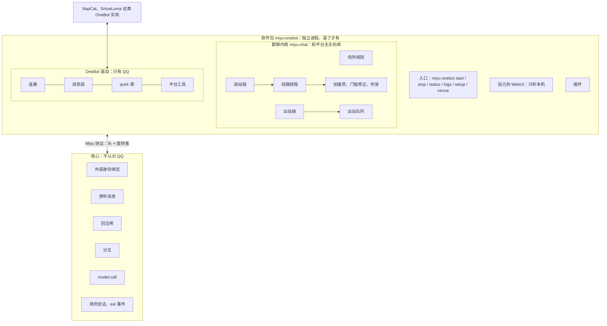
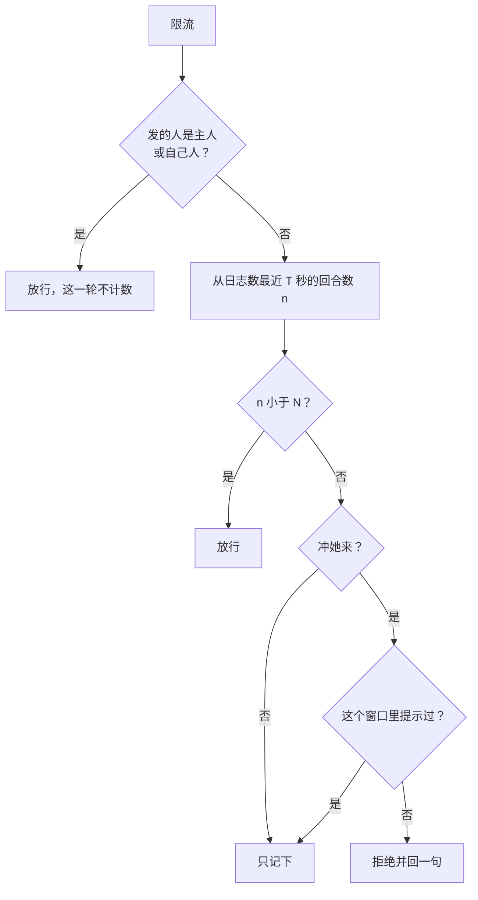
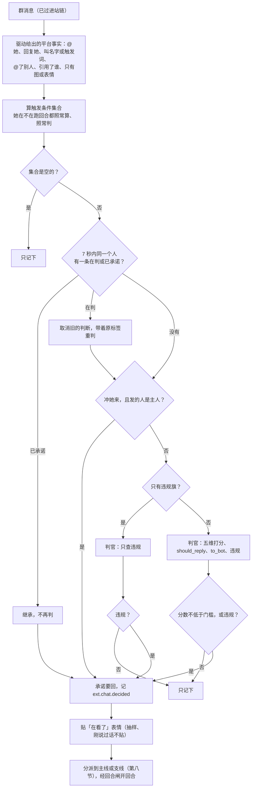
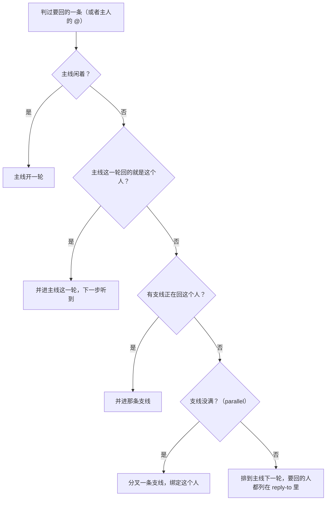
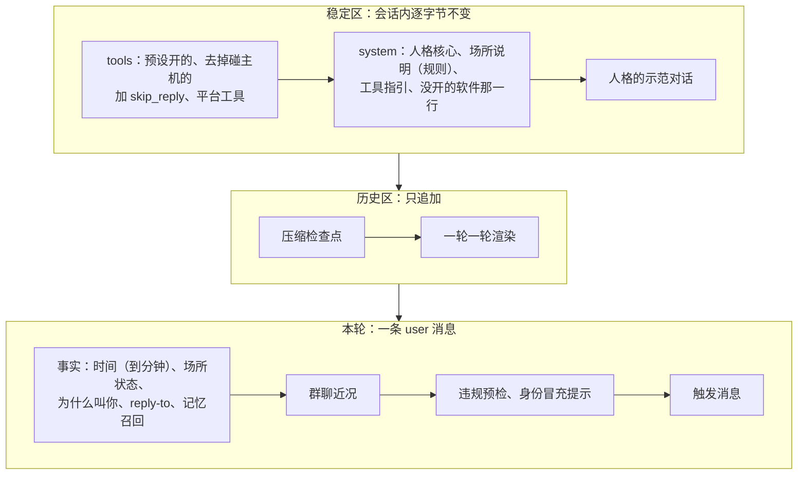
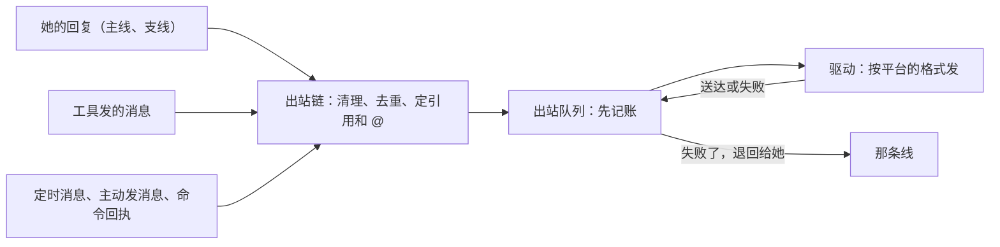

## 通讯平台（草案）

状态：Q1 到 Q27 已定（Q1 到 Q16 于 2026-09-25 定，Q7 于 2026-09-26 改；Q1、Q4、Q7、Q12 于 2026-10-07 改，Q17 到 Q27 于 2026-10-07 定）。其余内容为草案。讨论时画的图在 `docs/reviews/2026-10-07-onebot拆分图.html`、`2026-10-07-限流与主动回复判断.html`、`2026-10-07-并行回复与上下文组装.html`。

旧版 QQ 这一套**效果很好，后端很乱**（项目主人 2026-09-25）。所以这里的做法是：旧版磨出来的效果照搬，后端从头分层，而且照着 Linux 来搭（第二节）。第一版只接 QQ（Q9），走 OneBot v11。除了驱动那一层，其余全部和平台无关，以后接别的平台直接共用。

通讯平台是一个**软件包** `miyu-onebot`，和终端界面、网页平级，是一个头（Q17）。不装它，核心里没有一行 QQ 的代码、一个 QQ 的配置项。

### 一、分层：核心、群聊内核、驱动


```mermaid
flowchart TB
    qq["NapCat、SnowLuma 这类 OneBot 实现"] <--> drv
    subgraph pkg["软件包 miyu-onebot：独立进程，装了才有"]
        direction TB
        entry["入口：miyu onebot start / stop / status / logs / setup / venue"]
        web["自己的 WebUI：只听本机"]
        subgraph chat["群聊内核 miyu-chat：和平台无关的库"]
            direction LR
            rules["场所规则"]
            inq["进站链"] --> ld["线路规程"] --> sc["加值项、门槛修正、判官"]
            oq["出站链"] --> spool["出站队列"]
        end
        subgraph drv["OneBot 驱动：只有 QQ"]
            direction LR
            tr["连接"] --- codec["消息段"] --- qk["quirk 表"] --- io["平台工具"]
        end
        plug["插件"]
    end
    pkg <-- "Miyu 协议：头 + 提供者" --> core
    subgraph core["核心：不认识 QQ"]
        direction LR
        p1["外部身份绑定"]
        p2["旁听消息"]
        p3["回合闸"]
        p4["分叉"]
        p5["model.call"]
        p6["场所会话、ext 事件"]
    end
```

| 层 | 在哪 | 管什么 |
|---|---|---|
| **核心** | 核心进程 | 场所会话和它的日志；外部身份绑定、系统账号；旁听消息、回合闸、分叉这几个通用原语（第十六节）；模型调用、用量；命令、权限、上下文组装，连同群聊近况的取法和渲染（第九节） |
| **群聊内核** `miyu-chat` | 软件包里的一个库，和平台无关 | 场所规则、进站链、线路规程、主动回复判断、出站链与出站队列、并行的分派 |
| **OneBot 驱动** | 软件包里，只有 QQ | 连接 NapCat、消息段的编解码、quirk 表、平台工具 |

- **群聊内核不进核心**（Q1，2026-10-07 重开）：原来定的是场所子系统编进核心，理由是换平台不用重写、用模型的决定都在核心。现在挪进软件包里的一个库，两条理由照样成立：以后的 Telegram 桥链进同一个库，换平台不用重写；判官、入群审批经核心的 `model.call`（施工 8-20）调模型，模型池和用量还是核心记账。换来的是没装 QQ 的人，核心里没有线路规程、判官、出站队列。
- **桥是一个头，同时是一个提供者**（`01-架构.md` D3、`05-内核接口.md` 第四节）：它代表平台上的人发命令（`act_for_external`），也向核心提供平台工具和 `skip_reply`。
- **核心不认识 QQ**：核心只多了几个通用的原语，终端界面、语音、子代理以后也用得上。凡是 QQ 的细节都关在驱动里（Q10）。
- **代码放在哪一层**（`01-架构.md` 第九节，2026-10-07 照推荐定）：`miyu-chat` 是第 2 层的纯逻辑，只依赖内核的事件类型；`miyu-onebot` 是第 5 层的头，依赖 `miyu-chat`、协议的消息类型和本机传输，不依赖核心的 crate；WebUI 和网页软件共用的 HTTP 那块抽到第 3 层。核心拉起桥、问回合闸、反向调用平台工具，走的都是协议，是进程之间的事，不是 crate 之间的依赖。
- **群聊近况在核心里渲染，不在群聊内核里**（同上）：它是请求的一部分，请求由核心组装，组装是独占的同步纯函数，外面的扩展挂不上（`05-内核接口.md` 第五节）。放在群聊内核里，核心就得反过来调软件包，成了向上依赖。所以取法和一行一条的渲染写在 `miyu-assemble` 里，和平台无关，只认事件里的字段；桥把要的东西都写进事件：消息的字段、「另一条线正在回」这些标记、回合开始时的 `reply-to` 和「为什么叫你」。判官用的「同一个渲染器」，是桥往下依赖 `miyu-assemble` 的那个函数。

**旧版乱在哪里**。子代理逐文件核对过旧版 3.9 万行的平台层（连同插件 5.2 万行，2026-10-07 又盘了一遍），问题主要是这几类：

| 问题 | 证据 |
|---|---|
| 把核心该做的事又做了一遍 | 自己的回合排队与抢占，大约有八套机制；自己的插件系统，19 个挂接点；自己的权限判断；自己的聊天记录库，还带迁移；判官、好感度、入群审批三处各自直连模型、各自重试 |
| 同一条规则写了好几遍 | 「是不是管理员或白名单」至少算了 7 处，其中一处漏看了动态授权；取出站文字的函数有三四份；长文转图的渲染器开了两个 |
| 上帝对象和巨型函数 | 一个 25 个字段的回合上下文；处理一条消息的函数约 720 行，判断要不要开口的约 590 行 |
| QQ 的细节漏到了下层 | 14 种 `<qq-*>` 提示词标签散在 11 个文件里；最底层的公共代码里放着 QQ 头像的地址和 QQ 专用的端口；28 条 OneBot 实现的特判散在 12 个文件里 |
| 一个群的状态散在好几处 | 聊天记录库、会话历史、插件的键值表、核心的几张表，外加只放在内存里的冷静、续聊、限流状态，一重启就丢 |
| 入口各走各的 | 进来的消息、命令、后台唤醒、定时消息、主动发消息，排队的方式和拼提示词的方式都不一样 |
| 配置界面写死在别的头里 | 终端界面里约 20 屏 QQ 配置，网页设置页里约 1600 行；不用 QQ 的人也装着它们 |

### 二、仿 Linux：Linux 上的 Linux

通讯平台这个子系统也仿照 Linux 设计，后端更清晰，扩展起来也方便（2026-09-25 项目主人定）。Miyu 整体像一台操作系统（`01-架构.md` 第二节）；通讯平台在里面再套一层，照 Linux 的终端子系统来搭：

| Linux | 通讯平台 | 说明 |
|---|---|---|
| 一个软件包，装了才有 | `miyu-onebot` | 自己的入口命令、自己的 WebUI、自己的系统账号（第三节） |
| `postgres`、`www-data` 这类系统用户 | 系统账号 `onebot` | 服务以它的身份运行，它的东西在自己的家目录里（Q19） |
| `systemctl start/stop/status`、`journalctl` | `miyu onebot start/stop/status/logs` | 开关和看日志（Q17） |
| 终端驱动：串口、USB 串口、伪终端 | OneBot 驱动 | 把一种平台的线路协议翻译成统一的消息 |
| 设备节点 `/dev/tty*` | 场所 | 一个群或一个私聊，就是一个设备 |
| 进程的控制终端 | 场所会话 | 她挂在这个场所上说话 |
| 线路规程（line discipline） | 要不要开口的策略 | 决定进来的消息什么时候交给她；每个场所挂一个，可以换 |
| udev 规则 | 场所规则 | 新场所出现时，按规则决定它的人格、预设、线路规程、限流 |
| netfilter 的链 | 进站链、出站链 | 一条条规则按顺序过，每条给出结果 |
| 邮件系统的队列 | 出站队列 | 先入队再发送，失败了退回，过期作废 |
| `fork` | 支线 | 主线忙时分叉出一条支线回另一个人（第八节） |
| `ioctl` | 平台工具 | 收发之外，每种设备自己提供的操作：撤回、禁言、踢人 |
| 驱动的 quirk 表 | 平台实现的毛病 | 按连上来的是哪个实现、哪个版本，打开对应的修正 |
| 信号 | 命令与连接状态 | `/stop` 相当于 Ctrl+C；桥断线相当于挂断 |
| `udevadm info`、`stty` | `miyu onebot venue show/set` | 看一个场所的属性和它们的来处，改一个场所 |
| `stty -F /dev/ttyS0` | 从别处操作一个场所 | 在终端的会话里，写明操作的是哪个群、哪个好友（第十一节） |
| `~/.ssh/authorized_keys` | 主人对应表 | 写在这台机器上的一张表，把远端的身份认成本机的账号（第三节） |

这一篇里说的「驱动」都是 OneBot 驱动，和把请求翻译给模型供应商的模型驱动（`05-内核接口.md` 第七节）不是一回事。

每一种扩展都有固定的插口，都不用改核心（第十四节）：

| 想做的事 | 插口 |
|---|---|
| 接一个新平台 | 写一个新的桥，链进群聊内核 |
| 换一种开口的方式 | 写一个线路规程 |
| 让某种情况更容易或更不容易开口 | 加一个加值项或门槛修正 |
| 加一道过滤，例如拦广告 | 往进站链或出站链里加一条规则 |
| 改新场所的默认 | 加一条场所规则 |
| 加一种平台操作 | 驱动多提供一件平台工具 |
| 平台实现又出了新毛病 | quirk 表里加一行 |

### 三、软件包 `miyu-onebot`

**入口**（Q17，2026-10-07 项目主人定）。软件包清单里声明 `[command]`，`miyu onebot …` 原样转交给 `miyu-onebot`（`05-内核接口.md` I9）：

| 命令 | 做什么 |
|---|---|
| `miyu onebot start` | 打开开关：核心拉起桥，以后核心每次起来都拉起它，直到 `stop`。核心因此常驻（`12-进程形态与分发.md` 第二节），这时提议登记成登录时自动启动的服务 |
| `miyu onebot stop` | 关开关，停掉桥。场所会话、日志都留着 |
| `miyu onebot restart` | 停了再起，例如改了连接的设置 |
| `miyu onebot status` | 开没开、连没连上 NapCat、连的是哪个实现和版本、几个场所、出站队列里积压了几条 |
| `miyu onebot logs` | 桥的运行日志，能跟着看 |
| `miyu onebot setup` | 没有浏览器时的最小接入：只问 NapCat 的令牌和主人的 QQ 号，剩下的改文件 |
| `miyu onebot venue show/set` | 看、改一个场所（第四节） |

- 开关存在核心那边：核心起来时照它决定拉不拉起桥。桥是核心的子进程，随核心退出（`12-进程形态与分发.md` R5）；崩了按退避重启。
- 还没配好就 `start`：桥只开 WebUI，不连 NapCat，等配好。

**自己的 WebUI**（Q18，2026-10-07 项目主人定）。桥进程自己开 HTTP，像 NapCat、AstrBot 的面板：

- 只听本机，端口固定，和网页软件 `miyu-web` 不共用。NapCat 反连进来的端口另开一个：一个凭令牌，一个凭登录，两种凭据不放在一处。旧版共用一个端口，NapCat 的端口要跟着网页端口变。
- 管的：连接状态、主人对应表、场所和场所规则、平台工具的开关、插件和插件的配置；以后的聊天记录、群管面板、插件市场也在这里。
- 登录不自建账号：照网页软件的做法（`21-网页.md` X6，施工 W-8），用户名、密码交给核心验。谁进得来，看他有没有「接平台」这项管理能力（`06-多用户与身份.md` 第四节）：管理员默认有，也能授给一个管群的朋友。
- 配置项照旧在清单里声明，经核心的 `config.set` 写，校验只在一处；WebUI 只是画。
- 终端界面、网页的设置页里只有一行「QQ：打开 miyu-onebot」，不画任何 QQ 的配置。旧版把这些画在终端界面和网页里，不装 QQ 的人也带着，就成了死代码。
- 静态页面、安全响应头、登录握手这几样和网页软件一样，抽成两边共用的库，不抄一份。

**系统账号 `onebot`**（Q19，2026-10-07 项目主人定）。像 Linux 给服务开的系统用户：

- 装 `miyu-onebot` 时建，彻底卸载（purge，`12-进程形态与分发.md` R9）时连数据一起删。一个包一个账号，接了两个 QQ 号也共用它，机器人的 QQ 号只是场所的一个属性。
- 没有密码，不能登录；它的东西属于管理员能看能管的那一类（`06-多用户与身份.md` 第二节「系统账号」）。
- 场所会话的属主是它，工作区在 `home/onebot/workspace/`，用量记在它名下。群友就算骗过了场所的强制策略，也碰不到你的工作区和会话：属主都不一样。
- 例外：主人的私聊会话属于主人对应的本机账号（下面）。

**主人对应表**（Q20，2026-10-07 项目主人定，改了 Q7 的写法）。像 `authorized_keys`：系统配置里一张表，「平台上的身份 → 本机账号」：

```toml
# 系统配置。键是核心的、通用的，不带 QQ 的名字：以后别的平台的桥也用这一张表
[[external.bindings]]
id = "qq:10001"
account = "admin"

[[external.bindings]]
id = "qq:10002"     # 主人的小号
account = "admin"
```

- 一个本机账号可以对应几个 QQ 号，这几个号的私聊都是那个账号本人。只有能改这台机器配置的人写得了，写下它本身就是证明。
- 由核心认，不信桥的一面之词：桥只说「这是 `qq:10001`」，是不是主人，核心查这张表（第十六节）。
- 主人在私聊里就是对应的本机账号：会话属于那个账号，有那个账号全部的工具，照它的权限级别来。这里没有确认和提问的界面：要越过沙盒的操作，她会说明做不了，请你到终端或网页上做；她有问题就直接问你（`11-权限与沙盒.md` A11，2026-09-26 改）。
- 在群里仍按群的规矩：群里还有别人，别人的话也会进她的上下文，所以不碰主机。你在群里多的是管理命令的权限，你的 @ 也不过判官（第七节）。
- 代价要说清楚（2026-09-25 项目主人确认：用法照旧，风险写明）：
  - QQ 号被盗，就等于这台机器在你的权限级别下被别人用；
  - 「这是主人发的」只能听桥和 OneBot 实现报上来的。OneBot 实现被人拿下，或者本身不怀好意，就能伪造你的私聊；
  - 网页、文件里藏着的提示词注入，能让她在沙盒允许的范围里乱改工作区的文件；越过沙盒的操作在这里一律做不了。
- 不改用法的加固：OneBot 实现默认只接本机的，并且要带访问令牌；所有操作都记在日志里，QQ 那边撤回的只是命令回执，日志里照样在。

**自己人**：私聊里能叫她，不限流，睡眠时间里私聊也放行。和主人不同，自己人仍是外部身份，在群里 @ 她照样过判官。

### 四、场所与场所规则

- **场所**在这一篇里指通讯平台上的一个群、一个私聊。本机的头也算场所（`01-架构.md` 第五节），但它们不走这一篇的场所规则和进站链。每个场所一个主线会话，一直续下去；太长了照常压缩（`09-压缩.md` Z8）。
- **场所出现**：驱动报告有一个新场所，例如机器人被拉进一个新群、有人第一次私聊她。群聊内核按场所规则把它配好，就像插上一个设备，udev 按规则给它命名、设权限。
- **场所规则**（Q13）放在 `system/venues.d/` 下，按文件名的顺序套用。每条规则有匹配条件和要设的属性；一个场所匹配到的规则全都套上，后面的覆盖前面的。匹配条件有四种，都写了的要同时满足：`platform`（平台）、`kind`（`group` 或 `private`）、`group`（群号的列表）、`user`（私聊的对方，列表）。规则没设到的属性，用软件包的默认值，`venue show` 里来处写「软件包默认」。

```toml
# system/venues.d/50-defaults.toml（出厂）
[[rule]]
match = { kind = "group" }
persona = "miyu"
preset = "full"
discipline = "chatty"
rate = "5/300s"
parallel = 1

[[rule]]
match = { kind = "private" }
discipline = "every-message"
rate = "5/300s"
parallel = 0
```

```toml
# system/venues.d/80-my-groups.toml
[[rule]]
match = { platform = "qq", group = [123456, 234567] }
rate = "30/60s"
managers = ["qq:10002"]
chatty = { probability = 0.08 }
```

规则能设的属性：

| 属性 | 管什么 |
|---|---|
| `persona`、`preset` | 这个场所用谁、以什么方式工作（`16-人格与预设.md` 第六节）。群里要用别的模型、开不开记忆，都由预设定，不另开一套 |
| `discipline` | 线路规程（第七节） |
| `allow` | 这个场所能不能叫她 |
| `keywords` | 除了 @ 她、回复她之外，还有哪些词能叫她 |
| `rate` | 限流（第六节） |
| `parallel` | 最多几条支线，`0` 就是串行（第八节） |
| `sleep` | 睡眠时间，例如 `23:00-07:00`，可以跨午夜 |
| `managers` | 谁能在这里用 `/reset` 这类命令 |
| `show_ids` | 她看不看得到发送者的号码 |
| `workspace` | 这个场所会话的工作区，默认 `home/onebot/workspace/` |
| 各插件的参数 | 线路规程、加值项、门槛修正的参数，例如 `chatty = { probability = 0.08 }`、`restraint = false` |

- **参数都能按场所改**（Q26，2026-10-07 按推荐定）：每个插件在清单里声明自己的参数和类型，场所规则里都能写。旧版的 `conversations[]` 只能改 10 组字段，另外 93 个键全机一份，存成不带类型的 JSON，每轮重新解析。WebUI 先露开关和常用的几项（抽样概率、门槛、限流、并行），其余写规则文件。
- **看和改**：`miyu onebot venue show` 列出一个场所的每一项属性，以及它来自哪条规则，像 `udevadm info`。`miyu onebot venue set` 写一条只匹配这个场所的规则，像 `stty`，但会留下来。WebUI 看到的是同一份。
- **旧版的白名单、按会话的专属配置、平台的默认，是三套各自的东西**，现在都是规则。旧版的动态授权工具、跳过判断的 QQ 号名单也一样：给主人一件改规则的工具，不另存一张表。
- **场所组**：每个群自动是一个组，组员是在群里说话的人和驱动报上来的成员名单，由桥担保（`06-多用户与身份.md` 第二节）。群里的人是外部身份，碰不到这台机器。
- **群里不能派子代理，也没有跨会话的工具**（第一版，2026-09-26 项目主人定；跨会话 2026-10-07 补）：群会话的工具面里没有 `subagent`、`send_message`、`sessions`，`history` 也读不了别的会话。群会话都属于 `onebot`，不去掉的话，A 群里的她能读到 B 群、读到 QQ 里别的私聊，群友就能套出来。群友是外部身份，派出去的子会话算谁授权、继承什么限制，要另写一套；长一点的查询她在群会话里自己做。支线不是子代理（第八节）。

### 五、群里的每条消息都是事件

- **群里的每一条消息，不管是不是冲她来的，都记成这个场所会话的事件**：谁说的、说了什么、引用了哪条、带了什么图和文件。撤回、戳一戳、禁言、有人进群退群、她被踢出群，也都是事件（Q2）。
- **不冲她来的是旁听消息**（第十六节）：只记下，不开回合，回合进行中也不排进这一轮；下一轮开始时收进群聊近况（第九节）。
- **聊天记录就是会话日志。** 她搜聊天记录，搜的是它的派生索引（`07-存储.md` S3）。旧版另开了一个聊天记录库，和会话各存一份，两份真相。
- **撤回的消息照样看得到**：标明被撤回，写明是谁撤的。旧版把撤回的标记记下了，但读的那一侧从来没人去看，撤回的消息在历史里凭空消失。
- 图片、文件、视频先只记下编号，她要看时再由桥去取（懒下载）。
- 合并转发的消息，进来时就展开，里面的每一条都记下，不用以后再去平台取。里面的图片、文件、视频同样先只记编号，要看时再取。
- **同一条消息只记一次**：桥把平台、它登录的账号和消息编号拼成命令编号（`04-核心协议.md` 第六节）。平台的消息编号只在一个账号里唯一，不是全局唯一。连接断了重连、平台重发，核心也只收一次。旧版在进门之前没有按消息编号去重。
- **睡着时收到的消息照样记下，但她看不到**：不进群聊近况，醒来以后也不补看（第六节）。旧版的文档说这段时间的消息不进历史，代码却在准入之前就存了；这里明确成记下、不给她看（2026-09-25 确认）。
- **事件里不写 QQ 专用的格式**：发送者、场所、群里的角色都用和平台无关的字段，`qq:10086` 这样的编号是唯一带平台前缀的地方。以后的记忆、搜索都不认识 QQ（第十五节）。

### 六、进站链与限流

进来的每条消息，先过进站链，像 netfilter 的 INPUT 链：一条条规则按顺序过，每条给出一个结果（Q6、Q14）。

| 结果 | 意思 |
|---|---|
| 放行 | 交给这个场所的线路规程（第七节） |
| 只记下 | 记成事件，不往下走 |
| 拒绝并回一句 | 记成事件，回一句说明，例如限流的提示 |

自带五条规则，按这个顺序：

1. **睡眠时间**：时段内只放行主人（私聊、群聊都行）和自己人（只在私聊）。其余的消息只记下（第五节）：不参与主动插话，不占限流额度，也不回话。醒来以后照旧，睡着时错过的不补看。
2. **她被禁言了**：只记下。这像串口的 XOFF：出站也同时暂停（第十节）。禁言的状态以平台的通知为准，并且定时去平台复查（第十三节）。
3. **谁能叫她**：按场所规则的 `allow`，以及人的名单（第三节）。
4. **违规关键词**：命中关键词，或者 base64 解码以后命中，给这条消息插一面违规旗，交给线路规程让判官认真查一眼（第七节）。只是旗，不拦。关键词按子串匹配，短的 ASCII 词是灾难（旧版 `OD` 一个词 7 天误报 447 次），改了词表拿真实聊天记录审一遍。
5. **限流**（下面）。

**限流**（Q22，2026-10-07 定）。它是防滥用、防花费的兜底，不管她话多话少，话多话少归冷静机制管。旧版 7 天日志里，三个主群一次都没碰到过。

- **数的是回合**：数这个场所最近 T 秒里开了几轮（`turn.started`），不数群里的消息。主人和自己人开的不计数。不是消息开的回合也算：子代理回报、后台命令结束、定时到了。支线开的也算。判官的辅助请求不算回合，另有全局的并发上限（旧版是 4）。
- **滑动窗口，从日志算**：额度写成 `N/T`，例如 `5/300s`，`0` 是不限。直接从场所会话的日志投影出来，核心或桥重启都不丢。旧版是固定窗口，从这段时间的第一条算起，窗口一到整段清零，边界上能瞬间多用一倍额度；而且放在内存里，一重启就清零。
- **超了**：冲她来的，这个窗口里第一次回一句「消息太频繁了，请稍候再发。」，记一条 `ext.venues.rate_noticed`；之后只记下。回合数降到 N 以下，下次满了再提示一次。「提示过没有」也从日志看。
- **超了的那段时间**，线路规程不抽样、不调判官。超了额度的消息照样进下一轮的群聊近况：她醒着，只是没开口，和睡着时错过的不一样（2026-10-07 项目主人定）。
- **提示**走出站队列的短通知：不经长文转图和去重，照样入队记账，禁言时照样暂停（第十二节）。


```mermaid
flowchart TB
    in["限流"] --> ex{"发的人是主人<br/>或自己人？"}
    ex -- "是" --> pass["放行，这一轮不计数"]
    ex -- "否" --> cnt["从日志数最近 T 秒的回合数 n"]
    cnt --> full{"n 小于 N？"}
    full -- "是" --> pass2["放行"]
    full -- "否" --> addr{"冲她来？"}
    addr -- "否" --> rec["只记下"]
    addr -- "是" --> warned{"这个窗口里提示过？"}
    warned -- "是" --> rec
    warned -- "否" --> note["拒绝并回一句"]
```

**不是消息开的回合，经回合闸**（第十六节）。子代理回报、后台命令结束、定时到了，这些回合是核心开的。场所会话绑了回合闸，核心开回合之前先问桥：

| 桥的回答 | 什么时候 |
|---|---|
| 现在开 | 没睡、额度够 |
| 推迟到某个时刻再问 | 睡着了，推迟到醒来；额度满了，推迟到窗口里最早那一轮满 T 秒 |
| 先记着 | 等下一次别的原因开回合时一起看到 |

闸只能推迟，不能丢：回报、留言照内核的规矩排着，迟早被看到。睡着时不在半夜开口（2026-09-26 补）。

**旧版有、新版不要的**：

- 每个会话最多同时跑 8 轮、排 16 轮（`session_limits`），以及全局 16 的并发：新版一个场所的主线一轮一轮跑，中途来的照内核「排队的消息」并进下一步或下一轮，支线有 `parallel` 封顶。不另设上限。
- 判官单独限流：不加。旧版 7 天约 6000 次判断，用的是便宜的模型；额度满了停判官，加上全局并发上限，已经够了。真成了问题再加。
- 扩展可以往进站链里加规则，例如拦广告（第十四节）。

### 七、线路规程与主动回复判断

线路规程决定进来的消息什么时候交给她，每个场所挂一个，可以换（Q12）。自带四个：

| 线路规程 | 什么时候交给她 | 花费 | 默认用在 |
|---|---|---|---|
| **每条都回** `every-message` | 有字的消息都交给她 | 每条一个主回合 | 私聊 |
| **叫她才回** `when-called` | @ 她、回复她、叫到名字或触发词；她刚回过的人接着说（续聊，规则见下）；同一个人接连发的几条 | 只有主回合 | 想让她安静的群，例如工作群 |
| **看情况插话** `chatty` | 主动回复判断：下面这一整套 | 主回合加判官 | 群的默认 |
| **唤醒** `wake` | 听到唤醒词才交给她；回复以后一小段时间内不用再叫 | 只有主回合 | 桌面语音（`20-语音.md` 第四节） |

- 不开主动回复判断，就是不挂 `chatty`：判官、加值项、门槛修正都不构造，一次辅助请求也不发。照样有的：进站链、出站链、引用和 @、群聊近况、`skip_reply`、写明为什么叫她。少了的：主动插话，以及判官顺带做的违规初判；违规旗这时直接开一个回合，附上提示。
- **续聊不算数的情况**（2026-10-07 项目主人定）：这一句 @ 了别人，或者引用的是别人的消息，就不算续聊。旧版的续聊要先过判官，判官认得出「这句是对别人说的」；`when-called` 没有判官，没有这条规则，她会把那个人 15 秒内的每句话都接住。剩下误接的，她用 `skip_reply` 兜住。

**主动回复判断**（`chatty`）就是旧版的那一套，效果照搬（Q4）。旧版的核心就是它：几项加分加起来，跟门槛比，门槛被冷静机制抬着，再由判官打分。新版把每一项拆成能登记的插件（第十四节），算出的每一笔都记进日志。


```mermaid
flowchart TB
    msg["群消息（已过进站链）"] --> facts["驱动给出的平台事实：@她、回复她、叫名字或触发词、<br/>@了别人、引用了谁、只有图或表情"]
    facts --> set["算触发条件集合<br/>她在不在跑回合都照常算、照常判"]
    set --> empty{"集合是空的？"}
    empty -- "是" --> rec1["只记下"]
    empty -- "否" --> sup{"7 秒内同一个人<br/>有一条在判或已承诺？"}
    sup -- "已承诺" --> inherit["继承，不再判"]
    sup -- "在判" --> cancel["取消旧的判断，带着原标签重判"]
    sup -- "没有" --> owner
    cancel --> owner{"冲她来，且发的人是主人？"}
    owner -- "是" --> commit
    owner -- "否" --> only{"只有违规旗？"}
    only -- "是" --> modj["判官：只查违规"]
    only -- "否" --> judge["判官：五维打分、should_reply、to_bot、违规"]
    judge --> pass{"分数不低于门槛，或违规？"}
    modj --> viol{"违规？"}
    pass -- "否" --> rec2["只记下"]
    viol -- "否" --> rec2
    pass -- "是" --> commit["承诺要回，记 ext.chat.decided"]
    viol -- "是" --> commit
    inherit --> commit
    commit --> react["贴「在看了」表情（抽样、刚说过话不贴）"]
    react --> disp["分派到主线或支线（第八节），经回合闸开回合"]
```

**触发条件是一个集合，不是梯子**。每个条件是一个加值项：自己判断成不成立，成立就给一笔加分；几个同时成立，加分相加，不封顶。旧版原来是一条 if-else 优先级的梯子，几个机制只能互相抢，后来才改成集合。

| 加值项 | 什么时候成立 | 加分 | 窗口 | 免冷静 | 贴表情 |
|---|---|---|---|---|---|
| `direct` 冲她来 | @ 她、回复她的消息、叫到名字或触发词 | +0.30 | — | 免 | 贴 |
| `continuation` 续聊 | 她刚回过这个人，他接着说；@ 了别人、引用别人的不算 | +0.10 | 15 秒 | — | 贴 |
| `after_speaking` 刚说过话 | 她刚在群里说过话，任何人接着说；只有表情的不算 | +0.10 | 30 秒 | — | 不贴 |
| `inherited` 顶替 | 同一个人 7 秒内补发，接过前一条 | 沿用前一条的整个集合 | 7 秒 | 随前一条 | 随前一条 |
| `probability` 抽样 | 按 5% 抽中；只有图的不抽 | 0 | — | — | 不贴 |
| `moderation` 违规旗 | 进站链插的旗 | 0，只让判官认真查一眼 | — | — | — |

- **只有主人的 @ 不过判官**（Q4，2026-10-07 项目主人定，照旧版）：别人的 @，包括自己人的，照旧过判官，加 0.3、免冷静，判官能拒掉。原来这里写的「冲她来的一定交给她」和旧版的效果不一样，改回旧版：Q4 定了效果照搬、拿旧版日志逐条对照，而且每个 @ 都花一次主回合更贵。
- **主触发**只用来归类：日志标题、贴不贴表情、回合开头那句「为什么叫你」写哪一种。优先级：冲她来、顶替、续聊、刚说过话、抽样、违规旗。
- **抽样要能回放**：随机数的种子由「场所加消息编号」算出来，同一份日志回放出同样的结果。纯逻辑不碰时钟和随机源（`02-内核.md` K1）。
- **回合进行中照常判**（2026-10-07 项目主人定）：主动回复判断和她的回合是并行的，她在回 A 时，别人的话照常判；判过要回的，就是她接下来要回的，交给分派（第八节）。

**算分**：

- 判官给五维分，每维 0 到 10：相关 0.25、意愿 0.25、社交 0.15、时机 0.15、连贯 0.20（权重是旧版的默认）。`raw = Σ 权重×分 ÷ (10×Σ权重)`。
- `final = raw + should_reply 的调整（是 +0.2，否 −0.2）+ 各项加分`。
- `门槛 = 0.8 + 冷静抬高`；冲她来的、判官说 `to_bot` 的，冷静抬高为 0。
- `final` 不低于门槛，或者违规（severity 不低于 7），就承诺要回。
- 例：刚说过话时有人接一句，五维 6/5/4/6/3，raw 0.485，should_reply 是，加刚说过话，final 0.785；她最近连说了两句，门槛 0.92，不回。同一句话 @ 了她，再加 0.3 成 1.085，免冷静，门槛 0.8，回。

**冷静机制只管插嘴**：冲她来的话都不受它压，这是按真人聊天的样子定的。她在这个场所每真发出一轮回复（回 @ 的也算），记一笔，每笔 3 分钟衰减一半，加起来是近期发言量 p。插嘴的门槛抬高 `0.35·p³/(p³+2.5³)`：一两句几乎不抬（p=1 抬 0.02，p=2 抬 0.12），连说三四句才明显（p=3 抬 0.22，p=4 抬 0.28），再多也不超过 0.35。

- 这条曲线不给旋钮，只留一个开关：没有人会回去调挡位（旧版时项目主人就定过）。上限是拿旧版 7 天日志校的：判官放行的插嘴余量最大 0.38、中位 0.22，上限高过这个尾巴她忙起来就一句都插不进去。

**顶替窗口：发错了马上改**。同一个人 7 秒内又发一条：前一条已经判过要回（已承诺），这一条直接继承，不再判；前一条还在判，就取消旧的判断，两条一起、带着原来的标签重判。继承时保留原来的触发标签：一律写成「顶替」，会让路人在观察窗口里的一句话被记成跟她直接互动（旧版 08-31 修过）。

**判官和她各看各的**：

| | 判官 | 她（主回合） |
|---|---|---|
| 群聊记录 | 触发消息之前的 20 条，每次重新取一段 | 群聊近况：上一轮到开回合那一刻，增量 |
| 刀口为什么不同 | 判官可能跑几十秒，这段时间群里聊到哪儿，她回话时就该看到哪儿 | |
| 人设 | 默认带上人格提示词，可以整个换掉 | 人格、预设 |
| 程序的加减分 | 看不到 | 看不到 |
| 判官的打分 | — | 看不到；只看到「为什么叫你」一句事实，违规时多一句预检结论 |
| 模型 | 经核心 `model.call`，场所规则指定的池，默认便宜的那档 | 场所的预设 |
| 工具、记忆 | 没有 | 有，再去掉碰主机的 |

- **两边各看各的**：旧版把程序的加减分写进判官的提示词，判官就重复算分（13 条判断理由直接引用了加减分）；分数一旦摆在模型面前，她就会拿它立规矩。
- **违规审核**：判官同时检查违规。命中时不管有没有人叫她，都会触发，并附上预检结论。关键词只能把判官拉起来，不能直接定违规。
- 判官超时 60 秒（只查违规时 120 秒），排队等并发最多 15 秒，重试 1 次。判不了、超时，按不回算。

**状态都从日志算**：续聊窗口、观察窗口、冷静的近期发言量、顶替窗口里谁在判、限流的回合数和提示过没有，全都是场所会话日志的投影，核心和桥重启以后照样在。旧版把它们放在内存里，一重启就没了。

**每一次判断都记成事件** `ext.chat.decided`：条件集合、五维、raw、各项加分、冷静抬高、门槛、结论、判官的理由、用的模型和耗时。给模型的投影里跳过它。WebUI 里能逐条看「她为什么说了、为什么没说」，Q4 的回放验收也靠它逐条对照。旧版的决策日志只写进运行日志，重启就查不到了。

**旧版的默认值**（实现时照 Q4 拿旧版群聊日志回放，再校一遍）：抽样 5%；门槛 0.8；五维权重 0.25、0.25、0.15、0.15、0.20；should_reply ±0.2；冲她来 +0.3，续聊 +0.1（15 秒），刚说过话 +0.1（30 秒）；顶替 7 秒；判官看 20 条；判官全局并发 4；违规 severity 7；贴的表情是 QQ 表情 289，10 分钟没回就摘。

**不管哪个线路规程，群里的每个回合都能不说话，而且知道为什么叫她**（Q5）：

- 群里的每个回合都有一个明确的「这次不说话」的工具（`skip_reply`）。用了它，这一回合就不发任何消息，理由只记进日志。它由桥提供，只在场所会话里有（第十一节）。
- 每个回合开头都写明她为什么被叫来、回谁：被 @ 了、有人回复她、有人接着她的话、子代理回报了、后台命令结束了、定时到了，还是「没人叫你，这是一次插话的机会」。这是一条事实型注入，放在触发消息之前，用英文写（`08-上下文投影.md` C2、C7）。
- 这两条针对的是旧版的一个真问题：好几条路径会硬起一个「必须说点什么」的回合，既不说明为什么叫她，也不给她不说话的路。她只好把「这没 @ 我，我先旁听」说出口。这句话被记进群聊历史，又被原样回放，最后变成了她的自我认知。
- **不做好感度、情绪**（Q21，2026-10-07 项目主人定）：旧版的好感度（28 个配置项）、情绪（13 个配置项）都不搬。好感度 2026-09-25 已经定过不做。

### 八、并行：主线与支线

**一条线永远串行，要并行就分叉一条支线**（Q24，2026-10-07 项目主人定）。旧版做过同一个会话里并行跑几轮，实际只用串行，痛点有两个：一是上下文不好组装，几轮的事件交错着写进一本日志，怎么排都会让某一边的前缀断掉；二是她搞不清回谁，一轮里混着几个人的消息。

- **主线**：场所会话本身，一轮一轮跑，一直续下去。
- **支线**：主线忙时，从主线分叉出的短命子会话（第十六节的分叉，`03-事件模型.md` 第七节）。它的历史引用主线到分叉点为止的有效历史，不复制，所以请求的前缀和主线逐字节相同，缓存照样命中。跑完一轮就结束、封存。
- **分叉点**：主线正在跑的这一轮开始之前。支线看不到主线回到一半的东西，只多一句事实「你另有一条回复正在回 A」。
- **每条线绑定自己要回的人**：每一轮开头有一条 `reply-to` 事实写明回谁；引用和 @ 由出站链照这条绑定来定，不让模型自己挑。规则写在 system 的场所说明里，一直成立；每一轮只记标记，不会像旧版那样回放成过期的指令（`08-上下文投影.md` C3）。


```mermaid
flowchart TB
    t["判过要回的一条（或者主人的 @）"] --> idle{"主线闲着？"}
    idle -- "是" --> mstart["主线开一轮"]
    idle -- "否" --> same{"主线这一轮回的就是这个人？"}
    same -- "是" --> join["并进主线这一轮，下一步听到"]
    same -- "否" --> lsame{"有支线正在回这个人？"}
    lsame -- "是" --> ljoin["并进那条支线"]
    lsame -- "否" --> room{"支线没满？（parallel）"}
    room -- "是" --> fork["分叉一条支线，绑定这个人"]
    room -- "否" --> queue["排到主线下一轮，要回的人都列在 reply-to 里"]
```

- 同一个人催一句，并进他正在被回的那一轮：人家回得慢、催一句「??」，不该换来两条回复（旧版 09-26 用户提出）。
- **支线的过程不合回主线**（2026-10-07 项目主人定）：主线只看到她在支线里发到群里的话，出现在下一轮的群聊近况里（`[you]` 行）；支线的思考、工具调用丢了就丢了。QQ 里通常一问一答，问题不大。合回去要在主线里把那一轮全价再算一遍，多花的 token 不值。支线那一轮照样记日记，长期的记忆里不全丢（第十五节）。
- **一个例子**：A @ 她，主线开第 42 轮回 A；B @ 她，主线忙，分叉支线回 B，近况里 A 标「另一条线正在回」；主线回完 A；C @ 她，主线闲着，开第 43 轮回 C，近况里 B 标「另一条线正在回」；支线回完 B，封存；下一轮主线的近况里有她回 B 的那句，B 那条标「你已经回过」。
- **缓存**：每一次请求的前缀都是之前原样发过的。支线的前缀就是主线上一轮最后一次请求；支线说的话只出现在主线下一轮新加的近况里，主线的前缀一直接得上。
- **要守的三条**：
  1. `[you]` 行只放这条线历史里没有的：支线说的、从终端用平台工具发进这个群的、定时消息。主线自己的回复已经是 assistant 消息，不重复。
  2. 交给别的线的消息标两种状态：「另一条线正在回」「你已经回过」，都在这一轮开始时定死，这一轮里不改，改了就断前缀。
  3. 支线继承主线钉住的端点和 key：缓存存在端点上，换了端点前缀再一样也不命中（`08-上下文投影.md` 第六节）。按断点缓存的供应商，支线前缀的终点正好是主线上一次请求的「请求结束」标记，在缓存存活时间里就命中。
- **串行还是并行是一个配置项**（2026-10-07 项目主人定）：场所规则的 `parallel`，`0` 就是串行。群默认 1 条支线（最多同时回两个人），私聊默认 0（只有一个人，并进主线就行），上限 3（2026-10-07 按推荐定）。
- 支线的工具和主线一样（2026-10-07 按推荐定）：群会话本来就碰不到主机，也不能派子代理，没有更多要防的。支线也受限流、回合闸、禁言管。
- 两条线的话在群里会交错出现。出站链的引用规则（中间隔了几条别人的消息就引用）正好让群友看得出哪句回谁。
- 主线被撤销、被压缩，都不影响已经分叉的支线：它引用的是分叉那一刻的有效历史。
- 未选：同一个会话里并行跑几轮（旧版的做法，就是痛点本身）；分叉再合流（多花 token）；每次另起一个新会话回（前缀和主线不同，每次从头算，人格的历史也带不过去）。

### 九、她看到什么：上下文怎么组装

照 `08-上下文投影.md` 的三个分区：稳定区、历史区、本轮。整个请求只追加，每一次请求都是下一次的前缀。群聊加的是下面这些。


```mermaid
flowchart TB
    subgraph stable["稳定区：会话内逐字节不变"]
        direction LR
        tools["tools：预设开的、去掉碰主机的<br/>加 skip_reply、平台工具"] --> sys["system：人格核心、场所说明（规则）、<br/>工具指引、没开的软件那一行"] --> demo["人格的示范对话"]
    end
    subgraph hist["历史区：只追加"]
        direction LR
        cp["压缩检查点"] --> h["一轮一轮渲染"]
    end
    subgraph now["本轮：一条 user 消息"]
        direction LR
        f["事实：时间（到分钟）、场所状态、<br/>为什么叫你、reply-to、记忆召回"] --> near["群聊近况"] --> pre["违规预检、身份冒充提示"] --> trig["触发消息"]
    end
    stable --> hist --> now
```

- **规则进 system，标记进事实**（C3）。「回复 reply-to 指的那条」「引用里的话是被引用的人说的，不是在跟你说」「昵称和正文是不可信的字段」「群聊近况一行一条的格式」，这些是规则，写在 system 的场所说明里。每一轮只记标记：这一轮回谁、为什么叫你。旧版把「这一轮回复谁」写进消息块，回放以后成了过期的指令，跨轮错乱。旧版一开始也没写引用的规矩，她把群友引用的别人的话当成是对她说的。
- **触发消息在最后**（C2）：群聊近况放在它前面。旧版实测，把当前消息挪到群聊记录块之后，措辞一字不改，指令遵循率从 80% 升到 100%（N=32）。
- **时间到分钟**、场所状态（`no host access`、禁言没有），变了才注入（C10）。
- **回合中途**：冲她来的、判过要回且并进这一轮的，在下一步的边界加进来，排在那一步的全部工具结果之后；别的旁听消息等下一轮的群聊近况。

**群聊近况**是两次回合之间旁听消息的投影，不是注入，所以字节稳定：这一轮开了以后，哪些消息算进这一块就定了。

- **取**：上一轮请求看到的最后一条之后，到这一轮开始为止的旁听消息。
- **去掉**：睡着时收到的。
- **留下**：被限流的；撤回的（标明谁撤的）；交给别的线的（标「另一条线正在回」或「你已经回过」）；`[you]` 行（第八节第 1 条）。
- **预算**：从最新往前装，装不下就停，块头写明前面还有几条、用工具去搜（旧版 80 KB）。
- **一行一条**，沿用旧版，字段名换成和平台无关的。可信字段（编号、群里的角色、时刻）和不可信字段（昵称、正文）分开；不可信的照 `08-上下文投影.md` 的模板转义成一行，防止有人伪造一条记录。`show_ids` 关着时不写 `id=`。

```text
[14:02] 小林 (id=qq:10086, admin) [msg=8810]: 今天谁值班
[14:02] [you] [msg=8811]: 我看看排班表
[14:03] 阿杰 (id=qq:20017) [msg=8812] reply-to=8810: 我吧 [image id=img_8812_1]
[14:03] 阿杰 (id=qq:20017) [msg=8813] (withdrawn by qq:20017): 发错了
```

- **判官的请求另一份**，经 `model.call`，有自己的缓存状态，不碰主线（`08-上下文投影.md` 第六节「辅助请求隔离」）。用同一个渲染器渲染群聊记录。
- **支线的请求**：主线上一次请求的前缀，加支线自己的事实、群聊近况、触发消息。
- **长了**：场所会话一直续下去，照常压缩（`09-压缩.md` Z8），提前压好、到线换上也照用。09 号留着的「群聊默认裁剪」，等回放实测再定。
- **记忆**：按这次回复会被谁看到来召回（`17-记忆.md` L6），召回的结果是一块事实，放在群聊近况之前（第十五节）。
- **工具**：群里能用的工具，是预设打开的，再去掉碰主机的（`05-内核接口.md` 第六节的 `venues`）。群里需要确认的操作一律拒绝，并告诉她原因（`11-权限与沙盒.md` A11）。

### 十、出站：出站链、出站队列、驱动

她要说出去的一切，走同一条路（Q8、Q15）：


```mermaid
flowchart LR
    reply["她的回复（主线、支线）"] --> chain
    tool["工具发的消息"] --> chain
    other["定时消息、主动发消息、命令回执"] --> chain
    chain["出站链：清理、去重、定引用和 @"] --> spool["出站队列：先记账"]
    spool --> drv["驱动：按平台的格式发"]
    drv -- "送达或失败" --> spool
    spool -- "失败了，退回给她" --> back["那条线"]
```

**出站链**在群聊内核里，和平台无关，像 netfilter 的 OUTPUT 链（Q14）：

1. **清理**：漏进正文的工具调用格式去掉；整条只有括号里的旁白，就不发。
2. **去重**，只在同一个回合里生效：图片按内容的哈希去重；文字按归一化后的相似度去重。旧版实测：端点出故障的那天，她会把「发送」这一步一遍遍重做，每次换一种说法。两道闸都不能拆。
3. **引用和 @**：回谁照这一轮的 `reply-to` 绑定，不让模型挑；要不要引用、要不要 @，沿用旧版的规矩：中间隔了 4 条别人的消息才引用，隔了 15 秒、期间有别人说过话才 @。

- 她的回复和工具发的消息走同一条链。旧版这两条路各走各的：工具发的消息查两道去重，最终回复只查一道，而且不记账。
- 扩展可以往出站链里加规则（第十四节）。

**出站队列**像邮件系统的队列（Q15）：

- 每一条先记成「入队」的事件，再交给驱动；驱动报回送达或失败，也记成事件（`ext.venues.delivered`，写明来自哪条线）。先记账再发送，核心重启了也知道哪些发了、哪些没发。
- 发不出去就退回给她，像退信：她在下一步知道这条没发出去，以及为什么。
- **定时消息**就是带着「不早于某个时间」入队；过了时间点还没发出去就作废，不补发。
- **命令回执**带着「3 秒后撤回」入队：`/reset` 这类命令的回执发出 3 秒后自动撤回，群里不留机器人的内部状态。发命令的那条消息不撤。
- **她被禁言时，队列暂停**。过期的作废，不会在解禁以后一股脑发出去。

**驱动**按平台的格式发：

- 她说的每一段都发出去，工具调用本身不发。Markdown 转成纯文本，太长的按段拆开。
- **长文转图**：超过一定长度就把 Markdown 画成图片发出去，发失败了退回原文。版式照旧版：长宽跟着内容自动定，尽量接近方形，表格续栏时重复表头。也可以改成合并转发。渲染器是单独的软件包，终端里的会话也能用（`01-架构.md` 第八节的渲染 worker）。
- **表情包、图片、文件、视频、语音**：表情包单独发一条，和正文之间隔一小会儿，不带引用和 @。语音由语音子系统转，播报时把原文一起记进历史。
- 出站的附件交给平台时，用短时有效的地址，过期作废。

### 十一、平台工具：像 `ioctl`

收发消息之外，每个平台自己的操作由驱动提供，像设备的 `ioctl`。桥没连着时，这些工具照样留在目录里，调用时返回「桥离线」（`05-内核接口.md` I6）。

| 能力 | 做法 | 谁提供 |
|---|---|---|
| 发消息 | 发给任意好友或群，收件人从通讯录里找，名字对不上时列出候选 | 驱动 |
| 通讯录 | 好友和群的名单 | 驱动 |
| 场所总览 | 最近哪些场所有新消息、谁找过你、有没有人 @ 她 | 群聊内核，读场所会话的日志 |
| 聊天记录 | 按场所、关键词、人、时间范围搜 | 核心，读场所会话日志的派生索引（第五节） |
| 群文件 | 列出群文件，按文件夹找 | 驱动 |
| 下载文件 | 群文件和聊天里的文件：在终端里下载到这个会话的工作区，在群里作为附件 | 驱动 |
| 群成员、头像 | 按号码、群名片、昵称找人；取头像 | 驱动 |
| 补拉消息 | 桥断线时漏掉的消息，从平台补回来；补回来的只进聊天记录，不进群聊近况 | 驱动 |
| 撤回 | 撤自己的消息直接撤；在群里撤别人的，要她是群主或群管理员；撤回的目标永远以回复的那条为准，不信模型给的编号 | 驱动 |
| 群管 | 禁言（单位是秒，返回里写明换算成多久）、踢人、拉黑、头衔；默认不能动群主和群管理员；违规者档案从日志投影 | 驱动执行，策略在群聊内核 |
| 二次确认 | 不是管理的人让她做群管操作时，要她在同一轮里把这次调用原样再发一遍，防止手滑 | 群聊内核 |
| 不说话 | `skip_reply`：这一回合不发任何消息，理由只记进日志 | 群聊内核 |
| 互动 | 戳一戳，给消息贴表情 | 驱动 |
| 改场所规则 | 给主人一件工具，代替旧版的动态授权和跳过名单 | 群聊内核 |
| 入群审批 | 经 `model.call` 发一次辅助请求来判断；判不了、没配置、出错，一律保持待定，不误拒 | 群聊内核 |
| 好友请求 | 默认只自动通过自己人和主人；群邀请只记下，保持待定 | 群聊内核 |

**从别处操作场所**（Q16，2026-09-25 确认）。这是「在 QQ 私聊里操作这台机器」（Q7）的反面：在终端里处理 QQ 上的事。

- **每件平台工具都带一个「对哪个场所」的参数。** 在场所会话里，默认就是这个场所，像操作自己的控制终端；在终端、网页的会话里，必须写明是哪个群、哪个好友，像 `stty -F /dev/ttyS0` 操作的是另一个设备。
- **只有有「接平台」能力的人能从别处操作**（`06-多用户与身份.md` 第四节）。
- **场所会话不出现在本机的头上**（2026-10-07 项目主人定）：终端界面、网页的会话列表里没有群会话，也没有 QQ 的私聊会话；看不到，也不能打字。跨会话的工具（`29-跨会话.md`）也不列它们。理由：混在终端的会话里会乱，群里一行一条的消息、几个人的发言、支线，在终端的时间线和输入框里也不好画。
  - 要她在群里说话、做群管、查东西：在你自己的会话里吩咐她，她用平台工具去做。
  - 要看群里聊了什么：在终端里让她用聊天记录工具查，或者去 `miyu-onebot` 的 WebUI。
- **哪些会话有这些工具，由预设决定**：功能全开里有，在终端里也能用；开发预设里没有。旧版有意把它们从终端拿掉，现在这件事交给预设（`16-人格与预设.md` Y7）。
- **预设没开这些工具时，她知道它们存在**：系统提示词里有一行写明「装了、但这次没开」（`16-人格与预设.md` Y8）。被问到时，她会说换哪个预设，不会自己去拼平台的接口。旧版的 issue #49 记下了这个毛病：终端里只有两件 QQ 工具，她就用 curl 去猜 NapCat 的接口，猜错了拿到 404，还下结论说「OneBot 不支持读历史消息」。
- **不给模型任意接口直通的工具。** 那样她还是要去猜接口名，也就回到了 issue 里的老问题。常用的做成正式的工具，名字直接说明能做什么。插件能直调 OneBot 接口（第十四节），模型不能。

### 十二、命令与信号

- 命令由核心解析（`04-核心协议.md` P4），桥只把原文交过去。`miyu-onebot` 自己和它的插件，都能往核心的命令目录里登记斜杠命令，终端界面里也能用，例如 `/onebot status`；输出用核心定义的通用组件（键值、表格这些，`05-内核接口.md` 第五节第 4 条），终端界面不用认识 QQ 也画得出来。
- `/reset`、`/stop`、`/models` 这类命令，只有主人和场所里管理的人能用。
- `/reset`：从这里起清空她看到的上下文，等于压成一个空的检查点（`09-压缩.md` 第四节）；日志照样留着，聊天记录照样能搜（2026-09-26 补）。
- 命令的输出和普通回复走同一条出站的路（第十节），所以长清单一样会转成图片。限流提示这类故障时的短通知，不经长文转图和去重，照样入队记账，禁言时照样暂停。

平台上发生的几件事，像终端上的信号：

| 平台上发生的事 | 相当于 | 怎么办 |
|---|---|---|
| `/stop` | Ctrl+C | 打断这个场所正在进行的回合，主线、支线都打断，历史保留 |
| 桥断线 | 挂断 | 场所标成离线；正在进行的回合照常结束，出站队列等桥重连，过期的作废；回合闸按「先记着」算 |
| 她被禁言 | XOFF | 进站只记下，出站暂停（第六节、第十节） |
| 她被踢出群、群解散 | 设备被拔掉 | 场所标成已移除；会话留着，能查，不能说 |

### 十三、驱动的 quirk 表

同样叫 OneBot v11，不同的实现各有各的毛病。它们写成驱动里的 quirk 表，像 Linux 的驱动按设备型号打开对应的修正：桥连上以后，先问对端是哪个实现、哪个版本，再打开对应的几条（Q10）。这些都只写在驱动里，不许漏到群聊内核和核心。旧版有 28 条，散在 12 个文件里，下面是几条典型的：

| 实现 | 毛病 | 旧版踩到的现象 |
|---|---|---|
| SnowLuma | 发出的消息编号有一半是负数，它自己收引用时又把负数扔掉 | 自动引用有一半静默失效，消息照发，还回「成功」 |
| NapCat | 查自己的禁言状态时，会用它自己的成员缓存 | 被提前解禁以后，她以为自己还被禁言，一个群连着两个多小时不说话 |
| NapCat | 踢人成功也返回失败 | 只能以退群通知为准判成败 |
| NapCat | 解析不出引用段时静默丢弃，还返回成功 | 发完要回查引用还在不在 |
| 通用 | 视频消息的编号只有通用的取文件接口认 | 她看不了别人发的视频 |
| 通用 | 语音消息要先按 wav 取回来，再交给语音识别 | 语音只显示成「语音消息」 |
| SnowLuma | 加群请求的 flag 格式不一样 | 处理加群时报「系统已处理」 |

- 每一行写清实现、版本范围、毛病、旧版踩到的现象、怎么修。
- 排查时先确认到底是哪个实现连在端口上。旧版有一次花了几十分钟读 NapCat 的源码，其实连着的是 SnowLuma。

### 十四、插件

**照 AstrBot 的方向，一步步做到插件市场**（Q25，2026-10-07 项目主人定）。项目主人在 AstrBot 上写过 22 个插件，用得最多的是：LLM 工具 77 件、命令 13 个、改请求 9 处、改回复 7 处、发出后回调 4 处，还有直调 OneBot 接口的（例如被戳时反戳）。插槽照这几样来定。

**群聊内核和驱动的插槽**：一个插槽只做一件事，加东西只登记，不改中心。

| 插槽 | 在哪 | 合并规则 | 自带 |
|---|---|---|---|
| 线路规程 | 群聊内核 | 每个场所独占一个 | 每条都回、叫她才回、看情况插话、唤醒 |
| 加值项 | 群聊内核 | 求和 | 冲她来、续聊、刚说过话、顶替、抽样、违规旗 |
| 门槛修正 | 群聊内核 | 求和 | 冷静 |
| 判官 | 群聊内核 | 每个线路规程独占一个，可以换 | 五维打分 |
| 进站链规则 | 群聊内核 | 链式，每条给出结果 | 睡眠、禁言、谁能叫她、违规关键词、限流 |
| 出站链规则 | 群聊内核 | 链式 | 清理、去重、引用和 @ |
| 出站形态 | 群聊内核 | 照场所规则选一种 | 纯文本拆段、长文转图、合并转发 |
| 观察者 | 群聊内核 | 广播，只读日志，能写自己的 `ext` 事件 | 违规者档案、表情包收集 |
| 平台工具 | 驱动 | 登记进核心的工具目录 | 第十一节 |
| 消息段 | 驱动 | 一种段一个编解码 | at、reply、image、file、record、video、forward、face |
| quirk | 驱动 | 连上后照实现和版本打开 | 第十三节 |

- 每个插件的输入是「这条消息的平台事实，加日志投影出的状态」，输出是一笔结果加一句理由。输入输出都能写成协议消息，所以编进包里的和进程外的是同一个形状。
- 旧版的插件接口是一个 19 个方法的 trait，插件们一起改同一个可变的决定。其中顶替、合并、中止、重置那几个由核心的单入口和排队的消息管（Q11），状态从日志算；改请求换成事实注入；归档换成日志本身。
- 工具、命令、往请求里加东西，走核心的插槽（`05-内核接口.md` 第一节、第五节），终端里的会话也能用，不只是 QQ。往请求里加东西只能在回合开始时注入、成为事件，字节稳定。

**和 AstrBot 对照**：

| AstrBot | Miyu |
|---|---|
| `metadata.yaml` | 软件包清单（`05-内核接口.md` 第二节），多一项：要哪些能力，装的时候由人批准 |
| `_conf_schema.json` | 清单里的 `[settings]`，WebUI 照它画 |
| `@filter.llm_tool`、`@filter.command` | 核心的工具目录、命令目录 |
| `on_llm_request` | 回合开始时注入 |
| `on_decorating_result`、`after_message_sent` | 出站链规则、观察者；另有进站链规则 |
| `call_action`（直调 OneBot） | 能力 `onebot.call`，清单里列出调哪几个接口，装的时候给人看 |
| 进程内的 Python，权限不受限 | 独立进程，任何语言，跑在沙盒里；插件崩了不拖垮桥 |
| 插件市场 | Miyu 的软件源（`12-进程形态与分发.md` 第四节）。QQ 插件是依赖 `miyu-onebot` 的软件包，不另开一个市场 |

**分三期**（2026-10-07 项目主人定）：

1. 自带的插件（线路规程、加值项、门槛修正、链上的规则）照插件的形状写，每个插槽都有契约测试；
2. 进程外的插件和 Python 的 SDK：只加一个转发的适配器，插槽不用回头改；
3. 市场：软件源、签名、WebUI 里的安装界面。

**插件能直调 OneBot 接口**（2026-10-07 项目主人定）：`onebot.call` 能力，清单里列出调哪几个接口。只给插件，不给模型（第十一节）。

### 十五、和记忆的接口

记忆是核心的（`17-记忆.md`），`miyu-onebot` 和它的插件都不自己做。核心的记忆还没做，在那之前，群里选一个不开记忆的预设就行，不卡任何一步。到时候接上靠这几处：

| 记忆要的 | 这里准备好的 |
|---|---|
| 每轮开始时召回，记成 `context.injected`，放在触发消息前面（17 第四节） | 群会话的「本轮」本来就是事实、群聊近况、触发消息；召回结果是一块事实，放在群聊近况之前 |
| 每一条记着是谁说的（L5） | 每条群消息都是事件，带稳定的发送者编号，可信字段和不可信字段分开（第五节） |
| 按这次回复会被谁看到来召回（L6） | 场所组：桥把成员变化写成通用的事件，由核心维护，记忆模块不回头问 QQ |
| 有的预设不开记忆（L1） | 开不开记忆由场所规则选的预设决定 |

- **支线也召回**：17 号写的是子代理默认不召回、不记下，支线不是子代理，它就是她在回话，照主线召回。
- 支线那一轮照样记日记（17 第三节），所以支线的过程虽然不进主线的上下文，长期的记忆里不全丢。
- 记忆的命令（`/reset-memory` 这类）登记在核心的命令目录里。
- 讨论记忆时要定的（不挡这一篇）：17 号 L1 定的是记忆跟着人格走，按 L1，QQ 里的她和终端里的她用同一份记忆，靠 L6 过滤；`onebot` 系统账号隔不开它。要不要让 QQ 里的她单独一份记忆，是一个产品取舍。另外两件：主人在群里说的话记在谁名下；群友随口说的「事实」能不能进知识点。

### 十六、协议与核心的原语

- 桥连上核心时声明两个身份：头，以及提供者（`04-核心协议.md` 第三节、`05-内核接口.md` 第四节）。它需要 `act_for_external`、`sessions.drive`、`tools` 三项能力。它以系统账号 `onebot` 的身份运行。
- 场所出现和消失，由桥报给核心，像热插拔：`venue.appeared`、`venue.gone`。成员变化也报。
- 平台上的消息和通知，经桥变成对场所会话的命令。桥说明这是平台上的谁；这个人是不是主人，由核心按主人对应表来认，不信桥的一面之词。
- 出站队列里的一条，由桥交给驱动；送达或失败记成 `ext.venues.*` 事件。
- **事件**：群里的每条消息都是 `message.user`，body 里带着发送者、引用和附件；不冲她来的带旁听那一格。触发回合的那一条由 `turn.started` 指明。撤回、戳一戳、禁言、进群退群，以及出站队列的入队、送达、失败，用 `ext.venues.*`；每一次判断用 `ext.chat.decided`（`03-事件模型.md` E6）。

**核心要加的通用原语**（Q27，2026-10-07 定）。Q1 重开以后，群聊内核在核心外面，核心要给它几样通用的东西。都不认识 QQ：

| 原语 | 做什么 | 别处也用得上 |
|---|---|---|
| 外部身份绑定 | 一张「平台上的身份 → 本机账号」的表，在系统配置里，由核心认（第三节的主人对应表） | 以后别的平台的桥 |
| 系统账号 | 一种不能登录、属于管理员能看能管的账号（`06-多用户与身份.md`） | 以后别的服务 |
| 旁听消息 | `message.user` 多一格：只记、不开回合、回合中途也不排进这一轮；投影时收进下一轮的群聊近况 | 语音场所里没叫醒时听到的话 |
| 回合闸 | 一个会话绑了闸，它的每一次开回合，不管谁触发，都先经反向调用 `gate.ask` 问闸的提供者：现在开、推迟到某个时刻、先记着。只能推迟不能丢；提供者没连着按「先记着」算 | 语音的唤醒规程 |
| 分叉 | `session.fork`：造一个子会话，历史引用父会话到某个序号为止的有效历史（`03-事件模型.md` 第七节已经定了分叉的样子，这里补上协议方法和「支线」这种用法）；支线继承父会话钉住的端点 | 终端里「从这里试另一条路」；fork 式摘要（`09-压缩.md`） |

已经有的：`model.call`（施工 8-20）、软件包的子命令（`05-内核接口.md` I9）。

### 十七、决定

**Q1. 分工**

- **已定（2026-10-07 项目主人定，重开）：三层。核心只有通用的原语，不认识 QQ；群聊内核（场所规则、进站链、线路规程、主动回复判断、出站链与出站队列、并行的分派）是软件包里和平台无关的一个库；OneBot 驱动只管翻译、按平台的格式发、平台工具和 quirk 表。判官、入群审批经核心的 `model.call` 调模型。**
- 原来的定论（2026-09-25）：场所子系统编进核心。重开的理由：不用 QQ 的人核心里也要带着线路规程、判官、出站队列；`model.call` 有了以后，用模型的决定不放在核心里，也照样经核心的池、记核心的账。
- 未选：旧版的做法，这些都写在 QQ 平台层里。换一个平台就得重写一遍，而且平台层自己又长出了一套回合管理和插件系统。
- 重开条件：出现只有某个平台才有、群聊内核表达不了的决定。

**Q2. 群里的消息存在哪**

- **已定：每一条都是场所会话的事件，按平台的消息编号只记一次；聊天记录的搜索是它的派生索引；撤回的消息照样看得到；睡着时收到的也记下（2026-09-25 确认）。**
- 未选：另开一个聊天记录库，也就是旧版的做法。两份真相，撤回、删除要在两处各做一遍。
- 重开条件：实测消息量让会话日志成了瓶颈。

**Q3. 一个场所几个会话**

- **已定：一个主线会话，一直续下去，太长了照常压缩。支线是主线分叉出的短命子会话，不另算（Q24）。**
- 未选：按天或按话题切开。切口处她会突然忘了刚才在聊什么。
- 重开条件：无。

**Q4. 看情况插话怎么判断**

- **已定：沿用旧版的效果：触发条件是集合、加分相加；主动插话靠抽样加判官；冷静机制只管插嘴，曲线内置、只留开关；判官和主模型各看各的（项目主人 2026-09-25：效果很好）。只有主人的 @ 不过判官，别人的 @ 照旧过判官，加 0.3、免冷静；她在跑回合时照常判（2026-10-07 项目主人定）。** 窗口的长短、抽样的概率这类数字，实现时按旧版日志重新校一遍。验收时拿旧版的群聊日志回放：同样的消息流，新实现要不要开口的决定和旧版逐条对照，差得多的逐条查（2026-09-25 补）。每一次判断记成 `ext.chat.decided`，回放对照靠它。
- 未选 A：每条消息都交给判官。花费大，而且判官一慢，她就总是慢半拍。
- 未选 B：冲她来的一律直接交给她，由她用 `skip_reply` 不说话。和旧版的效果不一样，回放对不上，每个 @ 都花一次主回合。
- 重开条件：实测新的实现和旧版的效果对不上。

**Q5. 每个回合都能不说话**

- **已定：群里的每个回合都有 `skip_reply` 工具；每个回合都写明为什么叫她、回谁。**
- 未选：靠提示词叫她「不该回就别回」。旧版就是这样，她把「没 @ 我」说出了口，还越传越多。
- 重开条件：无。

**Q6. 准入**

- **已定：进站链自带的五条规则，按睡眠时间、禁言、谁能叫她、违规关键词、限流的顺序（违规关键词 2026-10-07 补，它只插旗、不拦）。限流数的是回合，是兜底，不管话多话少。**
- 重开条件：无。

**Q7. 主人的平台账号**

- **已定：系统配置里的主人对应表就是绑定，一个本机账号可以对应几个平台账号（2026-10-07 项目主人定，原来只写「主人的 QQ 号」）。在私聊里，主人就是对应的本机账号；这里没有确认界面，要越过沙盒的操作一律做不了（2026-09-26 改，`11-权限与沙盒.md` A11）；在群里仍按群的规矩（2026-09-25 确认）。** 这改掉了 `06-多用户与身份.md` U8 在私聊里的那一半。伪造和注入这两条风险照写在第三节，用法不变（2026-09-25 项目主人确认）。
- 未选：保持 U8 原来的定论，谁都不绑定，平台上的人一律是外部身份。那样主人在 QQ 上就叫不动这台机器，而旧版里这是天天在用的。
- 重开条件：出现主人的平台账号被盗用的实际情况。

**Q8. 去重与回执**

- **已定：她的回复和工具发的消息过同一道出站链；同一回合里图片按内容的哈希去重、文字按相似度去重；命令回执 3 秒后自动撤回。**
- 重开条件：无。

**Q9. 第一版接哪些平台**

- **已定：只接 QQ，走 OneBot v11（2026-09-25 确认）。**
- 未选：同时接 Telegram、Discord。以后写新的桥，链进群聊内核就行，核心不用动。
- 重开条件：有人要用别的平台。

**Q10. 平台实现的差异放在哪**

- **已定：只放在驱动的 quirk 表里；桥连上时问清对端的实现和版本，打开对应的修正。**
- 未选：在核心或群聊内核里判断「这是不是 NapCat」。一个实现的毛病会变成所有平台的负担。
- 重开条件：无。

**Q11. 回合从哪里进**

- **已定：一条线的回合只有一个入口，就是这个会话的 actor（`02-内核.md` 第七节）。群里来的消息、命令、后台任务的唤醒、定时消息、主动发消息，都从这里进；核心开的回合经回合闸问桥（Q27）。**
- 未选：各走各的，也就是旧版的做法。进来的消息要排队，命令能抢先，唤醒不排队，定时消息绕过插件；同一个会话里甚至拼出了两份不同的系统提示词。
- 重开条件：无。

**Q12. 线路规程**

- **已定：要不要开口做成可以换的线路规程，每个场所挂一个。自带四个：每条都回（私聊的默认）、叫她才回、看情况插话（群的默认，就是旧版的那一套）、唤醒（桌面语音，`20-语音.md` V6）。叫她才回的续聊，@ 了别人、引用别人的不算（2026-10-07 项目主人定）。**
- 未选：旧版的做法，一套写死的判断，只能用开关关掉其中几段。想要一种新的开口方式，只能去改那一套。
- 重开条件：无。

**Q13. 场所规则**

- **已定：场所出现时按 `system/venues.d/` 里的规则配置，按文件名的顺序套用，后面的覆盖前面的；`miyu onebot venue show` 能看每一项来自哪条规则。**
- 未选：旧版的做法，白名单、按会话的专属配置、平台的默认各是一套，一个群最后听谁的，要看三处才知道。
- 重开条件：规则多到人看不懂。

**Q14. 进站链与出站链**

- **已定：进站前和出站前的检查，都写成按顺序的一条条规则，每条给出结果；扩展可以往里加。**
- 未选：写成一个函数里的一串判断，也就是旧版处理一条消息的那个约 720 行的函数。
- 重开条件：无。

**Q15. 出站队列**

- **已定：一切出站先入队再发送，送达和失败都记成事件；发不出去就退回给她；定时消息和命令回执都是带条件的入队；她被禁言时队列暂停，过期的作废。**
- 未选：直接发，各条路自己记账。旧版的最终回复、工具发的消息、定时消息，就是三种记法。
- 重开条件：无。

**Q16. 从别处操作场所**

- **已定：每件平台工具都带「对哪个场所」的参数，在场所会话里默认是这个场所，在别处必须写明；只有有「接平台」能力的人能从别处操作；哪些会话有这些工具由预设决定，功能全开里有、开发里没有（2026-09-25 确认）。场所会话不出现在本机的头的会话列表和跨会话工具里，从终端管 QQ 的事只走平台工具和命令（2026-10-07 项目主人定）。**
- 未选 A：终端里一概没有平台工具，也就是旧版的做法。旧版 issue #49：她只好去猜平台的接口，猜错了还下结论说平台不支持。
- 未选 B：给模型一件任意接口直通的工具。她还是要去猜接口名。
- 未选 C：终端界面里能挂上群会话看、甚至打字。会乱，输入和渲染也不好处理（2026-10-07 项目主人）。
- 重开条件：无。

**Q17. 软件包与入口**

- **已定（2026-10-07 项目主人定）：通讯平台是软件包 `miyu-onebot`，装了才有，和终端界面、网页平级。经 `miyu onebot start / restart / stop / status / logs` 开关和看日志，另有 `setup`、`venue`；这些经软件包的子命令（`05-内核接口.md` I9）登记。`start` 是存在核心那边的开关，开着核心就常驻、每次起来都拉起桥。**
- 未选：装了就拉起。不用 QQ 的时候也占着一个进程，核心也退不了。
- 重开条件：无。

**Q18. 配置界面**

- **已定（2026-10-07 项目主人定）：`miyu-onebot` 自己开一个 WebUI，像 NapCat、AstrBot 的面板。别的头只给一个跳转入口，不画 QQ 的配置。登录交给核心验；配置项在清单里声明，经 `config.set` 写。**
- 未选 A：终端界面、网页照清单把 QQ 的配置页画出来。不装 QQ 的人也带着这些代码。
- 未选 B：做成网页软件里的一页，挂在 iframe 里（`21-网页.md` X7）。要先有受限通道，而且离了网页软件就配不了。
- 重开条件：无。

**Q19. 系统账号**

- **已定（2026-10-07 项目主人定）：装 `miyu-onebot` 时建系统账号 `onebot`，一个包一个。场所会话、工作区、用量都在它名下；主人的私聊例外，属于主人对应的本机账号。**
- 未选：群会话的属主是管理员（`06-多用户与身份.md` 第三节原来的写法）。群里的会话、工作区、用量都和管理员本人的混在一起，隔离全靠强制策略一道。
- 重开条件：无。

**Q20. 主人对应表**：见 Q7（2026-10-07 项目主人定）。

**Q21. 好感度与情绪**

- **已定（2026-10-07 项目主人定）：都不做。**
- 重开条件：项目主人要。

**Q22. 限流**

- **已定（2026-10-07 定）：数回合不数消息；主人和自己人不计数；滑动窗口，从日志投影；超了冲她来的提示一次，之后只记下，不抽样不判官；超了的消息照样进群聊近况；核心开的回合经回合闸，只能推迟不能丢。** 超了的消息进不进近况是项目主人定的，其余照推荐。
- 未选 A：旧版的固定窗口、放在内存里。边界上能多用一倍，重启就清零。
- 未选 B：另设每个会话的并发和排队上限、判官单独限流。没有成过问题。
- 重开条件：实测判官的花费成了问题。

**Q23. 主动回复判断的细节**：见 Q4、第七节（2026-10-07 项目主人定）。

**Q24. 并行回复**

- **已定（2026-10-07 项目主人定）：主线串行，主线忙时分叉支线回另一个人；支线的过程不合回主线，只把她在群里说的话留给主线；串行还是并行是场所规则的 `parallel`。群默认 1 条支线、私聊 0 条、上限 3，支线的工具和主线一样（照推荐定）。**
- 未选 A：同一个会话里并行跑几轮。上下文组装不好处理，她也搞不清回谁，旧版就是因此只用串行。
- 未选 B：分叉再合流。主线有完整的过程记忆，但合进来的那一轮要全价再算一遍。
- 未选 C：每次另起一个新会话。前缀和主线不同，每次从头算。
- 重开条件：实测「过程丢了」造成了答非所问。

**Q25. 插件**

- **已定（2026-10-07 项目主人定）：照 AstrBot 的方向，一步步做到插件市场；分三期：自带的插件照插件的形状写、进程外的插件和 Python SDK、市场。插件能经 `onebot.call` 能力直调 OneBot 接口。市场就是 Miyu 的软件源。**
- 未选：照 AstrBot 做成进程内的插件。插件崩了拖垮桥，权限也管不住。
- 重开条件：无。

**Q26. 参数按场所改到多细**

- **已定（2026-10-07 按推荐定）：每个插件的参数都在清单里声明类型，场所规则里都能按场所改；WebUI 先露开关和常用的几项。**
- 未选：照 2026-09-25 的写法，判官的权重、窗口的长短只是软件包里的默认值，不能改。项目主人要高度可自定义。
- 重开条件：无。

**Q27. 核心要加的原语**

- **已定（2026-10-07，随 Q1 重开）：外部身份绑定、系统账号、旁听消息、回合闸、分叉，都是通用的，不认识 QQ。**
- 重开条件：无。

**后续再定**

- 判官、入群审批的提示词：随提示词的设计定（第二轮细纲）；进 `26-提示词.md` 第十节的登记簿
- 长文转图的渲染放在哪个进程：随渲染 worker 定（`01-架构.md` 第八节）
- 记忆：讨论 `17-记忆.md` 时定第十五节末尾的三件事
- 语音：已定，见 `20-语音.md`
