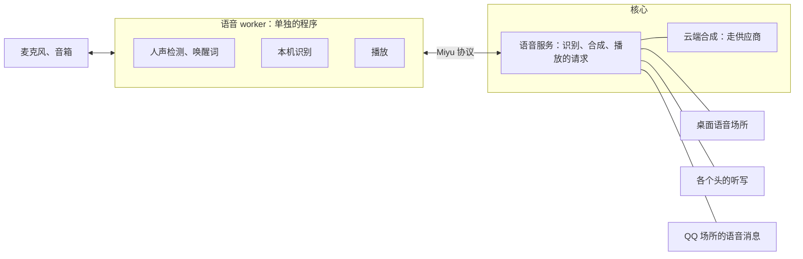

## 语音（草案）

状态：V1 到 V7 已定（2026-09-25）。其余内容为草案。

### 一、第一版做什么

- **三样**（V1，2026-09-25 确认）：
  - 桌面语音助手：叫她的名字，跟她说话，她说话回答你；
  - 听写：在终端界面、命令行、网页里，说话代替打字；
  - QQ 语音消息：收到语音就识别成文字，她也能用她的声音发语音。
- 「朗读回复」，也就是不是语音叫起来的回合也把回复念出来，第一版不做。
- **合成引擎**（V2，2026-09-25 确认）：云端的 MiMo 和 MiniMax，加上 macOS 自带的 `say`。旧版在用的 GPT-SoVITS 第一版不做。

### 二、仿 Linux

| Linux | 语音 |
|---|---|
| speech-dispatcher：一个守护进程接「念这句」的请求，后面接可换的输出模块 | 核心里的语音服务，加一个语音 worker：接「听」「说」的请求，后面接可换的引擎 |
| 终端驱动 | 语音 worker 就是桌面语音这个场所的场所驱动（`18-通讯平台.md` 第二节） |
| 线路规程 | 「唤醒」：听到唤醒词才交给她；回复以后一小段时间内不用再叫 |
| PipeWire、CoreAudio、WASAPI | 系统的声音服务。声音从哪进、从哪出，归系统管；Miyu 只选设备，不管路由 |
| `arecord`、`aplay` | `miyu-voice test`：不进对话，只测麦克风和播放 |

### 三、三个部分

- **语音 worker**（`miyu-voice`）是重型 worker：单独的二进制软件包，第一次用语音时才下载（`12-进程形态与分发.md` R2）。桌面助手开着时它一直在，待机只跑人声检测和唤醒词；只用听写和 QQ 语音时，用完空闲一会儿就退出（`01-架构.md` 第八节）。桌面助手开着，核心也常驻（`12-进程形态与分发.md` R1）。它管麦克风和播放、人声检测、唤醒词、本机识别。旧版也是这样拆的：主程序里没有一行语音代码，体积不变。
- **核心里的语音服务**统一接三种请求：识别这段音频、合成这句话、播放这段声音。云端合成由核心去调，走供应商那一套（`15-模型与供应商.md`）。
- **用它的有三处**：桌面语音场所（第四节）、各个头的听写（第五节）、QQ 场所的语音消息（第六节）。

### 四、桌面语音助手：一个本机的场所

- **本机的麦克风和音箱就是一个场所**（V3），语音 worker 是它的场所驱动。场所规则照常给它配人格和预设（`18-通讯平台.md` 第三节），默认是 Miyu 和功能全开。它有自己的会话，一直续下去；这个会话在终端界面和网页里都看得到。
- **用它的人是你本人**，所以是有人值守的场所。要确认的事，通过桌面通知和各个头问你（`13-终端界面.md` 第四节）。没人回答时不一直等：过一段时间（初值 10 分钟）按「没人回答」处理，要确认的就拒绝，并在通知里说明（2026-09-25 补）。

**线路规程「唤醒」**（`wake`）：

1. **待机**：只跑人声检测和唤醒词，安静的时段由能量门挡掉。旧版实测，待机时 CPU 0.4%，内存 75 到 80MB。
2. **听到唤醒词**：响一声提示音，弹一条桌面通知，接着听这一句。唤醒词后面紧跟着说的话也算。
3. **说完**，也就是静下来一小会儿：识别成文字，交给她。太短的、识别得没把握的，不交给她。旧版实测，环境音和视频的声音会被识别成一些碎片，当成了指令。
4. **她回答**：一句一句地合成、一句一句地播，第一句合成好就开始播。
5. **追问窗口**：播完以后 30 秒内接着说，不用再叫她；每回答一次就重新计时；她思考和说话的时候不计时。这是旧版定下的规矩（V6）。
6. **开口就打断**：她说话时你一开口，持续约 0.3 秒的人声，她立刻停下，这一回合就此打断。旧版原来要等你整句说完才打断，后来改成了这样（V6）。
7. **开关**：`miyu listen` 按一下关、再按一下开。关掉时响一声下行的提示音。

- **唤醒词跟着人格**：默认就是她的名字。Miyu 的是「未有未有」「密友密友」「miyumiyu」「みゆみゆ」。场所规则的 `keywords` 可以改。
- 通知的标题用人格的名字。

### 五、听写

- 终端界面里的 `/stt`、命令行的 `miyu stt`、网页上的麦克风按钮。
- 听写是不用唤醒的语音输入：打开以后，你说的话识别成文字，交给你正在用的那个会话。听写期间，桌面助手的唤醒暂停，退出以后恢复。旧版就是这样。
- 网页的听写：浏览器录下来，交给核心去识别，核心再交给语音 worker。

### 六、QQ 语音消息

- **收**：桥把语音取回来，交给核心识别；各个实现取语音的办法不一样，归驱动的 quirk 表管（`18-通讯平台.md` 第十一节）。这条消息记成「[语音] 识别出的文字」，原始语音作为附件留着。
- **发**：她用语音软件包提供的 `send_voice` 工具，核心用她人格的声音合成，放进这个场所的出站队列（`18-通讯平台.md` 第八节），桥按 QQ 的格式发出去。她说的原文一起记进历史。
- 只发了语音时，后面不再跟一条空的正文。旧版有一次，模型在语音之后回了一个零宽空格，于是照样发出了一条看上去空白的消息。出站链的清理对「看起来是空的」一视同仁。

### 七、引擎

| 做什么 | 引擎 | 在哪跑 |
|---|---|---|
| 人声检测 | silero | 语音 worker，本机 |
| 唤醒词 | sherpa-onnx 的唤醒模型 | 语音 worker，本机 |
| 识别 | SenseVoice，默认 | 语音 worker，本机 |
| 合成 | MiMo、MiniMax | 核心，云端 |
| 合成 | macOS 的 `say` | 语音 worker，本机，只在 macOS 上有 |

- **识别和合成是两个用途**，和主对话、看图一样配（`15-模型与供应商.md` 第四节的 `speech_in`、`speech_out`）。
- **人格决定她的声音**：用哪个合成引擎的哪个音色（`16-人格与预设.md` 第一节）。MiniMax 能克隆音色；MiMo 可以用一句话描述风格和语气。
- **识别默认在本机**（V5）：唤醒之前的声音只在本机处理，不存，也不发出去；唤醒以后的那一句，才识别、才交给她。
- **Linux 和 Windows 上没有本机合成**：要她开口，就配一个云端引擎。没配时，桌面助手只听不说，回答以文字出现在通知和各个头里（V7）。
- **模型文件**，也就是人声检测、唤醒词、识别三样，一共约 190MB。第一次打开语音时下载，放在系统的缓存目录，整台机器共用（`07-存储.md` 第二节，V4）。旧版把它们放在每个数据根里，换一个数据根就重下一整份。
- **识别模型用时才加载**，加载以后内存多约 300MB，空闲一会儿就卸掉。旧版实测，识别 3 到 5 秒的语音，热的时候约 150 毫秒，两个核和十六个核差不多。

### 八、三个平台

| 平台 | 声音服务 | 要注意的 |
|---|---|---|
| Linux | PipeWire，通过 PulseAudio 或 ALSA 的接口 | WirePlumber 会记住每个程序的声音流被挪到了哪。测试时别用 `pactl move-*`，改用 `pw-link` 直接接线。语音全无反应时，先查它记住的目标。旧版就因为测试工具挪过一次播放流，之后所有的声音都进了一个空设备 |
| macOS | CoreAudio | 第一次用麦克风，要在系统里授权 |
| Windows | WASAPI | 第一次用麦克风，要在系统里授权 |

- 按设备名选麦克风和音箱；选不到，就用系统默认的。
- 同一台机器上开着两个 Miyu 时，只让一个开麦。旧版按名字接线，接到了另一个 Miyu 的麦克风上。做法：语音 worker 开麦之前，先拿一把整台机器共用的锁，放在系统的运行时目录；拿不到，就说明麦克风被另一个 Miyu 占着（2026-09-25 补）。

### 九、协议

| 方法 | 类型 | 做什么 |
|---|---|---|
| `voice.transcribe` | 命令 | 把一段音频识别成文字：网页的听写、QQ 的语音都用它 |
| `voice.synthesize` | 命令 | 用某个声音把一句话合成为音频 |
| `voice.listen` | 命令 | 打开或关掉桌面助手 |
| `voice.dictate` | 命令 | 开始或停止听写 |
| `voice.status` | 查询 | 在不在听、用的是哪个麦克风、模型下载好了没有 |

- 语音 worker 连上核心时，声明自己是桌面语音场所的场所驱动（`18-通讯平台.md` 第十二节）。

### 十、决定

**V1. 第一版做什么**

- **已定：桌面语音助手、听写、QQ 语音消息（2026-09-25 确认）。**
- 未选：朗读回复，也就是不是语音叫起来的回合也念出来。
- 重开条件：有人确实需要。

**V2. 合成引擎**

- **已定：MiMo、MiniMax，以及 macOS 的 `say`（2026-09-25 确认）。**
- 未选 A：GPT-SoVITS。音色能克隆、首音快，但要显卡，要自己装。
- 未选 B：Linux 的 espeak-ng、Windows 的系统朗读。旧版试过本机 CPU 合成，因为音质太差删掉了。
- 重开条件：有人需要不联网的合成。

**V3. 桌面语音是什么**

- **已定：一个本机的场所。驱动是语音 worker，线路规程是「唤醒」；人格、预设、会话、记忆，都和别的场所共用。**
- 未选：旧版的做法，语音自己有一套会话和回合。
- 重开条件：出现场所表达不了的语音用法。

**V4. 语音的代码和模型放哪**

- **已定：语音 worker 是单独的二进制软件包，主程序不带语音代码（`12-进程形态与分发.md` R2）；模型文件放在系统的缓存目录，整台机器共用。**
- 未选：编进主程序。不用语音的人也要背上几十 MB。
- 重开条件：无。

**V5. 识别在哪里做**

- **已定：默认在本机，用 SenseVoice。唤醒之前的声音不出这台机器。**
- 未选：默认用云端识别。免下载，但麦克风里的声音要发出去。
- 重开条件：本机识别的质量明显不够用。

**V6. 唤醒的规矩**

- **已定：沿用旧版：追问窗口 30 秒，从播完起算，每回答一次就重新计时，她思考和说话时不计时；你一开口就打断她。**
- 重开条件：用下来哪一条不顺手。

**V7. 没有本机合成的平台**

- **已定：只听不说，回答以文字出现在通知和各个头里；要她开口，就配一个云端引擎。**
- 未选：没配合成就不许开桌面助手。那样只想用语音说话、看文字回答的人，也用不了。
- 重开条件：无。

**后续再定**

- 用日语、英语的发音叫她时唤醒词对不上：旧版的唤醒词按拼音编，日语母语的发音一次都没命中。要么靠识别出的文字兜底，要么换多语种的唤醒模型，实测后再定
- 提示音用哪一套：旧版有三套候选，要耳朵听过再定
