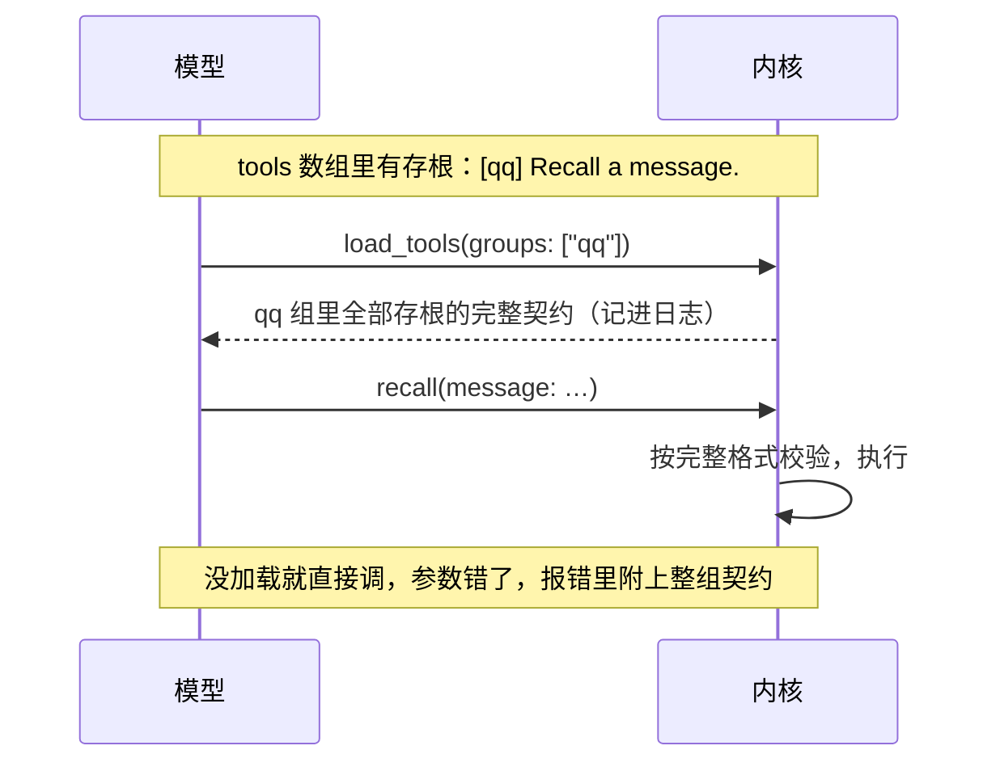

## 工具加载（第二轮细纲）

状态：W1 到 W8 已定（2026-09-25）。其余内容为草案。

装的软件一多，再加上平台工具、MCP，工具面会很繁杂（`18-通讯平台.md` 第九节）。项目主人定的方向：出厂给一套合理的混合加载，再允许按件、按组配置，工具的描述也能改（`10-自带软件.md` 第九节）。这一份把它落到细处。

改不了的约束，前面已经定死了：
- 一个会话里 tools 数组逐字节不变。改加载方式、改描述，都在下一个回合开始时生效，记成一次有原因的前缀改写（`02-内核.md` K3、`08-上下文投影.md` 第七节）。
- 工具面按会话定，不按说话的人变（`08-上下文投影.md` C4）。
- 故障的工具留在目录里（`05-内核接口.md` I6）。

### 一、三个状态

| 状态 | 进 tools 数组的是什么 | 给谁 |
|---|---|---|
| **全量** | 名字、说明、完整的参数格式 | 常用的工具 |
| **存根** | 名字、一行摘要（前面带组名）、宽松的参数外壳。完整契约要用时按组加载（第二节） | 不常用的工具 |
| **关** | 不进数组。系统提示词里有一行写明「装了、但这次没开」（`16-人格与预设.md` Y8） | 预设没开的软件 |

- **不设「精简」这一档**（W1）。旧版实测过「结构壳」：留下参数的名字和类型，去掉参数说明，体积省一半，约束解码的模型也能用。项目主人的判断是：这本来就是写工具时的取舍，不必做成一档。
- **所以它变成一条写法**（W2）：名字和参数格式自己就说得清怎么用的工具，全量声明里只写参数壳，也就是参数的名字、类型、必填、枚举，不写参数说明。说不清的，参数说明也不超过一句。调用之后才用得上的知识，照旧写进工具自己的输出（`05-内核接口.md` 第六节）。
- 旧版的账：40 件工具全量 21.4 KB，其中参数说明占 16.8 KB，工具说明只有 4.6 KB。大头就在这条写法上。

### 二、按组加载

- **每件工具属于一个组**（W3）。默认一个软件包一组，例如 `qq`、`kb`；一个 MCP 服务器一组。也可以自己建组：

```toml
[tools.groups]
qq-admin = ["mute", "kick", "ban", "title"]
```

- 自建的组覆盖默认的：上面这几件工具，就从 `qq` 组挪到了 `qq-admin` 组。
- **存根的摘要前面带组名**，例如 `[qq] Recall a message.`。摘要就是说明的第一行，不超过 60 个字符。
- **要用时按组加载**：她调 `load_tools`，写上组名，结果是这一组里全部存根的完整契约。结果是一条工具结果，记进日志，以后原样回放，不碰前缀。
- **不加载直接调也行**（W6）：参数按完整的格式校验，对了就执行；错了，报错里附上这一组的完整契约，第一次调错就学会。
- `load_tools` 只在这个会话里有存根时才出现（`10-自带软件.md` 第三节）。



### 三、出厂的混合模式

常用的全量，其余存根（W4）。写在预设里：

```toml
# 功能全开
[loading]
unlisted = "stub"            # 没列出来的工具：存根
full = ["basesystem", "net"] # 这些组全量：基础系统 13 件、联网

[loading.in_venue]
full = ["qq"]                # 在 QQ 的场所会话里，平台工具也全量
```

```toml
# 开发
[loading]
unlisted = "full"            # 它开的工具本来就少，全部全量
```

- **什么算常用**：每次对话都可能用到的。基础系统 13 件、联网，以及场所会话里自己那个平台的工具。平台工具在终端和网页的会话里很少用，所以那里是存根。
- **在哪里改**，照配置的分层（`14-配置.md` 第三节）：
  - 给预设写同名覆盖（`16-人格与预设.md` 第四节），这个预设以后都这样；
  - 自建组，写在系统配置或个人设置里；
  - 会话里临时改，用 `/tools`，下一个回合开始时生效。
- **关**不在这里设：开哪些软件、关哪个工具，是预设的 `[software]` 表（`16-人格与预设.md` 第三节）。设置页上三个状态放在一处给人选，写进去的是两个地方。

### 四、约束解码的模型

- 有的供应商用约束解码：工具参数只能照声明的格式生成。存根的宽松外壳会让它只能发出 `{}`，没声明的工具名也调不出来。旧版对照 8 次，全部如此；把契约写进对话也救不回来。
- **规则**（W5）：一个会话能用到的模型里，只要有一个不能用存根，这个会话的存根就一律按全量发。「能用到的模型」包括会话的模型、它所在的池、出错时会换到的模型。
- 能不能用存根是模型资料里的一项（`15-模型与供应商.md` 第三节），可以手填，也可以实测学到。
- 发生这种情况时，设置页和 `miyu tools` 上写明原因，不悄悄变。

### 五、改描述

- **能改的**（W7）：工具说明、每个参数的说明、存根那一行摘要，以及给人看的显示名。**工具名不能改**：日志里历史上的调用认的是原名。
- **写成同名覆盖**，只写改了的项。系统级的放在 `system/tools/<工具>.toml`，个人的放在 `home/<账号>/tools/<工具>.toml`。找的顺序是个人、系统、出厂，和人格、预设一样（`16-人格与预设.md` 第四节）。

```toml
# home/<账号>/tools/recall.toml
description = "Recall a message. Only the message you are replying to can be recalled."

[params.message]
description = "The message id from the reply."
```

- **给模型看的字要检查**：
  - 一律英文，这是注入与描述的写法（`08-上下文投影.md` C7）；
  - 说明不超过三句（`10-自带软件.md` 第九节）；
  - 显示改前、改后各多少 token，超了单件的上限就提示。
- **恢复默认**就是删掉这份覆盖。
- 改了的在下一个回合开始时生效，记成一次策略变化。

### 六、设置页

网页和终端界面照同一份数据画（`21-网页.md` 第五节、`14-配置.md` 第九节）：

- **最上面是一根预算条**：这个预设的工具面，全量几件、存根几件、合计多少 token、预算多少。会话里有不能用存根的模型时，这里写明「存根会按全量发」。
- **按组列出**：
  - 组的那一行：整组的状态、整组的 token、最近被加载的次数；
  - 组下面每件一行：状态（全量、存根、关三选一）、全量和存根各多少 token、最近被调用的次数、这个状态来自哪一层（出厂、预设、个人、会话）、「改描述」。
- **给建议，不自己改**：
  - 一组存根十次对话里有八次都被加载了，提示改成全量更省：每加载一次，就多一个来回、多一段契约；
  - 一件全量的工具很久没被调过，提示改成存根。
- 调用次数、加载次数都从事件日志里算，不单独记账（`07-存储.md` S1）。
- 这一页的样子，和头的样式一起出图。

### 七、协议

| 方法 | 类型 | 做什么 |
|---|---|---|
| `tools.catalog` | 查询 | 工具和组：状态、来自哪一层、全量与存根的 token、调用与加载次数 |
| `tools.describe` | 查询 | 一件工具合成之后的完整契约，每一项来自哪一层 |
| `tools.override` | 命令 | 写一份描述的同名覆盖，校验后写盘 |
| `tools.reset` | 命令 | 删掉覆盖，恢复默认 |

- 改加载方式，就是改预设或配置：`preset.save`、`config.set`（`16-人格与预设.md` 第九节、`14-配置.md` 第八节）。
- `load_tools` 是给模型用的工具，不是协议方法。

### 八、决定

**W1. 状态**

- **已定：全量、存根、关三个（2026-09-25 项目主人定）。**
- 未选：再加一档「精简」，只留参数的名字和类型。项目主人：它本来就是写工具时的取舍，不必成一档（W2）。
- 重开条件：实测出现三个状态表达不了的常见需求。

**W2. 自己说得清的工具只写参数壳**

- **已定：名字和参数格式自己说得清怎么用的，全量声明里不写参数说明（2026-09-25 项目主人定）。**
- 重开条件：实测发现省掉参数说明后，某类常用模型选错参数明显变多。

**W3. 按组加载**

- **已定：存根按组加载；默认一个软件包一组、一个 MCP 服务器一组；可以自建组（2026-09-25 项目主人定：「需要加载工具是分组后按组加载的」）。**
- 未选：一件一件加载。常一起用的工具要来回好几次。
- 重开条件：组大到一次加载的契约明显浪费。

**W4. 出厂的混合模式**

- **已定：常用的全量，其余存根，可以配置（2026-09-25 项目主人定）。功能全开：基础系统、联网全量，场所会话里自己那个平台的工具全量；开发：全部全量。**
- 未选 A：全部全量。旧版对六十件左右的目录是这么做的，但功能全开装得越多，越吃不消。
- 未选 B：全部存根。常用的工具每次对话都要加载，反而更贵。
- 重开条件：原型实测的调用和加载次数表明，默认的「常用」列错了。

**W5. 约束解码的模型**

- **已定：一个会话能用到的模型里，只要有一个不能用存根，存根就一律按全量发，并写明原因。**
- 未选：教模型用文本格式发工具调用，绕开约束解码。旧版试过可行，但等于自己再造一层调用协议，还要防它漏进正文。
- 重开条件：主流的约束解码供应商都支持了原生的延迟加载。

**W6. 直接调用存根**

- **已定：按完整格式校验；对了就执行，错了在报错里附上整组的完整契约。**
- 未选：没加载就拒绝调用。模型多数时候猜得对，白白多一个来回。
- 重开条件：无。

**W7. 改描述**

- **已定：工具说明、参数说明、存根摘要、显示名都能改，写成同名覆盖；工具名不能改；给模型看的字检查英文和长度；下一个回合生效。**
- 未选：只能改工具说明。参数说明才是大头（第一节），也最常需要按自己的用法改。
- 重开条件：无。

**W8. 设置页的数字**

- **已定：显示每件、每组、整面的 token，最近的调用和加载次数；只给建议，不自动改状态。**
- 未选：按次数自动升降。工具面会自己变来变去，缓存和模型的认知都跟着乱。
- 重开条件：无。

**后续再定**

- 工具面整面的预算、单件的上限：原型实测定（`23-性能预算.md`）
- 供应商原生的延迟加载，例如 Anthropic 的：驱动实现时实测，语义和缓存表现一样才用
- 设置页的样子：和头的样式一起出图
