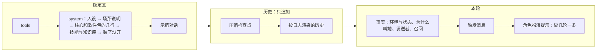

## 提示词（第二轮细纲）

状态：J1 到 J11 已定（2026-09-26）。其余内容为草案。

这一份管的是**一切给模型看的字**：人设、场所说明、工具说明、注入的事实块、工具结果里的固定文字、辅助请求的提示词。项目主人的要求是参考旧版一直在用的那一套（「那是我一直在用的」）。

输入是旧版的全量盘点：约 118KB 给模型看的字，分成提示词文件、工具说明、注入主请求的文字、辅助请求四类。盘点结论里最要紧的四条：
- **旧版其实已经没有浮动尾巴了**。用户消息后面的块全部化石化，每次请求只重建系统提示词（`08-上下文投影.md` C3，今天据此改了定论）。
- **化石里混着指令**，违反旧版自己的规矩：表情包提醒写着「本轮回复时你必须发送表情包」，插话、群管预检、长期目标收尾都有同样的写法；AUR 审查的 5KB 规则住在工具结果里，永久回放。
- **给模型看的字至少 18 处是中文**，还有两处跟着界面语言变。改界面语言，模型看到的字节就变了。
- **敏感区在「不动」的名义下漂了**：人格提醒在 A/B 之后改了 10 次，胜出的那一条被删掉；风格锁只在「提醒开着」时测过，生产环境里提醒却是关的。

### 一、四个去处

给模型看的每一段字，只能落在下面一处（J1）：

| 去处 | 放什么 | 会不会变 | 例子 |
|---|---|---|---|
| **稳定区** | 规则和人设：怎么做，一直成立 | 会话内逐字节不变；变了按内核 K3，在回合开始时整体换一次 | 人设、场所说明、工具使用指引、工具说明、示范对话 |
| **事实** | 发生了什么，以后回看仍然为真 | 先成为事件，永久回放（`08-上下文投影.md` C3、C10） | 时间、权限级别的切换、发送者、这一轮为什么叫她、记忆召回、子代理回报 |
| **工具结果** | 这一次调用的结果，加上怎么读它的一句话 | 执行时定下，永久回放（`08-上下文投影.md` C9） | 命令输出、报错、`load_tools` 拿到的契约 |
| **辅助请求** | 自己的一整套提示词 | 和主会话的缓存无关（J6） | 压缩、起标题、判官、看图、整理记忆 |



- **工具结果里不写规则**：怎么读这个结果的一句话可以写（`25-工具加载.md` W2），一整套规则不行。旧版 AUR 审查把 5KB 规则放进工具结果，此后每一轮都回放。这类规则改成辅助请求：审查由一次辅助请求做，主会话只拿到结论（J7）。
- **技能正文是例外里的正常情况**：技能用 `read` 读进来，本来就是工具结果（`10-自带软件.md` 第三节）。它是她自己决定读的，读一次，压缩后按需重建（`09-压缩.md` 第四节）。

### 二、指令进稳定区，每一轮的标记记成事实

旧版的教训：把「只回复当前消息」这句指令写进消息块，回放以后成了过期的指令，跨轮错乱。后来修的办法是把规则挪进系统提示词（`08-上下文投影.md` C3）。这里把它推成一条通用的写法（J2）：

- **规则**写在稳定区，一直成立，说「遇到某种标记时怎么做」。
- **标记**记成事实，只说「这一轮是什么情况」，以后回看仍然为真。

旧版化石里的几种指令，照这个拆开：

| 旧版写在化石里的 | 规则（稳定区） | 标记（事实） |
|---|---|---|
| 「只回复 [New messages…] 里的那条」 | 场所说明：回复触发这一轮的那条消息 | 这一轮由哪条消息触发（编号） |
| 插话时「即使没 @ 你也照样回一条」 | 场所说明：插话的回合可以不说话，用 `skip_reply`（`18-通讯平台.md` Q5） | 为什么叫她：插话的机会 |
| 「本轮回复时你必须发送表情包」 | 表情包软件包：带这个标记的回合，回复里带一张表情包 | 这一轮适合发表情包（J11） |
| 长期目标的收尾指令 | 长期目标软件包：收到收尾标记时，调用 `goal` 报完成或卡住 | 这一轮是收尾轮 |
| 群管预检「看上下文决定怎么回，别透露分数」 | 群管软件包：预检标记的含义和处理 | 这条消息的预检结果 |
| 图片路径加「你可以使用 vision_analyze」 | 工具说明里写看图怎么用 | 附件清单：编号、种类、大小 |

- 一轮里要是同时有几种标记，放在同一个事实块里，排在触发消息之前（`08-上下文投影.md` C2）。
- 上面的表是中文写的说明；真正发给模型的全是英文（J3）。一个群聊回合大致是这样，规则在 system 里，标记在这一轮的事实块里：

```text
system 里的规则（每个回合都一样）：
  Reply to the message named in <turn trigger>. A quoted message is an earlier message by its author, not addressed to you.
  On a turn marked meme="suggested", include one meme in your reply.

这一轮的事实块（记成事件，以后原样回放）：
  <turn trigger="msg:88213" reason="mentioned" meme="suggested"/>
  <sender id="qq:10086" role="member" nickname="…"/>
```

- 标记只写这一轮的情况，不写「你应该」。规则只写在稳定区，不写进标记。
- 压缩检查点也照这个拆（2026-09-26 补，施工 1-12）。检查点是标记，只说之前的那部分对话压缩成了下面的摘要。「接着做进行中的事，不问要不要接着做，不确认也不复述摘要」是核心在 system 里的一行规则。Claude Code 把这句写在摘要消息的末尾，压完以后一直留在上下文里（`09-压缩.md` 第四节）。

### 三、写法

照 `08-上下文投影.md` C7，再补几条旧版磨出来的（J3）。项目主人 2026-09-26：「系统相关的都要用英语」。

- **机械的文字一律英文短句**：场所说明、工具说明、事实块、报错、辅助请求的指令。中文只留给人格侧的字：人设、示范对话、角色扮演提示。旧版的经验：中文书面语的注入和人设同一个语域，最容易被模仿，是出戏的头号来源（出过事后总结的，没做过 A/B）。
- **字节不随界面语言变**。给人看的字和给模型看的字分两份：模型那一份永远是英文，人那一份跟着界面语言（旧版的「双槽」）。旧版有两处按界面语言切中英文，改一下界面语言，前缀就断了。
- **只陈述是什么，不写「你应该」**：`QQ id is stable, nickname can change`，不写「不要凭昵称认人」。位置比措辞重要得多（`08-上下文投影.md` C2、C7）。
- **不用分号把几句串成一句，不用「总述：分述」的结构**。每写一段注入，先问删掉会怎样，再问怎么写短。
- **可信和不可信的字段分开**：内核产生的（编号、身份）是可信的；昵称、正文这类用户可控的，进请求之前转义，防伪造记录行（`08-上下文投影.md` C7）。
- **工具说明**照 `25-工具加载.md` W2：说明不超过三句，写「是什么、什么时候用、最容易踩的一个坑」；调用之后才用得上的知识，写进工具自己的输出。

### 四、系统提示词的排法

从最稳的排到最常变的，这样换一个软件的开关，只断后面那一截（J8）：

1. **人设**：人格的 `persona.md`。
2. **场所说明**：终端、网页、命令行、QQ 群、QQ 私聊、桌面语音、子代理，各一份。写这个场所的规则，例如「引用的是别人的话」「回复触发这一轮的那条」；终端的还写这台机器的系统和 shell（每台机器固定，不是每轮变）。
3. **核心和软件包的几行**：核心自己的排在最前，例如压缩检查点怎么读（2026-09-26 补，施工 1-12）。然后是开着的软件包各自带的规则，按软件包编号排，例如记忆怎么读、产物怎么用、长期目标怎么收尾。
4. **技能与知识库的列表**。
5. **装了、但这次没开的软件**，一行（`16-人格与预设.md` Y8）。
6. **派子代理时能选的人格和预设**（`16-人格与预设.md` 第六节）。
7. **风格锁**：人格会话才有，子代理没有（旧版实测：探针全过从 5/12 升到 8/12）。

然后是**示范对话**，放在 system 之后、历史之前（`08-上下文投影.md` 第三节）。

- 同一个人格、同一个场所、同一个预设的两个会话，system 逐字节相同，可以共用缓存。
- 时间、工作目录、权限级别这类会变的，一律不进 system，走事实（`08-上下文投影.md` C10）。

### 五、从旧版带过来什么

旧版约 120 条，按去处和处理方式归类（J7）。四种处理：**照搬**（原文不动）、**改写**（改成英文，或者改接口）、**拆开**（指令拆成规则加标记）、**不要**。

**人格侧：照搬**

| 旧版 | 新版的位置 | 处理 |
|---|---|---|
| `miyu.md` 人设（1403 token） | 出厂 Miyu 的 `persona.md` | 照搬。「工具使用时注意」里安装卸载要确认、删除要确认这几条，现在由权限和回收站在代码上保证；人设里留着也不冲突 |
| `miyu-dialogs.md` 示范对话 17 对 | `examples.md` | 照搬 |
| `miyu.hint.md` 人格提醒 | `reminders.md` | 照搬；出厂 Miyu 默认开，每 3 轮一条（J10） |
| 风格锁 | 人格会话的 system 末尾 | 照搬（受 A/B 保护，文本里的分号不改） |
| 开发模式提示词 | 软件工程师这个人格的 `persona.md` | 旧版 09-24 起默认是空的，照旧空着 |

**场所说明：照搬英文的，改写中文的**

| 旧版 | 新版的位置 | 处理 |
|---|---|---|
| QQ 的身份规则、聊天记录格式、历史图片、回复对象、引用格式 | QQ 场所说明 | 照搬；回复对象那条改成指向「触发这一轮的那条」标记（第二节） |
| 群管、撤回的规则 | QQ 软件包的几行，或者对应工具的说明 | 照搬；只在工具开着时出现 |
| 场所的附加说明（旧版路由里的 `extra_prompt`） | 场所规则的一项属性（`18-通讯平台.md` 第三节） | 照搬 |
| LaTeX 排版说明 | 终端、网页的场所说明 | 照搬；头在握手时声明能不能显示公式 |
| 语音协议（中文） | 桌面语音的场所说明 | 改写成英文 |
| 子会话的交付约定（「回报对象是父会话」「不要轮询」） | 子代理的场所说明 | 照搬 |
| 通用子代理提示词（中文） | 子代理的场所说明 | 改写成英文；「改文件前先读行号」这类已经由工具保证的去掉 |
| 产物用法 | 产物软件包的几行 | 照搬；点名的工具必须在场（J4） |
| 联想记忆的读法 | 记忆软件包的几行 | 照搬 |
| 机器信息（系统、内核） | 终端的场所说明 | 照搬；模型名不写，换模型不该断前缀 |

**事实块：拆开或改写**

| 旧版 | 新版 | 处理 |
|---|---|---|
| 时间、工作目录、沙盒说明 | 环境和状态的事实（`08-上下文投影.md` C10） | 已定 |
| 发送者的可信信息（QQ 号、身份、回复谁） | 发送者事实，可信字段 | 照搬 |
| 这些消息已由并行的回合在答 | — | 不要：一个场所一个会话，回合按顺序跑（`02-内核.md` 第七节） |
| 唤醒说明（后台任务完成、重启续跑） | 为什么叫她：子代理回报、后台命令结束、核心重启 | 拆开 |
| 插话的让步句 | 为什么叫她：插话的机会 | 拆开 |
| 受保护的昵称被冒用 | 身份警告的事实 | 照搬 |
| 群管预检 | 预检结果的事实，规则在群管软件包 | 拆开 |
| 心情、精神（中文） | — | 不要：它们从好感度的回复里算出来，好感度不做，它们也跟着去掉（2026-09-26 项目主人定） |
| 最近的长回复转成了图片 | 事实 | 照搬 |
| 产物清单 | 状态的事实，变了才注入 | 照搬 |
| 图片、视频、PDF 的路径提示（中文，带指令） | 附件清单的事实 | 拆开并改写 |
| 联想记忆（中文小标题） | 记忆召回的事实 | 改写成英文 |
| 表情包提醒（中文，指令） | 标记，规则在表情包软件包 | 拆开（J11） |
| 长期目标的收尾指令 | 标记，规则在长期目标软件包 | 拆开 |
| 续传时的模式切换加整份系统提示词 | — | 不要：会话的预设不换（`16-人格与预设.md` Y5） |
| 回合被打断（中文，拼在助手正文后面） | `turn.ended` 的事实块（`08-上下文投影.md` 第四节） | 改写 |
| 工具轮数到上限（拼在助手正文后面） | `turn.ended` 的事实块 | 改写 |
| 压缩检查点（user 角色） | 压缩检查点 | 照搬 user 角色：旧版实测，放在 system 里，摘要里的祈使句会被当成新指令 |
| 截断标记（中文） | 预览的标记（`08-上下文投影.md` C9） | 改写成英文 |
| 后台任务报告（中文） | `job.reported` 的渲染 | 改写 |
| 跨会话的消息「由另一个会话的 AI 发送，不是用户」 | 另一个会话发来的消息 | 照搬（项目主人 09-23 定「只要这一句」） |
| 长期目标的续轮消息 | 长期目标软件包的触发消息 | 照搬（事故驱动出来的措辞） |
| 群聊近况的格式、缺口提示 | 群聊近况的渲染（`18-通讯平台.md` 第七节） | 照搬 |
| 引用图片、文件的占位（跟着界面语言变） | 附件清单 | 改写成固定的英文 |
| 看不见图时的旁路描述（中英混杂） | 看图的辅助请求写回的事实 | 改写成英文 |

**工具结果里的固定文字：照搬，修悬空引用**

| 旧版 | 处理 |
|---|---|
| `tool error: …`、未知工具「did you mean」、超时、输出被截断 | 照搬 |
| 存根调错时附上契约 | 照搬，改成附整组的契约（`25-工具加载.md` W6） |
| `load_tools` 的结果格式 | 照搬；删掉指向 `<available_load_targets>` 的悬空引用，旧版里已经没有东西生成它 |
| 同参复读闸：回灌上一轮原字节，不加文字 | 照搬：旧版实测提醒文字无效，结构闸才有效 |
| AUR 审查规则 | 挪进辅助请求（第一节） |

### 六、辅助请求

每一种辅助请求声明自己的用途，有自己的缓存状态，单独记账，不碰主会话的缓存。只有压缩可以复用主会话的前缀，这是刻意的（J6）。

| 辅助请求 | 从旧版来 | 处理 |
|---|---|---|
| 压缩：fork 和兜底的整段摘要 | `compact.md` | 照搬（实测敏感区）；修两处漂移：fork 模式里不存在的 `<conversation>` 标签、「for coding sessions」 |
| 起标题 | 中文 | 改写成英文 |
| 选中文字的解释和翻译（网页） | 英文 | 照搬 |
| 群里要不要开口的判官 | 英文 | 照搬（09-24 实测 18/18 对 11/18） |
| 入群审批 | 中文 | 改写成英文 |
| 看图、替不能看图的模型描述图片 | 英文，标签中文 | 标签改成英文 |
| 表情包入库时的描述 | 中文 | 规则改写成英文，人格那部分照旧 |
| 整理记忆：日记整理成知识点和经历 | 中文 | 改写成英文（`17-记忆.md`） |
| 自定义人格的人格提醒蒸馏 | 英文 | 照搬；修旧版续行吞掉的 11 处空格；声明用途，旧版没声明，被记成了主对话 |
| 好感度 | 中文 | 不要（好感度不做） |
| AUR 审查 | 原来在工具结果里 | 改成辅助请求，主会话只拿结论 |

### 七、门禁

给模型看的字当代码测（J4、J5）：

- **请求形状探针**：用固定的剧本让真会话跑出日志（施工 2-9 下），为每一种会话渲染出完整请求，包括终端、网页、命令行、QQ 群、QQ 私聊、桌面语音、子代理。和存档逐字节比对。字节变了，必须是有意的，并写明原因。旧版就靠这个证明重构没改提示词。现在只有终端一种会话（施工 1-14），别的随各自的场所加进来。
- **引用必须在场**：提示词里点名的每一件工具、每一个标签、每一条命令，在这个会话的工具面和场所里都必须存在。旧版出过好几次悬空引用：产物用法点名三件已经删掉的工具，一个月没人发现。
- **英文检查**：机械文字的首字是英文字母，中文字数不过半；人格侧的文件不查。
- **token 预算**：每件工具、整张工具面、system 各有上限，超了当场拦下。初值原型实测定（`23-性能预算.md`）。
- **敏感区要有评测**：人设、示范对话、角色扮演提示、压缩模板、判官，各带一套能重跑的评测，例如旧版的人格遵循度 A/B、压缩的 20 条事实召回、判官的 18 个场景。改了就重跑，而且在和生产一样的条件下跑：旧版的风格锁只在提醒开着时测过，生产里提醒却是关的。

### 八、东西放在哪

- **人格的字**在人格目录里：`personas/<人格>/prompts/`（`16-人格与预设.md` 第三节）。
- **软件包的字**跟着软件包走：工具说明、它往 system 里加的几行、它的辅助请求提示词，都在软件包自己的目录里。覆盖照 `25-工具加载.md` W7，个人、系统、出厂三层。
- **内核和场所的字**：终端、网页、命令行、子代理的场所说明，事实块的模板，随核心附带；QQ 的场所说明随 QQ 桥的软件包附带。
  - 随核心附带的放在资源目录的 `core/` 下（2026-09-26 补，施工 1-12）。现在有检查点包装的开头 `checkpoint-open.txt` 和结尾 `checkpoint-close.txt`，system 里检查点的那一行规则 `checkpoint-rule.txt`（施工 3-6 拼进 system），回合没走完的四句 `turn-ended/<原因>.txt`，环境和状态两类事实的模板 `facts/env.txt`、`facts/permission.txt`（施工 1-13），驱动的几句占位 `drivers/*.txt`：图片、文件发不了，工具一个字都没回，工具结果里的图挪到了后面（施工 3-4 上）。文件的内容原样用，行尾的换行也算。
- 出厂的全部只读，要改就写同名覆盖（J9）。

### 九、决定

**J1. 四个去处**

- **已定：给模型看的每一段字只能落在稳定区、事实、工具结果、辅助请求之一；工具结果里不写整套规则。**
- 未选：规则跟着注入走，哪里用到写在哪里。旧版这样做，化石里积了一堆过期的指令。
- 重开条件：出现一段字哪一处都放不进去。

**J2. 规则加标记**

- **已定：每一轮不一样的指令，拆成稳定区里的规则和事实里的标记。**
- 未选：指令写进这一轮的注入。回放以后过期，跨轮错乱。
- 重开条件：实测某类行为只有写成这一轮的指令才管用。

**J3. 语言**

- **已定：机械文字一律英文，字节不随界面语言变；人格侧的字用人格自己的语言。**
- 重开条件：新的实测表明中文的机械文字不再引起出戏。

**J4. 引用必须在场**

- **已定：提示词里点名的工具、标签、命令，都要在这个会话里存在，测试当场拦；每种会话的完整请求逐字节存档比对。**
- 重开条件：无。

**J5. 敏感区要评测**

- **已定：人设、示范对话、角色扮演提示、压缩模板、判官各带一套能重跑的评测，改了就在生产的条件下重跑；「不动」不再是保护手段。**
- 重开条件：无。

**J6. 辅助请求**

- **已定：各自声明用途、各自的缓存状态、单独记账；只有压缩可以复用主会话的前缀。**
- 重开条件：无。

**J7. 旧版的字怎么带过来**

- **已定：人格侧照搬；机械文字照 J3 改写；化石里的指令照 J2 拆开；工具结果里的整套规则改成辅助请求。**
- 重开条件：照搬过来的人设在新的上下文排法下，评测明显变差。

**J8. system 的排法**

- **已定：人设、场所说明、核心和软件包的几行、技能与知识库、装了没开的软件、能派的人格与预设、风格锁，最稳的在前。**「核心和」是 2026-09-26 补的（施工 1-12）。
- 重开条件：实测另一种排法命中明显更高，或者遵循度明显更好。

**J9. 放在哪**

- **已定：人格的字在人格目录，软件包的字跟着软件包，内核和场所的字随核心；出厂只读，覆盖照 `25-工具加载.md` W7。**
- 重开条件：无。

**J10. 角色扮演提示**

- **已定：出厂 Miyu 默认开，每 3 轮追加一条，记成事实，排在触发消息之后；软件工程师没有（2026-09-26 项目主人定）。**
- 未选：默认关，旧版 08-16 以来的样子。旧版实测：干净的会话里只靠示范对话就够；可在 3 万 token 的真实群聊里，只靠示范对话是 4/12，加上提醒是 8/12。
- 重开条件：评测表明示范对话单独就够（J5）。

**J11. 表情包提醒**

- **已定：留着，照 J2 做成标记。按概率抽中的回合记一条「这一轮适合发表情包」的标记，怎么做的规则写在表情包软件包带进 system 的几行里；抽中的概率是软件包的默认值（2026-09-26 项目主人定）。**
- 未选 A：旧版的写法，把「本轮回复时你必须发送表情包」写进化石。过期的指令会跟着回放。
- 未选 B：不提醒，只靠人设里的「适时发送表情包」。项目主人：「不发提示词的话，AI 怎么知道要发呢？」
- 重开条件：评测表明她不靠提醒也会按合适的频率发。

**后续再定**

- 各件工具的最终说明：附录是草稿，参数外壳照 `25-工具加载.md` W2，原型时定
- 心情、精神不做（2026-09-26 项目主人定），好感度也不做（`18-通讯平台.md` 第六节）

### 附录：基础系统 13 件的说明草稿

照 `25-工具加载.md` W2：说明不超过三句；名字和参数自己说得清的，参数外壳里只写名字、类型、必填、枚举。

| 工具 | 说明（给模型看的，英文） | 参数 |
|---|---|---|
| `shell` | Run a shell command or a multi-line script in the workspace. For long work set `background` with a short `title`: it returns a job id at once, and you are told when it ends. | `command`（必填）、`background`、`title`、`timeout_seconds` |
| `jobs` | List your background commands and subagents, read a command's output, or stop one. Finished jobs report to you on their own, so there is no need to poll. | `action`：list、output、stop；`id` |
| `read` | Read a text file by line pages, an image, a PDF, or list a directory. Prefer this over `cat` in the shell: files read here come back after compaction. | `path`（必填）、`offset`、`limit` |
| `edit` | Replace exact text in an existing file; one call can make several edits. Each `old_text` must appear exactly once in the original file. For new files use `write`. | `path`（必填）、`edits`（必填）：`old_text`、`new_text` |
| `write` | Create a file, or overwrite one entirely. For changes inside an existing file use `edit`. | `path`（必填）、`content`（必填） |
| `trash` | Move files or directories to the system trash. Pass every path in one call. | `paths`（必填） |
| `grep` | Search file contents with a regular expression, respecting .gitignore. | `pattern`（必填）、`path`、`include`、`max_results` |
| `glob` | Find files by name pattern, respecting .gitignore. | `pattern`（必填）、`path`、`max_results` |
| `history` | Read back earlier parts of this conversation by sequence number or keyword, including turns folded away by compaction. | `query`、`from`、`to` |
| `ask_user` | Ask the user one or more questions with options and wait for the answers. Put the recommended option first and add "(recommended)" to its label. Don't add an "other" option: the user can always type their own answer. | `questions`（必填） |
| `todo` | Keep this session's task list; the user sees it. `todos` replaces the whole list, `updates` changes items in order. | `todos`、`updates` |
| `agent` | Start a subagent in a new session to do one task in the background; its report arrives as a message when it finishes. It sees nothing of this conversation, so the prompt must stand on its own: background, what is already known, the goal and what to report. | `title`（必填）、`prompt`（必填）、`tier`、`persona`、`preset` |
| `message_agent` | Send a follow-up message to a subagent you started. A running one reads it at its next step; a finished one starts a new turn with it and reports again. | `agent`（必填）、`message`（必填） |

- 草稿依据旧版在用的说明改写：`run_command`、`job`、`read`、`edit`、`trash_path`、`grep`、`glob`、`search_evicted_context`、`ask_question`、`todowrite`、`subagent`、`send_subagent_message`。
- `jobs` 那句「不用轮询」来自旧版实测：子代理反复查后台任务状态，项目主人看到后要求加上（09-18）。
- `read` 那句「压缩后会读回来」给模型一个用 `read` 而不用 `cat` 的理由：旧版读文件全走 `cat`，压缩后要重建的文件清单恒为空（`10-自带软件.md` 第二节）。
