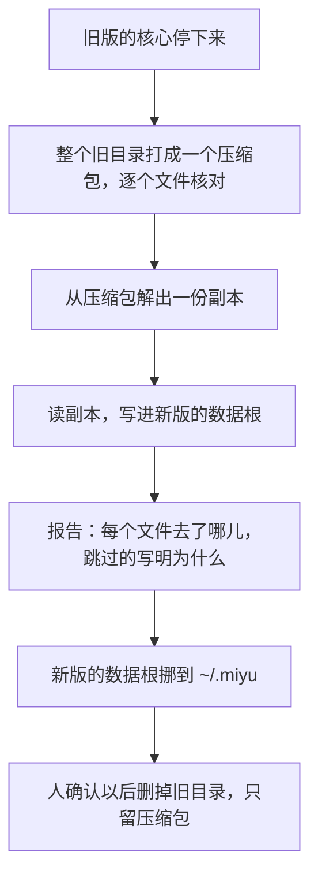

## 从旧版迁过来（草案）

状态：MG1 到 MG5 已定（2026-09-26）。迁移程序本身等全部做完以后再画；这里先记下已经定的、盘点到的，和两个版本并行时会撞上的地方。

### 一、什么时候迁、谁来迁

- **全部做完以后再迁**（2026-09-26 项目主人，MG1）：新版能替掉旧版以前，两个版本并行；到那天跑一次迁移，一次切过来。不边做边迁。
- **迁移是一个单独的程序，不在新版里**。项目主人的原话：「我倾向于新旧都放.miyu，在我们全部做完之后，考虑migrate的事情，用一个单独的迁移脚本去迁移数据。而不是承担这个旧版本兼容的债」。
  - 旧版的格式、目录、标记文件，只有迁移程序认得。新版的代码里一行也没有，连「认出这是旧版」都没有：认不出的数据根只有一种说法，「这里有别的东西，不动它」（`07-存储.md` 第二节）。
  - 迁移程序往新版里写的，全是新版自己的格式。新版要为它添的功能，只能是说得出一般用处的，例如只读的会话，不能是「旧版的会话」。
  - 迁完、确认不要了，迁移程序整个删掉，新版一个字节都不用改。
- **新旧最后都在 `~/.miyu`**：并行期新版设 `MIYU_HOME` 指到别处（例如 `~/.miyu-next`）；切过来以后，旧目录打成一个压缩包存着，新版就位在 `~/.miyu`。

### 二、并行期：两个版本在同一台机器上

并行期旧版照常用，QQ 也还归旧版接，新版试着用。两个版本会在下面这些地方撞上。每一条的做法都是新版本来就该守的规矩，不靠认出旧版：

| 撞在哪 | 旧版在那儿的东西 | 新版的规矩 | 哪里管 |
|---|---|---|---|
| 数据根 | `~/.miyu` | 认 `.miyu-root` 标记，认不出就不碰；并行期设 `MIYU_HOME` | `07-存储.md` 第二节，施工 3-1（补）已做 |
| 缓存目录 | `~/.cache/miyu/voice-models`（语音模型） | 只动自己建的子目录，不整个清空 | `07-存储.md` 第二节 |
| 套接字、锁 | `$XDG_RUNTIME_DIR/miyu/` 下的 `core.sock`、`core.lock`、`starter.lock` | 套接字的路径按数据根分开：一个数据根一个核心，测试里同时有好几个数据根也不撞 | `04-核心协议.md` 第二节，施工 3-8 |
| 命令名 | PATH 上的 `miyu` 是旧版（`~/.local/bin/miyu`，系统包装的 `/usr/bin/miyu`） | 头拉起核心、核心拉起子进程，都用自己这个可执行文件的路径，不按名字去 PATH 里找 | `12-进程形态与分发.md` 第二节 |
| shell 集成 | `~/.config/fish/conf.d/miyu.fish` | 安装时不覆盖不是自己写的文件 | `22-命令行.md` O6 |
| QQ | 旧版连着 NapCat | 并行期新版不接同一个 QQ 号：两个都接，一句话会回两遍 | `18-通讯平台.md` |
| 借用 agent CLI | `~/.gemini/config/agents/` 下的两个 `miyu-*`，`mcp_config.json` 里的一项 | 往别的软件的配置里写之前先看有没有同名的，不覆盖不是自己写的 | `15-模型与供应商.md` |
| 网页 | 旧版的网页占着 8300 端口 | 端口被占了，说清楚是哪个端口，不悄悄换一个 | `21-网页.md` |

### 三、切过来那天

- **旧数据一个字节不改**：迁移程序不打开旧目录里的数据库，只读压缩包解出来的副本（MG5）。
  - 旧目录里的库，只有用 `mode=ro&immutable=1` 打开才保证一个字节不写，可这样读不到 WAL 里还没合回主文件的数据。盘点时就碰上了：一个成员的库，主文件还是第 35 版，第 39 版的表结构和后来写的行都在 WAL 里。副本随便开，SQLite 在副本上把 WAL 合回去，原件不动。
  - 旧版的核心还在跑就不动手：它还在写，打包打到的是半截。
- **每个文件都要有去处**：照旧目录里真有的文件走一遍，每个文件要么迁了，要么原样存档，要么跳过并写明理由；没着落的，报告里单列出来。不照一张写死的清单：旧版的 `miyu export` 就是照写死的清单备份，漏了用量、成员的知识库、中转线的状态、压缩稿和溢出文件、附件、网页的登录会话、沙盒，它的测试也照同一张清单查，所以没查出来。
- **能重跑**：原件和压缩包都不变，同样的输入迁出同样的结果。
- **旧目录打成一个压缩包**（项目主人，MG4）：打包在迁移之前，迁移读的就是它。删旧目录是最后一步，要人确认一次。要回旧版，先把包解开。
  - 压缩包里有密钥（配置里各家供应商的密钥、网页的密码、搜索脚本用的浏览器里的登录态）：文件只给本人读写，报告里写明。

### 四、每一类数据怎么迁

照 2026-09-26 的盘点（第五节）。大小和数量是那一天的。

| 旧版的数据 | 大小、数量 | 怎么迁 | 定了没有 |
|---|---|---|---|
| 会话：管理员约 70 个，一个成员 3 个 | 约 50 MB | 迁成只读的存档：会话列表里翻得到、搜得到，她用 history 也查得到，不能接着聊 | 已定（MG2） |
| 会话的旁文件：压缩稿、溢出的长输出、附件；按会话存的老文件（待办、上键历史） | 约 7 MB | 跟着各自的会话进存档 | 跟着 MG2 |
| QQ 的消息记录：约 7.2 万条，撤回约 1300 条 | 55 MB | 原样迁进新版的消息记录：QQ 那边拿不回来了 | 已定（MG2） |
| QQ 下载下来的图片和文件 | 在旧目录的 `cache/` 里 | 跟着消息记录迁：同样拿不回来 | 跟着 MG2 |
| 记忆：出厂人格的知识点约 870 条、经历约 9500 段；被挤出上下文的 136 轮 | 约 65 MB | 原样存进新版的数据根，先不用；记忆系统设计好了，再定怎么转 | 已定（MG3） |
| 配置和密钥：25 个供应商、QQ、定时消息、插件、语音 | 34 KB | 转成新版的配置和密钥文件 | 到时候画对照表 |
| 人格：三个人格的设定和提示词 | 小 | 转成新版的人格目录 | 到时候画 |
| 成员的账号 | 一个 | 转成新版的账号 | 到时候画 |
| 知识库的文档：约 6700 个 Markdown，三个集合 | 约 25 MB | 文档拷进新版的知识库目录，索引由新版重建 | 知识库设计好了再画 |
| 表情包 | 171 张，50 MB | 拷过去，向量由新版重建 | 到时候画 |
| 自己写的脚本、技能 | 108 KB | 新版的软件包格式不一样 | 到时候定 |
| 生成的图、文档、产物，工作目录 | 约 95 MB | 拷过去 | 到时候画 |
| 网页的密码、自定义样式、主题 | 不到 10 KB | | 到时候定 |
| 记账 | 几条 | 新版第一版没有记账 | 到时候定 |
| 用量：约 3 万条 | 小 | | 到时候定 |
| 不迁的：语音模型 266 MB、知识库索引 150 MB、别的缓存、运行日志、网页的登录会话 | 约 620 MB | 能重建，都在压缩包里；运行日志里还有完整的提示词 | 派生的不迁（`07-存储.md` S1） |
| 不迁的：会话库和配置的备份 | 约 130 MB | 都在压缩包里 | 已定：备份不迁 |

### 五、盘点到的（2026-09-26，只读）

盘点只看了结构、名字、类型、大小和行数，没读任何内容；数据库只用 `mode=ro&immutable=1` 打开，行数没算 WAL 里的，可能比实际少。

- 旧版的 `~/.miyu` 约 1.1 GB，大头能重建：知识库索引 150 MB、语音模型 266 MB（缓存目录里另有一份硬链接）、缓存 170 MB。
- 真相里有数据库：会话库（管理员一个、成员各一个）、记忆库、被挤出上下文的库、QQ 的消息库、知识库的元数据、记账、用量。都是 SQLite，版本号的走法各不相同（会话库第 40 版，另有三条不改版本号的命名迁移；记忆库和用量库不用版本号）。
- 目录换过三代布局（XDG 的几个目录挪进 `~/.miyu`；资源从 `config/` 挪到 `data/`；家目录布局），每一代留一个标记文件，旧版找东西要先看标记。迁移程序也得先读它们。
- 数据里写死了绝对路径：会话里压缩稿、溢出文件的路径，知识库的文件表，配置里生图的输出目录和沙盒清单，可能还有会话的工作目录。迁的时候改成新版的相对路径（`07-存储.md` 第二节：数据里一律存相对路径）。
- 按会话存的老文件，要等会话下次打开才搬进数据库：升级以后没打开过的会话，待办和上键历史只在那些文件里。
- 定时消息只在配置里，「已经发过」只记在内存里。
- 会话库的备份约 130 MB，手动的那一份比正在用的还大；配置有 9 份手动备份，多半带着同样的密钥。
- 目录外面还有：旧版的可执行文件和系统包、运行时目录里的套接字和锁、fish 的钩子、`~/.gemini` 下的两处、`~/.local/state/miyu` 里一个只有 1 轮的库、一个空的图片目录。切过来那天，这些列进报告，删不删由人定。

### 六、到时候再定

项目主人 2026-09-26：「旧版的内容无非就是一些json和数据对吧？那其实可以导入我们现在的配置不就好了吗？之后做迁移的时候我们再详细讨论。」迁移就是把旧版的这些数据读出来，写成新版自己的配置和数据：配置是 JSONC，会话、记忆、QQ 的消息记录是 SQLite 库，其余是普通文件。下面几条到那时一起过。

- **并行期在新版里产生的东西，切过来以后还在不在**（聊过的会话、配好的模型）。我倾向于在：迁移往并行期用的那个数据根里添东西，只添不改；配置冲突的，以新版里配过的为准，旧版的另存一份给人看。
- **迁移程序给谁用**：旧版在 AUR、Homebrew 上都有包，别的机器上也会有旧版的 `~/.miyu`。新版替掉旧版的那一版发出去，旧版的用户一升级，新版就认不出他们的数据根。我倾向于迁移程序和那一版一起发，发行说明写清怎么迁。
- 迁移程序用什么写：我倾向于 Rust，用新版自己的代码写新版的数据（事件、会话日志、blob、配置），写出来的和新版自己写的过同一道检查。Python 读旧库方便，可新版的格式要照着再写一遍，写错了新版读不出来。
- 压缩包放在哪、用什么格式。
- 第四节里标着「到时候」的每一类。
- 只读的会话在新版里长什么样：会话列表里单独一段，能翻、能搜，不能接着说（`13-终端界面.md`、`21-网页.md`）。

### 七、决定

**MG1. 新版怎么替掉旧版**

- **已定（2026-09-26 项目主人）：先并行，全部做完以后跑一次迁移，一次切过来。迁移是单独的程序，新版的代码不背旧版的兼容债。新旧最后都在 `~/.miyu`。**
- 未选 A：边做边迁，做好一块切一块。两个版本同时各管一部分，两边的数据要来回对着。
- 未选 B：不迁，从头来。
- 未选 C：新版里带一条 `miyu migrate`。新版的代码里就有了旧版的格式，要一直背着。
- 重开条件：无。

**MG2. 聊天记录**

- **已定（2026-09-26 项目主人）：迁成只读的存档，翻得到、搜得到，不能接着聊。QQ 的消息记录原样迁：QQ 那边拿不回来了。**
- 未选 A：迁成能接着聊的会话。旧会话里是旧版自己的格式（工具调用的回放字节、压缩记录），硬转容易出错，转不干净的地方要丢细节。
- 未选 B：不迁，聊天记录留在旧版里。
- 重开条件：无。

**MG3. 记忆**

- **已定（2026-09-26 项目主人）：先原样存进新版的数据根，先不用；记忆系统设计好了再转。**
- 未选 A：记忆系统做好了再迁这一块，在那之前记忆留在旧目录里。
- 未选 B：不要旧的记忆，新版的她从头认识你。
- 重开条件：无。

**MG4. 旧目录**

- **已定（2026-09-26 项目主人）：打成一个压缩包存着。**
- 未选 A：改名留着。想回旧版改回来就行，可一直占着地方。
- 未选 B：迁完删掉。
- 重开条件：无。

**MG5. 从哪儿读旧数据**

- **已定：从压缩包解出来的副本读，不打开旧目录里的库。**
- 未选：直接读旧目录，库用 `mode=ro&immutable=1` 打开。保证不写，可读不到 WAL 里还没合回去的数据（第三节）。
- 重开条件：无。
