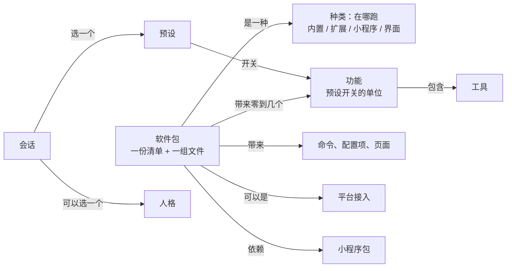

## 插件框架

Miyu 的能力都以软件包的样子装进来：自带的和别人做的走同一条路、同一份清单、同一个登记口子。装上就有，卸了就没有；预设照「功能」一样一样地开关。这一页也是几个词的唯一说法：别的设计、蓝图、施工单里说到软件包、功能、种类、预设开关的，照这一页。

状态：第一节到第九节已定（2026-10-09 项目主人定方向、第九节和第十一节，主会话照推荐定细节）；第十二节是施工的先后。起因和查出来的走偏见 `docs/reviews/2026-10-09-概念review.md`。

### 一、几个词

| 词 | 是什么 | 不是什么 |
|---|---|---|
| 核心 | 常驻的那个进程 `miyu core`：会话、回合、工具、协议都在里面 | 不叫「宏内核」 |
| 内核 | 核心里纯逻辑的第 1 层 `miyu-kernel`：事件、日志、回合状态机（`01-架构.md` 第九节） | 不指整个核心；「内核模块」「内核空间模块」改叫内置包 |
| 软件包 | 装卸的单位：一份清单加一组文件 | 不是开关的单位 |
| 种类 | 软件包跑在哪：内置、扩展、小程序、界面（第二节） | 不说它带来什么 |
| 功能 | 预设开关的单位，是一样具体的本事，例如文件读写、运行命令、网络搜索（第三节） | 不等于软件包：一个包可以带好几个功能 |
| 工具 | 她能调的一件，挂在一个功能下面 | |
| 预设 | 一张功能开关表，开会话时选一个（`16-人格与预设.md`） | 不管人格、不装东西 |
| 人格 | 她是谁：人设、示范对话、提醒短语、记忆跟着谁（`16-人格与预设.md`） | 不管开关 |
| 头 | 把人接进来的那一头：终端、网页是界面包，接入QQ 是扩展包 | 是角色，不是种类 |
| 平台接入 | 接一个通讯平台的扩展包，例如接入QQ（第五节） | 接入本身不是功能 |
| 扩展 | 种类是「扩展」的包：核心拉起的进程，说 Miyu 协议 | 和「软件包」不是并列的两样东西 |
| 提供者 | 往工具目录登记工具的那个包（角色） | 不是一种包 |
| 小程序 | 种类是「小程序」的包：核心按需拉起、空闲退出的辅助进程，例如内置模型 `miyu-embed` | 以前叫 worker，说法照这里 |
| 模块 | 不再对外用 | |

### 二、软件包

1. **清单只回答三件事**：在哪跑（种类）、带来什么（功能、命令、配置项、页面、平台接入）、依赖什么（小程序）。
2. **种类**：

   | 种类 | 清单里写 | 跑在哪 | 例子 |
   |---|---|---|---|
   | 内置 | `builtin` | 代码编在核心里，装的是清单和它的资源 | 基础系统、联网、长期目标、人格记忆、人设防失忆提醒、画 mermaid，以后的知识库 |
   | 扩展 | `process` | 核心拉起的常驻进程，说 Miyu 协议 | 接入QQ |
   | 小程序 | `worker` | 核心按需拉起、空闲退出，说它自己的协议 | 内置模型，以后的语音 |
   | 界面 | `ui` | 自己起来，连核心 | 终端界面、网页 |

   以后的脚本、技能、人格包、预设包另加种类，到时候再定。
3. **装了，只有一种算法：读得出清单。** 内置的包还要核心里编进了它的代码；清单在、代码没编进来的，照读坏了的清单报。没清单的内置代码不起：不登记工具、不接挂接点、不起召回。
4. **两层**：出厂的放资源目录，管理员自己装的放家目录（`packages.md`）。系统区那一层等多用户。
5. **必需的包**：只有基础系统。卸不掉；它的功能照样能在预设里关。
6. **依赖**：`[depends]` 是缺了就不起，`[recommends]` 是缺了照起、少一部分本事（像 Debian）。人格记忆推荐内置模型：没装就只有关键词那一路。

### 三、功能

1. **一样具体的本事**，人在预设里看到的就是它的名字。
2. **从哪来**：
   - 软件包在清单里声明，每个功能有编号、名字、说明，写明下面是哪几件工具。
   - 一个功能都不写的包，整个包算一个功能，编号和名字照包的。写了空表的就是一个都没有（界面、小程序、只接平台不带工具的）。
   - 接进来的每个脚本、每个技能、每个 MCP 服务，各自自动算一个功能，不用写清单。MCP 一个服务一个开关，展开能逐件关。
3. **编号**全局不重：两个包撞了编号，后读到的那一份照写错了报。
4. **工具挂在功能下**，一件工具只挂一个。扩展登记工具时，清单里写了它归哪个功能的照写的；包只有一个功能的，没写的都归它；别的登记不上。
5. **不是工具的本事也挂在功能下**：回合开头的召回归人格记忆，提醒短语归人设防失忆提醒，后台跑归后台运行。核心照功能开没开决定做不做。
6. **自带的十五个**（2026-10-09 项目主人定）：

   | 功能 | 编号 | 包 | 下面有什么 |
   |---|---|---|---|
   | 文件读写 | `files` | 基础系统 | `read`、`write`、`edit`、`glob`、`grep`、`trash` |
   | 运行命令 | `commands` | 基础系统 | `shell` |
   | 后台运行 | `background` | 基础系统 | `jobs`，`shell` 放到后台跑，子代理在后台跑 |
   | 子代理 | `subagents` | 基础系统 | `subagent` |
   | 跨会话消息 | `peers` | 基础系统 | `sessions`、`send_message` |
   | 提问 | `questions` | 基础系统 | `ask_user` |
   | 待办清单 | `todos` | 基础系统 | `todowrite` |
   | 翻查本会话 | `history` | 基础系统 | `history` |
   | 用量 | `usage` | 基础系统 | `session_usage` |
   | 网络搜索 | `web-search` | 联网 | `web_search` |
   | 抓取网页 | `web-fetch` | 联网 | `web_fetch` |
   | 长期目标 | `goal` | 长期目标 | 长期目标的工具 |
   | 人格记忆 | `memory` | 人格记忆 | `remember`、`forget`、`memory_search`，回合开头的召回 |
   | 人设防失忆提醒 | `roleplay` | 人设防失忆提醒 | 没有工具：人格的提醒短语、风格锁 |
   | QQ 工具 | `qq` | 接入QQ | 平台工具 |

7. **后台运行关着**：`shell` 没有放到后台那一项，`jobs` 不在；子代理改在前台跑，派出去一直等到它交报告，报告就是这次调用的结果，打断连它一起停。开着照旧在后台跑。

### 四、预设

1. 预设文件的开关表叫 `[features]`，键是功能的编号。`unlisted` 管没写到的功能（包括以后新装的）开不开，`[tools]` 照旧能在开着的功能里关掉单件。
2. 以前的 `[software]` 照认：键是包的编号，算这个包的功能全照它。以前造的会话的快照里记的是包的编号，照同一条认，不换快照、不掉缓存。
3. 预设里列的是装了的功能，加上写了没装的（标没安装）。界面、小程序、平台接入本身不列。
4. 装了没开的那一行（`16-人格与预设.md` Y8）照功能写，只写下面有工具的。

### 五、平台接入

1. 种类照旧是扩展，清单里写它接的是哪个平台。
2. 接入本身（连不连、账号、端口这些配置项）在头里单独的「接入」页，不进设置页的软件包那一页，也不进预设。
3. 它带的平台工具是一个功能，照 `18-通讯平台.md` Q16 归预设管：全部功能里开，基础功能里关；QQ 的会话用的预设里开着。

### 六、小程序

1. 清单写程序名、拉起时带的参数；程序只找 `miyu` 旁边的（同 `packages.md`「转交」）。
2. 谁要用它，在自己的清单里写 `[depends]` 或 `[recommends]`。核心照依赖它的包装没装决定要不要拉它。
3. 小程序不带功能、不进预设；设置页照它的配置项画（内置模型那一项「语义模型」）。

### 七、配置项随包

1. 核心替内置包声明的配置项（人格记忆的、语义模型的）照包归组；包没装，它的配置项不出现、不报不认识。
2. 包清单自己的 `[settings]` 照旧。平台接入的配置项画在接入页。

### 八、别人做的包

1. 写一份清单：种类、名字、带哪些功能、哪件工具归哪个功能（只有一个功能的不用写）、要什么扩展能力。
2. 装上以后：预设的 `unlisted` 是开（全部功能）的，当场就能用；是关（基础功能）的，列出来关着，人点开就能用。
3. 清单里要了扩展能力的，第一次起来时人批一次（`05-内核接口.md` 第三节、施工 9-4 下上）。

### 九、装卸（2026-10-09 项目主人定）

1. 装、卸当场生效，不重启核心：核心手里的清单、预设的功能、工具目录、查询、扩展进程、配置项都跟着换，开着的会话下一个回合换上。
2. 出厂的内置包能在 Miyu 里卸：在家目录记一笔「不要它」（像 systemd 的 mask），资源目录不动，删掉这一笔就回来。基础系统必需，不能卸。
3. 卸掉一个包，已经用过它的会话：这个会话里它的工具照旧留在工具面上（不断缓存），调到时交回「已卸载」；会话压缩以后、新开的会话才没有。
4. 新装的包照各个预设的 `unlisted`：全部功能里开，基础功能里不开（第四节）。
5. 技能、知识库的列表变了怎么带给她（`docs/reviews/2026-09-30-dsh-即插即用调研.md` 第四节第 3 条），做技能、知识库时再问。

### 十、和别的设计的关系

- `05-内核接口.md` 第一、二、四、八、九节的「模块」读作软件包，「内核空间模块」读作内置包，「worker」读作小程序；第八节的「启用集」读作预设开着的功能。
- `10-自带软件.md` 第四节「可选软件包」那张表照第二节、第三节读；通讯平台桥那一行照第五节。
- `12-进程形态与分发.md` 第四节的软件包种类照第二节读。
- `16-人格与预设.md` 的 `[software]`、「开关以软件包为单位」照第四节读。
- `01-架构.md` 第三节的「核心：宏内核」「内核模块」照第一节读。
- 这几份的正文在第二阶段「整理」时照这一页回写（第十二节）。

### 十一、定了的（2026-10-09 项目主人）

1. 开关的单位是功能，是一样具体的本事；脚本、技能、MCP 都是功能，能任意开关。
2. 先专门搭框架，框架搭好再做别的；自己的功能照插件的样子挪上去。顺序：搭框架、整理现有功能和代码并清掉无用的、性能检查。
3. 自带的功能十五个（第三节第 6 条）；`jobs`、`shell` 放到后台、子代理在后台跑合成「后台运行」；关着时子代理改前台跑。
4. MCP 一个服务一个开关，展开能逐件关。
5. 平台工具照 18 Q16 归预设管；接入本身单独一页、不进预设。施工 9-1 再补把平台工具划出预设，和 Q16 相反，不合，要做的并进这一页。
6. 编进核心的也写清单、照装没装启用；基础系统必需。
7. 「模块」不再对外用，「内核」只指纯逻辑的那一层。
8. 记忆、知识库编进核心（内置包），不做独立进程（同一天先定的）。

主会话照推荐定的：种类、功能的编号；没写功能的包算一个功能；`[depends]`、`[recommends]` 分两种；`[software]` 照认的办法；worker 改叫小程序。

### 十二、什么时候做

**第一阶段：搭框架**（F 线，施工方案第三节）

| 步 | 做什么 |
|---|---|
| F-1 | 清单读得出新的几格：种类多内置、小程序；功能；平台接入；依赖、推荐；必需。`package.list` 带上它们。只读，不改行为 |
| F-2 | 内置的包照清单启用：出厂的几份内置包清单；核心照清单登记工具、查询、挂接点；没清单的不起 |
| F-3 | 功能表和预设照功能开关：工具挂功能；预设 `[features]`、以前的 `[software]` 照认；`preset.get` 照功能列、带每件工具；装了没开的那一行照功能；去掉写死的五个编号 |
| F-4 | 平台接入和配置项随包：接入页；内置包的配置项归组、没装不出现 |
| F-5 | 装包、卸包，当场生效（第九节）：上是装卸命令、落盘、核心手里的清单当场换；中是工具、查询当场换，旧会话报已卸载；下是扩展进程、系统账号当场换；补是配置项当场换；再补是内置模型的小程序当场换 |

**第二阶段：整理现有功能和代码**

- 自己的功能挪成插件：基础系统分成九个功能、后台运行和子代理前台跑；人格记忆（R-10）、内置模型（R-5 三补）由记忆的会话做；接入QQ 带上平台工具这个功能。
- 设计回写：第十节那几份的正文照这一页改；别的设计正文没跟上后来决定的，一起改（例如 `16-人格与预设.md` 第一节还写着出厂带 Miyu 和软件工程师）。
- 理一遍几处说法：会话在哪个目录干活叫「工作区」，账号默认的那个叫「默认工作区」，协议的格名 `cwd` 不改。
- 体验上对不上的：没有人格的会话里人格记忆不生效，预设却显示开着。整理时定怎么显示。
- 无用代码列清单，项目主人拍板了再删。

第二阶段排成 T 线（2026-10-09 主会话排的，技术细节照推荐做，两张等项目主人拍板）：

| 步 | 做什么 |
|---|---|
| T-1 | 后台运行关着（第三节第 7 条）：上是 `shell` 没有放到后台那一项、`jobs` 不在；下是子代理改前台跑，报告就是这次调用的结果，打断连它一起停 |
| T-2 | 扩展登记的工具要归它清单里的某个功能，归不上的拒绝（写了 `[features]` 的才查） |
| T-3 | `miyu pkg` 命令（`22-命令行.md` 第五节的名字）：在终端里列、装、卸 |
| T-4 | 说法（工作区、默认工作区）和设计正文照第一阶段的决定回写 |
| T-5 | 没有人格的会话里人格记忆怎么显示（等项目主人拍板） |
| T-6、T-7 | 无用代码列清单，项目主人拍了板再删 |

**第三阶段：性能检查**：照 `23-性能预算.md` 量启动、每回合、内存、二进制大小，超了的列出来。
