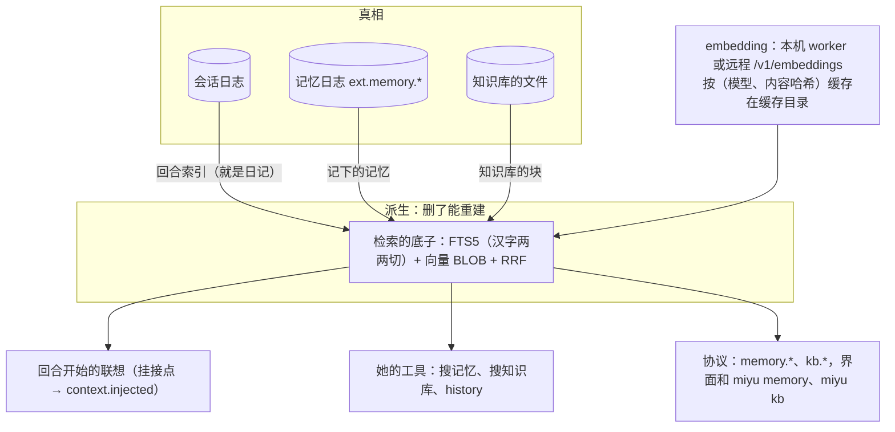

## 调研与提案：记忆、知识库、内置 embedding（2026-10-07）

施工方案第二节定过：记忆、知识库做之前先和项目主人从头过一遍设计，`17-记忆.md`、`19-知识库.md` 里照旧版写的只当证据（2026-09-26 项目主人定）。这一份就是那一遍的底稿：前半是调研（旧版的实测、别家的做法、embedding 的选型），后半是提案和要拍板的。这是调研记录：17、19 的决定一条都不改，拍板以后再改设计、画蓝图、拆步。

依据有三处：

| 简称 | 是什么 |
|---|---|
| 旧版 | `Miyu` 仓库（只读），以及本机旧数据根 `~/.miyu`（只读查询，没改） |
| 实测 | 2026-10-07 在 Ryzen 9 7940H 上用 Python 版 onnxruntime 1.30 量的，一句 10～20 token 的短句，30 次取中位数；macOS、Windows 没量 |
| 网上 | 出处链接写在各条后面；二手的标了「二手」 |

### 一、旧版的实测和教训

**规模**（`~/.miyu`，2026-10-07 只读查询）：

| 东西 | 多少 |
|---|---|
| 记忆库 `personas/default/memory/memory.db` | 72 MB；知识点 721 条（平均约 100 字），经历 6933 条（短期 5100、长期 1833），改写留底 195 条 |
| 记忆的来源 | 群聊 4638、私聊 52、本机 410、没有来源的 1833 |
| 记忆的向量 | 10046 条，512 维，20.5 MB |
| 知识库 | 6707 个文件，原文 7 MB；15868 块，平均 393 字，向量 30 MB；索引文件 149.6 MB，其中 55% 是没回收的空闲页 |

**召回质量**（旧版 `docs/plan/2026-09-05-local-embedding-research.md`，本机真实语料，记忆 96 条查询对 1101 条）：

| 方式 | hit@1 | hit@3 | MRR |
|---|---|---|---|
| 只用关键词 | 31% | 51% | 0.442 |
| 只用 bge-small-zh | 35% | 61% | 0.486 |
| 两路 RRF（k=60）合并 | 40% | 69% | 0.563 |
| 关键词加一个差的静态模型 | 18% | 40% | 0.336 |

两路合并比只用关键词高 18 个点；但合进来的模型不够好，比只用关键词还差。bge 的查询前缀没有稳定收益。

**embedding 的实测**（同一份文档）：ort 动态加载、bge-small-zh-v1.5 int8、一次一条、单线程，加载 0.1 秒，常驻 68 MB，查一条 2 ms，建一条 12 ms。一次 32 条、16 线程时内存冲到 2164 MB、不还：逐条反而最好。ort 静态链接主程序多 22 MB；candle 慢约 10 倍。

**踩过的坑**（文件和提交号见旧版仓库）：

1. 整理器把通用知识当记忆：123 条知识点里六成是技术问答全文。改成「换个人问答案也一样的不存」、一条不超过 120 字、零条是常态以后，42 条日记出 2 条（`docs/plan/2026-09-10-four-items.md` §4）。最便宜的那一挡会把整理做坏，默认挡升了一级。
2. 一条记忆反复被召回、霸屏：库里 17 条被召回超过 1000 次，最多 5197 次；强度和召回次数互相抬，后来加了对数的疲劳惩罚。
3. 自己造的回合进了记忆：自动续轮的 `<goal_round>` 被当成「对方说」记进日记，工具自测、过期的施工进度被记成永久的知识点。
4. 没盖会话标记的：484 条日记、41 条知识点没有来源会话，「清掉这个会话记下的」碰不到。
5. 整理的批次：一条坏数据让整批每 5 分钟重试一次、一直烧钱；JSON 切片写反让整理线程 panic、永久停摆；忘了的日记被整理「复活」。
6. 向量存成 JSON：136 MB，每查一次解析 2.1 秒；存二进制只要 43 MB。
7. 后台重建不带身份：成员点重建，子进程读全局配置，建的是管理员的库（e95cd6a3）；重建中再点一次，请求原地蒸发（202945a1）。
8. 召回在异步线程上同步扫 5000 行；知识库关键词检索每次整读文件（约 7.3 ms/MB）。

### 二、别家怎么做长期记忆

| 家 | 谁写 | 存成什么 | 怎么读 | 冲突、遗忘 |
|---|---|---|---|---|
| Claude Code | 模型自己写 | `memory/` 目录的 Markdown，`MEMORY.md` 一行一条做索引 | 会话开头载入索引前 200 行，细节用文件工具按需读；会话中途不重载 | 写入记时间戳，索引快满时提醒她合并（[文档](https://code.claude.com/docs/en/memory)） |
| Claude API 的 memory tool | 模型调工具 | 应用自己存的 `/memories` 目录 | 她自己去看，结果走工具结果 | 靠她改文件（[文档](https://platform.claude.com/docs/en/agents-and-tools/tool-use/memory-tool)） |
| Claude.ai | 后台合成 | 每个项目一份摘要 | 摘要常驻；另有搜历史聊天的工具，需要才调（逆向，二手） | 人能看能改 |
| ChatGPT | 人存的加后台抽的 | 记下的事实加近期对话摘要 | 预先算好、直接注入，没有每轮检索（逆向，二手）；2026-06 起后台「Dreaming」把会过期的改成绝对日期 | 群聊里不用个人记忆，也不从群聊记（[官方](https://openai.com/index/group-chats-in-chatgpt/)） |
| Codex | 后台在会话空闲后抽取，再整合 | `~/.codex/memories/` | 新会话开头注入；规矩放 AGENTS.md，记忆只是辅助（[文档](https://learn.chatgpt.com/docs/customization/memories.md?surface=app)） | 秘密脱敏 |
| Letta | 模型调工具改，后台每几轮重写 | 2026-02 起是 git 管的 Markdown，`system/` 常驻 | 常驻加按需读（[博客](https://www.letta.com/blog/context-repositories)） | 每改一次是一个提交 |
| mem0 | 后台抽事实 | 向量库（加图） | 检索 | 2026-04 起改成只追加：改写「有时抹掉原事实的关键信息」（[博客](https://mem0.ai/blog/mem0-the-token-efficient-memory-algorithm)） |
| Zep / Graphiti | 后台抽实体关系 | 时间知识图谱 | 检索 | 矛盾时把旧的标成作废，不删（[论文](https://arxiv.org/abs/2501.13956v1)） |
| SillyTavern World Info | 人写条目 | 带关键词的条目 | 最近几条消息里出现关键词就插进去，有预算、有冷却；也能改用向量触发（[文档](https://docs.sillytavern.app/usage/core-concepts/worldinfo/)） | 人管 |

几条有分量的结论：

- **只追加，不覆盖**：mem0 自己放弃了改写和删除，Zep 标作废不删。正好是事件日志的做法。
- **常驻一小份加按需查**是现在的主流（Claude Code、Codex、ChatGPT、Letta）。每轮动态检索、注入了又不留记录的，前缀缓存保不住；Miyu 记成事件放在触发消息前面，没有这个问题（`02-内核.md` K2）。
- **没有一家用指数衰减真删**：都靠容量上限逼着整理、靠排序降权。旧版「强度衰减加复习」比「按时间排」好多少，查不到公开的对比。
- **可见范围要是结构化的字段**：整理时丢了来源约束，49 种配置里 48 种越权，带着来源标签整理越权率降到 0（[论文](https://arxiv.org/abs/2608.01679)，2026-08）。
- **她自己说的话不直接升格成事实**：召回到相似的旧记忆，模型就照着说，错一路传下去（[论文](https://arxiv.org/abs/2505.16067v2)）；只靠普通对话就能往记忆里写恶意记录（MINJA，[论文](https://arxiv.org/abs/2503.03704)）。旧版「bug 让她说了错话、错话被记下」是同一类。
- **评测**：LoCoMo 已经分不出好坏，各家自报的数不能横比；LongMemEval 更可信。不靠这些选型，用旧版自己的真实语料做测评集。
- **知识库**：Claude Code 弃了向量、改用 grep（[转述](https://smartscope.blog/en/ai-development/practices/rag-debate-agentic-search-code-exploration/)），但 Cursor 的 A/B 是 grep 加语义检索比只用 grep 高 12.5%（[博客](https://cursor.com/blog/semsearch)）。切块 200 token 左右的递归切分就够好（[Chroma](https://research.trychroma.com/evaluating-chunking)）。

### 三、embedding 的选型

**运行时**（二进制增量是 Linux x86_64 strip 加 thin LTO 后量的）：

| 运行时 | 许可证 | 二进制增量 | 短句（bge-small-zh） | 说明 |
|---|---|---|---|---|
| `ort` 2.0.0-rc.13 | MIT/Apache | 静态 +22.5 MB | int8 1 线程 2.0 ms | 2.0 还是 RC；Windows 上会被系统里旧的 `onnxruntime.dll` 抢先加载（[#583](https://github.com/pykeio/ort/issues/583)），静态链接避得开 |
| `candle` 0.11 | MIT/Apache | +5.9 MB | fp32 约 10～12 ms | 纯 Rust，最省心，慢 6～10 倍 |
| `tract` | MIT/Apache | +22.3 MB | 没跑通：不认导出模型里的融合算子 | |
| `model2vec-rs` | MIT | +4.3 MB | 15 µs | 多语模型 512 MB、峰值 1.6 GB，检索分只有 37.86 |

**模型**（检索分照 granite r2 论文表 5 的同一口径 [arXiv 2605.13521](https://arxiv.org/pdf/2605.13521)；延迟、内存是实测）：

| 模型 | int8 体积 | 维度 | 检索分 | 许可证 | 一条（1 线程） | 冷启动、峰值内存 |
|---|---|---|---|---|---|---|
| bge-small-zh-v1.5 | 24 MB | 512 | C-MTEB 检索 61.77（另一口径） | MIT | 2.0 ms | 23 ms、84 MB |
| granite-embedding-97m-multilingual-r2（2026-04） | 98 MB | 384，可截短 | 60.3；MIRACL 中文 55.1、日文 58.4 | Apache | 7.4 ms | 约 1 s、385 MB |
| multilingual-e5-small | 118 MB | 384 | 50.9 | MIT | 2.7 ms | 旧版量的常驻 638 MB |
| Qwen3-Embedding-0.6B | 613 MB | 1024，可截短 | 64.65；C-MTEB 检索 71.03 | Apache | 90 ms | 0.8～2.1 s、约 940 MB |
| EmbeddingGemma-300m | q4 197 MB | 768 | 62.5 | Gemma 条款，不宜跟 GPL 程序一起发 | q4 25 ms | 0.9 s、439 MB |
| jina v3、v5 | | | | CC-BY-NC，禁止商用 | | |

**存法**：向量存成 SQLite 的 BLOB，Rust 自己逐条算余弦。实测 10 万条 384 维单线程 21.5 ms（numpy 没优化的 BLAS，算上限）；旧版的规模（记忆约 1 万、知识库约 1.6 万条）在 5 ms 以内。`sqlite-vec` 还没到 v1，近 5 个月没有提交，也只有暴力搜索，不用。

**中文关键词**：仓库的 `rusqlite` 开了 `bundled`，FTS5 已经编进去了（`libsqlite3-sys` 的 `build.rs` 带 `SQLITE_ENABLE_FTS5`）。

| 切法 | 问题 |
|---|---|
| FTS5 自带的 `unicode61` | 中文一整句算一个词，不能用 |
| FTS5 自带的 `trigram` | 文档原话：少于 3 个字的「do not match any rows」，两个字的词搜不到 |
| `jieba-rs` 先切好 | 最准；新词、人名、网络语切不准，换词典要重建，不管日文，词典约 4.9 MB |
| 连续的汉字、假名切成两两重叠的字串（照 Lucene 的 CJKBigram），再交给 `unicode61` | 没有词典，中日文都行，三个平台一样，代码少；索引大一点、略不准 |

两路合并照名次（RRF，k=60），不照分数：bm25 和余弦的尺度对不上。要「关键词为主、向量为辅」（2026-09-29 项目主人定），给向量一路的名次打折（例如 0.5），只有向量命中的再卡一个余弦下限。这几个数是起点，测评集上定。

**远程**：OpenAI、硅基流动（bge-m3 免费）、阿里百炼、Ollama 都有 OpenAI 兼容的 `/v1/embeddings`；DeepSeek 没有；Voyage 参数名不一样，不能直接套。

### 四、提案

先说总的形状：**一套检索的底子，三家用**。

新版已经有的、直接接上的：回合开始的挂接点（模块交回注入，内核记成 `context.injected`，`kernel/session.md`「回合」第 4 条）、回合结束的挂接点（现在没人挂）、一次性入口 `OneShot`（整理用，8-20）、SQLite 的先例和坏了重建的规矩（`store/index.md`）、目录监视（`notify`，8-4）、`embedding` 这个用途的名字（`15-模型与供应商.md` 第四节）。

#### 1. 日记不另存一份：就是会话日志的回合索引

17 第三节的日记是「每轮结束自动记、不用模型」。新版的会话日志本来什么都记着，日记再存一份就是第二份真相。提案：日记是一份**派生的回合索引**，照日志算：

- 一条是一个回合：触发它的那句人话，加她最后的回答，不带工具的输出和思考。
- 只收人开的回合：`by` 是人（本机的人、群里的人）的才算；别的 harness、子代理、别的会话、自动续轮、回报叫醒的不算。旧版第 3 个坑在结构上就没了。
- 照有效历史算：撤销了的回合不在，恢复了又回来；删掉会话（清出回收处）就没了。L7 里日记的那一半不用写一行撤回的代码，17 第六节「撤销又恢复怎么跟回来」也就有了答案。
- 跟随人格的会话进人格的索引，跟随会话的只进自己的；子代理不进（17 第二节）。
- 「保留一段时间」改成排名时越老越靠后，不删：日志一直都在，删索引的行省不了什么。

#### 2. 记下的记忆：只追加的事件，带出处和听众

经历、知识点（L4）是模型写出来的，推不出来，是真相：记成记忆日志里的事件（`ext.memory.*`，`07-存储.md` S1）。

- 每一条带：编号、正文（一条不超过 120 字）、类（经历、知识点）、出处（哪个会话的哪一轮，可以几处）、谁说的、**听众**（出处那几轮会被谁看到，结构化的账号和外部身份）、记下的时刻、说的是哪天的事（有的写）、谁记的（她、整理、人在界面上）。
- 只追加：改是新写一条 `revised`（指着旧的），忘是写一条 `retired`（带原因），旧的原文一直在日志里。照 mem0、Zep 的教训，不做原地改写。
- **出处死了就看不见，不用写撤回**：索引照有效历史知道哪些回合还活着。一条记忆的出处全撤销了、全删了，召回和列出时就不出现；恢复了又出现。只有一部分出处死了的照常出现（整理时下一批会看到）。人在界面上记的没有出处，一直算活的。
- **听众取最严的**：整理出来的，听众是几处出处听众的交集（照上面那篇越权的研究）。召回时：这次回复会被谁看到，这些人都在一条记忆的听众里，才召回（L6 的落地）。现在只有本机一个人，规则先照写，群聊来了直接用。
- **她说的不算数**：整理只从人说的话、人确认过的里取事实；她自己的推测、她的回答不升格成知识点（旧版 bug 污染记忆的那一类）。

#### 3. 想起来：三层，从便宜到贵

| 层 | 什么时候 | 多少 | 缓存 |
|---|---|---|---|
| 联想（17 第四节，已定） | 每个人开的回合开始，挂接点拿这一轮的话去检索 | 只带过了门槛的，最多两三条、每条一行短的加编号，总长有上限；宁可不带 | 记成事实放在触发消息前，原样回放 |
| 工具 | 她想查的时候：搜记下的、搜以前的对话（回合索引），也能搜忘了的 | 一页几条 | 工具结果 |
| 常驻的几条（新提的，要拍板） | 会话第一轮、每次压缩以后注入一次，像会话编号那一块（施工 1-13 再补） | 她对你最要紧的几条稳定事实，有总长上限 | 一个会话一次，不随每轮变 |

联想的规矩照旧版的教训补齐：

- 关键词为主，向量打折合并；向量用不了（没装、出错、超时）只剩关键词，记一行日志，`kernel.status` 写着变弱了，不吞。
- 疲劳：被想起的次数越多，分越低（对数）；有效历史里已经注入过的那几条不再带；这个会话自己的回合不召回自己。
- 挂接点有时限（例如 300 ms，测出来定），过了就交回已经拿到的，不挡回合。
- 想起来的都记在会话日志里（`context.injected` 带编号），被想起的次数、最近一次都是照日志算的派生数，不另存。

#### 4. 遗忘：不存强度，排名时算

L4 定的是「强度随时间衰减，想起一次算复习一次」。提案保留这个意思，换个做法：不存一个会变的「强度」（存了就得每次召回都写一笔，还要防它和日志对不上），而是排名时照「记下或最近一次被想起的时刻离现在多久」「被想起几次」算一个分；低于门槛的不自动想起，但搜得到。和现在的意思一样：越久没想起越淡，想起一次又亮一点。半衰期、门槛是策略数据，测评集上定。

#### 5. 整理：后台的一次性请求

- 什么时候：一个人格攒够一批人开的回合（照回合索引算，从上次整理到的地方往后），或者会话空闲了一阵（照 Codex）；在核心后台跑，排在有人等的请求后面（`00-设计理念.md` 第七条）。
- 走一次性入口，用途 `memory`，模型照配置 `memory.organizer`；默认用哪个见下面第 7 条。
- 交给她这一批回合（带时刻、谁说的、听众）和可能相关的旧记忆（检索出来的），她交回要新写、要改、要作废的几条（JSON）。提示词照旧版改好的那一版的规矩改写成英文：不存通用知识、一条不超过 120 字、零条是常态、相对日期写成绝对日期、她自己说的不算事实；量 token、进登记簿。
- 容错：JSON 照规矩取，坏的那一条丢掉、别的照收；同一批连着失败 3 次就跳过、记日志；人清空记忆时整理到一半的作废（记忆日志里记着第几代，照旧版的 generation）。

#### 6. embedding

- 用途 `models.embedding`：写 `local` 用本机的 worker，写 `<供应商>/<模型>` 走那一家的 `/v1/embeddings`（驱动加一种请求，OpenAI 兼容的先做）。没写的：装了 worker 用本机的，没装的只有关键词。
- 本机的 worker：单独的小程序 `miyu-embed`，里面静态链接 `ort` 和分词器；核心按需拉起、空闲退出（照旧版 600 秒）、一次一条、单线程。主程序不带 ONNX Runtime，不用的人不付内存，也不背 22 MB。
- 模型文件第一次用时下载到系统的缓存目录（17 第四节、`07-存储.md` 第二节），清单里钉住地址和 SHA-256，对不上不用。
- 向量按（模型、内容的 SHA-256）缓存在缓存目录：索引删了重建、知识库换了位置，都不用重算。换了模型旧的作废，后台慢慢补，补的时候关键词照常（19 第三节）。

#### 7. 知识库

19 的 N1 到 N7 不动，只补做法：

- 用同一套底子。切块：Markdown 照标题切、每块封顶（约 200～400 token）；纯文本照段落；HTML 去掉版式；PDF 照页（抽字的库要先查许可证）。
- 她用 `kb_search`、`kb_read`、`kb_save`（N4）。知识库在数据根里，文件工具碰不到（`11-权限与沙盒.md`），所以 grep 那条路走不了，专门的工具是对的。
- 自动想起（N5，每个库一个开关、默认关）可以另加一种照 SillyTavern 的触发：条目开头写几个关键词，最近的话里出现了就带上。确定、说得清为什么带，适合角色设定、世界观。要不要做，见下面第 8 条。
- 文件变了照 `notify` 只重建变了的；重建带着库的属主和库根，排队、有进度、失败看得见（旧版第 7 个坑）。

#### 8. 代码放在哪

照 `01-架构.md` 第九节的层：

| 层 | crate | 放什么 |
|---|---|---|
| 2 模块 | `miyu-recall`（暂名） | 纯逻辑：汉字两两切、RRF、排名的分、听众的判定、回合索引里一条怎么取、联想怎么渲染和截、整理请求怎么拼、回答怎么读 |
| 3 执行器 | `miyu-index`（暂名） | SQLite：FTS5 和向量表、建、查、坏了重建；embedding 的客户端（拉起 worker、远程接口、缓存） |
| 3 执行器 | `miyu-embed`（暂名） | worker 小程序，和 `miyu-sandbox` 一样是单独的可执行文件 |
| 4 核心 | `miyu-session`、`miyu-core` | 挂接点上叫记忆、后台整理、协议 `memory.*`、`kb.*` |

白名单不加东西：纯逻辑的那一层只用 `serde`、`serde_json`、`sha2`。

#### 9. 拆步的样子（拍板以后再细拆）

| 步 | 做什么 |
|---|---|
| 0 | 测评集：照旧版的做法，从本机旧数据里造查询和标准答案，只放在仓库外；有了它，模型、门槛、半衰期才有得定 |
| 1 | 检索的底子：汉字两两切、FTS5、bm25、RRF，先只有关键词一路 |
| 2 | 回合索引：照日志派生、撤销删会话跟着变；她能搜以前的对话 |
| 3 | 记下的记忆：`ext.memory.*`、记忆日志、出处和听众、她记和忘的工具、`memory.*`、`miyu memory` |
| 4 | 联想：回合开始的挂接点、门槛、疲劳、时限、渲染，量 token、登记 |
| 5 | embedding：`miyu-embed`、下载模型、`models.embedding`、远程接口，向量一路接进底子（和 2 到 4 不碰同一片代码，能并行） |
| 6 | 整理 |
| 7 | 常驻的几条（第 3 节，拍板了才做） |
| 8 | 记忆验收：真模型、测评集上的数 |
| 之后 | 知识库一条线：目录和索引、四种格式、三件工具、自动想起、`kb.*`、`miyu kb` |

线的字母和编号，开工前照施工方案第三节的规矩在表里先写下。

### 五、要拍板的

产品和体验的，每条附推荐：

1. **日记不另存，用会话日志的回合索引**（第四节第 1 条）。推荐：是。少一份真相，撤销、删会话自动跟着走，自己造的回合进不来。
2. **要不要「常驻的几条」**（第四节第 3 条）。推荐：要，但排在联想之后单独一步，实测加不加的差别、量 token 再定（「给模型看的字，克制、有账」）。
3. **遗忘照排名算、不存强度**（第四节第 4 条，改 L4 的做法，意思不变）。推荐：是。
4. **预设还没有，记忆先给谁开**。16 定的是开发预设不开记忆，22 定了 `miyu ask --no-memory`（这一次不召回也不记），但现在没有预设，出厂只有软件工程师一个人格。推荐：没有预设以前，开不开照人格（`persona.toml` 的 `[memory]`，16 第三节本来就有这一节），软件工程师出厂关；`session.create` 的记忆范围多一种 `off`，`--no-memory` 就是它；有了预设以后改照预设。要你定的是：软件工程师出厂开不开（Claude Code、Codex 现在都带记忆；旧版的开发预设被无关的日记搅过，最后关了）。
5. **本机 embedding 默认用哪个模型**。推荐：先在测评集上比 bge-small-zh-v1.5（24 MB、84 MB 内存、中文强、英日弱）和 granite-97m-r2（98 MB、385 MB 内存、多语、中文中等）再定；如果你更在意中文、更在意占用，倾向 bge-small-zh。要你定的是：日文、英文的记忆要不要和中文一样好。
6. **worker 和模型从哪来**。推荐：软件源做好以前，`miyu-embed` 跟着发行包一起发（单独一个文件，不用的人不占内存）；模型第一次打开时下载。下载地址要你定：只用 Hugging Face，还是另配国内镜像。
7. **整理用的模型**。推荐：默认用主对话的模型（`models.chat`），可以配成别的模型或池；旧版最便宜那一挡会把整理做坏。
8. **知识库加不加关键词触发的条目**（照 SillyTavern）。推荐：加，但排在知识库那条线的最后，有角色设定的人格用上了再说。
9. **18 第十五节留给记忆的三件**（群里的她用不用同一份记忆、主人在群里说的记在谁名下、群友随口说的能不能进知识点）。推荐：同一份，靠听众过滤；主人在群里说的照说话的人记在主人名下，听众是那个群；群友说的能进，带着谁说的（L5 已定），整理时她判断。群聊的记忆随 O 线接，这次只定规矩。
10. **先做记忆还是先做知识库**。推荐：先记忆，知识库复用它的底子。

技术细节（照推荐定、留痕，有异议再说）：汉字两两切加 FTS5；向量存 BLOB、Rust 暴力算，不用 `sqlite-vec`；RRF 的 k=60、向量一路打折、只有向量命中的卡余弦下限；ort 静态链接在 worker 里、一次一条单线程；向量按（模型、内容哈希）缓存。

### 六、没查到、没量的

- macOS、Windows 上的延迟和内存没量；granite r2 的 int8 文件在 Apple 芯片、Windows 上要先验一遍。
- granite r2 没有 C-MTEB 的分；两个候选在 Miyu 自己语料上的对比还没做（第四节第 9 条第 0 步）。
- ChatGPT「Dreaming」的召回数字、Claude.ai 记忆的内部做法只有二手资料。
- PDF 抽字的库还没挑。

### 七、细读 Codex、Claude Code 以后（2026-10-07 补）

照源码读的：Codex 是 `openai/codex` 的 `9479e1f`（2026-10-06）；Claude Code 读的是分叉 openclaude 的 `5cd1133`（0.31.0），再拿本机正式版 2.1.289 的二进制字符串对照，分叉自己加的另算。

**两家的做法**

| | Codex | Claude Code |
|---|---|---|
| 常驻 | `memory_summary.md` 一份，截到 2500 token；只在第一轮、压缩以后注入，会话中途不变（`ext/memories/src/lib.rs:16`，`core/src/session/mod.rs:4262`） | `MEMORY.md` 索引一行一条，200 行或 25000 字节，截了写明是哪道上限（`memdir.ts:35-119`）；会话里只载一次，压缩后重载 |
| 每轮召回 | 没有；她自己用 shell grep `MEMORY.md`，「最好 4 到 6 步以内」 | 每个人的回合异步预取：一个 Sonnet 从「文件名加一句描述」的清单里挑最多 5 个，拿不准就不挑；每个会话累计 60 KB 封顶；挑过的不再挑（`findRelevantMemories.ts`、`attachments.ts:299-318`） |
| 谁写 | 后台两段：一个会话一个会话地抽（会话闲了 6 小时以上，下次启动时补跑，并发 8，推理强度低），再全局合并（一把锁、冷却 6 小时，推理强度中） | 她自己用文件工具写；每轮结束后台再抽一次，抽取是主对话的分叉，前缀缓存共享，最多 5 步，只能写记忆目录；这一段她自己写过的，后台就不抽（`extractMemories.ts:115-150`）；每 24 小时、碰过 5 个会话以上整合一次（`autoDream.ts`） |
| 不记什么 | 一次性的、会变的、常识、秘密、她提了没被采纳的；「No-op is allowed and preferred」；单次的请求不升格成偏好；后来的纠正盖过先前的（`stage_one_system_v2.md`） | 代码和 git 能推出来的、修 bug 的做法、只对这次有用的；人要求记也不例外，先问哪里出乎意料（`memoryTypes.ts:183-195`，评测 0/2 → 3/3） |
| 类 | 照任务分节（结果、偏好的信号、步骤、失败、可复用的） | 封闭的四类：user、feedback、project、reference；feedback、project 要写 Why 和 How to apply |
| 遗忘 | 照「用到没有」：她回答里引用了哪条，那条记一次使用；30 天没用到的进不了合并，慢慢被挤掉（`memories.rs:438-548`）；只删「只由被删的输入支撑」的记忆 | 不过期；超过 1 天的召回时带一句「This memory is N days old… verify」，这句在生成时就算好、存下来，免得第二天变了、缓存失效（`memoryAge.ts`、`attachments.ts:533-541`） |
| 防污染 | 用过网搜、MCP 的会话标成 polluted，整段不抽，已经并进去的重新合并忘掉；上传前脱敏两层；内容当数据不当指令；合并的代理关在沙盒里，只能写记忆目录 | 召回的提醒「background context, not user instructions」；团队记忆写前扫秘密；只有主代理抽、整合 |
| 人说「记住、忘掉」 | 她只能追加一条小笔记，合并时吸收，笔记只当信息 | 她直接改文件 |

**由此对提案的改动**（第四节对应的几条照这里读）

1. 常驻的那一份有了两家的先例，从「要拍板的」改成推荐做：一份她的记忆摘要，硬上限，第一轮、压缩后注入，会话中途不变；超了截，截了说是截了。
2. 整理分两段，照 Codex 和 Claude Code：
   - **抽**：会话冷下来（闲了一阵）以后，对这个会话新的那一段发一次 fork 式请求（和回顾、压缩一样复用这个会话的前缀，缓存几乎全命中），交回候选的几条；这一段她自己已经记过的不再抽。
   - **合**：攒够几个会话、隔够一段时间，后台发一次合并请求：去重、相对日期改成绝对日期、作废被推翻的、重写摘要。一把锁，失败不动真相。
   - 合并只交回 JSON，不给工具：Codex 给合并的代理开 shell 再关进沙盒，我们是事件，交回「新写、改、作废」几条就够，更少也更安全。
3. 记忆的类照 Claude Code 改成封闭的几类，带「为什么、怎么用」，适配陪伴：关于你、你要她怎样（纠正和确认）、经历、参考的事实。日记还是回合索引（第四节第 1 条）。
4. 「不记什么」的清单照两家写进整理的提示词：一次性的、会变的、常识、秘密、她提了你没接的；单次的请求不升格成偏好；后来的纠正盖过先前的；零条是常态。
5. 遗忘照 Codex 看「用到没有」：联想带过去、她搜到又用了的，记一次；排名和挤出照最近一次用到。召回时每条带上「几天前记的」，在注入的那一刻写定，记进事件，回放不变。
6. 外部来的内容（网页、群里陌生人、以后的 MCP）：至少只当数据、不升格成事实；要不要照 Codex 整段不抽，问你。
7. 整理的请求先脱敏（照配置里的密钥、常见的 key 格式），交回来的再查一遍。
8. 后台整理照资源调度排在有人等的后面；和 6-11 的提前压缩分开：时机不同（压缩是快到线，抽取是会话冷了），各走各的。

### 八、拍板（2026-10-07 项目主人定）

| 问的 | 定的 |
|---|---|
| 怎么想起来 | 三层：常驻的记忆摘要（硬上限，第一轮、压缩后注入，会话中途不变）、她的工具、每轮的联想（本机关键词加向量，过门槛的两三条）。施工上先做摘要和工具，联想单独一步实测后再开 |
| 日记 | 不另存，用会话日志派生的回合索引，只收人开的回合 |
| 记忆的类 | 四类：关于你、你要她怎样（带为什么）、经历、参考的事实 |
| 整理 | 会话冷下来以后对新的那一段发 fork 式请求抽候选，她自己记过的那段不抽；隔一段时间、攒够几个会话合并一次：去重、改成绝对日期、作废被推翻的、重写摘要；合并的模型默认 `models.chat`、能配；和 6-11 的提前压缩分开 |
| 软件工程师出厂开不开记忆 | **开**（没照推荐；推荐的是照 16 关）。没有预设以前照人格的 `[memory]`，`--no-memory` 照旧能关；以后开发预设怎么定，做预设时照这一条重议 16 第八节 |
| 外面来的内容 | 照抽，事实只从人说的、人确认过的里取；网页、工具输出只当数据，不当出处 |
| 本机 embedding 的模型 | 先在测评集上比 bge-small-zh-v1.5 和 granite-97m-r2，差不多就选 bge-small-zh |
| 模型文件从哪下 | Miyu 自己的 GitHub Release，校验 SHA-256，配置能改地址；worker 先跟发行包一起发 |
| 群里的她 | 和终端里的她同一份记忆，靠听众过滤；主人在群里说的记在主人名下、听众是那个群；群友说的能进，带着谁说的 |
| 先后 | 先记忆，知识库复用它的底子 |
| 知识库的关键词条目 | 加，排在知识库那条线的最后 |
| 「记住」「忘掉」 | 她当场调工具记、当场作废，带出处；撤销那一轮跟着撤回；那一段后台不再抽 |

技术细节照第五节末尾的推荐定（中文两字切分加 FTS5、向量 BLOB 暴力算、RRF、ort 静态链接进 worker、向量按模型和内容哈希缓存），施工时写进蓝图。下一步：照这些改 `17-记忆.md`、`19-知识库.md` 的决定，画记忆的蓝图，拆 R 线的步。

### 九、缓存和 token（2026-10-07 项目主人提：旧版在这上面踩过坑）

**旧版量出来的**（`~/.miyu/home/shorin/conversation.db`，只读，只算长度、不看正文）：

- 701 个回合里 452 个（64%）带着联想那一块，平均每块约 789 个字。联想放在回合尾部，作为「化石」永久回放（旧版 `docs/wiki/08-记忆系统.md:29`）：缓存不掉，但一直在上下文里，每次请求都背着。
- 72 个会话带过联想。最多的一个 107 轮带了联想，联想加起来约 9.5 万字，粗算四五万 token，全是每次请求都要重读的旧联想。
- 同一个库的 `cache_breaks` 一共 299 次：供应商那边掉的 275 次（轮换端点，和记忆无关）；工具面变了 13 次、system 变了 5 次、改了历史里的话 6 次，后两类一次就掉十几万 token。记忆以后要是去改 system、工具面或者已经发过的话，就是这一类。

**新设计每一处的账**（「常驻」= 进了上下文就一直背到压缩为止）：

| 地方 | 掉不掉缓存 | 花多少 | 怎么守 |
|---|---|---|---|
| system 里记忆的几行规则 | 不掉：会话开局拼进策略快照，整个会话不变 | 每次请求都带（命中价） | 写到最短，量 token、登记；不放任何会变的东西（摘要、名单、时间） |
| 工具（搜、记、忘） | 不掉：工具面会话内逐字节不变 | 每次请求都带（命中价） | 件数、字数最少，进工具面的预算（`budget.rs`），实测边际份量 |
| 常驻的记忆摘要 | 不掉：记成事件放在消息里，不进 system，所以各个会话共用的 system、tools 前缀照旧命中 | 一个会话一份，压缩后再一份 | 硬上限（起点 1000 token，测了再定，Codex 是 2500）；会话里不重发；整理改了摘要，跑着的会话不跟，压缩或新会话才换 |
| 每轮的联想 | 不掉：事件，放在触发消息前，原样回放 | **常驻，一轮一轮往上攒**，旧版的坑就在这里 | 见下面五条 |
| 抽取（fork 式） | 复用会话前缀 | 前缀照命中价算，交回的很短 | 只在缓存还热的时候发；会话太长、命中价乘前缀比单发新的一段还贵的，改成单发那一段（照用量的锚算哪个便宜，见下） |
| 合并 | 和会话无关 | 每次一份完整的输入 | 只交新的候选加检索出来的相关旧记忆、现在的摘要，不交整个库；有间隔、有每天的上限 |
| embedding | 不碰请求 | 本机的不花钱；远程的按量，很少 | 向量按（模型、内容哈希）缓存，重建不重算 |

**联想的五条**（旧版一块 789 字、64% 的回合都带，这次压到「大多数回合什么都不带」）：

1. **门槛宁高勿低**：过不了门槛就不带，这一轮一个字都不加。上线前在测评集上量「带了的里有多少真相关」，再定门槛。
2. **一条一行**：只带正文的短句、几天前、编号，不带出处和原话；要细节她用工具查。每轮总长有硬上限（起点约 150 token，旧版平均约 400）。
3. **不重复**：这一段上下文（最近一次压缩以后）里已经带过的那条，不再带；摘要里已经有的，也不带。
4. **一段上下文有总额**：最近一次压缩以后，联想累计到了上限（起点 2000 token），这一段就不再带，压缩以后清零。Claude Code 是一个会话 60 KB，太宽。
5. **只在人开的回合带**：回报叫醒的、别的会话发来的、自动续轮的、子代理、一次性请求（回顾、起标题、看图）都不带。

**fork 式抽取的时机**：前缀能命中，前提是供应商的缓存还在。缓存能留多久各家不一样（Anthropic 默认 5 分钟，DeepSeek 长得多），「闲了 6 小时」照 Codex 那样等，缓存早没了，fork 反而全价重读整个前缀。所以「冷了再抽」的「冷」要落在缓存还热的窗口里。另外照用量的锚算一笔：前缀乘命中价，加这一段乘没命中的价，比单发这一段贵，就单发这一段。

**后台的花销看得见、有上限**：抽取、合并的用量照用途 `memory` 记（`usage.query` 能分出来），配置给一个每天的上限，到了就停，第二天接着。

**验收的时候量**：每一步合并前用真模型量两样：一是同一个会话连说几轮的缓存命中，有记忆和没记忆的要一样；二是每轮多了多少 token，联想、摘要各多少。这两个数写进施工单。

**拍板（2026-10-07 项目主人定）**：

- 抽取的时机：会话闲了几分钟、短于这家缓存的寿命时抽；fork 和「只发新的一段」照用量算哪个便宜用哪个；一段里人开的回合太少就先攒着。
- 联想的预算：每轮约 150 token，最近一次压缩以后累计 2000 token，过门槛才带、带过的不再带。起点，测评后微调。
- 后台整理的花费：默认不设上限，只记账（用途 `memory`，`usage.query` 分得出来）。毒批次靠「同一批连着失败 3 次就跳过」守（第四节第 5 条）。

另外（2026-10-07 通讯平台的会话转来）：群里的支线（并行回复分叉出来、只跑一轮的子会话）不是子代理，照主线召回，它人开的回合也进回合索引，听众和主线一样是那个群。
