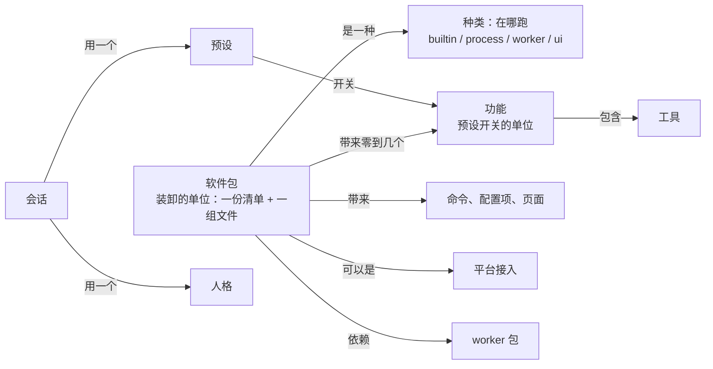

## 概念 review（2026-10-09）

状态：2026-10-09 项目主人定了（第七节），主会话写。定下来的写进了设计 `30-插件框架.md`，以它为准。起因：同一天做「接入QQ 不进设置页」「内置模型改成软件包」「记忆照包启用」，各加了一种标记或种类（`venue`、`embedding`、`builtin`），项目主人觉得架构的概念很乱，让主会话好好查一遍。

### 一、结论

1. **乱在名词，不在分层。** 代码的分层（`01-架构.md` 第九节）是清楚的、有门禁守着。乱的是「装卸、开关、跑在哪」这几样东西的叫法：同一批东西，设计 01、05、10、12、16、18 各用一套词，施工时又各挑了一套，没对齐。
2. **今天加的三样都在补同一个缺口。** `05-内核接口.md` 本来有一个干净的模型：一份清单加一次注册，种类只按「在哪跑」分（`builtin` 编进核心、`process` 独立进程、`script` 脚本），还能写依赖的 worker。施工 9-1 把清单做成「软件包」，只做了 `ui`、`process` 两种，`builtin`、「带来什么」「依赖什么」都没做。于是记忆照包启用要补 `builtin`，内置模型要补 `embedding`，接入QQ 不进预设要补 `venue`。
3. **缺口已经让一个定论被改错了**：9-1 再补（还没合）为了让接入QQ 不出现在预设里，把它的平台工具整个划出预设，这和 `18-通讯平台.md` Q16 定的「哪些会话有平台工具由预设决定，功能全开里有、开发里没有」相反。那是我当技术细节定的，越界了，也没对照 Q16。
4. **不用推翻，统一到 05 那个模型上就行**：第四节。改的大多是清单的格式、「装了」的算法、预设开关的单位，代码的分层不动。

### 二、现在的名词，各在哪、指什么

| 词 | 出处 | 指什么 | 问题 |
|---|---|---|---|
| 内核 | 01 第九节；`miyu-kernel` | 纯逻辑的第 1 层：事件、日志、回合状态机 | 01 第三节的图、05 全篇又用它指整个核心：「核心：宏内核」「内核模块」「内核空间模块」 |
| 核心 | 01 | 常驻的那个进程 | 和「内核」混用 |
| 模块 | 05 第一节 | 一份清单加一次注册的单位：`builtin`、`process`、`script` | 01 第三节的「内核模块」只指编进核心的；代码里没有这个概念 |
| 软件包 | 12 第四节；10 第三节；18 Q17 | 清单加一组文件：扩展、技能包、脚本、人格包和预设包、二进制 worker | 施工 9-1 做成 `[package]`，只有 `ui`、`process`；10 第三、四节说基础系统、记忆、联网、知识库都是软件包，它们编进核心、没有清单 |
| 自带软件 | 10 第一节 | 发行版自带的：基础系统，加可选软件包 | 「软件」「软件包」混用 |
| 软件（预设里的） | 16 第三节；预设文件的 `[software]` | 预设开关的单位，「开关以软件包为单位，也可以细到单个工具」 | 实际是写死的五个编号（`crates/miyu-endpoint/src/presets.rs` 的 `BUILT_IN`：`basesystem`、`net`、`goal`、`memory`、`roleplay`），加上「装了的 `process` 包」；`roleplay` 不是包、没有工具，`net`、`goal` 是 crate |
| 扩展 | 05 第四节 | 独立进程，核心拉起，说 Miyu 协议 | 实现里是 `kind = "process"` 的包加 `extension.*` 开关；和「软件包」是同一样东西的两个名字 |
| 提供者 | 05；`providers.md` | 往工具目录登记工具的连接（一个角色） | 常被当成和「扩展」并列的另一种东西 |
| 头 | 01 第三节；18 Q17 | 界面：终端、网页、终端无缝集成、单次命令行、通讯平台桥 | 05 第四节说桥是「扩展，同时扮演头」；10 第四节说它是「可选软件包，平台工具由预设决定」；18 Q17 说它是和终端、网页平级的软件包、一个头；实现里是 `process` 包，9-1 再补又加 `venue` |
| worker | 01 第八节；05 第九节；12 | 某个模块私有的辅助进程（embedding、语音），核心按需拉起 | 实现里 `miyu-embed` 由核心直接认，没有清单；R-5 三补草稿要加 `kind = "embedding"` |
| 工具目录里的「包」 | `miyu-tool` 的 `Catalog` | 每件工具挂一个包编号（`basesystem`、`net`、`memory`、提供者的包） | 预设照它开关；和清单的包、预设的软件是三个口径 |
| 编进来的 | `miyu-core` 的 cargo 开关；`queries.rs` | 编译时开的可选部分（`mermaid`，以后的 `net`），起来时登记 | 又一种「有没有」 |
| 功能 | 口头；出厂预设「功能全开」 | 大概就是预设开关的那一项 | 没有定义 |

### 三、具体的重叠和走偏

1. **「内核」一个词两件事**（01 第三节对第九节、05 全篇）。今天讨论记忆放哪，就得先解释「是进核心、不是进内核」。
2. **05 的 `builtin` 没做**。编进核心的基础系统、联网、长期目标、记忆都没有清单；预设靠代码里写死的五个编号认它们。「装上才有记忆」做不出来，就是因为它们没有清单。
3. **预设开关的「软件」和「软件包」不是一回事**：`roleplay` 不是包，`net`、`goal` 是 crate；`process` 包被自动算成软件（`presets::installed`），所以预设里列着「QQ 桥」（项目主人点名的问题）。
4. **平台接入在五处是五种东西**：01 是头，05 是扩展兼头，10 是可选软件包、平台工具由预设决定，18 是软件包兼头，实现里是 `process` 包。9-1 再补加 `venue`，又顺手把平台工具划出预设，和 18 Q16 相反（第一节第 3 条）。
5. **worker 没有落位**：05 写了 `[depends] workers = ["embedding"]`，12 写了「二进制 worker」，实现里没有。内置模型改成软件包，就要补 `kind = "embedding"`。
6. **「有没有」有四种算法**：清单读得出（9-1）；工具目录里有工具的包加 `roleplay` 加 `process` 包（P-2 的 `installed`）；cargo 开关编进来（W-4 的 `mermaid`）；随发行附带（10）。预设里的「没安装」说不清是哪一种。
7. **配置项两套**：核心声明的（`memory.*`、`models.embedding` 这些，挂在核心的几页）和包清单的 `[settings]`（挂在「软件包」那一页、一个包一组）。记忆照包启用以后，它的配置项归谁说不清（做记忆的会话写 R-6 时就在问）。
8. **人格、预设、技能、脚本**：12 说它们都是包的种类；实现里人格、预设是独立的目录，技能、脚本还没做。以后要不要统一成包，现在没说法。
9. **设计没回写**：9-1 少做了 05 的 `builtin`，05 没跟着改；同一件事在 01、05、10、12、16、18 各写一遍，彼此没对齐，施工时照哪份都说得通。

### 四、统一说法（提议）

1. **软件包**：装卸的单位，一份清单加一组文件。装上就有，卸了就没有。清单只回答三件事：在哪跑（种类）、带来什么（功能、命令、配置项、页面、平台接入）、依赖什么（worker）。「有没有」只认一种算法：读得出清单。
2. **种类，只说在哪跑**：
   - `builtin` 内置：代码编在核心里，装的是清单和它的资源；没装，编进来的代码也不起。清单在、核心里却没编这段代码，这个包照读坏了的清单报。基础系统、联网、长期目标、记忆、人设防失忆提醒、画 mermaid，以后的知识库。
   - `process` 扩展：核心拉起的常驻进程，说 Miyu 协议。接入QQ。
   - `worker` 小程序：核心按需拉起、空闲退出、说它自己的协议。内置模型 `miyu-embed`，以后的语音。别的包用 `[depends] workers` 依赖它（05 原样）。
   - `ui` 界面：自己起来、连核心。终端、网页。
   - 以后的 `script`、技能、人格包、预设包另加，到时候再说。
3. **功能**：预设开关的那一项，是一样具体的本事，例如文件读写、运行命令、网络搜索（2026-10-09 项目主人定）。
   - 比软件包细：一个包可以带好几个功能，基础系统一个包就带文件读写、运行命令、子代理这些。卸是照包卸，开关是照功能开关。
   - 一个功能下是一组工具，也可以一件都没有，比如人设防失忆提醒。预设照功能开关，也可以细到单个工具（16 原样）。
   - 接进来的每个脚本、每个技能、每个 MCP 服务各是一个功能，不管它是随包装的还是自己放进来的，都能任意开关。
   - 终端、网页、内置模型不带功能，预设自然不列。
   - 别人做的包：清单里写自己带哪些功能，扩展登记工具时说这件工具属于哪个功能。一个功能都不写的，整个包算一个功能，名字就是包的名字。装上以后，预设里 `unlisted = "on"` 的（全部功能）当场就开着，`"off"` 的（基础功能）列出来、关着，人点开就能用。清单里要了权限的（9-4 下上），第一次起来时人批一次。
   - 自己放进来的脚本、技能、MCP 服务不用写清单，每个自动算一个功能。
4. **平台接入**：种类照旧是 `process`，清单声明它接的是哪个平台。接入本身（连不连、账号、配置项）在头里单独的「接入」页，不进设置页、不进预设。它带的平台工具是一个功能（比如「QQ 工具」），照 18 Q16 归预设管：功能全开里开、开发里关；QQ 的会话用的预设里开着。
5. **其余几个词**：
   - 「内核」只指 `miyu-kernel` 那一层；01 第三节的「宏内核」改叫核心，「内核模块」「内核空间模块」改叫内置包。
   - 「扩展」就是 `process` 包。
   - 「提供者」是往工具目录登记工具的那个包，是角色，不是种类。
   - 「头」是角色：把人接进来的那一头。终端、网页是 `ui` 包，接入QQ 是 `process` 包。
   - 「模块」不再对外用。

### 五、现有的东西各归哪

| 东西 | 包 | 种类 | 带来的功能 | 别的 |
|---|---|---|---|---|
| 基础系统 | `basesystem` | `builtin` | 文件读写、运行命令、后台运行、子代理、跨会话消息、提问、待办清单、翻查本会话、用量 | 必需，不能卸 |
| 联网 | `net` | `builtin` | 网络搜索、抓取网页 | 链接卡片 |
| 长期目标 | `goal` | `builtin` | 长期目标 | |
| 人格记忆 | `memory` | `builtin` | 人格记忆 | 三件工具、回合开头的召回、`miyu memory`、记忆的配置项；依赖 worker `embed`（可选：没装就只有关键词那一路） |
| 人设防失忆提醒 | `roleplay` | `builtin` | 人设防失忆提醒 | 没有工具，只有提醒短语和风格锁 |
| 画 mermaid | `mermaid` | `builtin` | 无 | 给头用的 `mermaid.render` |
| 内置模型 | `embed` | `worker` | 无 | `miyu-embed` 和模型文件 |
| 接入QQ | `onebot` | `process` | QQ 工具 | 平台接入（QQ），自己的「接入」页 |
| 脚本、技能、MCP（以后） | 随包装的照包，自己放进来的不算包 | | 每个脚本、技能、MCP 服务各一个 | |
| 终端界面 | `tui` | `ui` | 无 | |
| 网页 | `web` | `ui` | 无 | |
| 知识库（以后） | `kb` | `builtin` | 知识库 | 依赖 worker `embed` |

### 六、要改的

1. **清单格式**：种类加 `builtin`、`worker`；加「带来的功能」（每个功能的编号、名字、说明，名字照语言）、「平台接入」、`[depends] workers`。出厂资源多几份内置包的清单（上表 `builtin` 那几行）。
2. **「有没有」只有一种算法**：读得出清单的包。预设的列表照装了的包声明的功能列，加上接进来的脚本、技能、MCP 服务，去掉写死的 `BUILT_IN`、去掉「`process` 包自动算软件」。工具目录里每件工具挂在功能下（原来挂在包下），预设照功能开关；一件工具两个功能都要用的（`jobs` 管后台命令也管子代理），哪个开着它就在。9-1 再补的 `venue`、`governed` 不要了。
3. **预设文件**：`[software]` 改叫 `[features]`，键是功能的编号；旧写法照认，`basesystem = true` 当成这个包的功能全开。协议 `preset.get` 的 `software` 跟着改，排着的 `tools` 一格照功能分组。
4. **协议**：`package.list` 每一项带种类、功能、平台接入；`extension.status` 只列 `process` 包（现在就是）；头照「平台接入」把它放进接入页，它的配置项只在接入页画。
5. **配置项**：核心为内置包声明的配置项（记忆的、语义模型的）照包归组；卸了的包，它的配置项不出现。
6. **文档**：新写一页「概念」当唯一真相源，01、05、10、12、16、18 改用同一套词、引用它；施工 9-1、P-2 的蓝图（`packages.md`、`presets.md`）跟着改。
7. **在途的三张**：9-1 再补（`venue`）、R-5 三补（`embedding`）、R-10（`builtin`）照新说法重写。它们要做的事（接入QQ 不进设置页和预设、内置模型从包里来、记忆照包启用）在新说法下各是几行清单。两处改名（接入QQ、人设防失忆提醒）照留。
8. 粗估核心这边四到五步：清单格式和读法；「有没有」和预设照功能；协议和头要的几格；配置项归组；文档。记忆那边的 R-5 三补、R-10 跟着变小。

### 七、定了的（2026-10-09 项目主人）

1. 开关的单位是「功能」，是一样具体的本事；接进来的脚本、技能、MCP 都是功能，能任意开关。
2. 先专门搭框架，框架搭好再做别的；自己的功能照插件的样子挪上去。记忆那边的 R-6 照做，R-10、R-5 三补等框架。
3. 自带的功能十五个，一个开关下面还能逐件关工具：

   | 功能 | 工具 |
   |---|---|
   | 文件读写 | `read`、`write`、`edit`、`glob`、`grep`、`trash` |
   | 运行命令 | `shell` |
   | 后台运行 | `jobs`，`shell` 的 `run_in_background`，子代理在后台跑 |
   | 子代理 | `subagent` |
   | 跨会话消息 | `sessions`、`send_message` |
   | 提问 | `ask_user` |
   | 待办清单 | `todowrite` |
   | 翻查本会话 | `history` |
   | 用量 | `session_usage` |
   | 网络搜索 | `web_search` |
   | 抓取网页 | `web_fetch` |
   | 长期目标 | `goal` 的工具 |
   | 人格记忆 | `remember`、`forget`、`memory_search`，加回合开头的召回 |
   | 人设防失忆提醒 | 没有工具 |
   | QQ 工具 | 平台工具 |

   后台运行关着：`shell` 没有 `run_in_background` 这一项，`jobs` 不在；子代理改在前台跑，派出去一直等到它交报告，报告就是这次调用的结果，打断连它一起停。开着照旧在后台跑（`02-内核.md` 第七节跟着改）。
4. MCP 一个服务一个开关，展开能逐件关。
5. QQ 的平台工具照 18 Q16 归预设管：预设里列「QQ 工具」一项，全部功能开、基础功能关；「接入QQ」本身不进预设，在单独的接入页。
6. 编进核心的东西（基础系统、联网、记忆这些）也写清单、照装没装启用，和第三方的包一样；基础系统必需，不能卸。
7. 「模块」不再对外用，「内核」只指纯逻辑的那一层。
